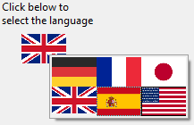

A picture pop-up menu is a pop-up menu that displays a two-dimensional array of pictures. Um menu pop-up imagem pode ser usado em vez de um [botão imagem](pictureButton_overview.md). The creation of the picture to use with a picture pop-up menu is similar to the creation of a picture for a picture button. O conceito é o mesmo das [grades de botões](buttonGrid_overview.md), exceto pelo fato de que o gráfico é usado como um menu pop-up em vez de um objeto do formulário.

## Utilizar os menus emergentes de imagens

Para criar um menu pop-up imagem, você precisa [fazer referência a uma imagem](properties_Picture.md#pathname). The following example allows you to select the interface language by selecting it from a picture pop-up menu. Cada língua é representada pela bandeira correspondente:

### Programação

Pode gerir os menus pop-up de imagens utilizando métodos. Como as [grades dos botões](buttonGrid_overview.md), variáveis associadas aos menus imagem são definidas com o valor do elemento selecionado no menu pop-up imagem. Se nenhum elemento for seleccionado, o valor é 0. Os elementos são numerados, linha a linha, da esquerda para a direita, começando pela linha superior.

### Ir para página

Você pode atribuir a [ação padrão](https://doc.4d.com/4Dv19R4/4D/19-R4/Standard-actions.300-5736871.en.html) `gotoPage` a um menu pop-up imagem. When that action is selected, 4D will automatically display the page of the form that corresponds to the position of the picture selected in the picture array. Elements are numbered from left to right and top to bottom, beginning with the top left corner.

For example, if the user selects the 3rd element, 4D will display the third page of the current form (if it exists).
Si desea gestionar usted mismo el efecto de un clic, seleccione `Sin acción`.

## Propriedades compatíveis

[Negrito](properties_Text.md#bold) - [Estilo da linha de borda](properties_BackgroundAndBorder.md#border-line-style) - [Parte inferior](properties_CoordinatesAndSizing.md#bottom) - [Classe](properties_Object.md#css-class) - [Colunas](properties_Crop.md#columns) - [Altura](properties_CoordinatesAndSizing.md#height) - [Dica de ajuda](properties_Help.md#help-tip) - [Dimensionamento horizontal](properties_ResizingOptions.md#horizontal-sizing) - [Esquerda](properties_CoordinatesAndSizing.md#left) - [Nome do objeto](properties_Object.md#object-name) - [Nome do caminho](properties_Picture.md#pathname) - [Direita](properties_CoordinatesAndSizing.md#right) - [Filhas](properties_Crop.md#rows)- [Ação padrão](properties_Action.md#standard-action) - [Topo](properties_CoordinatesAndSizing.md#top) - [Tipo](properties_Object.md#type) - [Variável ou expressão](properties_Object.md#variable-or-expression) - [Dimensionamento vertical](properties_ResizingOptions.md#vertical-sizing) - [Visibilidade](properties_Display.md#visibility) - [Largura](properties_CoordinatesAndSizing.md#width)
