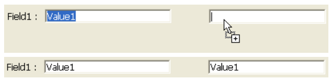

---

## Arrastável

Controlar se e como o usuário pode arrastar o objeto. Por defeito, não é permitida qualquer operação de arrastamento.

Estão disponíveis dois modos de arrastamento:

- **Personalizado**: nesse modo, qualquer operação de arrastar executada no objeto aciona o evento de formulário `On Begin Drag` no contexto do objeto. Em seguida, a ação de arrastamento é gerida através de um método.\
  No modo personalizado, basicamente toda a operação de arrastar e soltar é tratada pelo programador. Esse modo permite que você implemente qualquer interface baseada em arrastar e soltar, incluindo interfaces que não necessariamente transportam dados, mas podem executar qualquer ação, como abrir arquivos ou acionar um cálculo. Esse modo é baseado em uma combinação de propriedades, eventos e comandos específicos do tema `Pasteboard`.
- **Automático**: nesse modo, 4D **cópia** o texto ou as imagens diretamente do objeto formulário. Poderá então ser utilizado na mesma área de 4D, entre duas áreas 4D ou entre 4D e outra aplicação. Por exemplo, o arrastar (e soltar) automático permite que você copie um valor entre dois campos sem usar programação:\
  \
  
  Nesse modo, o evento de formulário `On Begin Drag` NÃO é gerado. Si quiere "forzar" el uso del arrastre personalizado mientras está activado el arrastre automático, mantenga presionada la tecla **Alt** (Windows) o **Opción** (macOS) durante la acción. Esta opção não está disponível para as imagens.

Para más información, consulte [Arrastrar y soltar](https://doc.4d.com/4Dv18/4D/18/Drag-and-Drop.300-4505037.en.html) en el manual *Lenguaje 4D*.

#### Gramática JSON

| Nome     | Tipo de dados | Valores possíveis                                                                                  |
| -------- | ------------- | -------------------------------------------------------------------------------------------------- |
| dragging | text          | "none" (por padrão), "custom", "automatic" (exceto list box) |

#### Objectos suportados

[4D Write Pro areas](writeProArea_overview.md) - [Input](input_overview.md) - [Hierarchical List](list_overview.md) - [List Box](listbox_overview.md) - [Plug-in Area](pluginArea_overview.md)

#### Veja também

[Soltável](#droppable)

---

## Soltável

Controle se e como o objeto pode ser o destino de uma operação de arrastar e soltar.

Há dois modos de soltar em 4D:

- **Personalizado**: neste modo, qualquer operação de soltar executada no objeto aciona os eventos formulário `On Drag Over` e `On Drop` no contexto do objeto. Em seguida, a ação de largar é gerida através de um método.\
  No modo personalizado, basicamente toda a operação de arrastar e soltar é tratada pelo programador. Esse modo permite que você implemente qualquer interface baseada em arrastar e soltar, incluindo interfaces que não necessariamente transportam dados, mas podem executar qualquer ação, como abrir arquivos ou acionar um cálculo. Esse modo é baseado em uma combinação de propriedades, eventos e comandos específicos do tema `Pasteboard`.
- **Automático**: en este modo, 4D gestiona automáticamente, si es posible, la inserción de los datos arrastrados de tipo texto o imagen que se sueltan sobre el objeto (los datos se pegan en el objeto). Los eventos `On Drag Over` y `On Drop` NO se generan. Por otra parte, se generan los eventos `On After Edit` (durante el soltar) y `On Data Change` (cuando el objeto pierde el foco).

Para más información, consulte [Arrastrar y soltar](https://doc.4d.com/4Dv18/4D/18/Drag-and-Drop.300-4505037.en.html) en el manual *Lenguaje 4D*.

#### Gramática JSON

| Nome     | Tipo de dados | Valores possíveis                                                                                  |
| -------- | ------------- | -------------------------------------------------------------------------------------------------- |
| dropping | text          | "none" (por padrão), "custom", "automatic" (exceto list box) |

#### Objectos suportados

[4D Write Pro areas](writeProArea_overview.md) - [Button](button_overview.md) - [Input](input_overview.md) - [Hierarchical List](list_overview.md) - [List Box](listbox_overview.md) - [Plug-in Area](pluginArea_overview.md)

#### Veja também

[Arrastável](#draggable)

---

## Executar método objeto

Quando essa opção está ativada, o método objeto é executado com o evento `On Data Change` *no mesmo momento* em que o usuário altera o valor do indicador. Cuando la opción está desactivada, el método se ejecuta *tras* la modificación.

#### Gramática JSON

| Nome                | Tipo de dados | Valores possíveis |
| ------------------- | ------------- | ----------------- |
| continuousExecution | boolean       | true, false       |

#### Objectos suportados

[Indicador de progreso](progressIndicator.md) - [Regla](ruler.md) - [Stepper](stepper.md)

---

## Métodos

Referência de um método ligado ao objeto. Os métodos do objeto "gerencie" geralmente o objeto enquanto o formulário é exibido ou impresso. Você não chama um método objeto — 4D o chama automaticamente quando um evento envolve o objeto ao qual o método objeto é anexado.

São suportados vários tipos de referências de métodos:

- um caminho de arquivo de método objeto padrão, ou seja, que usa o seguinte padrão:\
  `ObjectMethods/objectName.4dm`\
  ... onde `objectName` é o [nome do objeto](properties_Object.md#object-name). Este tipo de referencia indica que el archivo del método se encuentra en la ubicación por defecto ("sources/forms/*formName*/ObjectMethods/"). Nesse caso, 4D trata automaticamente o método objeto quando as operações são executadas no objeto formulário (renomeação, duplicação, copiar/colar...)

- um nome de método projeto: nome de um método projeto existente sem extensão de arquivo, ou seja:
  `myMethod`
  Nesse caso, o 4D não oferece suporte automático para operações objeto.

- um caminho de arquivo de método personalizado, incluindo a extensão .4dm, por exemplo:\
  `../../CustomMethods/myMethod. dm`
  Você também pode usar um sistema de arquivos:\
  `/RESOURCES/Buttons/bOK.4dm`
  Neste caso, 4D não fornece suporte automático para operações de objeto.

#### Gramática JSON

| Nome   | Tipo de dados | Valores possíveis                                                                       |
| ------ | ------------- | --------------------------------------------------------------------------------------- |
| method | text          | Caminho de ficheiro padrão ou personalizado do método objeto, ou nome do método projeto |

#### Objectos suportados

[4D View Pro Area](viewProArea_overview.md) - [4D Write Pro Area](writeProArea_overview.md) - [Button](button_overview.md) - [Button Grid](buttonGrid_overview.md) - [Check Box](checkbox_overview.md) - [Combo Box](comboBox_overview.md) - [Dropdown list](dropdownList_Overview.md) - [Forms](FormEditor/forms.md) - [Hierarchical List](list_overview.md) - [Input](input_overview.md) - [List Box](listbox_overview.md) - [List Box Column](listbox_overview.md#list-box-columns) - [Picture Button](pictureButton_overview.md) - [Picture Pop up menu](picturePopupMenu_overview.md) - [Plug-in Area](pluginArea_overview.md) - [Progress Indicators](progressIndicator.md) - [Radio Button](radio_overview.md) - [Ruler](ruler.md) - [Spinner](spinner.md) - [Splitter](splitters.md) - [Stepper](stepper.md) - [Subform](subform_overview.md) - [Tab control](tabControl.md) - [Web Area](webArea_overview.md)

---

## Linhas móveis

`List boxes de tipo array`

Autoriza a deslocação de linhas durante a execução. Esta opção é selecionada por defeito. No está disponible para los [list box de tipo selección](listbox_overview.md#selection-list-boxes) ni para los [list box en modo jerárquico](properties_Hierarchy.md#hierarchical-list-box).

#### Gramática JSON

| Nome        | Tipo de dados | Valores possíveis |
| ----------- | ------------- | ----------------- |
| movableRows | boolean       | true, false       |

#### Objectos suportados

[List Box](listbox_overview.md)

---

## Multi-seleccionável

Permite la selección de múltiples registros/opciones en una [lista jerárquica](list_overview.md).

#### Gramática JSON

| Nome          | Tipo de dados | Valores possíveis            |
| ------------- | ------------- | ---------------------------- |
| selectionMode | text          | "multiple", "single", "none" |

#### Objectos suportados

[Lista hierárquica](list_overview.md)

---

## Ordenável

Permite ordenar dados de coluna clicando em um cabeçalho [listbox](listbox_overview.md). Esta opção é selecionada por defeito. Os arrays de tipo imagem (colunas) não podem ser ordenadas com esta funcionalidade.

Nos list boxes baseados em uma seleção de registros, a função de classificação padrão está disponível apenas:

- Quando a fonte de dados é *Seleção atual*,
- Com colunas associadas com campos (do tipo Alfa, Número, Data, Hora ou Booliano).

Em outros casos (list box baseados em seleções nomeadas, colunas associadas com expressões), a função de classificação padrão não está disponível. Uma classificação de list box padrão altera a ordem da seleção atual no banco de dados. No entanto, os registros destacados e o registro atual não são alterados. Uma classificação padrão sincroniza todas as colunas da list box, incluindo colunas calculadas.

#### Gramática JSON

| Nome     | Tipo de dados | Valores possíveis |
| -------- | ------------- | ----------------- |
| sortable | boolean       | true, false       |

#### Objectos suportados

[List Box](listbox_overview.md)

---

## Ação padrão

Atividades típicas a serem executadas por objetos ativos (\*e.g., permitindo que o usuário aceite, cancele ou exclua registros, mova entre registros ou de página para página em um formulário multi-páginas, etc.) foi predefinido por 4D como ações padrão. Eles são descritos em detalhes na seção [Ações padrão](https://doc.4d.com/4Dv17R5/4D/17-R5/Standard-actions.300-4163633.en.html) do *manual de Desenho*.

Você pode atribuir uma ação padrão e um método projeto de um objeto. Neste caso, a ação padrão é geralmente executada depois que o método e o 4D usa esta ação para ativar/desativar o objeto conforme o contexto atual. Quando um objeto é desativado, o método projeto associado não pode ser executado.

Você também pode definir essa propriedade usando o comando `OBJECT SET ACTION`.

#### Gramática JSON

| Nome   | Tipo de dados | Valores possíveis                                                                                                             |
| ------ | ------------- | ----------------------------------------------------------------------------------------------------------------------------- |
| action | string        | O nome de uma [ação padrão válida](https://doc.4d.com/4Dv17R5/4D/17-R5/Standard-actions.300-4163633.en.html). |

#### Objectos suportados

[Botão](button_overview.md) - [Grade de botões](buttonGrid_overview.md) - [Caixa de seleção](checkbox_overview.md) - [Lista suspensa](dropdownList_Overview.md) - [List Box](listbox_overview.md) - [Botão imagem](pictureButton_overview.md) - [Menú emergente imagem](picturePopupMenu_overview.md) - [Controle de tabulação](tabControl.md)
