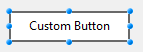
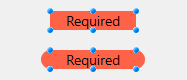
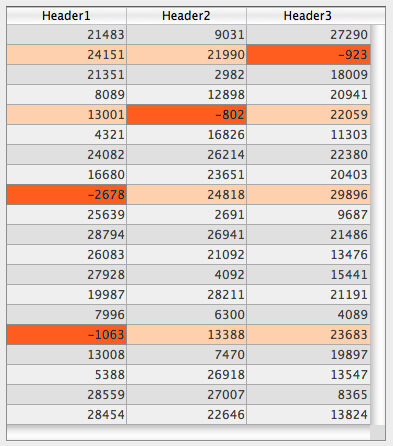

## Cor de fundo alternado

Permite definir uma cor de fundo diferente para linhas/colunas ímpares em uma caixa de listagem. Por padrão, *Automático* está selecionado: a coluna usa a cor de fundo alternativa definida no nível da caixa de listagem.

Você também pode definir esta propriedade usando o comando [`OBJECT SET RGB COLORS`](../commands/object-set-rgb-colors).

#### Gramática JSON

| Nome          | Tipo de dados | Valores possíveis                              |
| ------------- | ------------- | ---------------------------------------------- |
| alternateFill | string        | qualquer valor css; "transparent"; "automatic" |

#### Objectos suportados

[List Box](listbox_overview.md) - [Columna List Box](listbox-column.md)

#### Comandos

[`OBJECT GET RGB COLORS`](../commands/object-get-rgb-colors) - [`OBJECT SET RGB COLORS`](../commands/object-set-rgb-colors)

---

## Background Color / Fill color

Defines the background color / fill color of an object. It can be defined for some standard objects (`fill` JSON property) or ["custom style" objects](#custom-style-button-check-box-or-radio-button) (`borderFillColor` JSON property). [hh](#)

:::note

The **Fill color** property is named **Background color** with [List Box](listbox_overview.md), [List Box Column](listbox-column.md) and [List Box Footer](listbox-header-footer.md#footers) objects.

:::

### Standard objects

No caso de uma caixa de listagem, por padrão, *Automático* é selecionado: a coluna usa a cor de fundo definida no nível da caixa de listagem.

#### Gramática JSON

| Nome | Tipo de dados | Valores possíveis                              |
| ---- | ------------- | ---------------------------------------------- |
| fill | string        | qualquer valor css; "transparent"; "automatic" |

#### Objectos suportados

[Lista hierárquica](list_overview.md) - [Entrada](input_overview.md) - [List Box](listbox_overview.md) - [Coluna List Box](listbox-column.md) - [Rodapé List Box](listbox-header-footer.md#footers) - [Oval](shapes_overview.md#oval) - [Rectângulo](shapes_overview.md#rectangle) - [Área de texto](text.md)

#### Comandos

[`LISTBOX Get row color`](../commands/listbox-get-row-color) - [`LISTBOX SET ROW COLOR`](../commands/listbox-set-row-color) - [`OBJECT GET RGB COLORS`](../commands/object-get-rgb-colors) - [`OBJECT SET RGB COLORS`](../commands/object-set-rgb-colors)

### Custom button, custom check box, or custom radio button

This property allows you to assign a fill color attribute to [custom buttons](./button_overview.md#custom), [custom check boxes](./checkbox_overview.md#custom), or [custom radio buttons](./radio_overview.md#custom). In addition, [custom buttons](./button_overview.md#custom) must have the ["custom" Border Line Style](#border-line-style). In other contexts, the property is ignored.

#### Gramática JSON

| Nome            | Tipo de dados | Valores possíveis                              |
| --------------- | ------------- | ---------------------------------------------- |
| borderFillColor | string        | qualquer valor css; "transparent"; "automatic" |

#### Objectos suportados

[Custom Button](./button_overview.md#custom) (with ["custom" Border Line Style](#border-line-style)) - [Custom Check Box](checkbox_overview.md#custom) - [Custom Radio Button](radio_overview.md#custom)

#### Comandos

[`OBJECT GET RGB COLORS`](../commands/object-get-rgb-colors) - [`OBJECT SET RGB COLORS`](../commands/object-set-rgb-colors)

#### Veja também

[Transparente](#transparente)

---

## Background Color Expression {#background-color-expression}

`List box de tipo coleção e seleção de entidades`

Uma expressão ou uma variável (variáveis de matriz não podem ser usadas) para aplicar uma cor de fundo personalizada a cada linha da caixa de listagem. A expressão ou variável será avaliada para cada linha exibida e deve retornar um valor de cor RGB. For more information, refer to the description of the [`OBJECT SET RGB COLORS`](../commands/object-set-rgb-colors) command.

Você também pode definir esta propriedade usando o comando [`LISTBOX SET PROPERTY`](../commands/listbox-set-property) com a constante `lk color expression`.

> Com os list box de tipo coleção ou seleção de entidades, esta propriedade também pode ser definida usando uma [Meta Info Expression](properties_Text.md#meta-info-expression).

#### Gramática JSON

| Nome          | Tipo de dados | Valores possíveis                             |
| ------------- | ------------- | --------------------------------------------- |
| rowFillSource | string        | Uma expressão que retorna um valor de cor RGB |

#### Objectos suportados

[List Box](listbox_overview.md) - [Columna List Box](listbox-column.md)

#### Comandos

[`LISTBOX Get property`](../commands/listbox-get-property) - [`LISTBOX SET PROPERTY`](../commands/listbox-set-property)

---

## Border Color {#border-color}

Allows defining the color of the inner border for:

- [custom buttons](./button_overview.md#custom) with the ["custom" Border Line Style](#border-line-style),
- [custom check boxes](./checkbox_overview.md#custom),
- [custom radio buttons](./radio_overview.md#custom).

In other contexts, the property is ignored.

Note that the border is only displayed when its [width](#border-width) is > 0.

#### Gramática JSON

| Nome        | Tipo de dados | Valores possíveis                              |
| ----------- | ------------- | ---------------------------------------------- |
| borderColor | string        | qualquer valor css; "transparent"; "automatic" |

#### Objectos suportados

[Custom Button](./button_overview.md#custom) (with ["custom" Border Line Style](#border-line-style)) - [Custom Check Box](checkbox_overview.md#custom) - [Custom Radio Button](radio_overview.md#custom)

#### Comandos

[`OBJECT GET RGB COLORS`](../commands/object-get-rgb-colors) - [`OBJECT SET RGB COLORS`](../commands/object-set-rgb-colors)

## Estilo de linha de borda {#border-line-style}

Permite definir um estilo padrão para o contorno do objeto.

:::note

For [custom buttons](./button_overview.md#custom), the **custom** border line style enables the inner frame design, that includes a set of extra properties: [Fill color](#background-color--fill-color), [Frame color](#frame-color), [Frame width](#frame-width), and [Corner radius](./properties_BackgroundAndBorder.md#corner-radius).



:::

:::tip Related blog post

[Customize Buttons, Radio Buttons, and Check Boxes with Background and Border Properties](https://blog.4d.com/customize-buttons-radio-buttons-and-check-boxes-with-background-and-border-properties).

:::

#### Gramática JSON

| Nome        | Tipo de dados | Valores possíveis                                                           |
| ----------- | ------------- | --------------------------------------------------------------------------- |
| borderStyle | text          | "system", "none", "solid", "dotted", "raised", "sunken", "double", "custom" |

#### Objectos suportados

[Área 4D View Pro](viewProArea_overview.md) - [Áreas 4D Write Pro](writeProArea_overview.md) - [Botões](button_overview.md) - [Grade de botões](buttonGrid_overview.md) - [Lista jerárquica](list_overview.md) - [Entrada](input_overview.md) - [List Box](listbox_overview.md) - [Botão imagem](pictureButton_overview.md) - [Menu pop-up com imagem](picturePopupMenu_overview.md) - [Área Plug-in](pluginArea_overview.md) - [Indicador de progresso](progressIndicator.md) - [Regra](ruler.md) - [Spinner](spinner.md) - [Stepper](stepper.md) - [Subformulário](subform_overview.md) - [Área de texto](text.md) - [Área web](webArea_overview.md)

#### Comandos

[`OBJECT Get border style`](../commands/object-get-border-style) - [`OBJECT SET BORDER STYLE`](../commands/object-set-border-style)

---

## Border Width {#border-width}

Allows defining the width of the inner border for:

- [custom buttons](./button_overview.md#custom) with the ["custom" Border Line Style](#border-line-style),
- [custom check boxes](./checkbox_overview.md#custom),
- [custom radio buttons](./radio_overview.md#custom).

In other contexts, the property is ignored.

The value is expressed in pixels.

#### Gramática JSON

| Nome        | Tipo de dados | Valores possíveis                                                            |
| ----------- | ------------- | ---------------------------------------------------------------------------- |
| borderWidth | number        | Integer value (pixels). Minimum value = 0 |

#### Objectos suportados

[Custom Button](./button_overview.md#custom) (with ["custom" Border Line Style](#border-line-style)) - [Custom Check Box](checkbox_overview.md#custom) - [Custom Radio Button](radio_overview.md#custom)

---

## Retângulo

<details><summary>História</summary>

| Release | Mudanças                                                         |
| ------- | ---------------------------------------------------------------- |
| 21 R5   | Support for custom-styled buttons, radio buttons and check boxes |
| 18 R6   | Suporte para entradas e áreas de texto                           |

</details>

Define o arredondamento do canto (em pixels) do objeto. Por padrão, o valor do raio é 0 pixels. Você pode alterar essa propriedade para desenhar objetos arredondados com formas personalizadas:


O valor mínimo é 0; nesse caso, um retângulo de objeto padrão não arredondado é desenhado.
O valor máximo depende do tamanho do retângulo (ele não pode exceder metade do tamanho do retângulo menor) sendo calculado dinamicamente.

In [text areas](./text.md) and [inputs](./input_overview.md):

- the corner radius property is only available with "none", "solid", or "dotted" [border line styles](#border-line-style),
- the corner roundness is drawn **outside** the area of the object (the object appears larger in the form but its [width](./properties_CoordinatesAndSizing.md#width) and [height](./properties_CoordinatesAndSizing.md#height) are not extended).



In [custom buttons](./button_overview.md#custom) (with a ["custom" Border Line Style](#border-line-style)), [custom check boxes](checkbox_overview.md#custom) and [custom radio buttons](radio_overview.md#custom), the corner radius is drawn **inside** the area of the object.

#### Gramática JSON

| Nome         | Tipo de dados | Valores possíveis         |
| ------------ | ------------- | ------------------------- |
| borderRadius | integer       | mínimo: 0 |

#### Objectos suportados

[Custom Button](./button_overview.md#custom) (with ["custom" Border Line Style](#border-line-style)) - [Custom Check Box](checkbox_overview.md#custom) - [Input](input_overview.md) - [Rectangle](shapes_overview.md#rectangle) - [Text Area](text.md) - [Custom Radio Button](radio_overview.md#custom)

#### Comandos

[OBJECT GET CORNER RADIUS](../commands/object-get-corner-radius) - [OBJECT SET CORNER RADIUS](../commands/object-set-corner-radius)

---

## Tipo de linha pontilhada {#dotted-line-type}

Descreve o tipo de linha pontilhada como uma sequência de pontos pretos e brancos.

#### Gramática JSON

| Nome            | Tipo de dados               | Valores possíveis                                                                                                                                                                                                            |
| --------------- | --------------------------- | ---------------------------------------------------------------------------------------------------------------------------------------------------------------------------------------------------------------------------- |
| strokeDashArray | arrays numéricos ou strings | Ex. Ex. Ex. Ex. Ex. "6 1" or \[6,1\] for a sequence of 6 black point and 1 white point |

#### Objectos suportados

[Rectângulo](shapes_overview.md#rectangle) - [Ovalo](shapes_overview.md#oval) - [Linha](shapes_overview.md#line)

---

## Esconder linhas em branco extras

Controla a exibição de linhas em branco extras adicionadas na parte inferior de um objeto de caixa de listagem. Por defeito, 4D adiciona essas linhas extra para preencher a área vazia:


Pode remover estas linhas vazias selecionando esta opção. A parte inferior do objeto do list box é deixada em branco:


#### Gramática JSON

| Nome               | Tipo de dados | Valores possíveis |
| ------------------ | ------------- | ----------------- |
| hideExtraBlankRows | boolean       | true, false       |

#### Objectos suportados

[List Box](listbox_overview.md)

#### Comandos

[`LISTBOX Get property`](../commands/listbox-get-property) - [`LISTBOX SET PROPERTY`](../commands/listbox-set-property)

---

## Cor da linha

Designa a cor das linhas do objeto.
A cor pode ser especificada por:

- um nome de cor - como "red"
- um valor HEX - como "#ff0000"
- um valor RGB - como "rgb(255,0,0)"

Você também pode definir esta propriedade usando o comando [`OBJECT SET RGB COLORS`](../commands/object-set-rgb-colors).

#### Gramática JSON

| Nome   | Tipo de dados | Valores possíveis                        |
| ------ | ------------- | ---------------------------------------- |
| stroke | string        | um valor css, "transparent", "automatic" |

> Essa propriedade também está disponível para objetos baseados em texto, neste caso é designada tanto a cor da fonte quanto as linhas do objeto, veja [Cor da fonte](properties_Text.md#font-color).

#### Objectos suportados

[Línea](shapes_overview.md#line) - [Óvalo](shapes_overview.md#oval) - [Rectángulo](shapes_overview.md#rectangle)

#### Comandos

[`OBJECT GET RGB COLORS`](../commands/object-get-rgb-colors) - [`OBJECT SET RGB COLORS`](../commands/object-set-rgb-colors)

---

## Largura da linha

Designa a espessura de uma linha.

#### Gramática JSON

| Nome        | Tipo de dados | Valores possíveis                                                                                               |
| ----------- | ------------- | --------------------------------------------------------------------------------------------------------------- |
| strokeWidth | number        | 0 para el ancho más pequeño en un formulario impreso, o cualquier valor de entero < 20 |

#### Objectos suportados

[Línea](shapes_overview.md#line) - [Óvalo](shapes_overview.md#oval) - [Rectángulo](shapes_overview.md#rectangle)

---

## Row Background Color Array {#row-background-color-array}

`List boxes de tipo array`

O nome de um array para aplicar uma cor de fundo personalizada para cada linha ou coluna da list box.

Deve ser introduzido o nome de um array Longint. Cada elemento deste array corresponde a uma linha do list box (se aplicada o list box) ou a uma célula da coluna (se aplicada a uma coluna), pelo que o array deve ter o mesmo tamanho que o array associado à coluna. Você pode usar as constantes descritas no comando [`OBJECT SET RGB COLORS`](../commands/object-set-rgb-colors). Você pode usar as constantes do tema <a href="https://doc.4d.com/4Dv20/4D/20.1/SET-RGB-COLORS.302-6481080.en.html">SET RGB COLORS</a>.

Por exemplo, dada uma caixa de listagem em que as linhas têm uma cor alternada de cinza/cinza claro, definida nas propriedades da caixa de listagem. Um array de cor de fundo também foi definida para a caixa de listagem, a fim de mudar a cor das linhas em que pelo menos um valor é negativo para laranja claro:

```4d
 <>_BgndColors{$i}:=0x00FFD0B0 // laranja
 <>_BgndColors{$i}:=-255 // valor por padrão
```


De seguida, deve colorir as células com valores negativos a laranja-escuro. Para fazer isso, você definiu um array de cor de fundo para cada coluna, por exemplo, `<>_BgndColor_1`, `<>_BgndColor_2` e `<>_BgndColor_3`. Os valores dessas arrays têm prioridade sobre os valores definidos nas propriedades da caixa de listagem, bem como sobre os valores do array geral de cores de fundo:

```4d
 <>_BgndColorsCol_3{2}:=0x00FF8000 // laranja escura
 <>_BgndColorsCol_2{5}:=0x00FF8000
 <>_BgndColorsCol_1{9}:=0x00FF8000
 <>_BgndColorsCol_1{16}:=0x00FF8000
```



Você pode obter o mesmo resultado usando os comandos [`LISTBOX SET ROW STYLE`](../commands/listbox-set-row-font-style) e [`LISTBOX SET ROW COLOR`](../commands/listbox-set-row-color). Eles têm a vantagem de permitir que você não precise predefinir matrizes de estilo/cor para as colunas: em vez disso, elas são criadas dinamicamente pelos comandos.

#### Gramática JSON

| Nome          | Tipo de dados | Valores possíveis                           |
| ------------- | ------------- | ------------------------------------------- |
| rowFillSource | string        | O nome de um array longint. |

#### Objectos suportados

[List Box](listbox_overview.md) - [Columna List Box](listbox-column.md)

#### Comandos

[`LISTBOX Get array`](../commands/listbox-get-array) - [`LISTBOX GET ARRAYS`](../commands/listbox-get-arrays)

---

## Transparente

Define o fundo do list box como "Transparent". Quando definido, qualquer [cor de fundo alternativa](#alternate-background-color) ou [cor de fundo](#background-color--fill-color) definido para a coluna é ignorada.

#### Gramática JSON

| Nome | Tipo de dados | Valores possíveis |
| ---- | ------------- | ----------------- |
| fill | text          | "transparent"     |

#### Objectos suportados

[List Box](listbox_overview.md)

#### Comandos

[`OBJECT GET RGB COLORS`](../commands/object-get-rgb-colors) - [`OBJECT SET RGB COLORS`](../commands/object-set-rgb-colors)

#### Veja também

[Cor de fundo / Cor de preenchimento](#background-color--fill-color)

