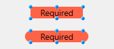

## Altura automática da linha

Esta propriedade só está disponível para os list box com as seguintes [fontes de dados](properties_Object.md#data-source):

- collection ou entity selection,
- array (não hierárquico).

A propriedade não está selecionada por padrão. Quando usado para pelo menos uma coluna, a altura de cada linha na coluna será automaticamente calculada por 4D, e o conteúdo da coluna será levado em consideração. Observe que somente as colunas com a opção selecionada serão consideradas para calcular a altura da linha.

:::note

Ao redimensionar a forma, se a propriedade de [dimensionamento horizontal](properties_ResizingOptions.md#horizontal-sizing) "Crescer" foi atribuída o list box, a coluna mais direita será aumentada além da largura máxima se necessário.

:::

Quando essa propriedade está ativada, a altura de cada linha é calculada automaticamente para que o conteúdo da célula caiba totalmente sem ser truncado (a menos que a opção [Wordwrap](properties_Display.md#wordwrap) esteja desativada).

- O cálculo da altura da linha tem em conta:
  - qualquer tipo de conteúdo (texto, numérico, datas, horas, imagens (o cálculo depende do formato da imagem), objetos),
  - quaisquer tipos de controlo (entradas, caixas de verificação, listas, listas suspensas),
  - tipos, estilos e tamanhos de letra,
  - a opção [Embalagem de palavras](properties_Display.md#wordwrap): se desativada, a altura é baseada no número de parágrafos (as linhas são truncadas); se ativada, a altura é baseada no número de linhas (não truncadas).

- O cálculo da altura da linha ignora:
  - conteúdo da coluna oculta
  - Para los list box de tipo array, esta propiedad sólo está disponible si la opción [Altura de línea automática](#automatic-row-height) no está seleccionada.

:::caution

&#062; Como requer cálculos adicionais em tempo de execução, a opção de altura automática da linha pode afetar a fluidez da rolagem da sua caixa de listagem, principalmente quando ela contém um grande número de linhas.

:::

#### Gramática JSON

| Nome          | Tipo de dados | Valores possíveis |
| ------------- | ------------- | ----------------- |
| rowHeightAuto | boolean       | true, false       |

#### Objectos suportados

[Coluna de list box](listbox_overview.md#list-box-columns)

---

## Fundo

Coordenadas inferiores do objeto no formulário.

#### Gramática JSON

| Nome   | Tipo de dados | Valores possíveis         |
| ------ | ------------- | ------------------------- |
| bottom | number        | mínimo: 0 |

#### Objectos suportados

[4D View Pro Area](viewProArea_overview.md) - [4D Write Pro Area](writeProArea_overview.md) - [Button](button_overview.md) - [Button Grid](buttonGrid_overview.md) - [Check Box](checkbox_overview.md) - [Combo Box](comboBox_overview.md) - [Dropdown list](dropdownList_Overview.md) - [Group Box](groupBox.md) - [Hierarchical List](list_overview.md) - [Input](input_overview.md) - [List Box](listbox_overview.md) - [Line](shapes_overview.md#line) - [List Box Column](listbox_overview.md#list-box-columns) - [Oval](shapes_overview.md#oval) - [Picture Button](pictureButton_overview.md) - [Picture Pop up menu](picturePopupMenu_overview.md) - [Plug-in Area](pluginArea_overview.md) - [Progress Indicators](progressIndicator.md) - [Radio Button](radio_overview.md) - [Rectangle](shapes_overview.md#rectangle) - [Ruler](ruler.md) - [Spinner](spinner.md) - [Splitter](splitters.md) - [Static Picture](staticPicture.md) - [Stepper](stepper.md) - [Subform](subform_overview.md) - [Tab control](tabControl.md) - [Text Area](text.md) - [Web Area](webArea_overview.md)

---

## Direita

Coordenadas esquerda do objecto no formulário.

#### Gramática JSON

| Nome | Tipo de dados | Valores possíveis         |
| ---- | ------------- | ------------------------- |
| left | number        | mínimo: 0 |

#### Objectos suportados

[4D View Pro Area](viewProArea_overview.md) - [4D Write Pro Area](writeProArea_overview.md) - [Button](button_overview.md) - [Button Grid](buttonGrid_overview.md) - [Check Box](checkbox_overview.md) - [Combo Box](comboBox_overview.md) - [Dropdown list](dropdownList_Overview.md) - [Group Box](groupBox.md) - [Hierarchical List](list_overview.md) - [Input](input_overview.md) - [List Box](listbox_overview.md) - [Line](shapes_overview.md#line) - [List Box Column](listbox_overview.md#list-box-columns) - [Oval](shapes_overview.md#oval) - [Picture Button](pictureButton_overview.md) - [Picture Pop up menu](picturePopupMenu_overview.md) - [Plug-in Area](pluginArea_overview.md) - [Progress Indicators](progressIndicator.md) - [Radio Button](radio_overview.md) - [Ruler](ruler.md) - [Rectangle](shapes_overview.md#rectangle) - [Spinner](spinner.md) - [Splitter](splitters.md) - [Static Picture](staticPicture.md) - [Stepper](stepper.md) - [Subform](subform_overview.md) - [Tab control](tabControl.md) - [Text Area](text.md) - [Web Area](webArea_overview.md)

---

## Esquerda

Coordenada direita do objecto no formulário.

#### Gramática JSON

| Nome    | Tipo de dados | Valores possíveis         |
| ------- | ------------- | ------------------------- |
| direita | number        | mínimo: 0 |

#### Objectos suportados

[4D View Pro Area](viewProArea_overview.md) - [4D Write Pro Area](writeProArea_overview.md) - [Button](button_overview.md) - [Button Grid](buttonGrid_overview.md) - [Check Box](checkbox_overview.md) - [Combo Box](comboBox_overview.md) - [Dropdown list](dropdownList_Overview.md) - [Group Box](groupBox.md) - [Hierarchical List](list_overview.md) - [Input](input_overview.md) - [List Box](listbox_overview.md) - [Line](shapes_overview.md#line) - [List Box Column](listbox_overview.md#list-box-columns) - [Oval](shapes_overview.md#oval) - [Picture Button](pictureButton_overview.md) - [Picture Pop up menu](picturePopupMenu_overview.md) - [Plug-in Area](pluginArea_overview.md) - [Progress Indicators](progressIndicator.md) - [Radio Button](radio_overview.md) - [Ruler](ruler.md) - [Rectangle](shapes_overview.md#rectangle) - [Spinner](spinner.md) - [Splitter](splitters.md) - [Static Picture](staticPicture.md) - [Stepper](stepper.md) - [Subform](subform_overview.md) - [Tab control](tabControl.md) - [Text Area](text.md) - [Web Area](webArea_overview.md)

---

## Topo

Coordenada superior do objecto no formulário.

#### Gramática JSON

| Nome | Tipo de dados | Valores possíveis         |
| ---- | ------------- | ------------------------- |
| top  | number        | mínimo: 0 |

#### Objectos suportados

[4D View Pro Area](viewProArea_overview.md) - [4D Write Pro Area](writeProArea_overview.md) - [Button](button_overview.md) - [Button Grid](buttonGrid_overview.md) - [Check Box](checkbox_overview.md) - [Combo Box](comboBox_overview.md) - [Dropdown list](dropdownList_Overview.md) - [Group Box](groupBox.md) - [Hierarchical List](list_overview.md) - [Input](input_overview.md) - [List Box](listbox_overview.md) - [Line](shapes_overview.md#line) - [List Box Column](listbox_overview.md#list-box-columns) - [Oval](shapes_overview.md#oval) - [Picture Button](pictureButton_overview.md) - [Picture Pop up menu](picturePopupMenu_overview.md) - [Plug-in Area](pluginArea_overview.md) - [Progress Indicators](progressIndicator.md) - [Radio Button](radio_overview.md) - [Ruler](ruler.md) - [Rectangle](shapes_overview.md#rectangle) - [Spinner](spinner.md) - [Splitter](splitters.md) - [Static Picture](staticPicture.md) - [Stepper](stepper.md) - [Subform](subform_overview.md) - [Tab control](tabControl.md) - [Text Area](text.md) - [Web Area](webArea_overview.md)

---

## Retângulo

<details><summary>História</summary>

| Release | Mudanças                               |
| ------- | -------------------------------------- |
| 18 R6   | Suporte para entradas e áreas de texto |

</details>

Define o arredondamento do canto (em pixels) do objeto. Por padrão, o valor do raio é 0 pixels. Você pode alterar essa propriedade para desenhar objetos arredondados com formas personalizadas:


O valor mínimo é 0; nesse caso, um retângulo de objeto padrão não arredondado é desenhado.
O valor máximo depende do tamanho do retângulo (ele não pode exceder metade do tamanho do retângulo menor) sendo calculado dinamicamente.

:::note

Com as [áreas de texto](text.md) e [entradas](input_overview.md):

- la propiedad de radio de la esquina sólo está disponible con los [estilos de línea de borde](properties_BackgroundAndBorder.md#border-line-style) "ninguno", "sólido" o "punteado",
- o arredondamento do canto é desenhado fora da área do objeto (o objeto aparece maior no formulário, mas sua [largura](properties_CoordinatesAndSizing.md#width) e [altura](properties_CoordinatesAndSizing.md#height) não são estendidas).



:::

Você também pode definir essa propriedade usando os comandos [OBJECT Get corner radius] (https://doc.4d.com/4dv19/help/command/en/page1323.html) e [OBJECT SET CORNER RADIUS] (https://doc.4d.com/4dv19/help/command/en/page1324.html).

#### Gramática JSON

| Nome         | Tipo de dados | Valores possíveis         |
| ------------ | ------------- | ------------------------- |
| borderRadius | integer       | mínimo: 0 |

#### Objectos suportados

[Entrada](input_overview.md) - [Retângulo](shapes_overview.md#rectangle) - [Área de texto](text.md)

---

## Alto

Esta propriedade designa o tamanho vertical de um objeto.

> Alguns objetos podem ter uma altura predefinida que não pode ser alterada.

#### Gramática JSON

| Nome   | Tipo de dados | Valores possíveis         |
| ------ | ------------- | ------------------------- |
| height | number        | mínimo: 0 |

#### Objectos suportados

[4D View Pro Area](viewProArea_overview.md) - [4D Write Pro Area](writeProArea_overview.md) - [Button](button_overview.md) - [Button Grid](buttonGrid_overview.md) - [Check Box](checkbox_overview.md) - [Combo Box](comboBox_overview.md) - [Dropdown list](dropdownList_Overview.md) - [Group Box](groupBox.md) - [Hierarchical List](list_overview.md) - [Input](input_overview.md) - [List Box](listbox_overview.md) - [Line](shapes_overview.md#line) - [List Box Column](listbox_overview.md#list-box-columns) - [Oval](shapes_overview.md#oval) - [Picture Button](pictureButton_overview.md) - [Picture Pop up menu](picturePopupMenu_overview.md) - [Plug-in Area](pluginArea_overview.md) - [Progress Indicators](progressIndicator.md) - [Radio Button](radio_overview.md) - [Ruler](ruler.md) - [Rectangle](shapes_overview.md#rectangle) - [Spinner](spinner.md) - [Splitter](splitters.md) - [Static Picture](staticPicture.md) - [Stepper](stepper.md) - [Subform](subform_overview.md) - [Tab control](tabControl.md) - [Text Area](text.md) - [Web Area](webArea_overview.md)

---

## Largura

Esta propriedade designa o tamanho horizontal de um objeto.

> - Alguns objetos podem ter uma altura predefinida que não pode ser alterada.
> - Si la propiedad [Redimensionable](properties_ResizingOptions.md#resizable) se utiliza para una [columna de list box](listbox_overview.md#list-box-columns), el usuario también puede cambiar manualmente el tamaño de la columna.
> - Ao redimensionar a forma, se a propriedade de [dimensionamento horizontal "Crescer"](properties_ResizingOptions.md#horizontal-sizing) foi atribuída o list box, a coluna mais direita será aumentada além da largura máxima se necessário.

#### Gramática JSON

| Nome  | Tipo de dados | Valores possíveis         |
| ----- | ------------- | ------------------------- |
| width | number        | mínimo: 0 |

#### Objectos suportados

[4D View Pro Area](viewProArea_overview.md) - [4D Write Pro Area](writeProArea_overview.md) - [Button](button_overview.md) - [Button Grid](buttonGrid_overview.md) - [Check Box](checkbox_overview.md) - [Combo Box](comboBox_overview.md) - [Dropdown list](dropdownList_Overview.md) - [Group Box](groupBox.md) - [Hierarchical List](list_overview.md) - [Input](input_overview.md) - [Line](shapes_overview.md#line) - [List Box](listbox_overview.md) - [List Box Column](listbox_overview.md#list-box-columns) - [Oval](shapes_overview.md#oval) - [Picture Button](pictureButton_overview.md) - [Picture Pop up menu](picturePopupMenu_overview.md) - [Plug-in Area](pluginArea_overview.md) - [Progress Indicators](progressIndicator.md) - [Radio Button](radio_overview.md) - [Ruler](ruler.md) - [Rectangle](shapes_overview.md#rectangle) - [Spinner](spinner.md) - [Splitter](splitters.md) - [Static Picture](staticPicture.md) - [Stepper](stepper.md) - [Subform](subform_overview.md) - [Tab control](tabControl.md) - [Text Area](text.md) - [Web Area](webArea_overview.md)

---

## Largura máxima

A largura máxima da coluna (em píxeis). A largura da coluna não pode ser aumentada além deste valor ao redimensionar a coluna ou o formulário.

> Ao redimensionar a forma, se a propriedade de [dimensionamento horizontal "Crescer"](properties_ResizingOptions.md#horizontal-sizing) foi atribuída o list box, a coluna mais direita será aumentada além da largura máxima se necessário.

#### Gramática JSON

| Nome     | Tipo de dados | Valores possíveis         |
| -------- | ------------- | ------------------------- |
| maxWidth | number        | mínimo: 0 |

#### Objectos suportados

[Coluna de list box](listbox_overview.md#list-box-columns)

---

## Largura mínima

A largura mínima da coluna (em píxeis). A largura da coluna não pode ser reduzida abaixo deste valor quando se redimensiona a coluna ou o formulário.

> Ao redimensionar a forma, se a propriedade de [dimensionamento horizontal "Crescer"](properties_ResizingOptions.md#horizontal-sizing) foi atribuída o list box, a coluna mais direita será aumentada além da largura máxima se necessário.

#### Gramática JSON

| Nome     | Tipo de dados | Valores possíveis         |
| -------- | ------------- | ------------------------- |
| minWidth | number        | mínimo: 0 |

#### Objectos suportados

[Coluna de list box](listbox_overview.md#list-box-columns)

---

## Array altura linha

Define a altura das linhas do list box (excluindo cabeçalhos e rodapés). Por padrão, a altura da linha é definida conforme a plataforma e o tamanho da fonte.

#### Gramática JSON

| Nome      | Tipo de dados | Valores possíveis                                                  |
| --------- | ------------- | ------------------------------------------------------------------ |
| rowHeight | string        | valor css na unidade "em" ou "px" (por defeito) |

#### Objectos suportados

[List Box](listbox_overview.md)

#### Veja também

[Array de altura da linha](#row-height-array)

---

## Array estilo linha

Essa propriedade é usada para especificar o nome de um array de altura de linha que você deseja associar a list box. Um array de altura de linha deve ser do tipo numérico (longint por defeito).

Quando um array de altura de linha é definido, cada um de seus elementos cujo valor difere de 0 (zero) é considerado para determinar a altura da linha correspondente no list box, com base na unidade de altura da linha atual.

Por exemplo, pode escrever:

```4d
ARRAY LONGINT(RowHeights;20)
RowHeights{5}:=3
```

Supondo que a unidade das linhas seja "linhas", então a quinta linha do list box terá uma altura de três linhas, enquanto todas as outras linhas manterão sua altura padrão.

> - A propriedade Row Height Array não é considerado nos list boxes hierárquicos.
> - Para os list box de tipo array e collection/entity selection, essa propriedade só estará disponível se a opção [Altura da linha automática](#automatic-row-height) não estiver selecionada.

#### Gramática JSON

| Nome            | Tipo de dados | Valores possíveis                              |
| --------------- | ------------- | ---------------------------------------------- |
| rowHeightSource | string        | Nome de uma variável array 4D. |

#### Objectos suportados

[List Box](listbox_overview.md)

#### Veja também

[Altura da linha](#row-height)

---

## Barra rolagem horizontal

Define um preenchimento horizontal para as células. O valor é definido em pixeis (padrão = 0).


#### Gramática JSON

| Nome              | Tipo de dados | Valores possíveis                                   |
| ----------------- | ------------- | --------------------------------------------------- |
| horizontalPadding | number        | Número de píxeles (debe ser >=0) |

#### Objectos suportados

[List Box](listbox_overview.md) - [List Box Column](listbox_overview.md#list-box-columns) - [Footers](properties_Footers.md) - [Headers](properties_Headers.md)

#### Veja também

[Vertical Padding](#vertical-padding)

---

## Dimensionamento vertical

Define um preenchimento vertical para as células. O valor é definido em pixeis (padrão = 0).

#### Gramática JSON

| Nome            | Tipo de dados | Valores possíveis                                   |
| --------------- | ------------- | --------------------------------------------------- |
| verticalPadding | number        | Número de píxeles (debe ser >=0) |

#### Objectos suportados

[List Box](listbox_overview.md) - [List Box Column](listbox_overview.md#list-box-columns) - [Footers](properties_Footers.md) - [Headers](properties_Headers.md)

#### Veja também

[Horizontal Padding](#horizontal-padding)
