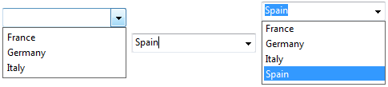

## Inserção automática

When this option is selected, if a user enters a value that is not found in the list associated with the object, this value is automatically added to the list stored in memory.

Quando a opção **inserção automática** não está definida (padrão), o valor inserido é armazenado no objeto formulário, mas não na lista na memória.

Esta propriedade é suportada por:

- Objetos formulário [Combo box](comboBox_overview.md) e [coluna list box](listbox_overview.md#list-box-columns) associado para uma lista de seleção.
- objetos de formulario [Combo box](comboBox_overview.md) cuya lista asociada se llena mediante su array o fuente de datos de objetos.

Por exemplo, dada uma lista de opções contendo "França, Alemanha, Itália" que está associada a um combo box "Countries": se a propriedade **inserção automática** estiver definida e um usuário digitar "Espanha", o valor "Espanha" será automaticamente adicionado à lista na memória:

> If the choice list was created from a list defined in Design mode, the original list is not modified.

#### Gramática JSON

| Nome               | Tipo de dados | Valores possíveis |
| ------------------ | ------------- | ----------------- |
| automaticInsertion | boolean       | true, false       |

#### Objectos suportados

[Combo Box](comboBox_overview.md) - [Columna List Box](listbox_overview.md#list-box-columns)

---

## Lista de escolha

Associa uma lista de opções a um objeto. It can be a choice list name (a list reference) or a collection of default values.

Você também pode associar listas de escolha a objetos usando os comandos [OBJECT SET LIST SET BY NAME](https://doc.4d.com/4dv19/help/command/en/page237.html) ou [OBJECT SET LIST BY REFERENCE](https://doc.4d.com/4dv19/help/command/en/page1266.html).

#### Gramática JSON

| Nome       | Tipo de dados     | Valores possíveis                                                              |
| ---------- | ----------------- | ------------------------------------------------------------------------------ |
| choiceList | liste, collection | Uma lista de valores possíveis                                                 |
| lista      | liste, collection | Uma lista de valores possíveis (apenas listas hierárquicas) |

#### Objectos suportados

[Drop-down List](dropdownList_Overview.md) - [Combo Box](comboBox_overview.md) - [Hierarchical List](list_overview.md#overview) - [List Box Column](listbox_overview.md#list-box-columns)

---

## Lista de opções (lista estática)

Lista de valores estáticos a serem usados como etiquetas para o objeto de controle de tabulação.

#### Gramática JSON

| Nome   | Tipo de dados     | Valores possíveis                                          |
| ------ | ----------------- | ---------------------------------------------------------- |
| labels | liste, collection | Uma lista de valores para preencher o controlo de pestanas |

#### Objectos suportados

[Controle de guias](tabControl.md)

---

## Item atual

`List box de tipo collection ou entity selection`

Specifies a variable or expression that will be assigned the collection element/entity selected by the user. You must use an object variable or an assignable expression that accepts objects. If the user does not select anything or if you used a collection of scalar values, the Null value is assigned.

> This property is "read-only", it is automatically updated according to user actions in the list box. Não é possível editar o seu valor para modificar o estado de seleção do list box.

#### Gramática JSON

| Nome              | Tipo de dados | Valores possíveis    |
| ----------------- | ------------- | -------------------- |
| currentItemSource | string        | Expressão de objecto |

#### Objectos suportados

[List Box](listbox_overview.md#overview)

---

## Posição item atual

`List box de tipo collection ou entity selection`

Specifies a variable or expression that will be assigned a longint indicating the position of the collection element/entity selected by the user.

- se nenhum elemento/entidade for selecionado, a variável ou expressão recebe zero,
- if a single element/entity is selected, the variable or expression receives its location,
- if multiple elements/entities are selected, the variable or expression receives the position of element/entity that was last selected.

> This property is "read-only", it is automatically updated according to user actions in the list box. Não é possível editar o seu valor para modificar o estado de seleção do list box.

#### Gramática JSON

| Nome                      | Tipo de dados | Valores possíveis  |
| ------------------------- | ------------- | ------------------ |
| currentItemPositionSource | string        | Expressão numérica |

#### Objectos suportados

[List Box](listbox_overview.md)

---

## Tipo de dados

Define o tipo de dados para a expressão apresentada. Esta propriedade é utilizada com:

- [Colunas do List box](listbox_overview.md#list-box-columns) de tipo seleção e coleção.
- [Listas suspensas](dropdownList_Overview.md) associadas a objetos ou arrays.

Veja também [**Tipo de expressão**](properties_Object.md#expression-type).

#### Gramática JSON

| Nome               | Tipo de dados | Valores possíveis                                                                                                                                                                                                                         |
| ------------------ | ------------- | ----------------------------------------------------------------------------------------------------------------------------------------------------------------------------------------------------------------------------------------- |
| dataSourceTypeHint | string        | <li>**columnas list box:** "boolean", "number", "picture", "text", date", "time". *Somente array/list box seleção*: "integer", "object"</li><li>**listas suspensas:** "object", "arrayText", "arrayDate", "arrayTime", "arrayNumber"</li> |

#### Objectos suportados

[Listas desplegables](dropdownList_Overview.md) asociadas a objetos o arrays - [Columna List Box](listbox_overview.md#list-box-columns)

---

## Tipo de dados (lista)

Define o tipo de dados a serem salvos no campo ou na variável associada à [lista suspensa](dropdownList_Overview.md). Esta propriedade é utilizada com:

- Listas suspensas [associadas a uma lista de opções](dropdownList_Overview.md#using-a-choice-list).
- Listas desdobráveis [associadas a una lista de selección jerárquica](dropdownList_Overview.md#using-a-hierarchical-choice-list).

Estão disponíveis três opções:

- **Referência de lista**: declara que a lista suspensa é hierárquica. Isso significa que a lista suspensa pode exibir até dois níveis hierárquicos e seu conteúdo pode ser gerenciado pelos comandos de linguagem 4D do tema **Listas hierárquicas**.
- **Valor do item selecionado** (padrão): a lista suspensa não é hierárquica e o valor do item escolhido na lista pelo usuário é salvo diretamente. For example, if the user chooses the value "Blue", then this value is saved in the field.
- **Referência do item selecionado**: a lista suspensa não é hierárquica e a referência do item da lista de opções é salva no objeto. Essa referência é o valor numérico associado a cada item por meio do parâmetro _itemRef_ dos comandos [`APPEND TO LIST`](https://doc.4d.com/4dv19/help/command/en/page376.html) ou [`SET LIST ITEM`](https://doc.4d.com/4dv19/help/command/en/page385.html), ou no editor de listas. This option lets you optimize memory usage: storing numeric values in fields uses less space than storing strings. It also makes it easier to translate applications: you just create multiple lists in different languages but with the same item references, then load the list based on the language of the application.

O uso da opção **Referência de item selecionado** exige a conformidade com os seguintes princípios:

- To be able to store the reference, the field or variable data source must be of the Number type (regardless of the type of value displayed in the list). A propriedade [expressão](properties_Object.md#expression-type) é definida automaticamente.
- Devem ser associadas referências válidas e únicas aos itens da lista.
- A lista pendente deve estar associada a um campo ou a uma variável.

#### Gramática JSON

| Nome   | Tipo de dados | Valores possíveis    |
| ------ | ------------- | -------------------- |
| saveAs | string        | "value", "reference" |

> Definir apenas `"dataSourceTypeHint" : "integer"` com um objeto de formulário `"type": "dropdown"` declarará uma lista suspensa hierárquica.

#### Objectos suportados

[Listas suspensas](dropdownList_Overview.md) associadas a listas

---

## Valores padrão (lista de)

List of values that will be used as default values for the list box column (array type only). Esses valores estão automaticamente disponíveis na [variable array](properties_Object.md#variable-or-expression) associada a essa coluna quando o formulário é executado. Usando a linguagem, você pode gerenciar o objeto referir-se a esse array.

> Não faça confusão entre esta propriedade e a propriedade "[valor padrão](properties_RangeOfValues.md#default-list-of-values)" que permite definir um valor de campo em novos registros.

É necessário introduzir uma lista de valores. In the Form editor, a specific dialog box allows you to enter values separated by carriage returns:

> Você também pode definir uma [lista de opções](properties_DataSource.md#choice-list) com a coluna de list box. However, a choice list will be used as list of selectable values for each column row, whereas the default list fill all column rows.

#### Gramática JSON

| Nome   | Tipo de dados | Valores possíveis                                                                                                              |
| ------ | ------------- | ------------------------------------------------------------------------------------------------------------------------------ |
| values | collection    | Uma coleção de valores por defeito (cadeias de caracteres), por exemplo: "a", "b", "c", "d" |

#### Objectos suportados

[Coluna List Box (somente tipo array)](listbox_overview.md#list-box-columns)

---

## Expression

Essa descrição é específica para colunas de list box do tipo [seleção](listbox_overview.md#selection-list-boxes)
e [collection](listbox_overview.md#collection-or-entity-selection-list-boxes). Consulte também a seção **[Variable or Expression](properties_Object.md#variable-or-expression)**.

Uma expressão 4D a associar a uma coluna. Você pode entrar:

- Uma **variável simple** (nesse caso, ela deve ser declarada explicitamente para compilação). Pode utilizar qualquer tipo de variável, exceto BLOBs e arrays. El valor de la variable se calculará generalmente en el evento `On Display Detail`.

- Um **campo** usando a sintaxe padrão [Tabela]Campo (solo [selection type list box](listbox_overview.md#selection-list-boxes)), por exemplo: `[Employees]LastName`. Podem ser utilizados os seguintes tipos de campos:
  - String
  - Numeric
  - Date
  - Hora
  - Imagem
  - Booliano\
    Você pode usar campos da tabela mestre ou de outras tabelas.

- Uma **expressão 4D** (expressão simples, fórmula ou método 4D). A expressão deve devolver um valor. O valor será avaliado nos eventos `On Display Detail` e `On Data Change`. O resultado da expressão será automaticamente apresentado quando mudar para o modo Aplicação. The expression will be evaluated for each record of the selection (current or named) of the Master Table (for selection type list boxes), each element of the collection (for collection type list boxes) or each entity of the selection (for entity selection list boxes). Se estiver vazia, a coluna não apresentará nenhum resultado.
  São suportados os seguintes tipos de expressão:
  - String
  - Numeric
  - Date
  - Imagem
  - Parâmetros

Nos list boxes coleção/entity selection, Null ou tipos sem suporte são exibidos como cadeias vazias.\
Ao usar coleções ou seleções de entidades, você geralmente declara a propriedade do elemento ou o atributo da entidade associado a uma coluna em uma expressão contendo [This](https://doc.4d.com/4Dv17R6/4D/17-R6/This.301-4310806.en.html). `This` es un comando 4D dedicado que devuelve una referencia al elemento actualmente procesado. Por ejemplo, puede utilizar `This.\<propertyPath>` donde `\<propertyPath>` es la ruta de una propiedad en la colección o una ruta de atributo de entidad para acceder al valor actual de cada elemento/entidad.
If you use a collection of scalar values, 4D will create an object for each collection element with a single property (named "value"), filled with the element value. Nesse caso, você usará `This.value` como expressão.

Si se utiliza una expresión no asignable  (por ejemplo, `[Person]FirstName+" "+[Person]LastName`), la columna nunca se podrá introducir aunque la propiedad [Editable](properties_Entry.md#enterable) esté activada.

Si se utiliza un campo, una variable o una expresión asignable (_por ejemplo Person.lastName_), la columna puede ser editable o no dependiendo de la propiedad [Editable](properties_Entry.md#enterable).

#### Gramática JSON

| Nome       | Tipo de dados | Valores possíveis                                                                                 |
| ---------- | ------------- | ------------------------------------------------------------------------------------------------- |
| dataSource | string        | Uma variável 4D, nome de campo ou uma expressão de linguagem complexa arbitrária. |

#### Objectos suportados

[Coluna de list box](listbox_overview.md#list-box-columns)

---

## Tabela mestre

`Current selection list boxes`

Especifica a tabela cuja seleção atual será utilizada. This table and its current selection will form the reference for the fields associated with the columns of the list box (field references or expressions containing fields). Even if some columns contain fields from other tables, the number of rows displayed will be defined by the master table.

All database tables can be used, regardless of whether the form is related to a table (table form) or not (project form).

#### Gramática JSON

| Nome   | Tipo de dados | Valores possíveis |
| ------ | ------------- | ----------------- |
| tabela | number        | Número de tabela  |

#### Objectos suportados

[List Box](listbox_overview.md#overview)

---

## Salvar como

Esta propriedade está disponível nas seguintes condições:

- una [lista de selección](#choice-list) está asociada al objeto
- for [inputs](input_overview.md) and [list box columns](listbox_overview.md#list-box-columns), a [required list](properties_RangeOfValues.md#required-list) is also defined for the object (both options should use usually the same list), so that only values from the list can be entered by the user.

This property specifies, in the context of a field or variable associated with a list of values, the type of contents to save:

- **Guardar como valor** (opción por defecto): el valor del elemento elegido en la lista por el usuario se guarda directamente. For example, if the user chooses the value "Blue", then this value is saved in the field.
- **Guardar como referencia**: la referencia del elemento de la lista de opciones se guarda en el objeto. Essa referência é o valor numérico associado a cada item por meio do parâmetro _itemRef_ dos comandos [`APPEND TO LIST`](https://doc.4d.com/4dv19/help/command/en/page376.html) ou [`SET LIST ITEM`](https://doc.4d.com/4dv19/help/command/en/page385.html), ou no editor de listas.

This option lets you optimize memory usage: storing numeric values in fields uses less space than storing strings. It also makes it easier to translate applications: you just create multiple lists in different languages but with the same item references, then load the list based on the language of the application.

A utilização deste bem exige o cumprimento dos seguintes princípios:

- To be able to store the reference, the field or variable data source must be of the Number type (regardless of the type of value displayed in the list). A propriedade [expressão](properties_Object.md#expression-type) é definida automaticamente.
- Devem ser associadas referências válidas e únicas aos itens da lista.

#### Gramática JSON

| Nome   | Tipo de dados | Valores possíveis    |
| ------ | ------------- | -------------------- |
| saveAs | string        | "value", "reference" |

#### Objectos suportados

[Área de entrada](input_overview.md) - [Columna List Box](listbox_overview.md#list-box-columns)

---

## Itens selecionados

`List box de tipo collection ou entity selection`

Specifies a variable or expression that will be assigned the elements or entities selected by the user.

- for a collection list box, you must use a collection variable or an assignable expression that accepts collections,
- para um list box seleção de entidades, é criado um objeto de seleção de entidades. You must use an object variable or an assignable expression that accepts objects.

> This property is "read-only", it is automatically updated according to user actions in the list box. Não é possível editar o seu valor para modificar o estado de seleção do list box.

#### Gramática JSON

| Nome                | Tipo de dados | Valores possíveis                          |
| ------------------- | ------------- | ------------------------------------------ |
| selectedItemsSource | string        | Assignable collection or object expression |

#### Objectos suportados

[List Box](listbox_overview.md#overview)

---

## Nome da seleção

`List boxes de tipo seleção nomeada`

Especifica a seleção nomeada a ser utilizada. Você deve inserir o nome de uma seleção nomeada válida. It can be a process or interprocess named selection. O conteúdo do list box será baseado nesta seleção. The named selection chosen must exist and be valid at the time the list box is displayed, otherwise the list box will be displayed blank.

> As selecções nomeadas são listas ordenadas de registos. They are used to keep the order and current record of a selection in memory. Para obter mais informações, consulte a seção **Seleções nomeadas** no _manual de Linguagem 4D_.

#### Gramática JSON

| Nome           | Tipo de dados | Valores possíveis |
| -------------- | ------------- | ----------------- |
| namedSelection | string        | Nome da selecção  |

#### Objectos suportados

[List Box](listbox_overview.md#overview)
