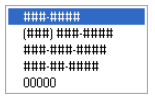
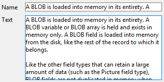

---

## Formato Alfa

Os formatos alfa controlam a forma como os campos alfanuméricos e variáveis aparecem quando exibidos ou impressos. Segue uma lista de formatos fornecidos para campos alfanuméricos:

Pode escolher um formato desta lista ou utilizar qualquer formato personalizado. A lista padrão contém formatos para alguns dos campos alfa mais comuns que requerem formatos: números de telefone dos EUA (distância local e interurbano), Números de segurança social e cep americano. Você também pode inserir um nome de formato personalizado definido no editor Filtros e formatos da caixa de ferramentas. Neste caso, o formato não pode ser modificado nas propriedades do objeto.
Todos os formatos ou filtros personalizados que você tiver criado estarão automaticamente disponíveis, precedidos por uma barra vertical (|).

O sinal de número (#) é o espaço reservado para um formato de exibição alfanumérico. Você pode incluir os traços, hífens, espaços e quaisquer outros sinais de pontuação apropriados que deseja exibir. Você usa os sinais de pontuação desejados e o sinal de número para cada caractere que quiser exibir.

Por exemplo, considere um número de peça com um formato como "RB-1762-1".

O formato alfa seria:

\##-####-#

Quando o usuário introduz "RB17621", o campo é apresentado:

RB-1762-1

O campo contém efetivamente "RB17621".

Se o usuário inserir mais caracteres do que o formato permitir, 4D exibe os últimos caracteres. Por exemplo, se o formato for:

(#######)

e o usuário introduzir "proportion", o campo é apresentado:

(portion)

O campo contém efetivamente "proportion". 4D aceita e armazena a entrada inteira, independentemente do formato de exibição. Não se perde nenhuma informação.

#### Gramática JSON

| Nome       | Tipo de dados | Valores possíveis                                                                                                   |
| ---------- | ------------- | ------------------------------------------------------------------------------------------------------------------- |
| textFormat | string        | "####", "(#####) ### ####", "### ### ### ####", "#### ## ####", "00000", formatos personalizados |

#### Objectos suportados

[Lista desplegable](dropdownList_Overview.md) - [Combo Box](comboBox_overview.md) - [Columna List Box](listbox_overview.md#list-box-columns) - [Pie List Box](listbox_overview.md#list-box-footers)

---

## Formato de Data

Os formatos de data controlam como as datas aparecem quando são apresentadas ou impressas. Para a entrada de dados, as datas são inseridas no formato MM/DD/AAAA, independentemente do formato de exibição escolhido.

Os formatos de exibição de datas podem ser definidos:

- usando um formato 4D incorporado,
- usando um padrão personalizado.

### Formatos incorporados

A tabela seguinte apresenta as opções disponíveis:

| Nome do formato                                  | Cadeia JSON                             | Exemplo (sistema americano)                |
| ------------------------------------------------ | --------------------------------------- | ------------------------------------------------------------- |
| System date short                                | systemShort (padrão) | 03/25/20                                                      |
| System date abbreviated _(1)_ | systemMedium                            | Wed, Mar 25, 2020                                             |
| System date long                                 | systemLong                              | Quarta-feira, 25 de março de 2020                             |
| RFC 822                                          | rfc822                                  | Tue, 25 Mar 2020 22:00:00 GMT |
| Short Century                                    | shortCentury                            | 03/25/20 pero 04/25/2032 _(2)_             |
| Internal date long                               | long                                    | March 25, 2020                                                |
| Fecha interna abreviada _(1)_ | abbreviated                             | Mar 25, 2020                                                  |
| Internal date short                              | short                                   | 03/25/2020                                                    |
| ISO Date Time _(3)_           | iso8601                                 | 2020-03-25T00:00:00           |

_(1)_ Para evitar ambigüedades y de acuerdo con la práctica actual, los formatos de fecha abreviados muestran "jun" para junio y "jul" para julio. Esta particularidade só se aplica às versões francesas de 4D.

_(2)_ El año se muestra con dos dígitos cuando pertenece al intervalo (1930;2029), de lo contrario se mostrará con cuatro dígitos. Esto es por defecto, pero puede modificarse utilizando el comando [SET DEFAULT CENTURY](https://doc.4d.com/4dv20/help/command/en/page392.html).

_(3)_ El formato `ISO Date Time` corresponde a la norma XML de representación de fecha y hora (ISO8601). Seu principal objetivo é ser usado na importação/exportação de dados em formato XML e em serviços da Web.

> Independentemente do formato de exibição, se o ano for inserido com dois dígitos, o 4D assume que o século é o 21º se o ano pertencer ao intervalo (00;29) e o 20º se pertencer ao intervalo (30;99). Esta es la configuración por defecto, pero puede modificarse utilizando el comando [SET DEFAULT CENTURY](https://doc.4d.com/4dv20/help/command/en/page392.html).

### Formato personalizado

Customized date formats can be built using several patterns described in the [**Date and Time Formats**](../Project/date-time-formats.md) page. Por exemplo:

| Padrão              | Exemplo (sistema americano) |
| ------------------- | ---------------------------------------------- |
| "eeee, dd"          | Wednesday, 29                                  |
| "'Dia' #D 'do ano'" | Dia #333 do ano                                |

#### Gramática JSON

| Nome       | Tipo de dados | Valores possíveis                                                                                                                                                                                                                                                                   |
| ---------- | ------------- | ----------------------------------------------------------------------------------------------------------------------------------------------------------------------------------------------------------------------------------------------------------------------------------- |
| dateFormat | string        | <li>Built-in formats: "systemShort", "systemMedium", "systemLong", "iso8601", "rfc822", "short", "shortCentury", "abbreviated", "long" + " blankIfNull"</li><li>Custom formats: any format built using a [supported pattern](../Project/date-time-formats.md) + " blankIfNull"</li> |

:::note blankIfNull

- Por padrão, uma data nula é exibida com zeros, por exemplo, 00/00/00. Com a opção "blankIfNull", uma data nula é exibida como uma área vazia. A cadeia de caracteres "blankIfNull" (sensível a maiúsculas e minúsculas) deve ser combinada com o valor de formato selecionado. Por exemplo: "systemShort blankIfNull" ou "ee dd LL blankIfNull".
- [List box columns](listbox_overview.md#list-box-columns) and [list box footers](listbox_overview.md#list-box-footers) of type date always use the "blank if null" behavior (it cannot be disengaged).

:::

#### Objectos suportados

[Combo Box](comboBox_overview.md) - [Drop-down List](dropdownList_Overview.md) - [Input](input_overview.md) - [List Box Column](listbox_overview.md#list-box-columns) - [List Box Footer](listbox_overview.md#list-box-footers)

---

## Formato do número

> Os campos de número incluem os tipos Integer, Long integer, Integer 64 bits, Real e Float.

Os formatos de números controlam a forma como os números aparecem quando exibidos ou impressos. Para a entrada de dados, você insere apenas os números (incluindo um ponto decimal ou sinal de menos, se necessário), independentemente do formato de exibição escolhido.

4D fornece vários formatos de números padrão.

### Marcadores

Em cada um dos formatos de exibição de números, o sinal de número (#), o zero (0), o acento circunflexo (^) e o asterisco (\*) são usados como espaços reservados. Você cria seus próprios formatos de números usando um espaço reservado para cada dígito que espera exibir.

| Placeholder (valores provisórios) | Efeito do zero à esquerda ou à direita     |
| ---------------------------------------------------- | ------------------------------------------ |
| #                                                    | Não apresenta nada                         |
| 0                                                    | Mostra 0                                   |
| ^                                                    | Apresenta um espaço (1) |
| \*                                                   | Apresenta um asterisco                     |

(1) O acento circunflexo (^) gera um caractere de espaço que ocupa a mesma largura de um dígito na maioria das fontes.

Por exemplo, se quiser exibir números de três dígitos, pode usar o formato ####. Si el usuario introduce más dígitos de los que permite el formato, 4D muestra <<< en el campo para indicar que se han introducido más dígitos de los especificados en el formato de visualización.

Se o usuário digitar um número negativo, o caractere mais à esquerda será exibido como um sinal de menos (a menos que um formato de exibição negativo tenha sido especificado). Si ##0 es el formato, menos 26 se muestra como -26 y menos 260 se muestra como <<< porque el signo menos ocupa un marcador de posición y sólo hay tres marcadores de posición.

> Independentemente do formato de exibição, 4D aceita e armazena o número inserido no campo. Não se perde nenhuma informação.

Cada caractere de espaço reservado tem um efeito diferente na exibição de zeros à esquerda ou à direita. Um zero à esquerda é um zero que começa um número antes do ponto decimal; um zero à direita é um zero que termina um número após o ponto decimal.

Suponha que utiliza o formato ##0 para mostrar três dígitos. Se o utilizador não introduzir nada no campo, o campo apresenta 0. Se o usuário introduzir 26, o campo apresenta 26.

### Caracteres separadores

Os formatos de exibição numérica (exceto para notações científicas) são automaticamente baseados nos parâmetros do sistema regional. 4D substitui os caracteres "." e ",", respectivamente, pelo separador decimal e pelo separador de milhar definido no sistema operacional. O ponto e a vírgula são, portanto, considerados caracteres de espaço reservado, seguindo o exemplo de 0 ou #.

> No Windows, ao usar a tecla de separação decimal do teclado numérico, 4D faz uma distinção dependendo do tipo de campo onde o cursor está localizado:
>
> - em um campo do tipo Real, o uso dessa chave inserirá o separador decimal definido no sistema,
> - em qualquer outro tipo de campo, essa chave insere o caractere associado à chave, geralmente um ponto (.) ou vírgula (,).

### Pontos decimais e outros caracteres de visualização

É possível utilizar um ponto decimal num formato de apresentação de números. Se quiser que o decimal seja exibido independentemente de o usuário digitá-lo, ele deverá ser colocado entre zeros.

Pode utilizar quaisquer outros caracteres no formato. Quando usados isoladamente, ou colocados antes ou depois de espaços reservados, os caracteres sempre aparecem. Por exemplo, se utilizar o seguinte formato:

$##0

um cifrão sempre aparece porque é colocado antes dos espaços reservados.

Se os caracteres forem colocados entre espaços reservados, eles aparecerão somente se os dígitos forem exibidos em ambos os lados. Por exemplo, se definir o formato:

\###.##0

o ponto só aparece se o usuário introduzir pelo menos quatro dígitos.

Os espaços são tratados como caracteres nos formatos de apresentação de números.

### Formatos para positivo, negativo e zero

Um formato de exibição de número pode ter até três partes, o que permite especificar formatos de exibição para valores positivos, negativos e zero. Você especifica as três partes separando-as com ponto e vírgula, conforme mostrado abaixo:

Positivo;Negativo;Zero

Não é necessário especificar as três partes do formato. Se você usar apenas uma parte, o 4D a usará para todos os números, colocando um sinal de menos na frente dos números negativos.

Se você usar duas partes, 4D usará a primeira parte para números positivos e zero e a segunda parte para números negativos. Se você usar três partes, a primeira será para números positivos, a segunda para números negativos e a terceira para zero.

> A terceira parte (zero) não é interpretada e não aceita caracteres de substituição. Si introduce `###;###;#`, el valor cero se mostrará "#". Por outras palavras, o que é realmente introduzido é o que será apresentado para o valor zero.

Aqui está um exemplo de um formato de exibição de números que mostra cifrões e vírgulas, coloca valores negativos entre parênteses e não exibe zeros:

$###,##0.00;($###,##0.00);

Observe que a presença do segundo ponto e vírgula instrui o 4D a usar nothing para exibir zero. O formato a seguir é semelhante, exceto pelo fato de que a ausência do segundo ponto e vírgula instrui o 4D a usar o formato de número positivo para zero:

$###,##0.00;($###,##0.00)

Neste caso, a indicação de zero seria $0,00.

### Notação científica

Si desea mostrar números en notación científica, utilice el **ampersand** (&) seguido de un número para especificar el número de dígitos que desea mostrar. Por exemplo, se o formato for:

&3

apresentaria 759,62 como:

7.60e+2

O formato de notação científica é o único formato que arredonda automaticamente o número exibido. Observe no exemplo acima que o número é arredondado para 7,60e+2 em vez de ser truncado para 7,59e+2.

### Formatos hexadecimais

Você pode exibir um número em hexadecimal usando os seguintes formatos de exibição:

- `&x`: This format displays hexadecimal numbers using the “0xFFFF” format.
- `&$`: This format displays hexadecimal numbers using the “$FFFF” format.

### Notação XML

The `&xml` format will make a number compliant with XML standard rules. Em particular, o caractere separador decimal será um ponto "." em todos os casos, independentemente das configurações do sistema.

### Mostrar um número como hora

Puede visualizar un número como una hora (con un formato de hora) utilizando `&/` seguido de un dígito. Hora é determinada calculando-se o número de segundos desde a meia-noite que o valor representa. O dígito no formato corresponde à ordem em que o formato da hora aparece no menu pendente Formato.

Por exemplo, se o formato for:

&/5

corresponde ao 5.º formato de hora no menu pop-up, especificamente a hora AM/PM. Um campo numérico com este formato apresentaria 25000 como:

6:56 AM

### Exemplos

A tabela a seguir mostra como os diferentes formatos afetam a exibição dos números. As três colunas - Positivo, Negativo e Zero - mostram como 1.234,50, -1.234,50 e 0 seriam exibidos.

| Formato Introduzido                                                                   | Positivo                                                                       | Negativo                                                                                                 | Zero                           |
| ------------------------------------------------------------------------------------- | ------------------------------------------------------------------------------ | -------------------------------------------------------------------------------------------------------- | ------------------------------ |
| ###                                                                                   | <<< | <<<                           |                                |
| ####                                                                                  | 1234                                                                           | <<<< |                                |
| #######                                                                               | 1234                                                                           | -1234                                                                                                    |                                |
| #####.##                                                              | 1234.5                                                         | -1234.5                                                                                  |                                |
| ####0.00                                                              | 1234.50                                                        | -1234.50                                                                                 | 0.00           |
| #####0                                                                                | 1234                                                                           | -1234                                                                                                    | 0                              |
| +#####0;–#####0;0                                                                     | +1234                                                                          | -1234                                                                                                    | 0                              |
| #####0DB;#####0CR;0                                                                   | 1234DB                                                                         | 1234CR                                                                                                   | 0                              |
| #####0;(#####0)                                                    | 1234                                                                           | (1234)                                                                                | 0                              |
| ###,##0                                                                               | 1,234                                                                          | -1,234                                                                                                   | 0                              |
| ##,##0.00                                                             | 1,234.50                                                       | -1,234.50                                                                                | 0.00           |
| \^\^\^\^\^\^\^                                                                 | 1234                                                                           | -1234                                                                                                    |                                |
| \^\^\^\^\^\^0                                                                   | 1234                                                                           | -1234                                                                                                    | 0                              |
| \^\^\^,\^\^0                                                                     | 1,234                                                                          | -1,234                                                                                                   | 0                              |
| \^\^,\^\^0.00                                                     | 1,234.50                                                       | -1,234.50                                                                                | 0.00           |
| \*\*\*\*\*\*\*                                                                        | \*\*\*1234                                                                     | \*\*-1234                                                                                                | \*\*\*\*\*\*\*                 |
| \*\*\*\*\*\*0                                                                         | \*\*\*1234                                                                     | \*\*-1234                                                                                                | \*\*\*\*\*\*0                  |
| \*\*\*,\*\*0                                                                          | \*\*1,234                                                                      | \*-1,234                                                                                                 | \*\*\*\*\*\*0                  |
| \*\*,\*\*0.00                                                         | \*1,234.50                                                     | -1,234.50                                                                                | \*\*\*\*\*0.00 |
| $\*,\*\*0.00;–$\*,\*\*0.00                            | $1,234.50                                                      | -$1,234.50                                                                               | $\*\*\*\*0.00  |
| $\^\^\^\^0                                                                        | $ 1234                                                                         | $–1234                                                                                                   | $    0                         |
| $\^\^\^0;–$\^\^\^0                                                              | $1234                                                                          | –$1234                                                                                                   | $   0                          |
| $\^\^\^0 ;($\^\^\^0)                                         | $1234                                                                          | ($1234)                                                                               | $   0                          |
| $\^,\^\^0.00 ;($\^,\^\^0.00) | $1,234.50                                                      | ($1,234.50)                                                           | $    0.00      |
| &2                                                                | 1.2e+3                                                         | -1.2e+3                                                                                  | 0.0e+0         |
| &5                                                                | 1.23450e+3                                                     | -1.23450e+3                                                                              | 0.00000        |
| &xml                                                              | 1234.5                                                         | -1234.5                                                                                  | 0                              |

#### Gramática JSON

| Nome         | Tipo de dados | Valores possíveis                                                                        |
| ------------ | ------------- | ---------------------------------------------------------------------------------------- |
| numberFormat | string        | Números (incluindo um ponto decimal ou sinal de menos, se necessário) |

#### Objectos suportados

[Combo Box](comboBox_overview.md) - [Drop-down List](dropdownList_Overview.md) - [Input](input_overview.md) - [List Box Column](listbox_overview.md#list-box-columns) - [List Box Footer](listbox_overview.md#list-box-footers) - [Progress Indicators](progressIndicator.md)

---

## Formato imagem

Os formatos imagem controlam a aparência das imagens quando exibidas ou impressas. Para a entrada de dados, o usuário sempre insere imagens colando-as da área de transferência ou arrastando e soltando, independentemente do formato de exibição.

As opções de truncagem e escala não afetam a imagem em si. O conteúdo de um campo Imagem é sempre guardado. Somente a exibição no formulário específico é afetada pelo formato de exibição de imagem.

### Escalado para caber

`Gramática JSON: "scaled"`

O formato **Scaled to fit** faz com que o 4D redimensione a imagem para se ajustar às dimensões da área.

### Truncado (centrado e não centrado)

`Gramática JSON: "truncatedCenter" / "truncatedTopLeft"`

El formato **Truncado (centrado)** hace que 4D centre la imagen en el área y recorte cualquier parte que no quepa dentro del área. 4D crops equally from each edge and from the top and bottom.

O formato **Truncado (não centrado)** faz com que 4D coloque o canto superior esquerdo da imagem no canto superior esquerdo da área e recorte qualquer parte que não caiba na área. 4D corta da direita e de baixo para cima.

> Quando o formato da imagem for **Truncado (não centrado)**, é possível adicionar barras de deslocamento à área de entrada.

### Escalado para caber (proporcional) e Escalado para caber centrado (proporcional)

`Gramática JSON: "proportionalTopLeft" / "proportionalCenter"`

Si utiliza **Escala de ajuste (proporcional)**, la imagen se reduce proporcionalmente en todos sus lados para ajustarse al área creada para la imagen. La opción **Escalado para ajustar centrado (proporcional)** hace lo mismo, pero centra la imagen en el área imagen.

Se a imagem for menor do que a área definida no formulário, ela não será modificada. Se a imagem for maior do que a área definida no formulário, ela será reduzida proporcionalmente. Uma vez que é proporcionalmente reduzida, a imagem não aparece distorcida.

Si ha aplicado el formato **Escalado para ajustar centrado (proporcional)**, la imagen también se centra en el área:

### Replicado

`Gramática JSON: "tiled"`

When the area that contains a picture with the **Replicated** format is enlarged, the picture is not deformed but is replicated as many times as necessary in order to fill the area entirely.

Se o campo for reduzido para um tamanho inferior ao da imagem original, a imagem é truncada (não centrada).

#### Gramática JSON

| Nome          | Tipo de dados | Valores possíveis                                                                                     |
| ------------- | ------------- | ----------------------------------------------------------------------------------------------------- |
| pictureFormat | string        | "truncatedTopLeft", "scaled", "truncatedCenter", "tiled", "proportionalTopLeft", "proportionalCenter" |

#### Objectos suportados

[Entrada](input_overview.md) - [Columna List Box](listbox_overview.md#list-box-columns) - [Pie List Box](listbox_overview.md#list-box-footers)

---

## Formato Hora

Os formatos de hora controlam a forma como as horas aparecem quando são apresentadas ou impressas. Para a entrada de dados, você insere as horas no formato HH:MM:SS de 24 horas ou no formato AM/PM de 12 horas HH:MM:SS, independentemente do formato de exibição escolhido.

Os formatos de exibição de horas podem ser definidos:

- usando um formato 4D incorporado,
- usando um padrão personalizado.

### Formatos incorporados

A tabela abaixo mostra os formatos de exibição do campo Hora e dá exemplos:

| Nome do formato                          | Cadeia JSON                                        | Comentários                                                                                                                                                                              | Exemplo para 04:30:25     |
| ---------------------------------------- | -------------------------------------------------- | ---------------------------------------------------------------------------------------------------------------------------------------------------------------------------------------- | --------------------------------------------------------- |
| HH:MM:SS | hh_mm_ss |                                                                                                                                                                                          | 04:30:25                  |
| HH:MM                    | hh_mm                         |                                                                                                                                                                                          | 04:30                                     |
| Hour Min Sec                             | HH_MM_SS |                                                                                                                                                                                          | 4 horas 30 minutos 25 segundos                            |
| Hour Min                                 | HH_MM                         |                                                                                                                                                                                          | 4 horas 30 minutos                                        |
| HH:MM AM/PM              | hh_mm_am |                                                                                                                                                                                          | 4:30 a.m. |
| MM SS                                    | mm_ss                         | Hora expressa como uma duração de 00:00:00                                                                                                               | 270:25                                    |
| Min Sec                                  | MM_SS                         | Hora expressa como uma duração de 00:00:00                                                                                                               | 270 minutos 25 segundos                                   |
| ISO Date Time                            | iso8601                                            | Corresponde ao padrão XML para representar dados relacionados ao tempo. Ele destina-se principalmente a ser usado ao importar/exportar dados em formato XML              | 0000-00-00T04:30:25       |
| System time short                        | - (o padrão)                    | Formato de hora standard definido no sistema                                                                                                                                             | 04:30:25                  |
| System time long abbreviated             | systemMedium                                       | apenas macOS: formato de hora abreviado definido no sistema.  Windows: esse formato é o mesmo que o formato curto da hora do sistema | 4•30•25 AM                                                |
| System time long                         | systemLong                                         | apenas macOS: formato de hora longa definido no sistema.  Windows: esse formato é o mesmo que o formato curto da hora do sistema     | 4:30:25 AM HNEC           |

### Formato personalizado

Formatos de hora personalizados podem ser construídos usando vários padrões descritos na página [**Formatos de Data e Hora**](../Project/date-time-formats.md). Por exemplo:

| Padrão                                  | Exemplo (sistema americano) |
| --------------------------------------- | ---------------------------------------------- |
| "HH 'horas' mm 'minutos' ss 'segundos'" | 13 horas 25 minutos 12 segundos                |
| hh:mm a                 | 01:25: PM      |

#### Gramática JSON

| Nome       | Tipo de dados | Valores possíveis                                                                                                                                                                                                                                                                                |
| ---------- | ------------- | ------------------------------------------------------------------------------------------------------------------------------------------------------------------------------------------------------------------------------------------------------------------------------------------------ |
| timeFormat | string        | <li>Built-in formats: "systemShort", "systemMedium", "systemLong", "iso8601", "hh_mm_ss", "hh_mm", "hh_mm_am", "mm_ss", "HH_MM_SS", "HH_MM", "MM_SS" + " blankIfNull"</li><li>Custom formats: any format built using [a supported pattern](../Project/date-time-formats.md) + "blankIfNull"</li> |

:::note blankIfNull

Por padrão, uma hora nula é exibida com zeros, por exemplo, "00:00:00". Com a opção "blankIfNull", uma hora nula é exibida como uma área vazia. A cadeia de caracteres "blankIfNull" (sensível a maiúsculas e minúsculas) deve ser combinada com o valor de formato selecionado. Ex: "MM_SS blankIfNull" ou "hh:mm aa blankIfNull"

:::

#### Objectos suportados

[Combo Box](comboBox_overview.md) - [Drop-down List](dropdownList_Overview.md) - [Input](input_overview.md) - [List Box Column](listbox_overview.md#list-box-columns) - [List Box Footer](listbox_overview.md#list-box-footers)

---

## Texto quando False/Texto quando True

Cuando una [expresión booleana](properties_Object.md#expression-type) se muestra como:

- un texto en un [objeto de entrada](input_overview.md)
- un "popup"  en una [columna del list box](listbox_overview.md#list-box-columns),

... pode selecionar o texto a apresentar para cada valor:

- **Text cuando True** - el texto que se mostrará cuando el valor sea "true"
- **Text cuando False** - el texto que se mostrará cuando el valor sea "false"

#### Gramática JSON

| Nome          | Tipo de dados | Valores possíveis                                                                                                                 |
| ------------- | ------------- | --------------------------------------------------------------------------------------------------------------------------------- |
| booleanFormat | string        | "\<_textWhenTrue_\>;\<_textWhenFalse_\>", por ejemplo "Assigned;Unassigned" |

#### Objectos suportados

[Columna List Box](listbox_overview.md#list-box-columns) - [Entrada](input_overview.md)

---

## Tipo de exibição

Utilizado para associar um formato de visualização aos dados da coluna. Os formatos fornecidos dependem do tipo de variável (caixa de listagem do tipo matriz) ou do tipo de dados/campo (caixas de listagem do tipo seleção e coleção).

As colunas booleanas e numéricas (numéricas ou inteiras) podem ser exibidas como caixas de seleção. En este caso, se puede definir la propiedad [Título](#title).

As colunas booleanas também podem ser apresentadas como menus pop-up. In this case, the [Text when False and Text when True](#text-when-falsetext-when-true) properties must be defined.

#### Gramática JSON

| Nome        | Tipo de dados | Valores possíveis                                                                                                                 |
| ----------- | ------------- | --------------------------------------------------------------------------------------------------------------------------------- |
| controlType | string        | <li>**colunas de números**: "automatic" (padrão) ou "checkbox"</li><li>**colunas booleanas**: "checkbox" (padrão) ou "popup"</li> |

#### Objectos suportados

[Coluna de list box](listbox_overview.md#list-box-columns)

---

## Não renderizado

Quando essa propriedade está ativada, o objeto não é desenhado no formulário, mas ainda pode ser ativado.

Em particular, esta propriedade permite implementar botões "invisíveis".  Os botões não renderizados podem ser colocados em cima de objetos gráficos. Eles permanecem invisíveis e não são realçados quando clicados, mas sua ação é acionada quando são clicados.

#### Gramática JSON

| Nome    | Tipo de dados | Valores possíveis |
| ------- | ------------- | ----------------- |
| display | boolean       | true, false       |

#### Objectos suportados

[Botón](button_overview.md) - [Lista desplegable](dropdownList_Overview.md)

---

## Três Estados

Permite que um objeto de caixa de verificação aceite um terceiro estado. A variável associada à caixa de seleção devolve o valor 2 quando a caixa estiver no terceiro estado.

#### Caixas de verificação de três estados em colunas list box

Las columnas de list box con un [tipo de datos](properties_Object.md#expression-type) numérico pueden mostrarse como casillas de verificación de tres estados. Se for selecionado, são apresentados os seguintes valores:

- 0 = caixa não assinalada,
- 1 = caixa marcada,
- 2 (o cualquier valor >0) = caja semi-marcada (tercer estado). Para a introdução de dados, este estado devolve o valor 2.
- -1 = caixa de seleção invisível,
- -2 = caixa desmarcada, não editável,
- -3 = caixa marcada, não pode ser introduzida,
- -4 = caixa semi-marcada, não editável

También en este caso, la propiedad [Título](#title) está disponible para que se pueda introducir el título de la casilla de verificación.

#### Gramática JSON

| Nome       | Tipo de dados | Valores possíveis |
| ---------- | ------------- | ----------------- |
| threeState | boolean       | true, false       |

#### Objectos suportados

[Casilla de selección](checkbox_overview.md) - [Columna List Box](listbox_overview.md#list-box-columns)

---

## Título

Esta propriedade está disponível para uma coluna list box se:

- el [tipo de columna](properties_Object.md#expression-type) es **boolean** y su [tipo de visualización](properties_Display.md#display-type) es "Casilla de selección"
- el [tipo de columna](properties_Object.md#expression-type) es **número** (numérico o entero) y su [tipo de visualización](properties_Display.md#display-type) es "Casilla de verificación de tres estados".

Nesse caso, o título da caixa de seleção pode ser inserido usando essa propriedade.

#### Gramática JSON

| Nome         | Tipo de dados | Valores possíveis                                           |
| ------------ | ------------- | ----------------------------------------------------------- |
| controlTitle | string        | Qualquer etiqueta personalizada para a caixa de verificação |

#### Objectos suportados

[Coluna de list box](listbox_overview.md#list-box-columns)

---

## Truncar com reticências

Controla a exibição de valores quando as colunas da caixa de listagem são muito estreitas para mostrar todo o seu conteúdo.

Essa opção está disponível para colunas com qualquer tipo de conteúdo, exceto imagens e objetos.

- Quando a propriedade está ativada (padrão), se o conteúdo de uma célula da caixa de listagem exceder a largura da coluna, ele será truncado e uma elipse será exibida:

> A posição das elipses depende do sistema operativo. No exemplo acima (Windows), ele é adicionado no lado direito do texto. No macOS, as reticências são adicionadas no meio do texto.

- Quando a propriedade estiver desativada, se o conteúdo de uma célula exceder a largura da coluna, ele será simplesmente recortado, sem adição de reticências:

A opção Truncar com reticências é ativada por padrão e pode ser especificada com caixas de listagem do tipo Matriz, Seleção ou Coleção.

> Cuando se aplica a columnas de tipo Texto, la opción Truncar con elipsis sólo está disponible si la opción [Ajustar texto](#wordwrap) no está seleccionada. Quando a propriedade Wordwrap é selecionada, o conteúdo extra nas células é tratado por meio dos recursos de quebra de palavras, de modo que a propriedade Truncar com reticências não está disponível.

La propiedad Truncar con elipsis puede aplicarse a columnas de tipo booleano; sin embargo, el resultado difiere en función del [formato de celda](#display-type):

- Para formatos booleanos do tipo pop-up, as etiquetas são truncadas com uma elipse,
- Para formatos booleanos do tipo caixa de verificação, as etiquetas são sempre cortadas.

#### Gramática JSON

| Nome         | Tipo de dados | Valores possíveis      |
| ------------ | ------------- | ---------------------- |
| truncateMode | string        | "withEllipsis", "none" |

#### Objectos suportados

[Columna List Box](listbox_overview.md#list-box-columns) - [Rodapé List Box](listbox_overview.md#list-box-footers)

---

## Visibilidade

Esta propriedade permite ocultar o objeto no ambiente Aplicação.

É possível tratar a propriedade Visibilidade para a maioria dos objetos de formulário. Esta propriedade é principalmente usada para simplificar o desenvolvimento de interfaces dinâmicas. Nesse contexto, muitas vezes é necessário ocultar objetos programaticamente durante o evento `On load` do formulário e, depois, exibir determinados objetos. A propriedade Visibility permite inverter essa lógica, tornando determinados objetos invisíveis por padrão. The developer can then program their display using the [`OBJECT SET VISIBLE`](https://doc.4d.com/4dv19/help/command/en/page603.html) command when needed.

#### Visibilidade automática em formulários lista

En el contexto de los [formularios "lista"](FormEditor/properties_FormProperties.md#form-type), la propiedad Visibilidad soporta dos valores específicos:

- **Si registro seleccionado** (nombre JSON: "selectedRows")
- **Si el registro no está seleccionado** (nombre JSON: "unselectedRows")

Essa propriedade é usada somente ao desenhar objetos localizados no corpo de um formulário de lista. Ele informa ao 4D se deve ou não desenhar o objeto, dependendo se o registro que está sendo processado está selecionado/não está selecionado. Ele permite representar uma seleção de registros usando atributos visuais que não sejam cores de destaque:

4D does not take this property into account if the object was hidden using the [`OBJECT SET VISIBLE`](https://doc.4d.com/4dv20/help/command/en/page603.html) command; in this case, the object remains invisible regardless of whether or not the record is selected.

#### Gramática JSON

| Nome         | Tipo de dados | Valores possíveis                                                                                                                                       |
| ------------ | ------------- | ------------------------------------------------------------------------------------------------------------------------------------------------------- |
| visibilidade | string        | "visible", "hidden", "selectedRows" (somente formulário de lista), "unselectedRows" (somente formulário de lista) |

#### Objectos suportados

[4D View Pro area](viewProArea_overview.md) - [4D Write Pro area](writeProArea_overview.md) - [Button](button_overview.md) - [Button Grid](buttonGrid_overview.md) - [Check Box](checkbox_overview.md) - [Combo Box](comboBox_overview.md) - [Drop-down List](dropdownList_Overview.md) - [Group Box](groupBox.md) - [Hierarchical List](list_overview.md) - [List Box](listbox_overview.md) - [List Box Column](listbox_overview.md#list-box-columns) - [List Box Footer](listbox_overview.md#list-box-footers) - [List Box Header](listbox_overview.md#list-box-headers) - [Picture Button](pictureButton_overview.md) - [Picture Pop-up Menu](picturePopupMenu_overview.md) - [Plug-in Area](pluginArea_overview.md) - [Progress indicator](progressIndicator.md) - [Radio Button](radio_overview.md) - [Spinner](spinner.md) - [Splitter](splitters.md) - [Static Picture](staticPicture.md) - [Stepper](stepper.md) - [Subform](subform_overview.md) - [Tab control](tabControl.md) - [Text Area](text.md) - [Web Area](webArea_overview.md)

---

## Wordwrap

> Para los objetos [entrada](input_overview.md), disponibles cuando la propiedad [Multilínea](properties_Entry.md#multiline) está definida como "yes".

Gerencia a exibição do conteúdo quando ele excede a largura do objeto.

#### Marcado para list box/Sim para entrada

`Gramática JSON: "normal"`

Quando essa opção é selecionada, o texto passa automaticamente para a próxima linha sempre que sua largura exceder a da coluna/área, se a altura da coluna/área permitir.

- Em colunas/áreas de linha única, somente a última palavra que pode ser exibida por completo é exibida. 4D insere retornos de linha; é possível rolar o conteúdo da área pressionando a tecla de seta para baixo.

- Em colunas/áreas com várias linhas, 4D efetua retornos de linha automáticos.

#### Não selecionado para list box/Não para entrada

`Gramática JSON: "none"`

Quando esta opção é selecionada, 4D não faz nenhum retorno automático de linha e a última palavra que pode ser exibida pode ser truncada. Nas áreas de tipo de texto, são suportadas os retornos de carro:

Nas caixas de lista, qualquer texto muito longo é truncado e exibido com uma elipse (...). En el siguiente ejemplo, la opción Wordwrap está **marcada para la columna izquierda** y **desmarcada para la columna derecha**:

Observe que, independentemente do valor da opção Wordwrap, a altura da linha não será alterada. Se o texto com quebras de linha não puder ser exibido inteiramente na coluna, ele é truncado (sem uma elipse). No caso de caixas de lista exibindo apenas uma única linha, somente a primeira linha do texto é exibida:

#### Automático para entrada (opção padrão)

`Gramática JSON: "automatic"`

- Em áreas de linha única, palavras localizadas no final das linhas são truncadas e não há retornos de linha.
- Em áreas com várias linhas, 4D efetua retornos automáticos de linha.

#### Gramática JSON

| Nome     | Tipo de dados | Valores possíveis                                                    |
| -------- | ------------- | -------------------------------------------------------------------- |
| wordwrap | string        | "automatic" (exceto list box), "normal", "nenhum" |

#### Objectos suportados

[Entrada](input_overview.md) - [Columna List Box](listbox_overview.md#list-box-columns) - [Pie List Box](listbox_overview.md#list-box-footers)
