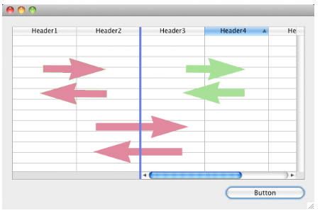

---

## Colunas

Coleção de colunas do list box.

#### Gramática JSON

| Nome    | Tipo de dados               | Valores possíveis                              |
| ------- | --------------------------- | ---------------------------------------------- |
| columns | colecção de objectos coluna | Contém as propriedades das colunas de list box |

Para obter uma lista de propriedades compatíveis com os objetos coluna, consulte a seção [Propriedades específicas da coluna](listbox_overview.md#column-specific-properties).

#### Objectos suportados

[List Box](listbox_overview.md)

---

## Nome formulário detalhe

`List box do tipo selecção`

Specifies the form to use for modifying or displaying individual records of the list box.

O formulário especificado é apresentado:

- ao usar as ações padrão `Add Subrecord` e `Edit Subrecord` aplicadas à list box (consulte [Usando ações padrão](https://doc.4d.com/4Dv20/4D/20/Using-standard-actions.300-6263819.en.html)),
- quando uma linha for clicada duas vezes e a propriedade [Double-click on Row] (#double-click-on-row) é definida como "Edit Record" (Editar registro) ou "Display Record" (Exibir registro).

#### Gramática JSON

| Nome       | Tipo de dados | Valores possíveis                                                                                                                                                                    |
| ---------- | ------------- | ------------------------------------------------------------------------------------------------------------------------------------------------------------------------------------ |
| detailForm | string        | <li>Nome (string) do formulário da tabela ou do projeto</li><li>Caminho POSIX (string) para um arquivo .json que descreve o formulário</li><li>Objeto que descreve o formulário</li> |

#### Objectos suportados

[List Box](listbox_overview.md)

---

## Duplo clique em linha

`List box do tipo selecção`

Sets the action to be performed when a user double-clicks on a row in the list box. As opções disponíveis são:

- **Não fazer nada** (padrão): clicar duas vezes em uma linha não aciona nenhuma ação automática.
- **Editar registro**: clicar duas vezes em uma linha exibe o registro correspondente no formulário de detalhes definido [para o list box](#detail-form-name). O registo é aberto em modo de leitura-escrita para poder ser modificado.
- **Exibir registro**: idêntico à ação anterior, exceto pelo fato de que o registro é aberto no modo somente leitura, de modo que não pode ser modificado.

> \> > Double-clicking an empty row is ignored in list boxes.

Independentemente da ação selecionada/escolhida, o evento de formulário `On Double clicked` é gerado.

Para as duas últimas ações, o evento do formulário `On Open Detail` também é gerado. `On Close Detail` é gerado quando um registro exibido no formulário detalhado associado à list box está prestes a ser fechado (independentemente de o registro ter sido modificado ou não).

#### Gramática JSON

| Nome                   | Tipo de dados | Valores possíveis                   |
| ---------------------- | ------------- | ----------------------------------- |
| doubleClickInRowAction | string        | "editSubrecord", "displaySubrecord" |

#### Objectos suportados

[List Box](listbox_overview.md)

---

## Ressaltar conjunto

`List box do tipo selecção`

Esta propriedade é usada para especificar o conjunto a ser usado para gerenciar registros destacados na caixa de listas (quando a fonte de dados **Arrays** é selecionada, um array booleano com o mesmo nome que a caixa de lista é usada).

O 4D cria um conjunto padrão chamado _ListBoxSetN_, em que _N_ começa em 0 e é incrementado de acordo com o número de caixas de listagem no formulário. Se necessário, pode alterar o conjunto predefinido. Pode ser um conjunto local, de processo ou entre processos (recomendamos o uso de um conjunto local, por exemplo, _$LBSet_, para limitar o tráfego de rede). É então mantido automaticamente por 4D. If the user selects one or more rows in the list box, the set is updated immediately. If you want to select one or more rows by programming, you can apply the commands of the “Sets” theme to this set.

> - The highlighted status of the list box rows and the highlighted status of the table records are completely independent.
> - If the “Highlight Set” property does not contain a name, it will not be possible to make selections in the list box.

#### Gramática JSON

| Nome         | Tipo de dados | Valores possíveis |
| ------------ | ------------- | ----------------- |
| highlightSet | string        | Nome do conjunto  |

#### Objectos suportados

[List Box](listbox_overview.md)

---

## Colunas bloqueadas e colunas estáticas

Locked columns and static columns are two separate and independent functionalities in list boxes:

- Locked columns always stay displayed to the left of the list box; they do not scroll horizontally.
- As colunas estáticas não podem ser movidas por arrastar e largar dentro do list box.

> É possível definir colunas estáticas e bloqueadas por meio de programação; consulte a seção "Caixa de listagem" no manual _4D Language Reference_.

Estas propriedades interagem da seguinte forma:

- Se definir colunas que são apenas estáticas, estas não podem ser deslocadas.

- Se definir colunas bloqueadas, mas não estáticas, pode ainda alterar a sua posição livremente na área bloqueada. No entanto, uma coluna bloqueada não pode ser movida para fora dessa área bloqueada.


- If you set all of the columns in the locked area as static, you cannot move these columns within the locked area.



- You can set a combination of locked and static columns according to your needs. For example, if you set three locked columns and one static column, the user can swap the two right-most columns within the locked area (since only the first column is static).

### Número de colunas estáticas

Number of columns that must stay permanently displayed in the left part of the list box, even when the user scrolls through the columns horizontally.

#### Gramática JSON

| Nome              | Tipo de dados | Valores possíveis         |
| ----------------- | ------------- | ------------------------- |
| lockedColumnCount | integer       | mínimo: 0 |

#### Objectos suportados

[List Box](listbox_overview.md)

### Número de colunas

Número de colunas que não podem ser movidas durante a execução.

#### Gramática JSON

| Nome              | Tipo de dados | Valores possíveis         |
| ----------------- | ------------- | ------------------------- |
| staticColumnCount | integer       | mínimo: 0 |

#### Objectos suportados

[List Box](listbox_overview.md)

---

## Número de colunas trancadas

Define o número de colunas do list box.

> Você pode adicionar ou remover colunas dinamicamente por meio de programação, usando comandos como [`LISTBOX INSERT COLUMN`](https://doc.4d.com/4dv20/help/command/en/page829.html) ou [`LISTBOX DELETE COLUMN`](https://doc.4d.com/4dv20/help/command/en/page830.html).

#### Gramática JSON

| Nome        | Tipo de dados | Valores possíveis         |
| ----------- | ------------- | ------------------------- |
| columnCount | integer       | mínimo: 1 |

#### Objectos suportados

[List Box](listbox_overview.md)

---

## Array controle linha

`List box do tipo array`

Um array 4D que controla a apresentação das linhas do list box.

Pode definir as propriedades de interface "oculto", "desativado" e "selecionável" para cada linha de um list box baseado num array utilizando este array. Ele também pode ser designado usando o comando `LISTBOX SET ARRAY`.

O array de controlo de linhas deve ser do tipo Longint e incluir o mesmo número de linhas que o list box. Cada elemento da _Row Control Array_ define o status da interface de sua linha correspondente na caixa de listagem. Three interface properties are available using constants in the "List Box" constant theme:

| Parâmetros               | Valor | Comentário                                                                                                                                                                                                                                                                                                                                                                                                                                                                                                                                                                                                                                                                                                                                                                                                                                                                        |
| ------------------------ | ----- | --------------------------------------------------------------------------------------------------------------------------------------------------------------------------------------------------------------------------------------------------------------------------------------------------------------------------------------------------------------------------------------------------------------------------------------------------------------------------------------------------------------------------------------------------------------------------------------------------------------------------------------------------------------------------------------------------------------------------------------------------------------------------------------------------------------------------------------------------------------------------------- |
| lk row is disabled       | 2     | A linha correspondente é desactivada. O texto e os controlos, como as caixas de verificação, estão esbatidos ou a cinzento. As áreas de entrada de texto inserível já não são inseríveis. Valor padrão: Activado                                                                                                                                                                                                                                                                                                                                                                                                                                                                                                                                                                                                  |
| lk row is hidden         | 1     | A linha correspondente é ocultada. A ocultação de linhas apenas afeta a visualização do list box. The hidden rows are still present in the arrays and can be managed by programming. Os comandos de linguagem, mais especificamente `LISTBOX Get number of rows` ou `LISTBOX GET CELL POSITION`, não levam em conta o status exibido/oculto das linhas. Por exemplo, em uma caixa de listagem com 10 linhas em que as primeiras 9 linhas estão ocultas, `LISTBOX Get number of rows` retorna 10. From the user’s point of view, the presence of hidden rows in a list box is not visibly discernible. Somente as linhas visíveis podem ser selecionadas (por exemplo, usando o comando Selecionar tudo). Valor padrão: Visível |
| lk row is not selectable | 4     | A linha correspondente não é selecionável (não é possível realçar). As áreas de entrada de texto digitável não são mais digitáveis, a menos que a opção [Single-Click Edit] (properties_Entry.md#single-click-edit) esteja ativada. No entanto, os controlos como as caixas de verificação e as listas continuam a funcionar. Esta definição é ignorada se o modo de seleção do list box é "Nenhum". Valor por defeito: Selecionável                                                                                                                                                                                                                               |

To change the status for a row, you just need to set the appropriate constant(s) to the corresponding array element. Por exemplo, se não quiser que a linha #10 seja selecionável, você pode digitar:

```4d
 aLControlArr{10}:=lk row is not selectable
```


É possível definir várias propriedades de interface de uma só vez:

```4d
 aLControlArr{8}:=lk row is not selectable + lk row is disabled
```


Note that setting properties for an element overrides any other values for this element (if not reset). Por exemplo:

```4d
 aLControlArr{6}:=lk row is disabled + lk row is not selectable
 //define a linha 6 como desativada E não selecionável
 aLControlArr{6}:=lk row is disabled
 //define a linha 6 como desativada mas selecionável novamente
```

#### Gramática JSON

| Nome             | Tipo de dados | Valores possíveis                  |
| ---------------- | ------------- | ---------------------------------- |
| rowControlSource | string        | Nome do array de controlo de linha |

#### Objectos suportados

[List Box](listbox_overview.md)

---

## Modo seleção

Designa a opção que permite aos utilizadores selecionar linhas:

- **Nenhum**: Linhas não podem ser selecionadas se esse modo for escolhido. Clicar na lista não terá efeito, a menos que a opção [Single-Click Edit] (properties_Entry.md#single-click-edit) esteja ativada. As teclas de navegação só fazem a lista rolar, o evento de formulário `Ao selecionar mudança` não é gerado.
- **Simples**: Uma linha de cada vez pode ser selecionada neste modo. Ao clicar em uma linha, ela será selecionada. Um **Ctrl+clique** (Windows) ou **Command+clique** (macOS) em uma linha alterna seu estado (entre selecionado ou não).\
  As teclas de seta para cima e para baixo selecionam a linha anterior/seguinte na lista. As outras teclas de navegação percorrem a lista. O evento de formulário `On Selection Change` é gerado sempre que a linha atual é alterada.
- **Multiplique**: Várias linhas podem ser selecionadas simultaneamente neste modo.

#### Gramática JSON

| Nome          | Tipo de dados | Valores possíveis            |
| ------------- | ------------- | ---------------------------- |
| selectionMode | string        | "multiple", "single", "none" |

#### Objectos suportados

[List Box](listbox_overview.md)
