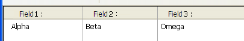

## Autodimensionamento coluna

When this property is enabled (`rightToLeft` value in JSON), list box columns are automatically resized along with the list box, within the limits of the [minimum](properties_CoordinatesAndSizing.md#minimum-width) and [maximum](properties_CoordinatesAndSizing.md#maximum-width) widths defined.

Cuando esta propiedad está desactivada (valor `legacy` en JSON), sólo se redimensiona la columna más a la derecha del listbox, aunque su ancho supere el valor máximo definido.

### Como funciona o redimensionamento automático de colunas

- A medida que el ancho del list box aumenta, sus columnas se amplían, una a una, empezando de derecha a izquierda, hasta que cada una alcanza su [ancho máximo](properties_CoordinatesAndSizing.md#maximum-width). Sólo se redimensionan las columnas con la propiedad [Resizable](#resizable) seleccionada.

- El mismo procedimiento se aplica cuando el ancho del list box disminuye, pero en orden inverso (*es decir,*, las columnas se redimensionan empezando de izquierda a derecha). Cuando cada columna ha alcanzado su [ancho mínimo](properties_CoordinatesAndSizing.md#minimum-width), la barra de desplazamiento horizontal vuelve a activarse.

- Las columnas se redimensionan sólo cuando la barra de desplazamiento horizontal no está "activa"; *es decir,*, todas las columnas son totalmente visibles en el list box en su tamaño actual. **Nota**: si la barra de desplazamiento horizontal está oculta, esto no altera su estado: una barra de desplazamiento puede seguir estando activa, aunque no sea visible.

- Depois que todas as colunas atingem seu tamanho máximo, elas não são mais ampliadas e, em vez disso, uma coluna em branco (falsa) é adicionada à direita para preencher o espaço extra. Se uma coluna falsa (em branco) estiver presente, quando a largura do list box diminuir, essa será a primeira área a ser reduzida.

#### Sobre a coluna falsa (em branco)

A aparência da coluna falsa corresponde à das colunas existentes; ela terá um cabeçalho e/ou rodapé falso se esses elementos estiverem presentes nas colunas do list box existentes e terá a(s) mesma(s) cor(es) de fundo aplicada(s).

Se puede hacer clic en el encabezado y/o en el pie de página falsos, pero esto no tiene ningún efecto sobre las otras columnas (por ejemplo: no se realiza ninguna ordenación); no obstante, los eventos se generan en consecuencia `On Clicked`, \\\\\\\`On Header Cl

Si se hace clic en una celda de la columna falsa, el comando [LISTBOX GET CELL POSITION](https://doc.4d.com/4Dv17R6/4D/17-R6/LISTBOX-GET-CELL-POSITION.301-4311145.en.html) devuelve "X+1" para su número de columna (donde X es el número de columnas existent

#### Gramática JSON

| Nome         | Tipo de dados | Valores possíveis       |
| ------------ | ------------- | ----------------------- |
| resizingMode | string        | "rightToLeft", "legacy" |

#### Objectos suportados

[List Box](listbox_overview.md)

---

## Dimensionamento horizontal

Esta propriedade específica se o tamanho horizontal de um objeto deve ser movido ou redimensionado quando um usuário redimensiona o formulário. También puede definirse dinámicamente por el comando del lenguaje `OBJECT SET RESIZING OPTIONS`.

Estão disponíveis três opções:

| Opção    | Valor JSON | Resultados                                                                                                                                       |
| -------- | ---------- | ------------------------------------------------------------------------------------------------------------------------------------------------ |
| Agrandar | "grow"     | A mesma percentagem é aplicada à largura do objeto quando o usuário redimensiona a largura da janela,                                            |
| Mover    | "move"     | O objeto é movido para a esquerda ou para a direita na mesma quantidade que a largura aumenta quando o usuário redimensiona a largura da janela, |
| Nenhum   | "fixed"    | O objeto permanece estacionário quando o formulário é redimensionado                                                                             |

> Esta propiedad funciona junto con la propiedad [Dimensionamiento vertical](#tamaño-vertical).

#### Gramática JSON

| Nome    | Tipo de dados | Valores possíveis       |
| ------- | ------------- | ----------------------- |
| sizingX | string        | "grow", "move", "fixed" |

#### Objectos suportados

[4D View Pro Area](viewProArea_overview.md) - [4D Write Pro Area](writeProArea_overview.md) - [Button](button_overview.md) - [Button Grid](buttonGrid_overview.md) - [Check Box](checkbox_overview.md) - [Combo Box](comboBox_overview.md) - [Dropdown list](dropdownList_Overview.md) - [Group Box](groupBox.md) - [Hierarchical List](list_overview.md) - [Input](input_overview.md) - [List Box](listbox_overview.md) - [Line](shapes_overview.md#line) - [List Box Column](listbox_overview.md#list-box-columns) - [Oval](shapes_overview.md#oval) - [Picture Button](pictureButton_overview.md) - [Picture Pop up menu](picturePopupMenu_overview.md) - [Plug-in Area](pluginArea_overview.md) - [Progress Indicators](progressIndicator.md) - [Radio Button](radio_overview.md) - [Ruler](ruler.md) - [Rectangle](shapes_overview.md#rectangle) - [Spinner](spinner.md) - [Splitter](splitters.md) - [Static Picture](staticPicture.md) - [Stepper](stepper.md) - [Subform](subform_overview.md) - [Tab control](tabControl.md) - [Web Area](webArea_Overview.md)

---

## Alinhamento vertical

Esta propriedade específica se o tamanho vertical de um objeto deve ser movido ou redimensionado quando um usuário redimensiona o formulário. También puede definirse dinámicamente por el comando del lenguaje `OBJECT SET RESIZING OPTIONS`.

Estão disponíveis três opções:

| Opção    | Valor JSON | Resultados                                                                                                                               |
| -------- | ---------- | ---------------------------------------------------------------------------------------------------------------------------------------- |
| Agrandar | "grow"     | A mesma porcentagem é aplicada à altura do objeto quando o usuário redimensiona a largura da janela,                                     |
| Mover    | "move"     | O objeto é movido na mesma quantidade para cima ou para baixo que o aumento da altura quando o usuário redimensiona a largura da janela, |
| Nenhum   | "fixed"    | O objeto permanece estacionário quando o formulário é redimensionado                                                                     |

> Esta propiedad funciona junto con la propiedad [Dimensionamiento horizontal](#horizontal-sizing).

#### Gramática JSON

| Nome    | Tipo de dados | Valores possíveis       |
| ------- | ------------- | ----------------------- |
| sizingY | string        | "grow", "move", "fixed" |

#### Objectos suportados

[4D View Pro Area](viewProArea_overview.md) - [4D Write Pro Area](writeProArea_overview.md) - [Button](button_overview.md) - [Button Grid](buttonGrid_overview.md) - [Check Box](checkbox_overview.md) - [Combo Box](comboBox_overview.md) - [Dropdown list](dropdownList_Overview.md) - [Group Box](groupBox.md) - [Hierarchical List](list_overview.md) - [Input](input_overview.md) - [List Box](listbox_overview.md) - [Line](shapes_overview.md#line) - [List Box Column](listbox_overview.md#list-box-columns) - [Oval](shapes_overview.md#oval) - [Picture Button](pictureButton_overview.md) - [Picture Pop up menu](picturePopupMenu_overview.md) - [Plug-in Area](pluginArea_overview.md) - [Progress Indicators](progressIndicator.md) - [Radio Button](radio_overview.md) - [Ruler](ruler.md) - [Rectangle](shapes_overview.md#rectangle) - [Spinner](spinner.md) - [Splitter](splitters.md) - [Static Picture](staticPicture.md) - [Stepper](stepper.md) - [Subform](subform_overview.md) - [Tab control](tabControl.md) - [Web Area](webArea_Overview.md)

---

## Pusher

Quando um objeto splitter tem essa propriedade, os outros objetos à sua direita (splitter vertical) ou abaixo dele (splitter horizontal) são empurrados ao mesmo tempo que o divisor, sem parada.

Aqui está o resultado de um divisor "pusher" sendo movido:

Quando esta propriedade não é aplicada ao splitter, o resultado é o seguinte:

#### Gramática JSON

| Nome         | Tipo de dados |                              Valores possíveis                             |
| :----------- | :-----------: | :------------------------------------------------------------------------: |
| splitterMode |     string    | "move" (pusher), "resize" (standard) |

#### Objectos suportados

[Splitter](splitters.md)

---

## Redimensionável

Designa se o tamanho da coluna pode ser modificado pelo usuário.

#### Gramática JSON

| Nome      | Tipo de dados | Valores possíveis |
| :-------- | :-----------: | :---------------: |
| resizable |    boolean    |  "true", "false"  |

#### Objectos suportados

[Coluna de list box](listbox_overview.md#list-box-columns)
