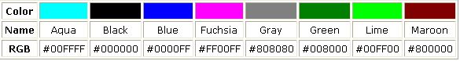
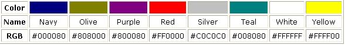

---

## Permitir a selecção de tipo de letra/cor

Quando essa propriedade está ativada, os comandos [OPEN FONT PICKER](../commands/open-font-picker) e [OPEN COLOR PICKER](../commands/open-color-picker) podem ser chamados para exibir as janelas do seletor de fontes e cores do sistema. Usando essas janelas, os usuários podem alterar a fonte ou a cor de um objeto formulário que tenha o foco diretamente ao clicar. Quando essa propriedade está desativada (padrão), os comandos do seletor de abertura não têm efeito.

#### Gramática JSON

| Propriedade          | Tipo de dados | Valores possíveis                       |
| -------------------- | ------------- | --------------------------------------- |
| allowFontColorPicker | boolean       | false (padrão), true |

#### Objectos suportados

[Entrada](input_overview.md)

---

## Negrito

Define o texto selecionado para aparecer mais escuro e mais pesado.

Você pode definir essa propriedade usando o comando [**OBJECT SET FONT STYLE**](../commands/object-set-font-style).

> Este é um texto normal.<br/>
> **Este é um texto em negrito.**

#### Gramática JSON

| Propriedade | Tipo de dados | Valores possíveis |
| ----------- | ------------- | ----------------- |
| fontWeight  | text          | "normal", "bold"  |

#### Objectos suportados

[Botão](button_overview.md) - [Caixa de verificação](checkbox_overview.md) - [Combo Box](comboBox_overview.md) - [Lista de seleção](dropdownList_Overview.md) - [Caixa de Grupo](groupBox.md) - [Lista hierárquica](list_overview.md) - [Entrada](input_overview.md) - [List Box](listbox_overview.md) - [Coluna de List Box](listbox-column.md) - [Rodapé da List Box](listbox-header-footer.md#footers) - [Cabeçalho de List Box](listbox-header-footer.md#headers) - [Botão de opção](radio_overview.md) - [Área de Texto](text.md)

#### Comandos

[OBJECT Get font style](../commands/object-get-font-style) - [OBJECT SET FONT STYLE](../commands/object-set-font-style)

---

## Itálico

Define o texto selecionado como ligeiramente inclinado para a direita.

Você também pode definir essa propriedade por meio do comando [**OBJECT SET FONT STYLE**](../commands/object-set-font-style).

> Este é um texto normal.<br/>
> *Este é o texto em itálico.*

#### Gramática JSON

| Nome      | Tipo de dados | Valores possíveis  |
| --------- | ------------- | ------------------ |
| fontStyle | string        | "normal", "italic" |

#### Objectos suportados

[Botão](button_overview.md) - [Caixa de verificação](checkbox_overview.md) - [Combo Box](comboBox_overview.md) - [Lista de seleção](dropdownList_Overview.md) - [Caixa de Grupo](groupBox.md) - [Lista hierárquica](list_overview.md) - [Entrada](input_overview.md) - [List Box](listbox_overview.md) - [Coluna de List Box](listbox-column.md) - [Rodapé da List Box](listbox-header-footer.md#footers) - [Cabeçalho de List Box](listbox-header-footer.md#headers) - [Botão de opção](radio_overview.md) - [Área de Texto](text.md)

#### Comandos

[OBJECT Get font style](../commands/object-get-font-style) - [OBJECT SET FONT STYLE](../commands/object-set-font-style)

---

## Sublinhado

Define o texto para ter uma linha por baixo.

#### Gramática JSON

| Nome           | Tipo de dados | Valores possíveis     |
| -------------- | ------------- | --------------------- |
| textDecoration | string        | "normal", "underline" |

#### Objectos suportados

[Botão](button_overview.md) - [Caixa de verificação](checkbox_overview.md) - [Combo Box](comboBox_overview.md) - [Lista de seleção](dropdownList_Overview.md) - [Caixa de Grupo](groupBox.md) - [Lista hierárquica](list_overview.md) - [Entrada](input_overview.md) - [List Box](listbox_overview.md) - [Coluna de List Box](listbox-column.md) - [Rodapé da List Box](listbox-header-footer.md#footers) - [Cabeçalho de List Box](listbox-header-footer.md#headers) - [Botão de opção](radio_overview.md) - [Área de Texto](text.md)

#### Comandos

[OBJECT Get font style](../commands/object-get-font-style) - [OBJECT SET FONT STYLE](../commands/object-set-font-style)

---

## Fonte

Esta propiedad permite indicar el **tema de la fuente** o la **familia de fuente** utilizada en el objeto.

> Las propiedades **Tema de la fuente** y de la **familia de la fuente** son mutuamente excluyentes. Um tema de tipo de letra controla os atributos do tipo de letra, incluindo o tamanho. Uma família de tipos de letra permite-lhe definir o nome, o tamanho e a cor do tipo de letra.

### Tema Fonte

A propriedade de tema do tipo de letra designa um nome de estilo automático. Os estilos automáticos determinam a família, o tamanho e a cor da fonte a serem usados no objeto de forma dinâmica, conforme os parâmetros do sistema. Esses parâmetros dependem de:

- a plataforma,
- a língua do sistema,
- e o tipo de objeto de formulário.

Com o tema de fonte, você tem a garantia de que os títulos serão sempre exibidos conforme os padrões atuais de interface do sistema. No entanto, o seu tamanho pode variar de uma máquina para outra.

Estão disponíveis três temas de tipos de letra:

- **normal**: estilo automático, aplicado por defecto a todo nuevo objeto creado en el editor de formularios.
- Los temas de fuentes **principales** y **suplementarios** solo son soportados por las [áreas de texto](text.md) y las [áreas de entrada](input_overview.md). Estes temas destinam-se principalmente a desenho de caixas de diálogo. Eles se referem aos estilos de fonte usados, respectivamente, para o texto principal e para as informações adicionais em suas janelas de interface. Aqui estão as caixas de diálogo típicas (macOS e Windows) que utilizam estes temas de tipos de letra:


> Os temas de tipo de letra gerem o tipo de letra, bem como o seu tamanho e cor. Entretanto, pode aplicar propriedades de estilo personalizadas (Negrito, Itálico ou Subscrito) sem alterar seu funcionamento.

#### Gramática JSON

| Nome      | Tipo de dados | Valores possíveis              |
| --------- | ------------- | ------------------------------ |
| fontTheme | string        | "normal", "main", "additional" |

#### Objectos suportados

[Botão](button_overview.md) - [Caixa de verificação](checkbox_overview.md) - [Combo Box](comboBox_overview.md) - [Lista de seleção](dropdownList_Overview.md) - [Caixa de Grupo](groupBox.md) - [Lista hierárquica](list_overview.md) - [Entrada](input_overview.md) - [List Box](listbox_overview.md) - [Coluna de List Box](listbox-column.md) - [Rodapé da List Box](listbox-header-footer.md#footers) - [Cabeçalho de List Box](listbox-header-footer.md#headers) - [Botão de opção](radio_overview.md) - [Área de Texto](text.md)

#### Comandos

[OBJECT Get style sheet](../commands/object-get-style-sheet) - [OBJECT SET STYLE SHEET](../commands/object-set-style-sheet)

### Família de letras

Existem dois tipos de nomes de famílias de letras:

- *family-name:* El nombre de una familia de fuentes, como "times", "courier", "arial", etc.
- *generic-family:* El nombre de una familia genérica, como "serif", "sans-serif", "cursive", "fantasy", "monospace".

Você pode definir isso usando o comando [`OBJECT SET FONT`](../commands/object-set-font).

#### Gramática JSON

| Nome       | Tipo de dados | Valores possíveis             |
| ---------- | ------------- | ----------------------------- |
| fontFamily | string        | Nome da família de fontes CSS |

> 4D recomienda utilizar sólo fuentes [seguras para la web](https://www.w3schools.com/cssref/css_websafe_fonts.asp).

#### Objectos suportados

[Botão](button_overview.md) - [Caixa de verificação](checkbox_overview.md) - [Combo Box](comboBox_overview.md) - [Lista de seleção](dropdownList_Overview.md) - [Caixa de Grupo](groupBox.md) - [Lista hierárquica](list_overview.md) - [Entrada](input_overview.md) - [List Box](listbox_overview.md) - [Coluna de List Box](listbox-column.md) - [Rodapé da List Box](listbox-header-footer.md#footers) - [Cabeçalho de List Box](listbox-header-footer.md#headers) - [Botão de opção](radio_overview.md) - [Área de Texto](text.md)

#### Comandos

[OBJECT Get font](../commands/object-get-font) - [OBJECT SET FONT](../commands/object-set-font)

## Tamanho fonte

Permite definir o tamanho da fonte do objeto em pontos.

#### Gramática JSON

| Nome     | Tipo de dados | Valores possíveis                                                           |
| -------- | ------------- | --------------------------------------------------------------------------- |
| fontSize | integer       | Tamanho da letra em pontos. Valor mínimo: 0 |

#### Objectos suportados

[Botão](button_overview.md) - [Caixa de verificação](checkbox_overview.md) - [Combo Box](comboBox_overview.md) - [Lista de seleção](dropdownList_Overview.md) - [Caixa de Grupo](groupBox.md) - [Lista hierárquica](list_overview.md) - [Entrada](input_overview.md) - [List Box](listbox_overview.md) - [Coluna de List Box](listbox-column.md) - [Rodapé da List Box](listbox-header-footer.md#footers) - [Cabeçalho de List Box](listbox-header-footer.md#headers) - [Botão de opção](radio_overview.md) - [Área de Texto](text.md)

#### Comandos

[OBJECT Get font size](../commands/object-get-font-size) - [OBJECT SET FONT SIZE](../commands/object-set-font-size)

---

## Cor fonte

Designa a cor do tipo de letra.

> Esta propriedade também define a cor da borda do objeto (se houver) quando o estilo "plaino" ou "pontilhado" é usado.

A cor pode ser especificada por:

- um nome de cor - como "red"
- um valor HEX - como "#ff0000"
- um valor RGB - como "rgb(255,0,0)"

Você também pode definir essa propriedade usando o comando [**OBJECT SET RGB COLORS**](../commands/object-set-rgb-colors).

#### Gramática JSON

| Nome   | Tipo de dados | Valores possíveis                        |
| ------ | ------------- | ---------------------------------------- |
| stroke | string        | um valor css, "transparent", "automatic" |

#### Objectos suportados

[Button](button_overview.md) - [Check Box](checkbox_overview.md) - [Combo Box](comboBox_overview.md) - [Drop-down List](dropdownList_Overview.md) - [Group Box](groupBox.md) - [Hierarchical List](list_overview.md) - [Input](input_overview.md) - [List Box](listbox_overview.md) - [List Box Column](listbox-column.md) - [List Box Footer](listbox-header-footer.md#footers) - [List Box Header](listbox-header-footer.md#headers) - [Progress Indicators](progressIndicator.md) - [Ruler](ruler.md) - [Radio Button](radio_overview.md) - [Text Area](text.md)

#### Comandos

[OBJECT GET RGB COLORS](../commands/object-get-rgb-colors) - [OBJECT SET RGB COLORS](../commands/object-set-rgb-colors)

---

## Expressão cor fonte

`List box do tipo coleção/seleção de entidade`

Utilizado para aplicar uma cor de letra personalizada a cada linha do list box. É necessário utilizar valores de cor RGB. For more information about this, refer to the description of the [`OBJECT SET RGB COLORS`](../commands/object-set-rgb-colors) command.

Deve introduzir uma expressão ou uma variável (não podem ser utilizadas variáveis do tipo array). A expressão ou variável será avaliada para cada linha exibida. Você pode usar as constantes descritas no comando [`OBJECT SET RGB COLORS`](../commands/object-set-rgb-colors).

You can also set this property using the [`LISTBOX SET PROPERTY`](../commands/listbox-set-property) command with `lk font color expression` constant.

> Esta propiedad también puede definirse mediante una [Expresión Meta Info](properties_Text.md#meta-info-expression).

El siguiente ejemplo utiliza un nombre de variable: introduzca *CompanyColor* para la **Expresión color fuente** y, en el método formulario, escriba el siguiente código:

```4d
CompanyColor:=Choose([Companies]ID;Background color;Light shadow color; Foreground color;Dark shadow color)
```

#### Gramática JSON

| Nome            | Tipo de dados | Valores possíveis   |
| --------------- | ------------- | ------------------- |
| rowStrokeSource | string        | Expressão cor fonte |

#### Objectos suportados

[List Box](listbox_overview.md)

#### Comandos

[LISTBOX Get property](../commands/listbox-get-property) - [LISTBOX SET PROPERTY](../commands/listbox-set-property)

---

## Style Expression {#style-expression}

`List box do tipo coleção/seleção de entidade`

Utilizado para aplicar um estilo de carácter personalizado a cada linha do list box ou a cada célula da coluna.

Deve introduzir uma expressão ou uma variável (não podem ser utilizadas variáveis do tipo array). A expressão ou variável será avaliada para cada linha apresentada (se aplicada à list box) ou para cada célula apresentada (se aplicada a uma coluna). Você pode usar as constantes listadas no comando [`LISTBOX SET ROW FONT STYLE`](../commands/listbox-set-row-font-style).

Exemplo:

```4d
Choose([Companies]ID;Bold;Plain;Italic;Underline)
```

You can also set this property using the [`LISTBOX SET PROPERTY`](../commands/listbox-set-property) command with `lk font style expression` constant.

> Esta propiedad también puede definirse mediante una [Expresión Meta Info](properties_Text.md#meta-info-expression).

#### Gramática JSON

| Nome           | Tipo de dados | Valores possíveis                                                     |
| -------------- | ------------- | --------------------------------------------------------------------- |
| rowStyleSource | string        | Expressão de estilo a avaliar para cada linha/célula. |

#### Objectos suportados

[List Box](listbox_overview.md) - [Columna List Box](listbox-column.md)

#### Comandos

[LISTBOX Get property](../commands/listbox-get-property) - [LISTBOX SET PROPERTY](../commands/listbox-set-property)

---

## Alihamento horizontal

Localização horizontal do texto na área que o contém.

#### Gramática JSON

| Nome      | Tipo de dados | Valores possíveis                                 |
| --------- | ------------- | ------------------------------------------------- |
| textAlign | string        | "right", "center", "left", "automatic", "justify" |

:::note

- "automatic" no es compatible con [casillas de selección](checkbox_overview.md) y [botones radio](radio_overview.md)
- "justify" sólo es compatible con las [entradas ](input_overview.md) y [áreas de texto](text.md)

:::

#### Objectos suportados

[Button](button_overview.md) - [Check Box](checkbox_overview.md) (all styles except Regular and Flat) - [Combo Box](comboBox_overview.md) - [Drop-down List](dropdownList_Overview.md) - [Group Box](groupBox.md) - [Input](input_overview.md) - [List Box](listbox_overview.md) - [List Box Column](listbox-column.md) - [List Box Header](listbox-header-footer.md#headers) - [List Box Footer](listbox-header-footer.md#footers) - [Radio Button](radio_overview.md) (all styles except Regular and Flat) - [Text Area](text.md)

#### Comandos

[OBJECT Get horizontal alignment](../commands/object-get-horizontal-alignment) - [OBJECT SET HORIZONTAL ALIGNMENT](../commands/object-set-horizontal-alignment)

---

## Cor linha vertical

Localização vertical do texto na área que o contém.

La opción **Predeterminado** (`automático` valor JSON) define la alineación según el tipo de datos que se encuentran en cada columna:

- `abajo` para todos los datos (excepto las imágenes) y
- `arriba` para los datos del tipo imagen.

This property can also be handled by the [`OBJECT Get vertical alignment`](../commands/object-get-vertical-alignment) and [`OBJECT SET VERTICAL ALIGNMENT`](../commands/object-set-vertical-alignment) commands.

#### Gramática JSON

| Nome          | Tipo de dados | Valores possíveis                      |
| ------------- | ------------- | -------------------------------------- |
| verticalAlign | string        | "automatic", "top", "middle", "bottom" |

#### Objectos suportados

[List Box](listbox_overview.md) - [List Box Column](listbox-column.md) - [List Box Footer](listbox-header-footer.md#footers) - [List Box Header](listbox-header-footer.md#headers)

#### Comandos

[`OBJECT Get vertical alignment`](../commands/object-get-vertical-alignment) - [`OBJECT SET VERTICAL ALIGNMENT`](../commands/object-set-vertical-alignment)

---

## Meta Info expression

`List box do tipo Collection ou entity selection`

Especifica uma expressão ou uma variável que será avaliada para cada linha exibida. Permite definir um conjunto completo de atributos de texto das linhas. Debe pasar una **variable objeto** o una **expresión que devuelva un objeto**. As propriedades abaixo são compatíveis:

| Nome da propriedade | Tipo    | Descrição                                                                                                                                                                                                                                                                                                                                                                                                                                                                                                                                                                 |
| ------------------- | ------- | ------------------------------------------------------------------------------------------------------------------------------------------------------------------------------------------------------------------------------------------------------------------------------------------------------------------------------------------------------------------------------------------------------------------------------------------------------------------------------------------------------------------------------------------------------------------------- |
| stroke              | string  | Cor de fundo. Qualquer cor CSS (por exemplo, "#FF00FF"), "automatic", "transparent"                                                                                                                                                                                                                                                                                                                                                                                                                                                    |
| fill                | string  | Cor de fundo. Qualquer cor CSS (por exemplo, "#F00FFF"), "automatic", "transparent"                                                                                                                                                                                                                                                                                                                                                                                                                                                    |
| fontStyle           | string  | "normal","italic"                                                                                                                                                                                                                                                                                                                                                                                                                                                                                                                                                         |
| fontWeight          | string  | "normal","bold"                                                                                                                                                                                                                                                                                                                                                                                                                                                                                                                                                           |
| textDecoration      | string  | "normal","underline"                                                                                                                                                                                                                                                                                                                                                                                                                                                                                                                                                      |
| unselectable        | boolean | Designa la línea correspondiente como no seleccionable (\* es decir, \*, no es posible el resaltado). As áreas inseríveis deixam de o ser se esta opção estiver ativada, a menos que a opção "Editar com um clique" também esteja ativada. Os controlos como as caixas de verificação e as listas permanecem funcionais. Esta definição é ignorada se o modo de seleção do list box é "Nenhum". Esta definição é ignorada se o modo de seleção do list box é "Nenhum". |
| disabled            | boolean | Desactiva a linha correspondente. As áreas acessíveis deixam de ser acessíveis se esta opção estiver activada. Texto e controles (caixas de seleção, listas, etc.) parecem escurecidos ou acinzentados. Esta definição é ignorada se o modo de seleção do list box é "Nenhum".                                                                                                                                                                                         |

A propriedade especial "célula" permite-lhe aplicar um conjunto de propriedades a uma única coluna:

| Nome da propriedade |              |                | Tipo   | Descrição                                                                                                                                                                                                                                                                                                                  |
| ------------------- | ------------ | -------------- | ------ | -------------------------------------------------------------------------------------------------------------------------------------------------------------------------------------------------------------------------------------------------------------------------------------------------------------------------- |
| cell                |              |                | object | Propriedades a serem aplicadas a coluna(s) única(s)                                                                                                                                                                                                                                  |
|                     | *columnName* |                | object | *columnName* es el nombre del objeto de la columna del list box                                                                                                                                                                                                                                                            |
|                     |              | *propertyName* | string | as propriedades "stroke", "fill", "fontStyle", "fontWeight" ou "textDecoration" (ver acima). **Nota**: las propiedades "no seleccionable" y "desactivada" sólo pueden definirse a nivel de la línea. São ignorados se forem passados no objeto "célula" |

> As configurações de estilo feitas com esta propriedade são ignoradas se outras configurações de estilo já estão definidas através de expressões (\*i.e., [Expressão de estilo](#style-expression), [Expressão de cor de Fonte](#font-color-expression), [Expressão de cor de fundo](./properties_BackgroundAndBorder.md#background-color-expression)).

**Exemplos**

En un método proyecto *Color*, escriba el siguiente código:

```4d
//Método Color
//Define a cor da fonte para determinadas linhas e a cor de fundo para as colunas Col2 e Col3
Form.meta:=New object
If(This.ID>5) //ID é um atributo de objetos/entidades
  Form.meta.stroke:="purple"
  Form.meta.cell:=New object("Col2";New object("fill";"black");\
  	"Col3";New object("fill";"red"))
Else
  Form.meta.stroke:="orange"
End if
```

**Buenas prácticas:** por razones de optimización, normalmente se recomienda crear el objeto `meta.cell` una vez en el método del formulario:

```4d
  //método formulário
 Case of
    :(Form event code=On Load)
       Form.colStyle:=New object("Col2";New object("fill";"black");\
       	"Col3";New object("fill";"red"))  
 // você também pode definir outros conjuntos de estilos
       Form.colStyle2:=New object("Col2";New object("fill";"green");\
       	"Col3";New object("fontWeight";"bold"))  
 End case
```

Entonces, el método *Color* contendría:

```4d
  //Método de cor
 ...
 If(This.ID>5)
    Form.meta.stroke:="purple"
    Form.meta.cell:=Form.colStyle //reutilize o mesmo objeto para melhorar o desempenho
 Else
 	Form.meta.stroke:="orange"
	Form.meta.cell:=Form.colStyle2
 End if
 ...
```

#### Gramática JSON

| Nome       | Tipo de dados | Valores possíveis                                                     |
| ---------- | ------------- | --------------------------------------------------------------------- |
| metaSource | string        | Expressão do objeto a avaliar para cada linha/célula. |

#### Objectos suportados

[List Box](listbox_overview.md)

#### Comandos

[LISTBOX Get property](../commands/listbox-get-property) - [LISTBOX SET PROPERTY](../commands/listbox-set-property)

---

## Multistyle

Esta propriedade permite o uso de [estilos específicos](https://doc.4d.com/4Dv20/4D/20.6/Supported-tags.300-7488021.en.html) na área selecionada. Cuando esta opción está marcada, 4D interpreta todas las etiquetas `<SPAN> HTML` presentes en el área.

Por defeito, esta opção não está activada.

#### Gramática JSON

| Nome       | Tipo de dados | Valores possíveis |
| ---------- | ------------- | ----------------- |
| styledText | boolean       | true, false       |

#### Objectos suportados

[Área de entrada](input_overview.md) - [Columna List Box](listbox-column.md)

#### Comandos

[LISTBOX Get property](../commands/listbox-get-property) - [LISTBOX SET PROPERTY](../commands/listbox-set-property) - [OBJECT Is styled text](../commands/object-is-styled-text) - ["Styled Text" theme](../ommands/theme/Styled_Text.md)

### Supported tags

You can use the following tags in 4D multi-style text areas.

#### 4D Expression

```html
<span style="-d4-ref:'expression'"> </span>
```

This tag inserts a 4D expression (expression, method, field, variable, command, etc.) in the text. The expression is tokenized and evaluated:

- when the expression is inserted
- when the object is loaded
- when the `computeExpressions` standard action is called from an interface object or by the [`INVOKE ACTION`](../commands/invoke-action) command
- when the [`ST COMPUTE EXPRESSIONS`](../commands/st-compute-expressions) command is executed
- when the [`ST FREEZE EXPRESSIONS`](../commands/st-freeze-expressions) command is executed, if the second `*` parameter is passed.

The evaluated value of the expression is not saved in the `<span>` tag, only its reference is.

Note: To ensure that expressions will be evaluated correctly regardless of the 4D language or version used, we recommend using the token syntax for elements whose name might vary between different versions (commands, tables, fields, constants). Por exemplo, para inserir o comando `Current time` (tempo atual), digite `Current time:C178`. For more information about this, refer to *Using tokens in formulas*.

#### URL

```html
<span><a href="url">Visible label</a></span>
```

This tag inserts a URL in the text. Exemplo:

```html
<span><a href="http://www.4d.com/">4D Web Site</a></span>
```

#### User link

```html
<span style="-d4-ref-user:'myUserLink'">Click here</span>
```

"User links" look the same as URLs, but when you click them, they do not automatically open the source. You can pass any string you want as reference, and it is up to the developer to program any custom actions that occur when it is clicked. This means you can create links which are not URLs but references to files, 4D methods, and so on, that you can open or execute when they are clicked. The [`ST Get content type`](../commands/st-get-content-type) command detects if a user link has been clicked.

User links are defined using the [`ST SET TEXT`](../commands/st-set-text) command. Por exemplo:

```4d
ST SET TEXT(txtVar;"This is a user link: <span style=\"-d4-ref-user:'UserLink'\">User Label</span>";$start;$end)
```

#### Custom tags

You can insert any tag in plain text, for example ``. It is stored in the code of the plain text without being interpreted or displayed. This is particularly useful in the context of e-mails in HTML format and including pictures for example.

#### Style tags

This paragraph lists the attributes of \<SPAN> tags that are supported by 4D in rich text areas. You can use these tags to implement custom style handling. Only the tags listed below are supported by 4D for style variations.

- Font name: `<SPAN STYLE="font-family: DESDEMONA"> ... </SPAN>`
- Font size: `<SPAN STYLE="font-size: 20pt"> ... </SPAN>`
- Estilo de letra:
  - Bold `<SPAN STYLE="font-weight: bold"> ... </SPAN>`
  - Italic `<SPAN STYLE="font-style: italic"> ... </SPAN>`
  - Normal `<SPAN STYLE="font-style: normal"> ... </SPAN>`
  - Underline `<SPAN STYLE="text-decoration: underline"> ... </SPAN>`
  - Strikethrough `<SPAN STYLE="text-decoration:line-through">...</SPAN>`

*Note: The "strikethrough" style is not supported under macOS, but this tag can still be managed by programming.*

- Font colors: `<SPAN STYLE="color:green"> ... </SPAN>` or `<SPAN STYLE="color:#006CCC">...</SPAN>`
- Background colors: `<SPAN STYLE="background-color:green"> ... </SPAN>` or `<SPAN STYLE="background-color:#006CCC">...</SPAN>`

#### Color values

For font color and background color attributes, the color value can be either the hexadecimal code for an RGB color, or the name of one of the 16 HTML colors defined for standard CSS by the W3C:




### Working with text handling commands

#### Interface do usuário

The commands that can be used to manipulate text objects by programming do not take any style tags integrated into the text into account. They act upon displayed text only. This concerns the following commands:

- [User Interface](../commands/theme/User_Interface.md) theme commands
- [`HIGHLIGHT TEXT`](../commands/highlight-text)
- [`GET HIGHLIGHT`](../commands/get-highlight)

When you use these commands with commands that manipulate character strings, it is necessary to filter the formatting characters using the [`ST Get plain text`](../commands/st-get-plain-text) command:

```4d
 HIGHLIGHT TEXT([Products]Notes;1;Length(ST Get plain text([Products]Notes))+1)
```

#### Objects (Forms)

The commands that can be used to modify the style of objects (for example, [`OBJECT SET FONT`](../commands/object-set-font)) apply to the whole object and not to the selection.

If the object does not have the focus when the command is executed, the modification is applied simultaneously to the object (the text area) and to its associated variable. If the object does have the focus, the modification is carried out on the object but not on the associated variable. The modification is only applied to the variable when the object loses the focus. Keep this principle in mind when programming text areas.

:::note

If the [**Store with default style tags**](#store-with-default-style-tags) option is checked for the object, the use of these commands will cause a modification of the tags saved with each object.

:::

Note also that only default properties are affected by these commands (as well as any properties saved by means of default tags). Custom style tags remain as they are. For example, given a multi-style area where default tags were saved:


The plain text of the area is as follows:

```html
<span style="text-align:left;font-family:'Segoe UI';font-size:9pt;color:#009900">This is the word <span style="color:#D81E05">red</span></span>
```

Se executar o seguinte código:

```4d
OBJECT SET COLOR(*;"myArea";-(Blue+(256*Yellow)))
```

The red color remains:


and code is:

```html
<span style="text-align:left;font-family:'Segoe UI';font-size:9pt;color:#0000FF">This is the word <span style="color:#D81E05">red</span></span>
```

The following commands are concerned:

- [`OBJECT SET RGB COLORS`](../commands/object-set-rgb-colors)
- [`OBJECT SET FONT`](../commands/object-set-font)
- [`OBJECT SET FONT STYLE`](../commands/object-set-font-style)
- [`OBJECT SET FONT SIZE`](../commands/object-set-font-size)

In the context of multi-style areas, such commands should be used to set default styles only. To manage styles during database execution, we recommend using the [commands of the "Styled Text" theme](../commands/theme/Styled_Text.md).

#### Get edited text

When it is used with a rich text area, the [`Get edited text`](../commands/get-edited-text) command returns the text of the current area including any style tags.

To retrieve the "plain" text (text without tags) being edited, you must use the [`ST Get plain text`](../commands/st-get-plain-text) command:

```4d
ST Get plain text(Get edited text)
```

#### Query and order by commands

Queries and sorts carried out among multi-style objects take into account any style tags saved in the object. If a style modification has been made within a word, searching for the word will not be successful.

To be able to carry out valid searches and sorts, you must use the [`ST Get plain text`](../commands/st-get-plain-text) command. Por exemplo:

```4d
QUERY BY FORMULA([MyTable];ST Get plain text([MyTable]MyFieldStyle)="very well")
```

---

## Orientação

Modifica a orientação (rotação) de uma área texto. Áreas texto pode ser rodadas por incrementos de 90°. Cada valor de orientação é aplicado enquanto mantém o mesmo ponto inferior esquerdo para o objeto:

| Valor de orientação             | Resultados                                     |
| ------------------------------- | ---------------------------------------------- |
| 0 (o padrão) |  |
| 90                              |  |
| 180                             |  |
| 270                             |  |

Además de [áreas de texto estáticas](text.md), los objetos de texto de las [áreas de entrada](input_overview.md) pueden girar cuando no son[editables](properties_Entry.md#enterable). Quando uma propriedade rotação for aplicada a um objeto input, a propriedade digitável é removida (se houver). Esse objeto é então excluído da ordem de entrada.

#### Gramática JSON

| Nome      | Tipo de dados | Valores possíveis |
| --------- | ------------- | ----------------- |
| textAngle | number        | 0, 90, 180, 270   |

#### Objectos suportados

[Entrada](input_overview.md) (no editable) - [Área de texto](text.md)

#### Comandos

[OBJECT Get text orientation](../commands/object-get-text-orientation) - [OBJECT SET TEXT ORIENTATION](../commands/object-set-text-orientation)

---

## Row Font Color Array {#row-font-color-array}

`List boxes de tipo array`

Permite estabelecer uma cor de fonte personalizada para cada linha do list box ou cada célula da coluna.

O nome do array LongInt deve ser usado. Cada elemento deste array corresponde a uma linha do list box (se aplicada o list box) ou a uma célula da coluna (se aplicada a uma coluna), pelo que o array deve ter o mesmo tamanho que o array associado à coluna. Você pode usar as constantes descritas no comando [`OBJECT SET RGB COLORS`](../commands/object-set-rgb-colors). Você pode usar as constantes do tema <a href="https://doc.4d.com/4Dv20/4D/20.1/SET-RGB-COLORS.302-6481080.en.html">SET RGB COLORS</a>.

#### Gramática JSON

| Nome            | Tipo de dados | Valores possíveis          |
| --------------- | ------------- | -------------------------- |
| rowStrokeSource | string        | O nome de um array longint |

#### Objectos suportados

[List Box](listbox_overview.md) - [Columna List Box](listbox-column.md)

#### Comandos

[`LISTBOX Get array`](../commands/listbox-get-array) - [`LISTBOX GET ARRAYS`](../commands/listbox-get-arrays) - [`LISTBOX SET ARRAY`](../commands/listbox-set-array)

---

## Row Style Array {#row-style-array}

`List boxes de tipo array`

Permite estabelecer um estilo de fonte personalizado para cada linha do list box ou cada célula da coluna.

O nome do array LongInt deve ser usado. Cada elemento deste array corresponde a uma linha do list box (se aplicada o list box) ou a uma célula da coluna (se aplicada a uma coluna), pelo que o array deve ter o mesmo tamanho que o array associado à coluna. O nome do array LongInt deve ser usado. Pode acionar constantes juntas para combinar estilos. Se quiser que a célula herde o estilo definido no nível mais alto, passe o valor -255 para o elemento array correspondente.

#### Gramática JSON

| Nome           | Tipo de dados | Valores possíveis                           |
| -------------- | ------------- | ------------------------------------------- |
| rowStyleSource | string        | O nome de um array longint. |

#### Objectos suportados

[List Box](listbox_overview.md) - [Columna List Box](listbox-column.md)

#### Comandos

[`LISTBOX Get array`](../commands/listbox-get-array) - [`LISTBOX GET ARRAYS`](../commands/listbox-get-arrays) - [`LISTBOX SET ARRAY`](../commands/listbox-set-array)

---

## Armazenar com etiquetas de estilo predefinidas

Esta propiedad sólo está disponible para un área de entrada [Multi-estilo](#multi-estilo).
Quando essa propriedade for ativada, a área armazena as tags de estilo com o texto, mesmo se nenhuma modificação for feita. Nesse caso, as tags correspondem ao estilo padrão. Quando essa propriedade for desativada, só as tags de estilo modificadas são armazenadas.

Por exemplo, aqui está um texto que inclui uma modificação de estilo:


Quando a propriedade for desativada, a área só armazena a modificação. Os conteúdos armazenados são entretanto:

```
Que <SPAN STYLE="font-size:13.5pt">belo</SPAN> dia!
```

Quando a propriedade for ativada, a área armazena todas as informações de formatação. A primeira tag genérica descreve o estilo padrão quando cada variação no sujeito for um par de tags aninhadas. Os conteúdos armazenados na área são portanto:

```
<SPAN STYLE="font-family:'Arial';font-size:9pt;text-align:left;font-weight:normal;font-style:normal;text-decoration:none;color:#000000;background-color:#FFFFFF">Que <SPAN STYLE="font-size:13.5pt">belo</SPAN> dia!</SPAN>
```

#### Gramática JSON

| Nome              | Tipo de dados | Valores possíveis                                        |
| ----------------- | ------------- | -------------------------------------------------------- |
| storeDefaultStyle | boolean       | true, false (padrão). |

#### Objectos suportados

[Entrada](input_overview.md)

