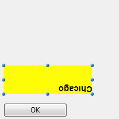
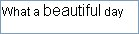

---

## Permitir a selecção de tipo de letra/cor

When this property is enabled, the [OPEN FONT PICKER](https://doc.4d.com/4Dv18/4D/18/OPEN-FONT-PICKER.301-4505612.en.html) and [OPEN COLOR PICKER](https://doc.4d.com/4Dv18/4D/18/OPEN-COLOR-PICKER.301-4505611.en.html) commands can be called to display the system font and color picker windows. Using these windows, the users can change the font or color of a form object that has the focus directly by clicking. When this property is disabled (default), the open picker commands have no effect.

#### Gramática JSON

| Propriedade          | Tipo de dados | Valores possíveis                       |
| -------------------- | ------------- | --------------------------------------- |
| allowFontColorPicker | boolean       | false (padrão), true |

#### Objectos suportados

[Input](input_overview.md)

---

## Negrito

Define o texto selecionado para aparecer mais escuro e mais pesado.

You can set this property using the [**OBJECT SET FONT STYLE**](https://doc.4d.com/4Dv17R5/4D/17-R5/OBJECT-SET-FONT-STYLE.301-4128244.en.html) command.

> Este é um texto normal.<br/>
> **Este é um texto em negrito.**

#### Gramática JSON

| Propriedade | Tipo de dados | Valores possíveis |
| ----------- | ------------- | ----------------- |
| fontWeight  | text          | "normal", "bold"  |

#### Objectos suportados

[Button](button_overview.md) - [Check Box](checkbox_overview.md) - [Combo Box](comboBox_overview.md) - [Drop-down List](dropdownList_Overview.md) - [Group Box](groupBox.md) - [Hierarchical List](list_overview.md#overview) - [Input](input_overview.md) - [List Box](listbox_overview.md#overview) - [List Box Column](listbox_overview.md#list-box-columns) - [List Box Footer](listbox_overview.md#list-box-footers) - [List Box Header](listbox_overview.md#list-box-headers) - [Radio Button](radio_overview.md) - [Text Area](text.md)

---

## Itálico

Define o texto selecionado como ligeiramente inclinado para a direita.

Você também pode definir essa propriedade por meio do comando [**OBJECT SET FONT STYLE**] (https://doc.4d.com/4Dv17R5/4D/17-R5/OBJECT-SET-FONT-STYLE.301-4128244.en.html).

> Este é um texto normal.<br/>
> _Este é o texto em itálico._

#### Gramática JSON

| Nome      | Tipo de dados | Valores possíveis  |
| --------- | ------------- | ------------------ |
| fontStyle | string        | "normal", "italic" |

#### Objectos suportados

[Button](button_overview.md) - [Check Box](checkbox_overview.md) - [Combo Box](comboBox_overview.md) - [Drop-down List](dropdownList_Overview.md) - [Group Box](groupBox.md) - [Hierarchical List](list_overview.md#overview) - [Input](input_overview.md) - [List Box](listbox_overview.md#overview) - [List Box Column](listbox_overview.md#list-box-columns) - [List Box Footer](listbox_overview.md#list-box-footers) - [List Box Header](listbox_overview.md#list-box-headers) - [Radio Button](radio_overview.md) - [Text Area](text.md)

---

## Sublinhado

Define o texto para ter uma linha por baixo.

#### Gramática JSON

| Nome           | Tipo de dados | Valores possíveis     |
| -------------- | ------------- | --------------------- |
| textDecoration | string        | "normal", "underline" |

#### Objectos suportados

[Button](button_overview.md) - [Check Box](checkbox_overview.md) - [Combo Box](comboBox_overview.md) - [Drop-down List](dropdownList_Overview.md) - [Group Box](groupBox.md) - [Hierarchical List](list_overview.md#overview) - [Input](input_overview.md) - [List Box](listbox_overview.md#overview) - [List Box Column](listbox_overview.md#list-box-columns) - [List Box Footer](listbox_overview.md#list-box-footers) - [List Box Header](listbox_overview.md#list-box-headers) - [Radio Button](radio_overview.md) - [Text Area](text.md)

---

## Fonte

Esta propiedad permite indicar el **tema de la fuente** o la **familia de fuente** utilizada en el objeto.

> Las propiedades **Tema de la fuente** y de la **familia de la fuente** son mutuamente excluyentes. Um tema de tipo de letra controla os atributos do tipo de letra, incluindo o tamanho. Uma família de tipos de letra permite-lhe definir o nome, o tamanho e a cor do tipo de letra.

### Tema Fonte

A propriedade de tema do tipo de letra designa um nome de estilo automático. Automatic styles determine the font family, font size and font color to be used for the object dynamically according to system parameters. Esses parâmetros dependem de:

- a plataforma,
- a língua do sistema,
- e o tipo de objeto do formulário.

With the font theme, you are guaranteed that titles are always displayed in accordance with the current interface standards of the system. No entanto, o seu tamanho pode variar de uma máquina para outra.

Estão disponíveis três temas de tipos de letra:

- **normal**: estilo automático, aplicado por defecto a todo nuevo objeto creado en el editor de formularios.
- Los temas de fuentes **principales** y **suplementarios** solo son soportados por las [áreas de texto](text.md) y las [áreas de entrada](input_overview.md). Estes temas destinam-se principalmente a desenho de caixas de diálogo. They refer to font styles used, respectively, for main text and additional information in your interface windows. Aqui estão as caixas de diálogo típicas (macOS e Windows) que utilizam estes temas de tipos de letra:


> Os temas de tipo de letra gerem o tipo de letra, bem como o seu tamanho e cor. Entretanto, pode aplicar propriedades de estilo personalizadas (Negrito, Itálico ou Subscrito) sem alterar seu funcionamento.

#### Gramática JSON

| Nome      | Tipo de dados | Valores possíveis              |
| --------- | ------------- | ------------------------------ |
| fontTheme | string        | "normal", "main", "additional" |

#### Objectos suportados

[Button](button_overview.md) - [Check Box](checkbox_overview.md) - [Combo Box](comboBox_overview.md) - [Drop-down List](dropdownList_Overview.md) - [Group Box](groupBox.md) - [Hierarchical List](list_overview.md#overview) - [Input](input_overview.md) - [List Box](listbox_overview.md#overview) - [List Box Column](listbox_overview.md#list-box-columns) - [List Box Footer](listbox_overview.md#list-box-footers) - [List Box Header](listbox_overview.md#list-box-headers) - [Radio Button](radio_overview.md) - [Text Area](text.md)

### Família de letras

Existem dois tipos de nomes de famílias de letras:

- _family-name:_ El nombre de una familia de fuentes, como "times", "courier", "arial", etc.
- _generic-family:_ El nombre de una familia genérica, como "serif", "sans-serif", "cursive", "fantasy", "monospace".

You can set this using the [**OBJECT SET FONT**](https://doc.4d.com/4Dv17R5/4D/17-R5/OBJECT-SET-FONT.301-4054834.en.html) command.

#### Gramática JSON

| Nome       | Tipo de dados | Valores possíveis             |
| ---------- | ------------- | ----------------------------- |
| fontFamily | string        | Nome da família de fontes CSS |

> 4D recomienda utilizar sólo fuentes [seguras para la web](https://www.w3schools.com/cssref/css_websafe_fonts.asp).

#### Objectos suportados

[Button](button_overview.md) - [Check Box](checkbox_overview.md) - [Combo Box](comboBox_overview.md) - [Drop-down List](dropdownList_Overview.md) - [Group Box](groupBox.md) - [Hierarchical List](list_overview.md#overview) - [Input](input_overview.md) - [List Box](listbox_overview.md#overview) - [List Box Column](listbox_overview.md#list-box-columns) - [List Box Footer](listbox_overview.md#list-box-footers) - [List Box Header](listbox_overview.md#list-box-headers) - [Radio Button](radio_overview.md) - [Text Area](text.md)

---

## Tamanho fonte

Permite definir o tamanho da fonte do objeto em pontos.

#### Gramática JSON

| Nome     | Tipo de dados | Valores possíveis                                                           |
| -------- | ------------- | --------------------------------------------------------------------------- |
| fontSize | integer       | Tamanho da letra em pontos. Valor mínimo: 0 |

#### Objectos suportados

[Button](button_overview.md) - [Check Box](checkbox_overview.md) - [Combo Box](comboBox_overview.md) - [Drop-down List](dropdownList_Overview.md) - [Group Box](groupBox.md) - [Hierarchical List](list_overview.md#overview) - [Input](input_overview.md) - [List Box](listbox_overview.md#overview) - [List Box Column](listbox_overview.md#list-box-columns) - [List Box Footer](listbox_overview.md#list-box-footers) - [List Box Header](listbox_overview.md#list-box-headers) - [Radio Button](radio_overview.md) - [Text Area](text.md)

---

## Cor fonte

Designa a cor do tipo de letra.

> Esta propiedad también define el color de [borde](#border-line-style-dotted-line-type) (si lo hay) del objeto cuando se utiliza el estilo "plano" o "punteado".

A cor pode ser especificada por:

- um nome de cor - como "red"
- um valor HEX - como "#ff0000"
- um valor RGB - como "rgb(255,0,0)"

You can also set this property using the [**OBJECT SET RGB COLORS**](https://doc.4d.com/4Dv18/4D/18/OBJECT-SET-RGB-COLORS.301-4505456.en.html) command.

#### Gramática JSON

| Nome   | Tipo de dados | Valores possíveis                        |
| ------ | ------------- | ---------------------------------------- |
| stroke | string        | um valor css, "transparent", "automatic" |

#### Objectos suportados

[Button](button_overview.md) - [Check Box](checkbox_overview.md) - [Combo Box](comboBox_overview.md) - [Drop-down List](dropdownList_Overview.md) - [Group Box](groupBox.md) - [Hierarchical List](list_overview.md#overview) - [Input](input_overview.md) - [List Box](listbox_overview.md#overview) - [List Box Column](listbox_overview.md#list-box-columns) - [List Box Footer](listbox_overview.md#list-box-footers) - [List Box Header](listbox_overview.md#list-box-headers) - [Progress Indicators](progressIndicator.md) - [Ruler](ruler.md) - [Radio Button](radio_overview.md) - [Text Area](text.md)

---

## Expressão cor fonte

`List box do tipo coleção/seleção de entidade`

Utilizado para aplicar uma cor de letra personalizada a cada linha do list box. É necessário utilizar valores de cor RGB. Para más información al respecto, consulte la descripción del comando [OBJECT SET RGB COLORS](https://doc.4d.com/4dv19R/help/command/en/page628.html) en el manual Lenguaje de 4D.

Deve introduzir uma expressão ou uma variável (não podem ser utilizadas variáveis do tipo array). A expressão ou variável será avaliada para cada linha exibida. Puede utilizar las constantes del tema [SET RGB COLORS](https://doc.4d.com/4Dv17R6/4D/17-R6/SET-RGB-COLORS.302-4310385.en.html).

También puede definir esta propiedad utilizando el comando `LISTBOX SET PROPERTY` con la constante `lk font color expression`.

> Esta propiedad también puede definirse mediante una [Expresión Meta Info](properties_Text.md#meta-info-expression).

El siguiente ejemplo utiliza un nombre de variable: introduzca _CompanyColor_ para la **Expresión color fuente** y, en el método formulario, escriba el siguiente código:

```4d
CompanyColor:=Choose([Companies]ID;Background color;Light shadow color; Foreground color;Dark shadow color)
```

#### Gramática JSON

| Nome            | Tipo de dados | Valores possíveis   |
| --------------- | ------------- | ------------------- |
| rowStrokeSource | string        | Expressão cor fonte |

#### Objectos suportados

[List Box](listbox_overview.md#overview)

---

## Expressão estilo

`List box do tipo coleção/seleção de entidade`

Utilizado para aplicar um estilo de carácter personalizado a cada linha do list box ou a cada célula da coluna.

Deve introduzir uma expressão ou uma variável (não podem ser utilizadas variáveis do tipo array). A expressão ou variável será avaliada para cada linha apresentada (se aplicada à list box) ou para cada célula apresentada (se aplicada a uma coluna). Puede utilizar las constantes del tema [Estilos de fuentes](https://doc.4d.com/4Dv17R6/4D/17-R6/Font-Styles.302-4310343.en.html).

Exemplo:

```4d
Choose([Companies]ID;Bold;Plain;Italic;Underline)
```

También puede definir esta propiedad utilizando el comando `LISTBOX SET PROPERTY` con la constante `lk font style expression`.

> Esta propiedad también puede definirse mediante una [Expresión Meta Info](properties_Text.md#meta-info-expression).

#### Gramática JSON

| Nome           | Tipo de dados | Valores possíveis                                                     |
| -------------- | ------------- | --------------------------------------------------------------------- |
| rowStyleSource | string        | Expressão de estilo a avaliar para cada linha/célula. |

#### Objectos suportados

[List Box](listbox_overview.md) - [Columna List Box](listbox_overview.md#list-box-columns)

---

## Alihamento horizontal

Localização horizontal do texto na área que o contém.

#### Gramática JSON

| Nome      | Tipo de dados | Valores possíveis                                 |
| --------- | ------------- | ------------------------------------------------- |
| textAlign | string        | "right", "center", "left", "automatic", "justify" |

:::note

- "automatic" no es compatible con [casillas de selección](checkbox_overview.md) y [botones radio](radio_overview.md)
- "justify" sólo es compatible con las [entradas ](input_overview.md) y [áreas de texto](text.md)

:::

#### Objectos suportados

[Button](button_overview.md) - [Check Box](checkbox_overview.md) (all styles except Regular and Flat) - [Group Box](groupBox.md) - [Input](input_overview.md) - [List Box](listbox_overview.md#overview) - [List Box Column](listbox_overview.md#list-box-columns) - [List Box Header](listbox_overview.md#list-box-headers) - [List Box Footer](listbox_overview.md#list-box-footers) - [Radio Button](radio_overview.md) (all styles except Regular and Flat) - [Text Area](text.md)

---

## Cor linha vertical

Localização vertical do texto na área que o contém.

La opción **Predeterminado** (`automático` valor JSON) define la alineación según el tipo de datos que se encuentran en cada columna:

- `abajo` para todos los datos (excepto las imágenes) y
- `arriba` para los datos del tipo imagen.

Esta propiedad también puede ser manejada por los comandos [OBJECT Get vertical alignment](https://doc.4d.com/4dv19R/help/command/en/page1188.html) y [OBJECT SET VERTICAL ALIGNMENT](https://doc.4d.com/4dv19R/help/command/en/page1187.html).

#### Gramática JSON

| Nome          | Tipo de dados | Valores possíveis                      |
| ------------- | ------------- | -------------------------------------- |
| verticalAlign | string        | "automatic", "top", "middle", "bottom" |

#### Objectos suportados

[List Box](listbox_overview.md) - [Columna List Box](listbox_overview.md#list-box-columns) - [Pie de List Box](listbox_overview.md#list-box-footers) - [Encabezado List Box](listbox_overview.md#list-box-headers)

---

## Meta Info expression

`List box do tipo Collection ou entity selection`

Especifica uma expressão ou uma variável que será avaliada para cada linha exibida. Permite definir um conjunto completo de atributos de texto das linhas. Debe pasar una **variable objeto** o una **expresión que devuelva un objeto**. As propriedades abaixo são compatíveis:

| Nome da propriedade | Tipo    | Descrição                                                                                                                                                                                                                                                                                                                                                                                                                                                                                                                                                            |
| ------------------- | ------- | -------------------------------------------------------------------------------------------------------------------------------------------------------------------------------------------------------------------------------------------------------------------------------------------------------------------------------------------------------------------------------------------------------------------------------------------------------------------------------------------------------------------------------------------------------------------- |
| stroke              | string  | Background color. Any CSS color (ex: "#F00FFF"), "automatic", "transparent"                                                                                                                                                                                                                                                                                                                                                                                                                                       |
| fill                | string  | Cor de fundo. Any CSS color (ex: "#FF00FF"), "automatic", "transparent"                                                                                                                                                                                                                                                                                                                                                                                                                                           |
| fontStyle           | string  | "normal","italic"                                                                                                                                                                                                                                                                                                                                                                                                                                                                                                                                                    |
| fontWeight          | string  | "normal","bold"                                                                                                                                                                                                                                                                                                                                                                                                                                                                                                                                                      |
| textDecoration      | string  | "normal","underline"                                                                                                                                                                                                                                                                                                                                                                                                                                                                                                                                                 |
| unselectable        | boolean | Designa la línea correspondiente como no seleccionable (\* es decir, \*, no es posible el resaltado). As áreas inseríveis deixam de o ser se esta opção estiver ativada, a menos que a opção "Editar com um clique" também esteja ativada. Os controlos como as caixas de verificação e as listas permanecem funcionais. Esta definição é ignorada se o modo de seleção do list box é "Nenhum". This setting is ignored if the list box selection mode is "None". |
| disabled            | boolean | Desactiva a linha correspondente. As áreas acessíveis deixam de ser acessíveis se esta opção estiver activada. Texto e controles (caixas de seleção, listas, etc.) parecem escurecidos ou acinzentados. This setting is ignored if the list box selection mode is "None".                                                                                                                                                                                         |

A propriedade especial "célula" permite-lhe aplicar um conjunto de propriedades a uma única coluna:

| Nome da propriedade |              |                | Tipo   | Descrição                                                                                                                                                                                                                                                                                                                  |
| ------------------- | ------------ | -------------- | ------ | -------------------------------------------------------------------------------------------------------------------------------------------------------------------------------------------------------------------------------------------------------------------------------------------------------------------------- |
| cell                |              |                | object | Allows applying the property to a single column.                                                                                                                                                                                                                                                           |
|                     | _columnName_ |                | object | _columnName_ es el nombre del objeto de la columna del list box                                                                                                                                                                                                                                                            |
|                     |              | _propertyName_ | string | as propriedades "stroke", "fill", "fontStyle", "fontWeight" ou "textDecoration" (ver acima). **Nota**: las propiedades "no seleccionable" y "desactivada" sólo pueden definirse a nivel de la línea. São ignorados se forem passados no objeto "célula" |

> Style settings made with this property are ignored if other style settings are already defined through expressions (_i.e._, [Style Expression](#style-expression), [Font Color Expression](#font-color-expression), [Background Color Expression](#background-color-expression)).

**Exemplos**

En un método proyecto _Color_, escriba el siguiente código:

```4d
//Color method
//Sets font color for certain rows and background color for Col2 and Col3 columns
Form.meta:=New object
If(This.ID>5) //ID is an attribute of collection objects/entities
  Form.meta.stroke:="purple"
  Form.meta.cell:=New object("Col2";New object("fill";"black");\
  	"Col3";New object("fill";"red"))
Else
  Form.meta.stroke:="orange"
End if
```

**Buenas prácticas:** por razones de optimización, normalmente se recomienda crear el objeto `meta.cell` una vez en el método del formulario:

```4d
  //form method
 Case of
    :(Form event code=On Load)
       Form.colStyle:=New object("Col2";New object("fill";"black");\
       	"Col3";New object("fill";"red"))  
 // you can also define other style sets  
       Form.colStyle2:=New object("Col2";New object("fill";"green");\
       	"Col3";New object("fontWeight";"bold"))  
 End case
```

Entonces, el método _Color_ contendría:

```4d
  //Color method
 ...
 If(This.ID>5)
    Form.meta.stroke:="purple"
    Form.meta.cell:=Form.colStyle //reuse the same object for better performance
 Else
 	Form.meta.stroke:="orange"
	Form.meta.cell:=Form.colStyle2
 End if
 ...
```

#### Gramática JSON

| Nome       | Tipo de dados | Valores possíveis                                                     |
| ---------- | ------------- | --------------------------------------------------------------------- |
| metaSource | string        | Expressão do objeto a avaliar para cada linha/célula. |

#### Objectos suportados

[List Box](listbox_overview.md)

---

## Multistyle

Esta propriedade ativa a possibilidade de usar estilos específicos na área selecionada. Cuando esta opción está marcada, 4D interpreta todas las etiquetas `<SPAN> HTML` presentes en el área.

Por defeito, esta opção não está activada.

#### Gramática JSON

| Nome       | Tipo de dados | Valores possíveis |
| ---------- | ------------- | ----------------- |
| styledText | boolean       | true, false       |

#### Objectos suportados

[Área de entrada](input_overview.md) - [Columna List Box](listbox_overview.md#list-box-columns)

---

## Orientação

Modifica a orientação (rotação) de uma área texto. Áreas texto pode ser rodadas por incrementos de 90°. Cada valor de orientação é aplicado enquanto mantém o mesmo ponto inferior esquerdo para o objeto:

| Valor de orientação             | Resultados                                     |
| ------------------------------- | ---------------------------------------------- |
| 0 (o padrão) |  |
| 90                              |  |
| 180                             |  |
| 270                             |  |

Además de [áreas de texto estáticas](text.md), los objetos de texto de las [áreas de entrada](input_overview.md) pueden girar cuando no son[editables](properties_Entry.md#enterable). Quando uma propriedade rotação for aplicada a um objeto input, a propriedade digitável é removida (se houver). Esse objeto é então excluído da ordem de entrada.

#### Gramática JSON

| Nome      | Tipo de dados | Valores possíveis |
| --------- | ------------- | ----------------- |
| textAngle | number        | 0, 90, 180, 270   |

#### Objectos suportados

[Entrada](input_overview.md) (no editable) - [Área de texto](text.md)

---

## Array cores de Fonte

`List boxes de tipo array`

Permite estabelecer uma cor de fonte personalizada para cada linha do list box ou cada célula da coluna.

O nome do array LongInt deve ser usado. Cada elemento deste array corresponde a uma linha do list box (se aplicada o list box) ou a uma célula da coluna (se aplicada a uma coluna), pelo que o array deve ter o mesmo tamanho que o array associado à coluna. Puede utilizar las constantes del tema [SET RGB COLORS](https://doc.4d.com/4Dv17R6/4D/17-R6/SET-RGB-COLORS.302-4310385.en.html). Se você quiser que a célula herde a cor de fundo definida no nível superior, passe o valor -255 para o elemento de array correspondente.

#### Gramática JSON

| Nome            | Tipo de dados | Valores possíveis          |
| --------------- | ------------- | -------------------------- |
| rowStrokeSource | string        | O nome de um array longint |

#### Objectos suportados

[List Box](listbox_overview.md) - [Columna List Box](listbox_overview.md#list-box-columns)

---

## Array estilo linha

`List boxes de tipo array`

Permite estabelecer um estilo de fonte personalizado para cada linha do list box ou cada célula da coluna.

O nome do array LongInt deve ser usado. Cada elemento deste array corresponde a uma linha do list box (se aplicada o list box) ou a uma célula da coluna (se aplicada a uma coluna), pelo que o array deve ter o mesmo tamanho que o array associado à coluna. Para llenar el array (utilizando un método), utilice las constantes del tema [Estilos de fuente](https://doc.4d.com/4Dv17R6/4D/17-R6/Font-Styles.302-4310343.en.html). Pode acionar constantes juntas para combinar estilos. Se quiser que a célula herde o estilo definido no nível mais alto, passe o valor -255 para o elemento array correspondente.

#### Gramática JSON

| Nome           | Tipo de dados | Valores possíveis                           |
| -------------- | ------------- | ------------------------------------------- |
| rowStyleSource | string        | O nome de um array longint. |

#### Objectos suportados

[List Box](listbox_overview.md#overview) - [Columna List Box](listbox_overview.md#list-box-columns)

---

## Armazenar com etiquetas de estilo predefinidas

Esta propiedad sólo está disponible para un área de entrada [Multi-estilo](#multi-estilo).
Quando essa propriedade for ativada, a área armazena as tags de estilo com o texto, mesmo se nenhuma modificação for feita. Nesse caso, as tags correspondem ao estilo padrão. Quando essa propriedade for desativada, só as tags de estilo modificadas são armazenadas.

Por exemplo, aqui está um texto que inclui uma modificação de estilo:



Quando a propriedade for desativada, a área só armazena a modificação. Os conteúdos armazenados são entretanto:

```
¡Qué <SPAN STYLE="font-size:13.5pt">hermoso</SPAN> día!
```

Quando a propriedade for ativada, a área armazena todas as informações de formatação. A primeira tag genérica descreve o estilo padrão quando cada variação no sujeito for um par de tags aninhadas. Os conteúdos armazenados na área são portanto:

```
<SPAN STYLE="font-family:'Arial';font-size:9pt;text-align:left;font-weight:normal;font-style:normal;text-decoration:none;color:#000000;background-color:#FFFFFF">¡Qué <SPAN STYLE="font-size:13.5pt">hermoso</SPAN> día!</SPAN>
```

#### Gramática JSON

| Nome              | Tipo de dados | Valores possíveis                                        |
| ----------------- | ------------- | -------------------------------------------------------- |
| storeDefaultStyle | boolean       | true, false (padrão). |

#### Objectos suportados

[Input](input_overview.md)
