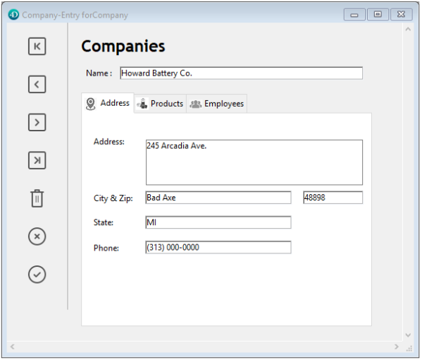

A tab control creates an object that lets the user choose among a set of virtual screens that are enclosed by the tab control object. O usuário acessa cada tela clicando na guia correspondente.

O seguinte formulário de várias páginas utiliza um objeto de controlo de pestanas:


Para passar de uma tela para outra, o usuário simplesmente clica na guia correspondente.

The screens can represent pages in a multi-page form or an object that changes when the user clicks a tab. If the tab control is used as a page navigation tool, then the [FORM GOTO PAGE](https://doc.4d.com/4Dv17R5/4D/17-R5/FORM-GOTO-PAGE.301-4128536.en.html) command or the `gotoPage` standard action would be used when a user clicks a tab.

Outra utilização do controlo de separadores consiste em controlar os dados apresentados num subformulário. Por exemplo, um Rolodex pode ser implementado utilizando um controlo de pestanas. The tabs would display the letters of the alphabet and the tab control’s action would be to load the data corresponding to the letter that the user clicked.

Cada pestana pode apresentar etiquetas ou etiquetas e um pequeno ícone. Se incluir ícones, estes aparecem à esquerda de cada etiqueta. Aqui está um exemplo de um controlo de pestanas que utiliza ícones:



When you create a tab control, 4D manages the spacing and placement of the tabs. You only need to supply the labels in the form of an array, or the icons and labels in the form of a hierarchical list.

If the tab control is wide enough to display all the tabs with both the labels and icons, it displays both. If the tab control is not wide enough to display both the labels and icons, 4D displays the icons only. If it can’t fit all the icons, it places scroll arrows to the right of the last visible tab. As setas de deslocamento permitem ao usuário deslocar os ícones para a esquerda ou para a direita.

Under macOS, in addition to the standard position (top), the tab controls can also be aligned to the bottom.


### JSON Exemplo

```4d
    "myTab": {
  "type": "tab",
   "left": 60, 
  "top": 160,  
  "width": 100, 
  "height": 20, 
  "labelsPlacement": "bottom" //define the direction
 }
```


## Adding labels to a tab control

There are several ways to supply the labels for a tab control:

- um objeto
- uma lista de escolha
- um array

### Utilização de um objecto

You can assign an [object](Concepts/dt_object.md) encapsulating a [collection](Concepts/dt_collection) as the [data source](properties_Object.md#variable-or-expression) of the tab control. O objeto deve conter as seguintes propriedades:

| Propriedade    | Tipo       | Descrição                                                                                                                                                  |
| -------------- | ---------- | ---------------------------------------------------------------------------------------------------------------------------------------------------------- |
| `values`       | Collection | Obrigatório - Coleção de valores escalares. Só são suportados valores cadeia. Se for inválido, vazio ou não definido, o controle de tabulação estará vazio |
| `index`        | number     | Index of the currently tab control page (value between 0 and `collection.length-1`)                                                                        |
| `currentValue` | Text       | Valor atual selecionado                                                                                                                                    |

The initialization code must be executed before the form is presented to the user.

In the following example, `Form.tabControl` has been defined as tab control [expression](properties_Object.md#variable-or-expression). You can associate the [`gotoPage` standard action](#goto-page-action) to the form object:

```4d
Form.tabControl:=New object Form.tabControl.values:=New collection("Page 1"; "Page 2"; "Page 3")
Form.tabControl.index:=2 //start on page 3
```


### Utilizar uma lista de seleção

You can assign a [choice list](properties_DataSource.md#choice-list-static-list) to the tab control, either through a collection (static list) or a JSON pointer ("$ref") to a json list. Icons associated with list items in the Lists editor will be displayed in the tob control.

### Utilizar um array texto

You can create a Text array that contains the names of each page of the form. Este código deve ser executado antes de o formulário ser apresentado ao usuário. For example, you could place the code in the object method of the tab control and execute it when the `On Load` event occurs.

```4d
 ARRAY TEXT(arrPages;3)
 arrPages{1}:="Name"
 arrPages{2}:="Address"
 arrPages{3}:="Notes"  
```
> You can also store the names of the pages in a hierarchical list and use the `Load list` command to load the values into the array.


## Funcionalidades do Goto page

### Comando FORM GOTO PAGE

You can use the [FORM GOTO PAGE](https://doc.4d.com/4Dv17R5/4D/17-R5/FORM-GOTO-PAGE.301-4128536.en.html) command in the tab control’s method:

```4d
FORM GOTO PAGE(arrPages)
```

The command is executed when the `On Clicked` event occurs. You should then clear the array when the `On Unload` event occurs.

Eis um exemplo de método objeto:

```4d
 Case of
    :(Form event=On Load)
       LIST TO ARRAY("Tab Labels";arrPages)
    :(Form event=On Clicked)
       FORM GOTO PAGE(arrPages)
    :(Form event=On Unload)
       CLEAR VARIABLE(arrPages)
 End case
```

### Acção Goto Page

When you assign the `gotoPage` [standard action](properties_Action.md#standard-action) to a tab control, 4D will automatically display the page of the form that corresponds to the number of the tab that is selected.

For example, if the user selects the 3rd tab, 4D will display the third page of the current form (if it exists).


## Propriedades compatíveis

[Negrita](properties_Text.md#bold) - [Inferior](properties_CoordinatesAndSizing.md#bottom) - [Lista de opções](properties_DataSource.md#choice-list-static-list) - [Classe](properties_Object.md#css-class) - [Tipo de expressão](properties_Object.md#expression-type) - [Fonte](properties_Text.md#font) - [Tamanho de fonte](properties_Text.md#font-size) - [Altura](properties_CoordinatesAndSizing.md#height) - [Mensagem de ajuda](properties_Help.md#help-tip) - [Tamanho horizontal](properties_ResizingOptions.md#horizontal-sizing) - [Itálico](properties_Text.md#italic) - [Esquerda](properties_CoordinatesAndSizing.md#left) - [Nome de objeto](properties_Object.md#object-name) - [Direita](properties_CoordinatesAndSizing.md#right) - [Ação padrão](properties_Action.md#standard-action) - [Direção de controle aba](properties_Appearance.md#tab-control-direction) - [Superior](properties_CoordinatesAndSizing.md#top) - [Tipo](properties_Object.md#type) - [Sublinhado](properties_Text.md#underline) - [Tamanho vertical](properties_ResizingOptions.md#vertical-sizing) - [Variável ou expressão](properties_Object.md#variable-or-expression) - [Visibilidade](properties_Display.md#visibility) - [Largura](properties_CoordinatesAndSizing.md#width) 
