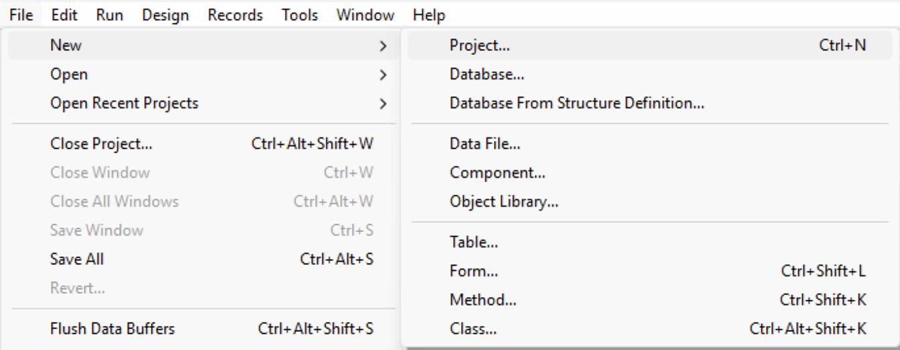
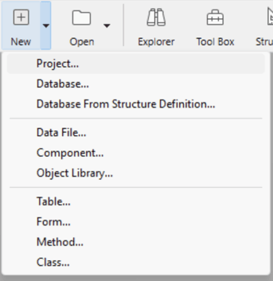

## Project overview

Los proyectos 4D se crean y desarrollan utilizando la aplicación **4D**, que ofrece un completo Entorno de Desarrollo Integrado (IDE). **4D Server** también puede crear nuevos proyectos vacíos.

Um projeto 4D contém todo o código fonte de uma aplicação 4D, qualquer que seja seu tipo de implementação (web, móvel, ou desktop), desde a estrutura do banco de dados até a interface do usuário, incluindo código, formulários, menus, configurações usuário, ou quaisquer recursos necessários. Um projeto 4D é principalmente composto por ficheiros texto.

### Ficheiros do projecto

Os ficheiros de projeto 4D são abertos e editados usando aplicações normais da plataforma 4D (4D ou 4D Server). With 4D, full-featured editors are available to manage files, including a structure editor, a [Code Editor](../code-editor/write-class-method.md), a [form editor](../FormEditor/formEditor.md), a menu editor...

Quando os projetos estão em ficheiros de texto simples legíveis (JSON, XML, etc.), podem ser lidos ou editados manualmente pelos programadores, utilizando qualquer editor de código.

Além disso, os ficheiros de projeto 4D facilitam a programação genérica, a criação de modelos de aplicação e a partilha de código. Los proyectos se organizan internamente en [carpetas y archivos](../Project/architecture.md).

### Desenvolvimento

Los proyectos 4D se desarrollan con la aplicación **4D**. Fornece um ambiente de desenvolvimento Integrado (IDE) para projetos 4D, bem como um servidor Web, um gerador de projetos móveis e um tempo de execução de aplicações, permitindo-lhe desenvolver, testar e depurar qualquer tipo de projeto.

El desarrollo multiusuario se gestiona a través de herramientas estándar del repositorio de **control de fuentes** (Perforce, Git, SVN, etc.), que permiten a los desarrolladores trabajar en diferentes ramas y comparar, fusionar o revertir las modificacion

### Implantação

Los archivos del proyecto pueden ser [compilados](../Project/compiler.md) y fácilmente desplegados. 4D permite criar três tipos de aplicações a partir de seus projetos:

- las aplicaciones [web](WebServer/webServer.md),
- [desktop](Desktop/building.md) applications (client/server or single-user),
- [mobile](https://developer.4d.com/go-mobile/) applications.

Os aplicativos de back-end podem ser implementados usando 4D Server, 4D ou [fundido com 4D Volume Desktop](../Desktop/building.md).

## Criar arquivos de projeto

Se pueden crear nuevos proyectos de aplicaciones 4D desde **4D** o **4D Server**. Em qualquer caso, os ficheiros de projeto são armazenados na máquina local.

Para criar um novo projeto de banco de dados:

1. Inicie 4D ou 4D Server.

2. Faça uma das seguintes opções:
   - Selecione **Novo > Projeto...** no menu **Arquivo**: 
   - (4D only) Select **Project...** from the **New** toolbar button:

A standard **Save** dialog appears so you can choose the name and location of the 4D project's main folder.

3. Introduzca el nombre de su carpeta de proyecto y haga clic en **Guardar**. Este nome será utilizado:

   - como nome de toda a pasta do projeto,
   - como nombre del archivo .4DProject en el primer nivel de la [carpeta "Project"](../Project/architecture.md#project-folder).

Pode escolher qualquer nome permitido pelo seu sistema operacional. <em x-id="3">Atenção:</em> se seu banco projeto estiver destinado a funcionar em outros sistemas ou a ser guardada através de uma ferramenta de controle de código fonte, deve levar em consideração suas recomendações específicas de denominação.

Al validar el diálogo **Guardar**, 4D cierra el proyecto actual (si lo hay), crea una carpeta de proyecto en la ubicación indicada y coloca en ella todos los archivos necesarios para el proyecto. Para más información, consulte [Arquitectura de un proyecto 4D](Project/architecture.md).

Pode então começar a desenvolver o seu projeto.

## Abrir projeto

Lance uma aplicação 4D Developer.

1. Faça uma das seguintes opções:

   - Seleccione **Abrir/Proyecto local...** desde el menú **Archivo** o del botón**Abrir** de la barra de herramientas.
   - Seleccione **Abrir un proyecto de aplicación local** en el diálogo del Asistente de Bienvenida

Aparece a caixa de diálogo padrão Abrir.

2. Seleccione el archivo `.4dproject` del proyecto (situado dentro de la carpeta ["Project" del proyecto](../Project/architecture.md#project-folder)) y haga clic en **Abrir**.

   Por padrão, o projeto é aberto com seu arquivo de dados atual. Outros tipos de arquivo são sugeridos:

   - *Archivos de proyectos empaquetados*: extensión `.4dz` - proyectos de despliegue
   - *Archivos de acceso directo*: extensión `.4DLink` - almacenan los parámetros adicionales necesarios para abrir proyectos o aplicaciones (direcciones, identificadores, etc.)
   - *Archivos binarios*: extensión `.4db` o `.4dc` - formatos de base de datos 4D heredados

### Opções

Además de las opciones sistema estándar, la caja de diálogo *Abrir* de 4D ofrece dos menús con opciones específicas disponibles utilizando el botón **Abrir** y el menú **Archivo de datos**.

- **Abrir** - modo de apertura del proyecto:
  - **Interpretado** o **Compilado**: estas opciones están disponibles cuando el proyecto seleccionado contiene [código interpretado y compilado](Concepts/interpreted.md).
  - **[Centro de seguridad y de mantenimiento](MSC/overview.md)**: apertura en modo seguro que permite el acceso a los proyectos dañados para realizar las reparaciones necesarias.

- **Archivo de datos** - especifica el archivo de datos a utilizar con el proyecto. Por defecto, está seleccionada la opción **Archivo de datos actual**.

## Atalhos de abertura de projectos

4D oferece várias maneiras de abrir projetos diretamente e ignorar o diálogo Aberto:

- através de opções de menu:
  - *Barra de menús* - **Archivo** > **Abrir proyectos recientes / {project name}**
  - *Barra de herramientas 4D* - Seleccione el proyecto en el menú asociado al botón **Abrir**

- através das preferências:
  - Fije la preferencia general **Al inicio** en **Abrir el último proyecto utilizado**.

- utilizando un archivo `.4DLink`.

### Abrir um projeto com um ficheiro 4DLink

Você pode usar um [arquivo `.4DLink`](#about-4dlink-files) para iniciar a aplicação 4D e abrir o projeto alvo 4D. Há duas formas de o fazer:

- haga doble clic o arrastre y suelte el archivo `.4DLink` en la aplicación 4D
- vaya a **Archivo** > **Abrir los proyectos recientes** y seleccione un proyecto

Um arquivo .4DLink do tipo "projeto remoto" pode ser copiado e usado em várias máquinas.

> Também é possível selecionar um arquivo 4DLink na caixa de diálogo 4D e 4D Server de abertura (abrindo apenas projeto local).

## Sobre 4DLink Files

Los archivos con la extensión `.4DLink` son archivos XML que contienen parámetros destinados a automatizar y a simplificar la apertura de proyectos 4D locales o remotos.

Los archivos `.4DLink` pueden guardar la dirección de un proyecto 4D, así como sus identificadores de conexión y el modo de apertura, lo que permite ahorrar tiempo al abrir los proyectos.

4D genera automáticamente un archivo `.4DLink` cuando se abre un proyecto local por primera vez o cuando se conecta a un servidor por primera vez. O arquivo é armazenado na pasta de preferências locais no seguinte local:

- Windows: C:\Users\UserName\AppData\Roaming\4D\Favorites vXX\
- macOS: Users/UserName/Library/Application Support/4D/Favorites vXX/

XX representa o número da versão da aplicação. Por exemplo, "Favorites v19" para 4D v19.

Esta pasta está dividida em duas subpastas:

- la carpeta **Local** contiene los archivos `.4DLink` que pueden utilizarse para abrir proyectos locales
- la carpeta **Remote** contiene los archivos `.4DLink` de proyectos remotos recientes

Los archivos `.4DLink` también pueden crearse con un editor XML.

4D ofrece un DTD que describe las llaves XML que pueden utilizarse para crear un archivo `.4DLink`. This DTD is named database_link.dtd and is found in the `\Resources\DTD\` subfolder of the 4D application.

