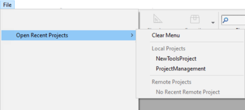

4D projects are created and developed using the **4D** application, which provides a comprehensive Integrated Development Environment (IDE). **4D Server** can also create new, empty projects.

Multi-user development is managed via standard **source control** repository tools (Perforce, Git, SVN, etc.), which allow developers to work on different branches, and compare, merge, or revert modifications.

## Criar arquivos de projeto

**Nota:** Servidor 4D pode abrir arquivos .4DProject em modo apenas leitura, mas apenas para propósitos de teste. Para lançamento, projetos 4D são oferecidos como arquivos .4dz (arquivos compactados zipados). Para saber mais, consulte [Construir um pacote de projetos](building.md). Em qualquer caso, os ficheiros de projeto são armazenados na máquina local.

Para criar um novo projeto de banco de dados:

1. Inicie 4D ou 4D Server.
2. Faça uma das seguintes opções:
    * Select **New > Project...** from the **File** menu: OR(4D only) Select **Project...** from the **New** toolbar button:A standard **Save** dialog appears so you can choose the name and location of the 4D project's main folder. 
    * When working on a project in 4D, you can use built-in 4D editors to create, modify, or save structure items, methods, forms, etc. Modifications are saved to disk when you select a **Save** menu item, or when the editor's window loses or gets the focus.

A standard **Save** dialog appears so you can choose the name and location of the 4D project's main folder.

3. Enter the name of your project folder and click **Save**. This name will be used:

    * as the name of the .4DProject file at the first level of the "Project" folder.
    * as the name of the .4DProject file at the first level of the "Project" folder.

 You can choose any name allowed by your operating system. *Atenção:* se seu banco projeto estiver destinado a funcionar em outros sistemas ou a ser guardada através de uma ferramenta de controle de código fonte, deve levar em consideração suas recomendações específicas de denominação.

Quando validar a caixa de diálogo, 4D fecha o banco de dados atual (se houver) e cria uma pasta "Project" no local indicado e coloca nela todos os arquivos necessários para o funcioanamento correto do banco de dados projeto. Para saber mais, consulte [Arquitetura de um projeto 4D](Project/architecture.md).

Pode então começar a desenvolver o seu projeto.

## Abrir projeto

Lance uma aplicação 4D Developer.

1. Faça uma das seguintes opções:

    * Select **Open a local application project** in the Welcome Wizard dialog, OR Select **Open/Local Project...** from the **File** menu or the **Open** toolbar button.
    * Select **Open a local application project** in the Welcome Wizard dialog

The standard Open dialog appears.

2. Select the project's `.4dproject` file and click **Open**.

    By default, the project is opened with its current data file. São sugeridos outros tipos de ficheiros:

    * *Packed project files*: `.4dz` extension  - deployment projects
    * *Shortcut files*: `.4DLink` extension - store additional parameters needed for opening projects or applications (addresses, identifiers, etc.)
    * *Binary files*: `.4db` or `.4dc` extension - legacy 4D database formats

### Opções

In addition to standard system options, the *Open* dialog in 4D provides two menus with specific options that are available using the **Open** button and the **Data file** menu.

* **Mode**: contains, by default, the **Return to Design mode** command, which is used to exit the Application mode.
  * **Interpreted** or **Compiled**: These options are available when the selected project contains both [interpreted and compiled code](Concepts/interpreted.md).
  * **[Maintenance Security Center](MSC/overview.md)**: Opening in secure mode allowing access to damaged projects in order to perform any necessary repairs.

* **File**: only includes the **Quit** command. The *Quit* standard action is associated with the command, which causes the application to quit.

## Atalhos de abertura de projectos

4D offers several ways to open projects directly and bypass the Open dialog:

* através de opções de menu:
  * *Menu bar* - **File** > **Open Recent Projects / {project name}**
  * OR Choose **Create a new menu bar** or **Create a new menu** from the context menu of the list or the options menu below the list. If you created a menu bar, a new bar appears in the list containing the default menus (File and Edit).

* via preferences:
  * Set the **At startup** general preference to **Open last used project**.

* utilizando um ficheiro `.4DLink`.

### Abrir um projeto com um ficheiro 4DLink

You can use a [`.4DLink` file](#about-4DLink-files) to launch the 4D application and open the target 4D project. Há duas formas de o fazer:

* double-click or drag and drop the `.4DLink` file onto the 4D application
* go to **File** > **Open Recent Projects** and select a project

A .4DLink file of "remote project" type can be copied and used on several machines.
> It's also possible to select a 4DLink file in the 4D and 4D Server opening dialog box (opening local project only).

## Sobre 4DLink Files

Files with the `.4DLink` extension are XML files that contain parameters intended to automate and simplify opening local or remote 4D projects.

`.4DLink` files can save the address of a 4D project as well as its connection identifiers and opening mode, saving you time when opening projects.

4D automatically generates a `.4DLink` file when a local project is opened for the first time or when connecting to a server for the first time. The file is stored in the local preferences folder at the following location:

* Windows 7 and higher: C:\Users\UserName\AppData\Roaming\4D\Favorites vXX\
* OS X: Users/UserName/Library/Application Support/4D/Favorites vXX/

XX represents the version number of the application. Por exemplo, "Favorites v19" para 4D v19.

Esta pasta está dividida em duas subpastas:

* the **Local** folder contains the `.4DLink` files that can be used to open local projects
* the **Remote** folder contains the `.4DLink` files of recent remote projects

`.4DLink` files can also be created with an XML editor.

4D provides a DTD describing the XML keys that can be used to build a `.4DLink` file. This DTD is named database_link.dtd and is found in the \Resources\DTD\ subfolder of the 4D application.

## Guardar ficheiros

When working on a project in 4D, you can use built-in 4D editors to create, modify, or save structure items, methods, forms, etc. Choose **Add an item to menu “MenuName”** in the options menu of the editor or from the context menu (right click in the central list).

Since the editors use files on the disk, potential conflicts could happen if the same file is modified or even deleted from different locations. For example, if the same method is edited in a method editor window *and* in a text editor, saving both modifications will result in a conflict.

The 4D development framework includes a file access manager to control concurrent access:

* if an open file is read-only at the OS level, a locked icon is displayed in the editor: 
* if an open file is edited concurrently from different locations, 4D displays an alert dialog when trying to save the changes:

* or, use the appropriate **Delete...**  command from the context menu or the options menu of the editor.
* **Edit**: standard and completely modifiable.
* **Cancelar**: não guardar

Esta funcionalidade está ativada para todos os editores 4D incorporados (Estrutura, Formulário, Método, Definições e Caixa de Ferramentas).
