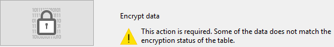

Puede utilizar esta página para cifrar o _descifrar_ (es decir, eliminar el cifrado) el archivo de datos, según el estado del atributo **Encriptable** definido para cada tabla de la base.

:::info

Para obtener información detallada sobre la encriptación de datos en 4D, consulte la sección [Encriptación de datos](https://doc.4d.com/4Dv20/4D/20/Encrypting-data.300-6263735.en.html) del manual de _Diseño_. También puede leer la entrada del blog [Una mirada más profunda al cifrado de datos en 4D](https://blog.4d.com/a-deeper-look-into-4d-data-encryption/).

:::

É criada uma pasta sempre que é efetuada uma operação de encriptação/desencriptação. Se denomina "Replaced Files (Encrypting) _yyyy-mm-dd hh-mm-ss_> o "Replaced Files (Decrypting) _yyyy-mm-dd hh-mm-ss_".

> A encriptação só está disponível no [modo de manutenção](overview.md#display-in-maintenance-mode). Se tentar realizar essa operação no modo padrão, um diálogo de aviso informará que o banco será fechado e se reiniciará no modo de manutenção

**Warning:**

- A criptografia de um banco de dados é uma operação demorada. Apresenta um indicador de progresso (que pode ser interrompido pelo usuário). Note também que a operação de criptografia de um banco de dados sempre inclui um passo de compactação.
- Cada operação de encriptação produz uma cópia do ficheiro de dados, o que aumenta o tamanho da pasta da aplicação. É importante ter isto em conta (especialmente em macOS onde as aplicações 4D aparecem como pacotes) para que o tamanho da aplicação não aumente excessivamente. Mover ou remover manualmente as cópias do ficheiro original no pacote pode ser útil para minimizar o tamanho do pacote.

## Encriptar dados pela primeira vez

Para encriptar os seus dados pela primeira vez utilizando o CSM, são necessários os seguintes passos:

1. En el editor de estructuras, marque el atributo **Encriptable** de cada tabla cuyos datos desee encriptar. Ver a secção "Propriedades das tabelas".
2. Abra a página Encriptar do CSM.
   If you open the page without setting any tables as **Encryptable**, the following message is displayed in the page:
   
   Otherwise, the following message is displayed:
   

   This means that the **Encryptable** status for at least one table has been modified and the data file still has not been encrypted.
   \*\*Note: \*\*The same message is displayed when the **Encryptable** status has been modified in an already encrypted data file or after the data file has been decrypted (see below).

3. Click on the Encrypt picture button.\
   \
   You will be prompted to enter a passphrase for your data file:
   
   The passphrase is used to generate the data encryption key. Uma frase-chave é uma versão mais segura de uma palavra-passe e pode conter um grande número de caracteres. Por exemplo, pode introduzir uma frase-chave como "Todos nós viemos para Montreux" ou "A minha primeira grande frase-chave!"
   The security level indicator can help you evaluate the strength of your passphrase:
   
   (deep green is the highest level)
4. Introduza para confirmar a sua frase-passe protegida.

O processo de encriptação é então iniciado. Se o MSC foi aberto em modo padrão, o banco de dados é reaberto em modo manutenção.

4D ofrece guardar la llave de encriptación (ver [Guardar la llave de encriptación](#saving-the-encryption-key) más abajo). Pode fazê-lo agora ou mais tarde. Também é possível abrir o ficheiro de registo da encriptação.

Se o processo de encriptação for bem-sucedido, a página Encriptar apresenta botões de operações de manutenção de encriptação.

**Atención:** durante la operación de encriptación, 4D crea un nuevo archivo de datos vacío y lo llena con los datos del archivo de datos original. Os registos pertencentes a tabelas "encriptáveis" são encriptados e depois copiados, os outros registos são apenas copiados (é também executada uma operação de compactação). Se a operação for bem sucedida, o ficheiro de dados original é movido para uma pasta "Replaced Files (Encrypting)". Se tentar entregar um arquivo de dados criptografado, tenha certeza de antes mover/remover qualquer arquivo de dados não criptografado na pasta de banco de dados.

## Operações de manutenção da cifragem

When an application is encrypted (see above), the Encrypt page provides several encryption maintenance operations, corresponding to standard scenarios.

### Fornecimento da chave de encriptação de dados atual

Por razões de segurança, todas as operações de manutenção da cifragem exigem que seja fornecida a chave de cifragem de dado atual.

- Se a chave de encriptação de dados já está carregada no enxoval 4D(1), é automaticamente reutilizada por 4D.
- Se a chave de encriptação de dados não for encontrada, é necessário fornecê-la. O seguinte diálogo é exibido:
  

Nesta fase, tem duas opções:

- introduzca la frase secreta actual(2) y haga clic en **OK**.
  OU
- conecte un dispositivo como una llave USB y haga clic en el botón **Escanear dispositivos**.

(1) The 4D keychain stores all valid data encrpytion keys entered during the application session.\
(2) The current passphrase is the passphrase used to generate the current encryption key.

Em todos os casos, se uma informação válida for fornecida, 4D reinicia em modo de manutenção (se ainda não for o caso) e executa a operação.

### Volte a encriptar os dados com a chave de encriptação atual

Esta operación es útil cuando se ha modificado el atributo **Encriptable** de una o varias tablas que contienen los datos. Nesse caso, para prevenir inconsistências no arquivo de dados, 4D não permite nenhum acesso de escrita aos registros das tabelas na aplicação. É então necessário voltar a encriptar os dados para restaurar um estado de encriptação válido.

1. Haga clic en **Recibir los datos con la llave de cifrado actual**.
2. Introduzir a chave de encriptação de dados atual.

The data file is properly re-encrypted with the current key and a confirmation message is displayed:

### Alterar a sua frase-chave e voltar a encriptar os dados

Esta operação é útil quando é necessário alterar a chave de encriptação de data atual. Por exemplo, poderá ter de o fazer para cumprir regras de segurança (como a exigência de alterar a frase-chave a cada três meses).

1. Haga clic en **Cambiar su frase de contraseña y volver a cifrar los datos**.
2. Introduzir a chave de encriptação de dados atual.
3. Enter the new passphrase (for added security, you are prompted to enter it twice):
   
   The data file is encrypted with the new key and the confirmation message is displayed.
   

### Desencriptar todos os dados

Esta operação remove toda a encriptação do ficheiro de dados. Se já não pretender que os seus dados sejam encriptados:

1. Haga clic en **Desencriptar todos los datos**.
2. Introduzir a chave de encriptação de dados atual (ver Fornecer a chave de encriptação de dados atual).

O arquivo de dados é totalmente descriptografado e uma mensagem de confirmação é exibida:

> Quando o arquivo de dados for desencriptado, o estado de encriptação das tabelas não corresponde aos seus atributos Encryptable. Para restablecer un estado coincidente, debe anular la selección de todos los atributos **Encriptable** al nivel de la estructura de la base.

## Guardar a chave de encriptação

4D permite salvar a chave de encriptação de dados em um arquivo dedicado. El nombre del archivo debe tener la extensión `.4DKeyChain`, por ejemplo "myKeys.4DKeyChain". Armazenar esse arquivo em um aparelho externo, como um pendrive USB, facilita o uso de um banco de ados criptografado, já que o usuário só precisa conectar o aparelho para fornecer a chave de criptografia antes de abrir o banco de dados para poder acessar os dados criptografados.

É possível guardar a chave de encriptação sempre que for fornecida uma nova frase-chave:

- quando o banco de dados for criptografado pela primeira vez,
- quando o banco de dados for re-criptografado com uma nova frase secreta.

Podem ser armazenadas chaves de encriptação sucessivas no mesmo dispositivo.

:::caution

Almacenar el archivo de llave de cifrado de datos en el primer nivel del dispositivo es obligatorio cuando utiliza la función  [de restauración automática y de integración de historiales](../Backup/settings.md#automatic-restore-and-log-integration). Quando a seqüência de restauração é acionada, 4D deve ter acesso ao arquivo de chave de encriptação, caso contrário ocorre um erro.

:::

## Arquivo histórico

Depois que a operação de criptografia tiver sido completada, 4D gera um arquivo na pasta Logs do banco de dados. Se crea en formato XML y se llama "_ApplicationName_Encrypt_Log_yyyy-mm-dd hh-mm-ss.xml_" o "_ApplicationName_Decrypt_Log_yyyy-mm-dd hh-mm-ss.xml_".

É apresentado um botão Open log file na página MSC sempre que é gerado um novo arquivo de registo.

O arquivo de registo lista todas as operações internas executadas relativas ao processo de encriptação/desencriptação, bem como os erros (se existirem).
