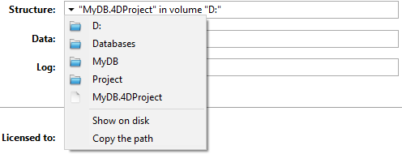

The Information page provides information about the 4D and system environments, as well as the database and application files. Cada página pode ser exibida usando controles de guia na parte superior da janela.

## Programa

Esta página indica el nombre, la versión y la ubicación de la aplicación, así como la carpeta 4D activa (para más información sobre la carpeta 4D activa, consulte la descripción del comando `Get 4D folder` en el manual _Lenguaje 4D_).

A parte central da janela indica o nome e local do projeto de bancos de dados e arquivos de dados assim como o arquivo de histórico (se houver). A parte inferior da janela indica o nome do titular da licença 4D, o tipo de licença e o nome de usuário do banco de dados quando ativar as senhas (ou o Designer se não for o caso).

- **Display and selection of pathnames**: On the **Program** tab, pathnames are displayed in pop-up menus containing the folder sequence as found on the disk:\
  
  If you select a menu item (disk or folder), it is displayed in a new system window.
  El comando **Copiar la ruta** copia el nombre completo de la ruta en el portapapeles como texto, utilizando los separadores de la plataforma actual.

- **"Licenses" Folder** The **"Licenses" Folder** button displays the contents of the active Licenses folder in a new system window. All the license files installed in your 4D environment are grouped together in this folder, on your hard disk. When they are opened with a Web browser, these files display information concerning the licenses they contain and their characteristics.
  The location of the "Licenses" folder can vary depending on the version of your operating system. For more information about the location of this folder, refer to the `Get 4D folder` command.
  _**Nota:** también puede acceder a esta carpeta desde la caja de diálogo "Actualizar licencias" (disponible en el menú Ayuda)._

## Tabelas

Esta página fornece uma visão geral das tabelas da sua base de dados:

> As informações desta página estão disponíveis nos modos standard e de manutenção.

The page lists all the tables of the database (including invisible tables) as well as their characteristics:

- **ID**: número internos de la tabla.
- **Tablas**: nombres de las tablas. Names of deleted tables are displayed with parenthesis (if they are still in the trash).
- **Registros**: número total de registros en la tabla. Si un registro está dañado o no se puede leer, se muestra _Error_ en lugar del número. Neste caso, pode considerar a utilização das ferramentas de verificação e reparação.
- **Campos**: número de campos en la tabla. Os campos invisíveis são contados, mas os campos apagados não são contados.
- **Índices**: número de índices de todo tipo en la tabla
- **Encriptable**: si el atributo **Encriptable** se marca para la tabla al nivel de la estructura (ver el párrafo "Encriptable" en el Manual de Diseño).
- **Encriptado**: si se marca, los registros de la tabla se cifran en el archivo de datos. **Encriptado**: si se marca, los registros de la tabla se cifran en el archivo de datos.
- **Tamaño tabla direcciones**: tamaño de la tabla de direcciones para cada tabla. The address table is an internal table which stores one element per record created in the table. Na verdade, associa os registos ao seu endereço físico. For performance reasons, it is not resized when records are deleted, thus its size can be different from the current number of records in the table. Si esta diferencia es significativa, se puede ejecutar una operación de compactación de datos con la opción "Compactar la tabla de direcciones" marcada para optimizar el tamaño de la tabla de direcciones (ver la página [Compactar](compact.md)).
  _**Nota:** las diferencias entre el tamaño de la tabla de direcciones y el número de registros también pueden ser el resultado de un incidente durante la escritura de la caché en el disco._

## Dados

La página **Datos** ofrece información sobre el espacio de almacenamiento disponible y utilizado en el archivo de datos.

> Esta página não pode ser acedida em modo manutenção

As informações são fornecidas sob a forma de gráficos:

> This page does not take into account any data that may be stored outside of the data file (see "External storage").

Arquivos que são muito fragmentados reduzem o desempenho do disco e, assim, do banco de dados. If the occupation rate is too low, 4D will indicate this by a warning icon (which is displayed on the Information button and on the tab of the corresponding file type) and specify that compacting is necessary:

A warning icon is also displayed on the button of the [Compact](compact.md) page:

