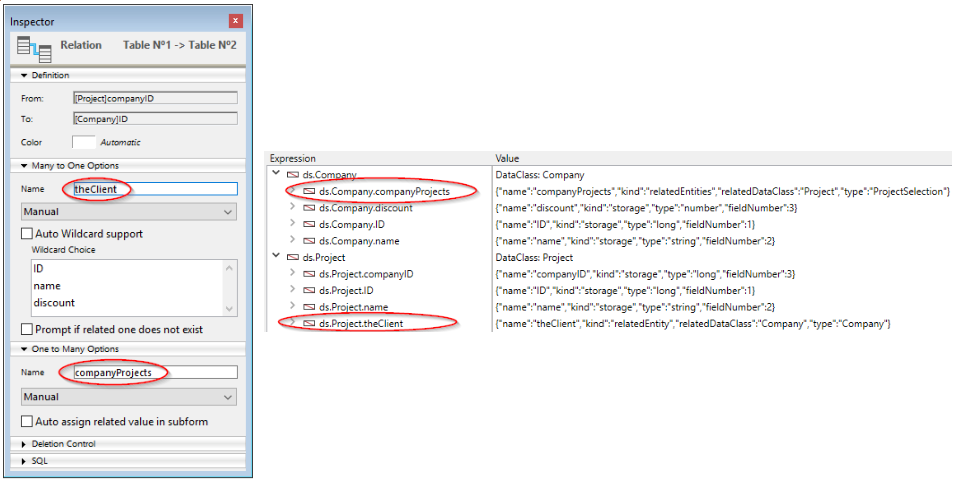

A tecnologia ORDA baseia-se em um mapeamento automático de uma estrutura de banco de dados subjacente. Também fornece acesso aos dados através de objetos seleção de entidades (entity selection) e entidades (entity). Como resultado, ORDA expõe toda a base de dados como um conjunto de objetos de modelo de dados.

## Mapeamento da estrutura

Quando você chama um datastore usando os comandos [`ds`](commands/ds.md) ou [`Open datastore`](commands/open-datastore.md), 4D faz automaticamente referência a tabelas e campos da estrutura 4D correspondente como propriedades do objeto [datastore](#datastore) retornado:

- As tabelas correspondem às dataclasses.
- Os campos são mapeados para atributos de armazenamento.
- As relações são mapeadas para atributos de relações - os nomes de relações, definidos no editor de estrutura, são usados como nomes de atributos de relações.



### Regras gerais

As seguintes regras são aplicadas a quaisquer conversões:

- Os nomes de tabelas, campos e relações são mapeados para nomes de propriedade de objeto. Asegúrese de que dichos nombres cumplen con las reglas generales de denominación de objetos, como se explica en la sección [Convenciones de denominación de objetos](Concepts/identifiers.md).
- Uma datastore só referencia as tabelas com uma única chave primária. As tabelas seguintes não são referenciadas:
  - Tabelas sem chave primária
  - Tabelas com chaves primárias compostas.
- Os campos BLOB estão automaticamente disponíveis como atributos do tipo [objeto Blob](Concepts/dt_blob.md#blob-types).

> O mapeamento ORDA não leva em consideração:
>
> - a opção "Invisível" para tabelas ou campos,
> - a estrutura virtual definida através de `SET TABLE TITLES` ou `SET FIELD TITLES`,
> - a propriedade "Manual" ou "Automática" das relações.

### Regras para o controlo do acesso remoto

Cuando se accede a un datastore remoto a través del comando `Abrir datastore` o [peticiones REST](REST/gettingStarted.md), sólo las tablas y los campos con la propiedad **Exponer como recurso REST** están disponibles de forma remota.

Essa opção deve ser selecionada no nível da estrutura 4D para cada tabela e cada campo que você deseja expor como classe de dados e atributo no armazenamento de dados:


### Actualização do modelo de dados

Quaisquer modificações aplicadas no nível da estrutura da base de dados invalidam a camada atual de data ORDA. Estas modificações incluem:

- adicionar ou remover uma tabela, um campo ou uma relação
- renomeação de uma tabela, um campo ou uma relação
- alterar uma propriedade principal de um campo (tipo, exclusivo, índice, autoincremento, suporte a valor null)

Cuando la capa actual del modelo ORDA ha sido invalidada, es automáticamente recargada y actualizada en llamadas posteriores del datastore local `ds` en 4D y 4D Server. Observe que as referências existentes a objetos ORDA, como entidades ou seleções de entidades, continuarão a usar o modelo a partir do qual foram criadas, até que sejam geradas novamente.

No entanto, a camada atualizada do modelo ORDA não está automaticamente disponível nos seguintes contextos:

- uma aplicação remota 4D conectada a 4D Server -- a aplicação remota deve reconectar ao servidor.
- un datastore remoto abierto mediante `Open datastore` o a través de [llamadas REST](REST/gettingStarted.md) -- debe abrirse una nueva sesión.

## Definição de objetos

### Datastore

O datastore é o objeto de interface para um banco de dados. Constrói uma representação de todo o banco de dados como objeto. Un datastore está formado por un **modelo** y **datos**:

- O modelo contém e descreve todas as dataclasses que compõem o datastore. É independente do próprio banco de dados subjacente.
- Os dados referem-se à informação que vai ser utilizada e armazenada neste modelo. Por exemplo, nomes, endereços e datas de nascimento dos funcionários são peças de dados com os quais você pode trabalhar em um datastore.

Cuando se maneja a través del código, el datastore es un objeto cuyas propiedades son todas las [dataclasses](#dataclass) que se han expuesto específicamente.

4D permite lidar com os seguintes datastores:

- el datastore local, basado en la base 4D actual, devuelta por el comando `ds` (el datastore principal).
- uno o más datastores remotos expuestos como recursos REST en las bases 4D remotas, devueltos por el comando `Open datastore`.

Um datastore faz referência apenas a um único banco de dados local ou remoto.

O próprio objeto datastore não pode ser copiado como um objeto:

```4d
$mydatastore:=OB Copy(ds) //retorna nulo
```

No entanto, as propriedades do datastore são enumeráveis:

```4d
 ARRAY TEXT($prop;0)
 OB GET PROPERTY NAMES(ds;$prop)
  //$prop contém os nomes de todas as classes de dados
```

El datastore principal (por defecto) siempre está disponible a través del comando `ds`, pero el comando `Open datastore` permite hacer referencia a todo datastore remoto.

### Dataclass

Uma dataclass é o equivalente a uma tabela. É usado como um modelo de objeto e referir-se a todos os campos como atributos, incluindo atributos relativo (atributos construídos sobre as relações entre os dataclasses). Os atributos relacionais podem ser utilizados em consultas como qualquer outro atributo.

Todas las dataclasses de un proyecto 4D están disponibles como propiedad del datastore `ds`. For remote datastores accessed through `Open datastore` or [REST requests](REST/gettingStarted.md), the **Expose as REST resource** option must be selected at the 4D structure level for each exposed table that you want to be exposed as dataclass in the datastore.

Por exemplo, considere a seguinte tabela na estrutura 4D:


La tabla `Company` está disponible automáticamente como dataclass en el datastore `ds`. Você pode escrever:

```4d
var $compClass : cs. Company //declares a $compClass object variable of the Company class
$compClass:=ds. Company //assigns the Company dataclass reference to $compClass
```

Um objeto de classe de dados pode conter:

- attributes
- atributos relacionais

A classe de dados oferece uma abstração do banco de dados físico e permite a manipulação de um modelo de dados conceitual. A dataclass é a única forma de consultar o datastore. Uma consulta é feita a partir de uma única dataclass. As consultas são construídas em torno de atributos e nomes de atributos de relação das dataclasses. Assim, os atributos de relação são o meio de envolver várias tabelas ligadas numa consulta.

O próprio objeto dataclass não pode ser copiado como um objeto:

```4d
$mydataclass:=OB Copy(ds. Employee) //returns null
```

No entanto, as propriedades da dataclass são enumeráveis:

```code4d
ARRAY TEXT($prop;0)
OB GET PROPERTY NAMES(ds. Employee;$prop)
//$prop contains the names of all the dataclasse attributes
```

### Atributo

As propriedades de dataclass são objetos de atributo que descrevem os campos ou relações subjacentes. Por exemplo:

```4d
 $nameAttribute:=ds. Company.name //reference to class attribute
 $revenuesAttribute:=ds. Company["revenues"] //alternate way
```

Este código asigna a `$nameAttribute` y `$revenuesAttribute` las referencias a los atributos name y revenues de la clase `Company`. Essa sintaxe NAO devolve valores mantidos dentro do atributo, mas sim devolve referências aos próprios atributos. Para manejar los valores, es necesario pasar por [Entidades](#entity).

Todos los campos elegibles de una tabla están disponibles como atributos de su [dataclass](#dataclass) padre. Para los datastores remotos a los que se accede a través de `Open datastore` o [peticiones REST](REST/gettingStarted.md), se debe seleccionar la opción **Exponer como recurso REST** al nivel de la estructura 4D para cada campo que se desee exponer como at

#### Atributos de armazenamento e de relação

Atributos da Dataclass vêm em vários tipos: armazenamento, relatedEntity e relatedEntities. Los atributos escalares (*es decir*, ofrecen un único valor) soportan todos los tipos de datos estándar 4D (entero, texto, objeto, etc.).

- Un **atributo de almacenamiento** equivale a un campo en la base de datos 4D y puede indexarse. Os valores atribuídos a um atributo de armazenamento são armazenados como parte da entidade quando ela é salva. Quando um atributo de armazenamento é acessado, seu valor vem diretamente do datastore. Atributos de armazenamento são o bloco de construção mais básico de uma entidade sendo definidos pelo nome e tipo de dados.
- Un **atributo relacional** ofrece acceso a otras entidades. Os atributos relação podem resultar em uma única entidade (ou nenhuma entidade) ou em uma seleção de entidades (de 0 a N). Os atributos relacional são criados com base em relações "clássicas" na estrutura relacional para fornecer acesso direto a entidades relacionadas ou a entidades relacionadas. Os atributos de relação estão diretamente disponíveis no ORDA usando seus nomes.

Por exemplo, considere a seguinte estrutura de banco de dados parcial e as propriedades de relação:


Todos os atributos de armazenamento estarão automaticamente disponíveis:

- na dataclass Project: "ID", "name" e "companyID"
- na dataclass Company: "ID", "name" e "discount"

Além disso, os seguintes atributos de relação também estarão automaticamente disponíveis:

- en la dataclass Project: el atributo **theClient**, del tipo "relatedEntity"; hay como máximo una Empresa para cada Proyecto (el cliente)
- en la dataclass Company: el atributo **companyProjects**, del tipo "relatedEntities"; para cada empresa existe un cierto número de proyectos relacionados.

> &#062; &#062; &#062; &#062; A propriedade Manual ou Automática de uma relação de banco de dados não tem efeito no ORDA.

Todos os atributos da dataclass são expostos como propriedades da dataclass:


Tenha em mente que esses objetos descrevem os atributos, mas não dão acesso aos dados. La lectura o escritura de los datos se realiza a través de los [objetos entidad](entities.md#using-entity-attributes).

#### Atributos computados e alias

Los [atributos calculados](ordaClasses.md#computed-attributes) y [alias](ordaClasses.md#alias-attributes) son atributos "virtuales". O seu valor não é armazenado, mas avaliado sempre que são acedidos. Eles não pertencem à estrutura de banco de dados subjacente, mas são construídos sobre ela e podem ser usados como qualquer atributo do modelo de dados.

### Entity

Uma entidade é o equivalente a um registo. Na verdade, é um objeto que referir-se a um registo no banco de dados. Puede verse como una instancia de una [dataclass](#dataclass), como un registro de la tabla correspondiente a la dataclass. No entanto, uma entidade também contém dados correlacionados ao banco de dados relacionado ao datastore.

O objetivo da entidade é gerir dados (criar, atualizar, apagar). Quando uma referência de entidade é obtida por uma seleção de entidade, ela também retém informações sobre a seleção de entidade, o que permite a iteração por meio da seleção.

O objeto entidade em si não pode ser copiado como um objeto:

```4d
 $myentity:=OB Copy(ds. Employee.get(1)) //retorna null
```

As propriedades da entidade são, no entanto, enumeráveis:

```4d
 ARRAY TEXT($prop;0)
 OB GET PROPERTY NAMES(ds. Employee.get(1);$prop)
  //$prop contains the names of all the entity attributes
```

### Seleção de entidades

Uma seleção de entidade é um objeto contendo uma ou mais referência(s) a entidades pertencentes à mesma dataclass. É normalmente criado como resultado de uma consulta ou devolvido a partir de um atributo de relação. Uma seleção de entidades pode conter 0, 1 ou X entidades da dataclass -- onde X pode representar o número total de entidades contidas na dataclass.

Exemplo:

```4d
var $e : cs. EmployeeSelection //declares a $e object variable of the EmployeeSelection class type
$e:=ds. Employee.all() //assigns the resulting entity selection reference to the $e variable
```

Las entity selections pueden estar "ordenadas" o "sin ordenar" ([ver abajo](#ordered-or-unordered-entity-selection)).

> Las entity selections también pueden ser "compartibles" o "no compartibles", dependiendo de [cómo se hayan creado](entities.md#shareable-or-alterable-entity-selections).

O próprio objeto de seleção de entidades não pode ser copiado como um objeto:

```4d
 $myentitysel:=OB Copy(ds. Employee.all()) //returns null
```

No entanto, as propriedades de seleção de entidades são enumeráveis:

```4d
 ARRAY TEXT($prop;0)
 OB GET PROPERTY NAMES(ds. Employee.all();$prop)
  //$prop contains the names of the entity selection properties
  //("length", 00", "01"...)
```

#### Entity selections ordenadas ou não ordenadas

Por razones de optimización, por defecto, 4D ORDA normalmente crea selecciones de entidades no ordenadas, excepto cuando utiliza el método `orderBy( )` o utiliza opciones específicas. Nesta documentação, a menos que especificado, "entity selection" geralmente se refere a uma "entity selection não ordenada".

As seleções das entidades ordenadas são criadas apenas quando necessárias ou quando solicitadas especificamente usando opções, ou seja, nos seguintes casos:

- resultado de un `orderBy()` sobre una selección (de cualquier tipo) o de un `orderBy()` sobre una dataclass
- resultado del método `newSelection()` con la opción `dk keep ordered`

As selecções de entidades não ordenadas são criadas nos seguintes casos:

- resultado de un `query()` estándar sobre una selección (de cualquier tipo) o de un `query()` sobre una dataclass,
- resultado del método `newSelection()` sin opción,
- resultado de uno de los métodos de comparación, sean cuales sean los tipos de selección de entrada: `or()`, `and()`, `minus()`.

> Las siguientes selecciones de entidades son siempre **ordenadas**:
>
> - seleções de entidades retornadas pelo 4D Server para um cliente remoto
> - selecções de entidades construídas em datastores remotos.

Observe que quando uma seleção de entidade ordenada se torna uma seleção de entidade não ordenada, quaisquer referências repetidas são removidas.
