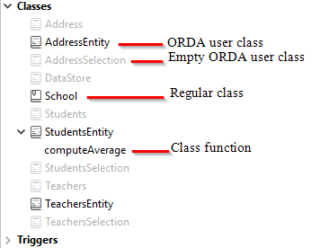

O ORDA permite-lhe criar funções de classe de alto nível acima do modelo de dados. Isto permite-lhe escrever código orientado para o negócio e "publicá-lo" tal como uma API. Datastore, classes de dados, seleções de entidades e entidades estão todos disponíveis como objetos de classe que podem conter funções.

Por exemplo, você poderia criar uma função `getNextWithHigherSalary()` na classe `EmployeeEntity` para retornar os funcionários com um salário maior do que o selecionado. Seria tão simples como chamar:

```4d
$nextHigh:=ds. Employee.get(1).getNextWithHigherSalary()
```

Os desenvolvedores podem não só utilizar estas funções em datastores locais, mas também em arquiteturas cliente/servidor e remotas:

```4d
 //$cityManager é a referência de um datastore remoto
Form.comp.city:=$cityManager.City.getCityName(Form.comp.zipcode)
```

Graças a esta caraterística, toda a lógica comercial da sua aplicação 4D pode ser armazenada como uma camada independente para que possa ser facilmente mantida e reutilizada com um alto nível de segurança:

- É possível "esconder" a complexidade global da estrutura física subjacente e expor apenas funções compreensíveis e prontas a utilizar.

- Se a estrutura física evoluir, pode simplesmente adaptar o código da função e as aplicações cliente continuarão a chamá-las de forma transparente.

- Por predefinição, todas as funções de classe do modelo de dados (incluindo [funções de atributo computadas](#computed-attributes-1)) e [atributos de alias](#alias-attributes-1) **não são expostas** a aplicações remotas e não podem ser chamadas a partir de pedidos REST. Você deve declarar explicitamente cada função pública e alias com a [palavra `exposed`](#exposed-vs-non-exposed-functions).


Além disso, 4D [pré-criações automaticamente](#creating-classes) as classes para cada objeto do modelo de dados disponível.

## Arquitetura

A ORDA fornece **classes genéricas** expostas através da **loja de classes `4D`** (Concepts/classes.md#class-stores), assim como **classes de utilizador** (que estendem as classes genéricas) expostas na **loja de classes `cs`** (Concepts/classes.md#class-stores):


Todas as classes do modelo de dados ORDA são expostas como propriedades do **`cs`** armazenamento de classes. Estão disponíveis as seguintes classes ORDA:

| Class                                       | Nome do exemplo                       | Instanciado por                                                                                                                                                                                                                                                                                                                                                                                                                                                                                                                                                                                                                                                                                                                                                                                                                                                        |
| ------------------------------------------- | ------------------------------------- | ---------------------------------------------------------------------------------------------------------------------------------------------------------------------------------------------------------------------------------------------------------------------------------------------------------------------------------------------------------------------------------------------------------------------------------------------------------------------------------------------------------------------------------------------------------------------------------------------------------------------------------------------------------------------------------------------------------------------------------------------------------------------------------------------------------------------------------------------------------------------- |
| cs. DataStore               | cs. DataStore         | [`ds`](commands/ds.md) command                                                                                                                                                                                                                                                                                                                                                                                                                                                                                                                                                                                                                                                                                                                                                                                                                                         |
| cs._DataClassName_          | cs. Employee          | [`dataStore.DataClassName`](API/DataStoreClass.md#dataclassname), `dataStore["DataClassName"]`                                                                                                                                                                                                                                                                                                                                                                                                                                                                                                                                                                                                                                                                                                                                                                         |
| cs._DataClassName_Entity    | cs. EmployeeEntity    | [`dataClass.get()`](API/DataClassClass.md#get), [`dataClass.new()`](API/DataClassClass.md#new), [`entitySelection.first()`](API/EntitySelectionClass.md#first), [`entitySelection.last()`](API/EntitySelectionClass.md#last), [`entity.previous()`](API/EntityClass.md#previous), [`entity.next()`](API/EntityClass.md#next), [`entity.first()`](API/EntityClass.md#first), [`entity.last()`](API/EntityClass.md#last), [`entity.clone()`](API/EntityClass.md#clone)                                                                                                                                                                                                                                                                                                                                                                                                   |
| cs._DataClassName_Selection | cs. EmployeeSelection | [`dataClass.query()`](API/DataClassClass.md#query), [`entitySelection.query()`](API/EntitySelectionClass.md#query), [`dataClass.all()`](API/DataClassClass.md#all), [`dataClass.fromCollection()`](API/DataClassClass.md#fromcollection), [`dataClass.newSelection()`](API/DataClassClass.md#newselection), [`entitySelection.drop()`](API/EntitySelectionClass.md#drop), [`entity.getSelection()`](API/EntityClass.md#getselection), [`entitySelection.and()`](API/EntitySelectionClass.md#and), [`entitySelection.minus()`](API/EntitySelectionClass.md#minus), [`entitySelection.or()`](API/EntitySelectionClass.md#or), [`entitySelection.orderBy()`](API/EntitySelectionClass.md#or), [`entitySelection.orderByFormula()`](API/EntitySelectionClass.md#orderbyformula), [`entitySelection.slice()`](API/EntitySelectionClass.md#slice), `Create entity selection` |

> As classes de utilizador ORDA são armazenadas como arquivos de classe normais (.4dm) na subpasta Classes do projeto [(ver abaixo)](#class-files).

Além disso, as instâncias de objetos das classes de usuárioes do modelo de dados ORDA beneficiam das propriedades e funções dos seus pais:

- um objeto de classe Datastore pode chamar funções da [classe genérica ORDA Datastore](API/DataStoreClass.md).
- un objeto de clase Dataclass puede llamar las funciones de la [clase genérica ORDA Dataclass](API/DataClassClass.md).
- um objeto de classe de seleção de Entidade pode chamar funções da [classe genérica de seleção de Entidade ORDA](API/EntitySelectionClass.md).
- um objeto de classe Entity pode chamar funções da [classe genérica ORDA Entity](API/EntityClass.md).

## Descrição da classe

<details><summary>História</summary>

| Release | Mudanças                                                                                                                                                 |
| ------- | -------------------------------------------------------------------------------------------------------------------------------------------------------- |
| 19 R4   | Atributos alias na Entity Class                                                                                                                          |
| 19 R3   | Atributos calculados en la Entity Class                                                                                                                  |
| 18 R5   | As funções de classe do modelo de dados não são expostas ao REST por defeito. Nuevas palabras clave `exposed` y `local`. |

</details>

### Classe DataStore

Uma base de dados 4D expõe a sua própria classe DataStore na loja de classes `cs`.

- **Extends**: 4D.DataStoreImplementation
- **Nombre de clase**: cs.DataStore

Você pode criar funções na classe DataStore que estarão disponíveis através do objeto `ds`.

#### Exemplo

```4d
// cs. DataStore class Class extends DataStoreImplementation Function getDesc
  $0:="Database exposing employees and their companies"
```

Esta função pode então ser chamada:

```4d
$desc:=ds.getDesc() //"Database exposing..."
```

### Classe DataClass

Cada tabela exposta com ORDA oferece uma classe DataClass no armazenamento de classes `cs`.

- **Extends**: 4D. DataClass
- **Nome da classe**: cs._DataClassName_ (em que _DataClassName_ é o nome da tabela)
- **Nome de exemplo**: cs. Employee

#### Exemplo

```4D
// cs. Classe company


Class extends DataClass

// Retorna empresas cuja receita é acima da média
// Retorna uma seleção de entidade relacionada com a dataClass Company

Function GetBestOnes()
	$sel:=This.query("revenues >= :1";This.all().average("revenues"));
	$0:=$sel
```

Em seguida, pode obter uma seleção de entidades das "melhores" empresas através da execução:

```4d
	var $best : cs.CompanySelection
	$best:=ds.Company.GetBestOnes()
```

:::info

[Os atributos calculados](#computed-attributes) são definidos na [Classe de Entidade](#entity-class).

:::

#### Exemplo com um datastore remoto

O seguinte catálogo _City_ está exposto em um datastore remoto (vista parcial):


A classe `City` fornece uma API:

```4d
// cs.City class

Class extends DataClass

Function getCityName()
	var $1; $zipcode : Integer
	var $zip : 4D.Entity
	var $0 : Text

	$zipcode:=$1
	$zip:=ds.ZipCode.get($zipcode)
	$0:=""

	If ($zip#Null)
		$0:=$zip.city.name
	End if
```

A aplicação cliente abre uma sessão no datastore remoto:

```4d
$cityManager:=Open datastore(New object("hostname";"127.0.0.1:8111");"CityManager")
```

Em seguida, uma aplicação cliente pode utilizar a API para obter a cidade correspondente a um código postal (por exemplo) a partir de um formulário:

```4d
Form.comp.city:=$cityManager.City.getCityName(Form.comp.zipcode)

```

### Classe EntitySelection

Cada tabela exposta com ORDA oferece uma classe EntitySelection no repositório de classes `cs`.

- **Extends**: 4D. EntitySelection
- **Nome da classe**: cs._DataClassName_ (em que _DataClassName_ é o nome da tabela)
- **Nome de exemplo**: cs.ColaboradorSelection

#### Exemplo

```4d
// cs.EmployeeSelection class


Class extends EntitySelection

//Extract the employees with a salary greater than the average from this entity selection

Function withSalaryGreaterThanAverage() : cs.EmployeeSelection
	return This.query("salary > :1";This.average("salary")).orderBy("salary")

```

Em seguida, é possível obter empregados com um salário superior à média em qualquer seleção de entidade através da execução:

```4d
$moreThanAvg:=ds. Company.all().employees.withSalaryGreaterThanAverage()
```

:::info

[Filtros de seleção de entidades restritas](entities.md#restricting-entity-selections) são definidos na [Classe de Dataclass](#dataclass-class).

:::

### Entity Class

Cada tabela exposta com ORDA oferece uma classe de Entidade no armazenamento de classes `cs`.

- **Extends**: 4D.Entity
- **Nome da classe**: _DataClassName_Entity (em que _DataClassName_ é o nome da tabela)
- **Nome do exemplo**: cs.CityEntity

#### Atributos calculados

As classes de entidades permitem-lhe definir **atributos computados** utilizando palavras-chave específicas:

- `Función get` _attributeName_
- `Función set` _attributeName_
- `Function query` _attributeName_
- `Función orderBy` _attributeName_

Para más información, consulte la sección [Atributos calculados](#computed-attributes-1).

#### Atributos de Alias

Classes de entidade permitem que você defina \*\*atributos de alias \*\*, geralmente sobre atributos relacionados, usando a palavra-chave `Alias`:

`Alias` _attributeName_ _targetPath_

Para mais informações, por favor consulte a seção de [Atributos de alias](#alias-attributes-1).

#### Exemplo

```4d
// cs.CityEntity class

Class extends Entity

Function getPopulation() : Integer
    return This.zips.sum("population")


Function isBigCity(): Boolean
// A função getPopulation() pode ser usada dentro da classe
	return This.getPopulation()>50000
```

Em seguida, pode chamar este código:

```4d
var $cityManager; $city : Object

$cityManager:=Open datastore(New object("hostname";"127.0.0.1:8111");"CityManager")
$city:=$cityManager.City.getCity("Caguas")

If ($city.isBigCity())
	ALERT($city.name + " is a big city")
End if
```

### Regras específicas

Ao criar ou editar classes de modelo de dados, é necessário preste atenção às seguintes regras:

- Como eles são usados para definir nomes automáticos de classe de DataClass nos **cs** [loja de classe](Concepts/classes.md#class-stores), tabelas 4D devem ser nomeadas para evitar qualquer conflito no namespace **cs**. Em particular:
  - Não dê o mesmo nome a uma tabela 4D e a um [nome de classe de usuário](Concepts/classes.md#class-names). Se isso acontecer, o construtor da classe de utilizador torna-se inutilizável (o compilador emite um aviso).
  - Não use um nome reservado para uma tabela 4D (por exemplo, "DataClass").

- Ao definir uma classe, verifique se a instrução [`class extends`](Concepts/classes.md#class-extends-classnameclass) corresponde exatamente ao nome da classe pai (lembre-se de que são sensíveis a maiúsculas e minúsculas). Por exemplo, 'Classe amplia EntitySelection' para uma classe de seleção de entidade.

- Você não pode instanciar um objeto de classe de modelo de dados com a palavra-chave `new()` (um erro é retornado). Você deve usar um método regular, como listado na [coluna `Instantiated by` da tabela da classe da ORDA](#architecture).

- Não é possível substituir uma função de classe ORDA nativa da loja de classes **`4D`** por uma função de classe de utilizador do modelo de dados.

### Execução preventiva

Quando compiladas, as funções da classe do modelo de dados são executadas:

- em **processos preventivos ou cooperativos** (dependendo do processo de chamada) em aplicativos de usuário único,
- em **processos preemptivos** em aplicações cliente/servidor (exceto se for utilizada a palavra-chave [`local`](#local-functions), caso em que depende do processo de chamada, como no utilizador único).

Se o seu projeto foi concebido para ser executado em cliente/servidor, certifique-se de que o código da função da classe do modelo de dados é thread-safe. Se o código thread-unsafe for chamado, será lançado um erro em tempo de execução (nenhum erro será lançado em tempo de compilação, uma vez que a execução cooperativa é suportada em aplicações de utilizador único).

## Atributos calculados

### Visão Geral

Um atributo computado é um atributo de classe de dados com um tipo de dados que oculta um cálculo. [Classes padrão 4D](Concepts/classes.md) implementa o conceito de propriedades computadas com `get` (_getter_) e `set` (_setter_) [funções de acessório](Concepts/classes.md#function-get-and-function-set). Los atributos de las clases de datos ORDA se benefician de esta funcionalidad y la extienden con dos funcionalidades adicionales: `query` y `orderBy`.

Como mínimo, un atributo calculado requiere una función `get` que describa cómo se calculará su valor. Quando uma função getter é fornecida para um atributo, 4D não cria o espaço de armazenamento subjacente no datastore, mas substitui o código da função cada vez que o atributo é acessado. Se o atributo não for acessado, o código nunca é executado.

Um atributo calculado também pode implementar uma função `set`, que é executada sempre que um valor é atribuído ao atributo. A função _setter_ descreve o que fazer com o valor atribuído, normalmente redirecionando-o para um ou mais atributos de armazenamento ou, em alguns casos, outras entidades.

Assim como os atributos de armazenamento, atributos calculados podem ser incluídos em **consultas**. Como padrão, quando um atributo calculado for utilizado numa consulta ORDA, o atributo é calculado uma vez por entidade examinada. Em alguns casos, isto é suficiente. No entanto, para um melhor desempenho, especialmente em cliente/servidor, os atributos computados podem implementar uma função `query` que se baseia nos atributos reais da classe de dados e beneficia dos seus índices.

Da mesma forma, atributos calculados podem ser incluídos em **ordenações**. Quando um atributo calculado é utilizado numa ordenação ORDA, o atributo é calculado uma vez por entidade examinada. Assim como nas consultas, atributos calculados podem implementar uma função `orderBy` que substitui outros atributos durante a ordenação, aumentando assim o desempenho.

### Como definir atributos computados

Você cria um atributo computado definindo um acessor `get` na [**classe de entidade**](#entity-class) dos dataclas. O atributo computado estará automaticamente disponível nos atributos da classe de dados e nos atributos da entidade.

Outras funções de atributos computados (`set`, `query` e `orderBy`) também podem ser definidas na classe de entidade. São facultativos.

Dentro das funções de atributo computadas, [`Isso`](Concepts/classes.md#this) designa a entidade. Os atributos calculados podem ser utilizados e tratados como qualquer atributo de classe de dados, ou seja, serão processados pelas funções entity class ou entity selection class .

> Atributos computados da ORDA não são [**expostos**](#funções-expostas-vs-não-expostas) por padrão. Você expõe um atributo calculado adicionando a palavra-chave `exposed` à definição da **função get**.

> **funções get e set** podem ter a propriedade [**local**](#local-functions) para otimizar o processamento cliente/servidor.

### `Function get <attributeName>`

#### Sintaxe

```4d
{local} {exposed} Function get <attributeName>({$event : Object}) -> $result : type
// code
```

A função _getter_ é obrigatória para declarar o atributo computado _attributeName_. Sempre que o _attributeName_ é acessado, o 4D avalia o código `Function get` e retorna o valor _$result_.

> Um atributo calculado pode utilizar o valor de outro(s) atributo(s) calculado(s). As chamadas recursivas geram erros.

A função _getter_ define o tipo de dados do atributo calculado graças ao parâmetro _$result_. São permitidos os seguintes tipos de resultados:

- Scalar (text, boolean, date, time, number)
- Object
- Imagem
- BLOB
- Entity (i.e. cs. EmployeeEntity)
- Entity selection (i.e. cs. EmployeeSelection)

El parámetro _$event_ contiene las siguientes propiedades:

| Propriedade   | Tipo         | Descrição                                                                                                              |
| ------------- | ------------ | ---------------------------------------------------------------------------------------------------------------------- |
| attributeName | Text         | Nome do atributo computado                                                                                             |
| dataClassName | Text         | Nome do dataclass                                                                                                      |
| kind          | Text         | "get"                                                                                                                  |
| resultado     | Diferente de | Opcional. Adicione esta propriedade com o valor Null se pretender que um atributo escalar devolva Null |

#### Exemplos

- Atributo _fullName_ calculado:

```4d
Function get fullName($event : Object)-> $fullName : Text

  Case of 	
	: (This.firstName=Null) & (This.lastName=Null)
		$event.result:=Null //use result to return Null
	: (This.firstName=Null)
		$fullName:=This.lastName
	: (This.lastName=Null)
		$fullName:=This.firstName
	Else
		$fullName:=This.firstName+" "+This.lastName
	End case
```

- Um atributo calculado pode ser baseado num atributo relacionado com uma entidade:

```4d
Function get bigBoss($event : Object)-> $result: cs.EmployeeEntity
	$result:=This.manager.manager

```

- Um atributo calculado pode ser baseado num atributo relacionado com a seleção de uma entidade:

```4d
Function get coWorkers($event : Object)-> $result: cs.EmployeeSelection
    If (This.manager.manager=Null)
        $result:=ds.Employee.newSelection()
    Else
        $result:=This.manager.directReports.minus(this)
    End if
```

### `Function set <attributeName>`

#### Sintaxe

```4d

{local} Function set <attributeName>($value : type {; $event : Object})
// code
```

A função _setter_ é executada sempre que um valor é atribuído ao atributo. Esta função processa normalmente o(s) valor(es) de entrada e o resultado é enviado entre um ou mais atributos.

O parâmetro _$value_ recebe o valor atribuído ao atributo.

El parámetro _$event_ contiene las siguientes propiedades:

| Propriedade   | Tipo         | Descrição                              |
| ------------- | ------------ | -------------------------------------- |
| attributeName | Text         | Nome do atributo computado             |
| dataClassName | Text         | Nome do dataclass                      |
| kind          | Text         | "set"                                  |
| value         | Diferente de | Valor a tratar pelo atributo calculado |

#### Exemplo

```4d
Function set fullName($value : Text; $event : Object)
	var $p : Integer
    $p:=Position(" "; $value) 		
	This.firstname:=Substring($value; 1; $p-1)  // "" if $p<0
	This.lastname:=Substring($value; $p+1)
```

### `Função query <attributeName>`

#### Sintaxe

```4d
Function query <attributeName>($event : Object)
Function query <attributeName>($event : Object) -> $result : Text
Function query <attributeName>($event : Object) -> $result : Object
// code
```

Esta função suporta três sintaxes:

- Com a primeira sintaxe, você manipula toda a consulta através da propriedade de objeto$event.result\`.
- Com a segunda e terceira sintaxes, a função retorna um valor em _$result_:

  - Se _$result_ é um Texto, deve ser uma string de consulta válida
  - Se _$result_ é um objeto, ele deve conter duas propriedades:

  | Propriedade                        | Tipo       | Descrição                                                                                                                             |
  | ---------------------------------- | ---------- | ------------------------------------------------------------------------------------------------------------------------------------- |
  | $result.query      | Text       | Cadeia de consulta válida com marcadores de posição (:1, :2, etc.) |
  | $result.parameters | Collection | valores para marcadores                                                                                                               |

A função `query` é executada sempre que é lançada uma consulta que utiliza o atributo calculado. É útil personalizar e otimizar as consultas com base em atributos indexados. Quando a função 'query' não estiver implementada para um atributo computado, a busca sempre é sequencial (baseada na avaliação de todos os valores usando a função `obter <AttributeName>`).

> Os seguintes recursos não são suportados:
>
> - chamando uma função `query` em atributos computados do tipo Entidade ou Entidade,
> - usando a palavra-chave 'order by' na string de consulta resultante.

El parámetro _$event_ contiene las siguientes propiedades:

| Propriedade   | Tipo         | Descrição                                                                                                                                                                                                                                                                                                                                                                                                                                                                                                                                                                                                                                                                                                                                                                                                                                   |
| ------------- | ------------ | ------------------------------------------------------------------------------------------------------------------------------------------------------------------------------------------------------------------------------------------------------------------------------------------------------------------------------------------------------------------------------------------------------------------------------------------------------------------------------------------------------------------------------------------------------------------------------------------------------------------------------------------------------------------------------------------------------------------------------------------------------------------------------------------------------------------------------------------- |
| attributeName | Text         | Nome do atributo computado                                                                                                                                                                                                                                                                                                                                                                                                                                                                                                                                                                                                                                                                                                                                                                                                                  |
| dataClassName | Text         | Nome do dataclass                                                                                                                                                                                                                                                                                                                                                                                                                                                                                                                                                                                                                                                                                                                                                                                                                           |
| kind          | Text         | "query"                                                                                                                                                                                                                                                                                                                                                                                                                                                                                                                                                                                                                                                                                                                                                                                                                                     |
| value         | Diferente de | Valor a tratar pelo atributo calculado                                                                                                                                                                                                                                                                                                                                                                                                                                                                                                                                                                                                                                                                                                                                                                                                      |
| operator      | Text         | Operador de consulta (ver também a [`função de classe query`](API/DataClassClass.md#query)). Valores possíveis:<li>== (igual a, @ é caractere coringa)</li><li>=== (igual a, @ não é caractere coringa)</li><li>!= (diferente de, @ é caractere coringa)</li><li>!== (diferente de, @ não é caractere coringa)</li><li>< (menor que)</li><li><= (menor ou igual a)</li><li>> (maior que)</li><li>>= (maior ou igual a)</li><li>IN (incluso em)</li><li>% (contém palavra-chave)</li> |
| resultado     | Diferente de | Valor a tratar pelo atributo calculado. Passe `Null` nesta propriedade se quiser deixar 4D executar a consulta padrão (sempre sequencial para atributos computados).                                                                                                                                                                                                                                                                                                                                                                                                                                                                                                                                                                                                                     |

> Se a função devolver um valor em _$result_ e outro valor for atribuído à propriedade `$event.result`, a prioridade é dada a `$event.result`.

#### Exemplos

- Consulta sobre o atributo _Nome completo_.

```4d
Function query fullName($event : Object)->$result : Object

	var $fullname; $firstname; $lastname; $query : Text
	var $operator : Text
	var $p : Integer
	var $parameters : Collection

	$operator:=$event.operator
	$fullname:=$event.value

	$p:=Position(" "; $fullname)
	If ($p>0)
		$firstname:=Substring($fullname; 1; $p-1)+"@"
		$lastname:=Substring($fullname; $p+1)+"@"
		$parameters:=New collection($firstname; $lastname) // two items collection
	Else
		$fullname:=$fullname+"@"
		$parameters:=New collection($fullname) // single item collection
	End if

	Case of
	: ($operator="==") | ($operator="===")
		If ($p>0)
			$query:="(firstName = :1 and lastName = :2) or (firstName = :2 and lastName = :1)"
		Else
			$query:="firstName = :1 or lastName = :1"
		End if
	: ($operator="!=")
		If ($p>0)
			$query:="firstName != :1 and lastName != :2 and firstName != :2 and lastName != :1"
		Else
			$query:="firstName != :1 and lastName != :1"
		End if
	End case

	$result:=New object("query"; $query; "parameters"; $parameters)
```

> Não esquecer que a utilização de espaços reservados nas consultas baseadas na introdução de texto pelo utilizador é recomendada por razões de segurança (ver [`query()` description](API/DataClassClass.md#query)).

Código de chamada, por exemplo:

```4d
$emps:=ds. Employee.query("fullName = :1"; "Flora Pionsin")
```

- Esta função trata as consultas do atributo calculado age e devolve um objeto com parâmetros:

```4d
Function query age($event : Object)->$result : Object

	var $operator : Text
	var $age : Integer
	var $_ages : Collection

	$operator:=$event.operator

	$age:=Num($event.value)  // integer
	$d1:=Add to date(Current date; -$age-1; 0; 0)
	$d2:=Add to date($d1; 1; 0; 0)
	$parameters:=New collection($d1; $d2)

	Case of

		: ($operator="==")
			$query:="birthday > :1 and birthday <= :2"  // after d1 and before or egal d2

		: ($operator="===")

			$query:="birthday = :2"  // d2 = second calculated date (= birthday date)

		: ($operator=">=")
			$query:="birthday <= :2"

			//... other operators			


	End case


	If (Undefined($event.result))
		$result:=New object
		$result.query:=$query
		$result.parameters:=$parameters
	End if

```

Código de chamada, por exemplo:

```4d
// people aged between 20 and 21 years (-1 day)
$twenty:=people.query("age = 20")  // calls the "==" case

// people aged 20 years today
$twentyToday:=people.query("age === 20") // equivalent to people.query("age is 20")

```

### `Função orderBy <attributeName>`

#### Sintaxe

```4d
Function orderBy <attributeName>($event : Object)
Function orderBy <attributeName>($event : Object)-> $result : Text

// code
```

A função `orderBy` é executada sempre que for necessário ordenar o atributo calculado. Permite ordenar o atributo calculado. Por exemplo, você pode ordenar _fullName_ pelos nomes próprios e depois pelos sobrenomes, ou vice-versa.
Quando a função 'orderBy' não está implementada para um atributo computado, a classificação é sempre sequencial (baseada na avaliação de todos os valores usando a função `obter <AttributeName>`).

> A chamada de uma função `orderBy` em atributos calculados do tipo classe Entidade ou classe de seleção Entidade **não é compatível**.

El parámetro _$event_ contiene las siguientes propiedades:

| Propriedade   | Tipo         | Descrição                                                                                                                                    |
| ------------- | ------------ | -------------------------------------------------------------------------------------------------------------------------------------------- |
| attributeName | Text         | Nome do atributo computado                                                                                                                   |
| dataClassName | Text         | Nome do dataclass                                                                                                                            |
| kind          | Text         | "orderBy"                                                                                                                                    |
| value         | Diferente de | Valor a tratar pelo atributo calculado                                                                                                       |
| operator      | Text         | "desc" ou "asc" (padrão)                                                                                                  |
| descending    | Parâmetros   | `true` para ordem descendente, `false` para ordem ascendente                                                                                 |
| resultado     | Diferente de | Valor a tratar pelo atributo calculado. Passe `Null` se você quiser que o 4D execute a classificação padrão. |

> Você pode usar o `operador` ou a propriedade `descendente`. É essencialmente uma questão de estilo de programação (ver exemplos).

Você pode retornar a string `orderBy` na propriedade de objeto$event.result`ou no resultado da função *$result. Se a função devolver um valor em *$result* e outro valor for atribuído à propriedade`$event.result`, a prioridade é dada a `$event.result\`.

#### Exemplo

É possível escrever código condicional:

```4d
Function orderBy fullName($event : Object)-> $result : Text
    If ($event.descending=True)
        $result:="firstName desc, lastName desc"
    Else
        $result:="firstName, lastName"
    End if
```

Também pode escrever código compacto:

```4d
Function orderBy fullName($event : Object)-> $result : Text
	$result:="firstName "+$event.operator+", "lastName "+$event.operator

```

O código condicional é necessário em alguns casos:

```4d
Function orderBy age($event : Object)-> $result : Text

    If ($event.descending=True)
        $result:="birthday asc"
    Else
        $result:="birthday desc"
    End if

```

## Atributos de Alias

### Visão Geral

Un atributo **alias** se crea sobre otro atributo del modelo de datos, denominado **atributo de destino**. O atributo de destino pode pertencer a uma classe de dados relacionada (disponível através de qualquer número de níveis de relação) ou à mesma classe de dados. Um atributo de alias não armazena dados, mas sim o caminho para o seu atributo de destino. É possível definir tantos atributos de alias quanto se pretenda numa classe de dados.

Os atributos de alias (pseudônimo) são particularmente úteis para tratar relações N para N. Proporcionam maior legibilidade e simplicidade no código e nas consultas, permitindo basear-se em conceitos comerciais em vez de pormenores de implementação.

### Como definir atributos alias

Você cria um atributo de alias em um dataclass usando a palavra-chave `Alias` na [**classe de entidade**](#entity-class) do dataclass.

### `Alias <attributeName> <targetPath>`

#### Sintaxe

```
{exposed} Alias <attributeName> <targetPath>
```

_attributeName_ deve estar em conformidade com [regras padrão para nomes de propriedades](../Concepts/identifiers.md#object-properties).

\*targetPath é um atributo path que contém um ou mais níveis, como por exemplo "employee.company.name". Se o atributo de destino pertencer à mesma classe de dados, targetPath é o nome do atributo.

Um alias pode ser utilizado como parte de um caminho de outro alias.

Um [atributo computado](#computed-attributes-1) pode ser usado em um caminho de pseudônimo, mas apenas como o último nível do caminho, caso contrário, um erro é retornado. Por exemplo, se "fullName" for um atributo computado, é válido um alias com o caminho "employee.fullName".

> Atributos de pseudônimo ORDA **não estão expostos** por padrão. É necessário adicionar a palavra-chave [`exposed`](#exposed-vs-non-exposed-functions) antes da palavra-chave `Alias` se você deseja que o alias esteja disponível para solicitações remotas.

### Utilizar atributos alias

Os atributos de alias são apenas de leitura (exceto quando baseados num atributo escalar da mesma classe de dados, ver o último exemplo abaixo). Podem ser utilizados em vez do caminho do atributo de destino em funções de classe como:

| Function                                       |
| ---------------------------------------------- |
| `dataClass.query()`, `entitySelection.query()` |
| `entity.toObject()`                            |
| `entitySelection.toCollection()`               |
| `entitySelection.extract()`                    |
| `entitySelection.orderBy()`                    |
| `entitySelection.orderByFormula()`             |
| `entitySelection.average()`                    |
| `entitySelection.count()`                      |
| `entitySelection.distinct()`                   |
| `entitySelection.sum()`                        |
| `entitySelection.min()`                        |
| `entitySelection.max()`                        |
| `entity.diff()`                                |
| `entity.touchedAttributes()`                   |

> Tenha em atenção que os atributos alias são calculados no servidor. Em configurações remotas, a atualização de atributos de alias em entidades requer que as entidades sejam recarregadas a partir do servidor.

### Propriedades alias

Atributo de alias [`kind`](../API/DataClassClass.md#attributename) é "alias".

Um atributo de alias herda seus dados [`type`](../API/DataClassClass.md#attributename) propriedade do atributo alvo:

- se o atributo de destino [`kind`](../API/DataClassClass.md#attributename) é "storage", o tipo de alias de dados é do mesmo tipo,
- if o atributo alvo [`kind`](../API/DataClassClass.md#attributename) is "relatedEntity" or "relatedEntities", the alias data type is of the `4D.Entity` or `4D.EntitySelection` ("_classname_Entity" or "_classname_Seletion").

Atributos de alias baseados nas relações têm uma propriedade específica [`path`](../API/DataClassClass.md#attributename), contendo o caminho de seus atributos de destino. Atributos de apelidos baseados em atributos do mesmo dataclass têm as mesmas propriedades que seus atributos de destino (e sem a propriedade `path`).

### Exemplos

Considerando o seguinte modelo:


Na classe de dados Teacher, um atributo alias devolve todos os alunos de um professor:

```4d
// cs.TeacherEntity class

Class extends Entity

Alias students courses.student //relatedEntities
```

Na classe de dados Student, um atributo alias devolve todos os professores de um aluno:

```4d
// cs. StudentEntity class Class extends Entity Alias teachers courses.teacher //relatedEntities
```

Na classe de dados Curso:

- um atributo alias devolve outra etiqueta para o atributo "name".
- um atributo alias devolve o nome do professor
- um atributo alias devolve o nome do aluno

```4d
// cs.CourseEntity class

Class extends Entity

Exposed Alias courseName name //scalar
Exposed Alias teacherName teacher.name //scalar value
Exposed Alias studentName student.name //scalar value

```

Em seguida, é possível executar as seguintes consultas:

```4d
// Find course named "Archaeology"
ds.Course.query("courseName = :1";"Archaeology")

// Find courses given by the professor Smith
ds.Course.query("teacherName = :1";"Smith")

// Find courses where Student "Martin" assists
ds.Course.query("studentName = :1";"Martin")

// Find students who have M. Smith as teacher
ds.Student.query("teachers.name = :1";"Smith")

// Find teachers who have M. Martin as Student
ds.Teacher.query("students.name = :1";"Martin")
// Note that this very simple query string processes a complex
// query including a double join, as you can see in the queryPlan:   
// "Join on Table : Course  :  Teacher.ID = Course.teacherID,    
//  subquery:[ Join on Table : Student  :  Course.studentID = Student.ID,
//  subquery:[ Student.name === Martin]]"
```

Também é possível editar o valor do alias _courseName_:

```4d
// Rename a course using its alias attribute
$arch:=ds. Course.query("courseName = :1";"Archaeology")
$arch.courseName:="Archaeology II"
$arch.save() //courseName and name are "Archaeology II"
```

## Funções expostas vs não expostas

Por razões de segurança, todas as funções de classe de modelo de dados e atributos de alias **não são** (por exemplo, privado) por padrão para solicitações remotas.

Os pedidos remotos incluem:

- Pedidos enviados por aplicações 4D remotas ligadas através de `Open datastore`
- Pedidos REST

> Os pedidos regulares de cliente/servidor 4D não são afetados. As funções de classe do modelo de dados estão sempre disponíveis nesta arquitetura.

Uma função que não esteja exposta não está disponível em aplicações remotas e não pode ser chamada em qualquer instância de objeto a partir de um pedido REST. Se uma aplicação remota tentar aceder a uma função não exposta, é devolvido o erro "-10729 - Método de membro desconhecido".

Para permitir que uma função de classe de modelo de dados seja chamada por um pedido remoto, você deve declará-la explicitamente usando a palavra-chave `exposed`. A sintaxe formal é:

```4d
// declara uma função exposta
exposed Function <functionName>   
```

> A palavra-chave `exposed` só pode ser utilizada com funções de classe de modelo de dados. Se usado com uma [classe de usuário regular](Concepts/classes.md) função, ela é ignorada e um erro é retornado pelo compilador.

### Exemplo

Se quiser que uma função exposta utilize uma função privada numa classe de dataclass:

```4d
Class extends DataClass

// Função pública
exposed Function registerNewStudent($student : Object) -> $status : Object

var $entity : cs.StudentsEntity

$entity:=ds.Students.new()
$entity.fromObject($student)
$entity.school:=This.query("name=:1"; $student.schoolName).first()
$entity.serialNumber:=This.computeSerialNumber()
$status:=$entity.save()

// Função não exposta (privada)
Function computeIDNumber()-> $id : Integer
// calcular um novo número de ID
$id:=...

```

Quando o código é chamado:

```4d
var $remoteDS; $student; $status : Object
var $id : Integer

$remoteDS:=Open datastore(New object("hostname"; "127.0.0.1:8044"); "students")
$student:=New object("firstname"; "Mary"; "lastname"; "Smith"; "schoolName"; "Math school")

$status:=$remoteDS. Schools.registerNewStudent($student) // OK
$id:=$remoteDS. Schools.computeIDNumber() // Error "Unknown member method"
```

## onHttpGet keyword

Use the `onHttpGet` keyword to declare functions that can be called through HTTP requests using the `GET` verb. Such functions can return any web contents, for example using the [`4D.OutgoingMessage`](../API/OutgoingMessageClass.md) class.

The `onHttpGet` keyword is available with:

- ORDA Data model class functions
- [Funções classe Singletons](../Concepts/classes.md#singleton-classes)

A sintaxe formal é:

```4d
// declare an onHttpGet function
exposed onHttpGet Function <functionName>(params) : result
```

:::info

The `exposed` keyword must also be added in this case, otherwise an error will be generated.

:::

:::caution

As this type of call is an easy offered action, the developer must ensure no sensitive action is done in such functions.

:::

### params

Uma função com a palavra-chave `onHttpGet` aceita [parâmetros](../Concepts/parameters.md).

In the HTTP GET request, parameters must be passed directly in the URL and declared using the `$params` keyword (they must be enclosed in a collection).

```
IP:port/rest/<dataclass>/functionName?$params='[<params>]'
```

Consulte a seção [Parâmetros](../REST/classFunctions#parameters) na documentação do servidor REST.

### resultado

Uma função com a palavra-chave `onHttpGet` pode retornar qualquer valor de um tipo compatível (o mesmo que para [parâmetros](../REST/classFunctions#parameters) REST).

:::info

You can return a value of the [`4D.OutgoingMessage`](../API/OutgoingMessageClass.md) class type to benefit from properties and functions to set the header, the body, and the status of the answer.

:::

### Exemplo

You have defined the following function:

```4d
Class extends DataClass

exposed onHTTPGet Function getThumbnail($name : Text; $width : Integer; $height : Integer) : 4D.OutgoingMessage
	
	var $file := File("/RESOURCES/Images/"+$name+".jpg")
	var $image; $thumbnail : Picture
	var $response := 4D.OutgoingMessage.new()
	
	READ PICTURE FILE($file.platformPath; $image)
	CREATE THUMBNAIL($image; $thumbnail; $width; $height; Scaled to fit)
	$response.setBody($thumbnail)	
	$response.setHeader("Content-Type"; "image/jpeg")
	return $response
```

It can be called by the following HTTP GET request:

```
IP:port/rest/Products/getThumbnail?$params='["Yellow Pack",200,200]'
```

## Funções locais

Por padrão na arquitetura cliente/servidor, funções do modelo de dados da ORDA são executadas **no servidor**. Normalmente, proporciona o melhor desempenho, uma vez que apenas o pedido de função e o resultado são enviados através da rede.

No entanto, pode acontecer que uma função seja totalmente executável no lado do cliente (por exemplo, quando processa dados que já estão na cache local). Neste caso, você pode salvar as solicitações para o servidor e, assim, aprimorar o desempenho da aplicação ao inserir a palavra-chave `local`. A sintaxe formal é:

```4d
// declarar uma função para executar localmente no cliente/servidor
local Function <functionName>   
```

Com esta palavra-chave, a função será sempre executada no lado do cliente.

> A palavra-chave `local` só pode ser usada com funções de classe de modelo de dados. Se usado com uma [classe de usuário regular](Concepts/classes.md) função, ela é ignorada e um erro é retornado pelo compilador.

Note-se que a função funcionará mesmo que eventualmente seja necessário aceder ao servidor (por exemplo, se a cache ORDA tiver expirado). No entanto, é altamente recomendável certificar-se de que a função local não acede a dados no servidor, caso contrário a execução local não poderá trazer qualquer benefício em termos de desempenho. Uma função local que gera muitos pedidos ao servidor é menos eficiente do que uma função executada no servidor que apenas devolveria os valores resultantes. Por exemplo, considere a seguinte função na classe de entidade Escolas:

```4d
// Obter os alunos mais novos 
// Uso inapropriado da palavra-chave local
local Function getYoungest
	var $0 : Object
    $0:=This.students.query("birthDate >= :1"; !2000-01-01!).orderBy("birthDate desc").slice(0; 5)
```

- **sem** a palavra-chave `local`, o resultado é dado através de um único pedido
- **com** a palavra-chave `local`, 4 pedidos são necessários: um para obter os alunos da entidade das escolas, um para a `query()`, um para o `orderBy()`, e um para o `slice()`. Neste exemplo, usar a palavra-chave `local` é inapropriado.

### Exemplos

#### Cálculo da idade

Dada uma entidade com um atributo de _data de nascimento_, queremos definir uma função `idade()` que seria chamada em uma caixa de lista. Esta função pode ser executada no cliente, o que evita desencadear um pedido ao servidor para cada linha da caixa de listagem.

Na classe StudentsEntity:

```4d
Class extends Entity

local Function age() -> $age: Variant

If (This.birthDate#!00-00-00!)
    $age:=Year of(Current date)-Year of(This.birthDate)
Else
    $age:=Null
End if
```

#### Verificação de atributos

Pretendemos verificar a consistência dos atributos de uma entidade carregada no cliente e actualizada pelo utilizador antes de solicitar ao servidor que os guarde.

Na classe _AlunosEntidade_, a função local `checkData()` verifica a idade do Aluno:

```4d
Class extends Entity

local Function checkData() -> $status : Object

$status:=New object("success"; True)
Case of
    : (This.age()=Null)
        $status.success:=False
        $status.statusText:="The birthdate is missing"

    :((This.age() <15) | (This.age()>30) )
        $status.success:=False
        $status.statusText:="The student must be between 15 and 30 - This one is "+String(This.age())
End case
```

Código de chamada:

```4d
var $status : Object

//Form.student is loaded with all its attributes and updated on a Form
$status:=Form.student.checkData()
If ($status.success)
    $status:=Form.student.save() // call the server End if
```

## Support in 4D projects

### Ficheiros de classe (class files)

Uma classe de usuário do modelo de dados ORDA é definida por adicionar, no [mesmo local dos arquivos de classes normais](Concepts/classes.md#class-files) (_e._ na pasta `/Sources/Classes` da pasta do projeto), um arquivo .4dm com o nome da classe. Por exemplo, uma classe de entidade para o dataclass `Utilities` será definida através de um arquivo `UtilitiesEntity.4dm`.

### Criação de classes

4D pré-criou automaticamente classes vazias na memória para cada objeto de modelo de dados disponível.


> Por padrão, as classes ORDA vazias não são exibidas no Explorer. Para mostrar a eles, você precisa selecionar **Mostrar todas as classes de dados** do menu de opções do Explorador:
> 

As classes de utilizadores ORDA têm um ícone diferente das classes normais. As classes vazias são escurecidas:



Para criar um arquivo de classe ORDA, basta fazer duplo clique na classe predefinida correspondente no Explorador. 4D crea el archivo de clase y añade el código `extends`. Por exemplo, para uma classe Entity:

```
Class extends Entity
```

Quando uma classe for definida, o seu nome deixa de estar obscurecido no Explorador.

### Edição de classes

Para abrir una clase ORDA definida en el editor de código 4D, seleccione o haga doble clic en el nombre de una clase ORDA y utilice **Editar...** en el menú contextual/menú de opciones de la ventana del Explorador:


Para as classes ORDA baseadas no armazenamento de dados local (`ds`), é possível acessar diretamente o código da classe pela janela 4D Structure:


### Editor de método

No Editor de Código 4D, as variáveis digitadas como uma classe ORDA se beneficiam automaticamente das características de autocompletar. Exemplo com uma variável de classe Entity:


