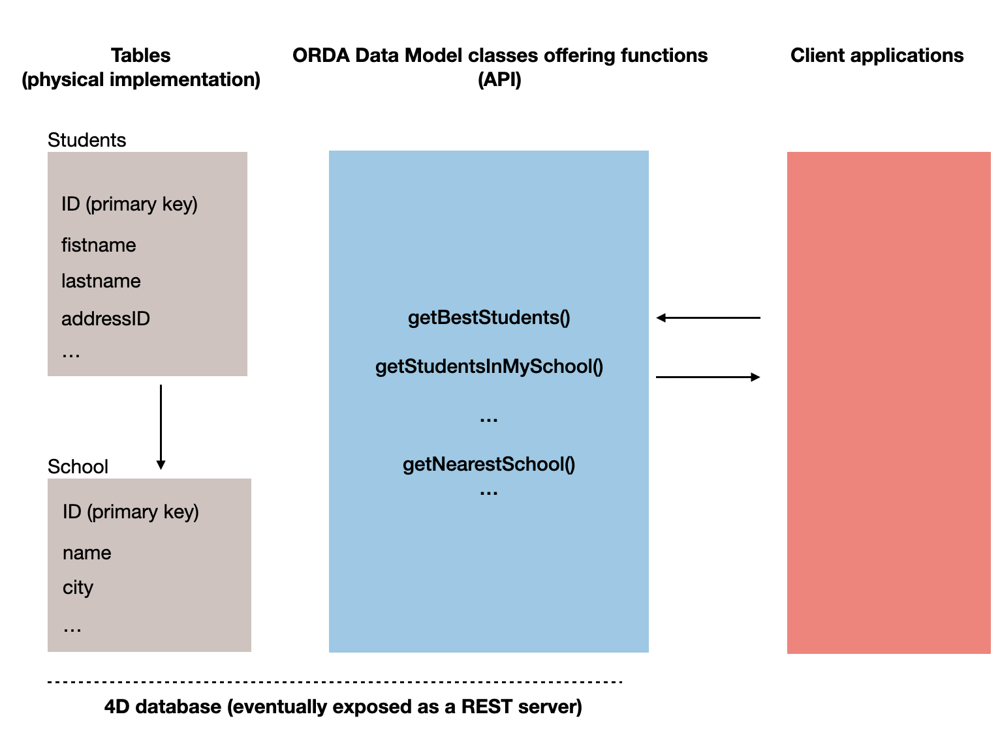
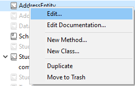

O ORDA permite-lhe criar funções de classe de alto nível acima do modelo de dados. Isto permite-lhe escrever código orientado para o negócio e "publicá-lo" tal como uma API. Datastore, classes de dados, seleções de entidades e entidades estão todos disponíveis como objetos de classe que podem conter funções.

Por ejemplo, podría crear una función `getNextWithHigherSalary()` en la clase `EmployeeEntity` para devolver los empleados con un salario superior al seleccionado. Seria tão simples como chamar:

```4d
$nextHigh:=ds. Employee.get(1).getNextWithHigherSalary()
```

Os desenvolvedores podem não só utilizar estas funções em datastores locais, mas também em arquiteturas cliente/servidor e remotas:

```4d
 //$cityManager é a referência de um datastore remoto
Form.comp.city:=$cityManager.City.getCityName(Form.comp.zipcode)
```

Graças a esta caraterística, toda a lógica comercial da sua aplicação 4D pode ser armazenada como uma camada independente para que possa ser facilmente mantida e reutilizada com um alto nível de segurança:

- É possível "esconder" a complexidade global da estrutura física subjacente e expor apenas funções compreensíveis e prontas a utilizar.

- Se a estrutura física evoluir, pode simplesmente adaptar o código da função e as aplicações cliente continuarão a chamá-las de forma transparente.

- Por defecto, todas las funciones de clase de su modelo de datos (incluidas las [funciones de atributo calculado](#computed-attributes-1)) y los [atributos alias](#alias-attributes-1) **no se exponen** a aplicaciones remotas y no se pueden llamar desde sol You must explicitly declare each public function and alias with the [`exposed`](#exposed-vs-non-exposed-functions) keyword.



Además, 4D [precrea automáticamente](#creating-classes) las clases para cada objeto del modelo de datos disponible.

## Arquitetura

ORDA ofrece **clases genéricas** expuestas a través del [class store](Concepts/classes.md#class-stores) **`4D`**, así como **clases usuario** (que extienden las clases genéricas) expuestas en el [class store](Concepts/classes.md#class-stores) **`cs`**:


Todas las clases de modelo de datos ORDA se exponen como propiedades del class store **`cs`**. Estão disponíveis as seguintes classes ORDA:

| Class                                       | Nome do exemplo                       | Instanciado por                                                                                                                                                                                                                                                                                                                                                                                                                                                                                                                                                                                                                                                                                                                                                                                                                                                        |
| ------------------------------------------- | ------------------------------------- | ---------------------------------------------------------------------------------------------------------------------------------------------------------------------------------------------------------------------------------------------------------------------------------------------------------------------------------------------------------------------------------------------------------------------------------------------------------------------------------------------------------------------------------------------------------------------------------------------------------------------------------------------------------------------------------------------------------------------------------------------------------------------------------------------------------------------------------------------------------------------- |
| cs. DataStore               | cs. DataStore         | [`ds`](API/DataStoreClass.md#ds) command                                                                                                                                                                                                                                                                                                                                                                                                                                                                                                                                                                                                                                                                                                                                                                                                                               |
| cs._DataClassName_          | cs. Employee          | [`dataStore.DataClassName`](API/DataStoreClass.md#dataclassname), `dataStore["DataClassName"]`                                                                                                                                                                                                                                                                                                                                                                                                                                                                                                                                                                                                                                                                                                                                                                         |
| cs._DataClassName_Entity    | cs. EmployeeEntity    | [`dataClass.get()`](API/DataClassClass.md#get), [`dataClass.new()`](API/DataClassClass.md#new), [`entitySelection.first()`](API/EntitySelectionClass.md#first), [`entitySelection.last()`](API/EntitySelectionClass.md#last), [`entity.previous()`](API/EntityClass.md#previous), [`entity.next()`](API/EntityClass.md#next), [`entity.first()`](API/EntityClass.md#first), [`entity.last()`](API/EntityClass.md#last), [`entity.clone()`](API/EntityClass.md#clone)                                                                                                                                                                                                                                                                                                                                                                                                   |
| cs._DataClassName_Selection | cs. EmployeeSelection | [`dataClass.query()`](API/DataClassClass.md#query), [`entitySelection.query()`](API/EntitySelectionClass.md#query), [`dataClass.all()`](API/DataClassClass.md#all), [`dataClass.fromCollection()`](API/DataClassClass.md#fromcollection), [`dataClass.newSelection()`](API/DataClassClass.md#newselection), [`entitySelection.drop()`](API/EntitySelectionClass.md#drop), [`entity.getSelection()`](API/EntityClass.md#getselection), [`entitySelection.and()`](API/EntitySelectionClass.md#and), [`entitySelection.minus()`](API/EntitySelectionClass.md#minus), [`entitySelection.or()`](API/EntitySelectionClass.md#or), [`entitySelection.orderBy()`](API/EntitySelectionClass.md#or), [`entitySelection.orderByFormula()`](API/EntitySelectionClass.md#orderbyformula), [`entitySelection.slice()`](API/EntitySelectionClass.md#slice), `Create entity selection` |

> Las clases usuario ORDA se almacenan como archivos de clase estándar (.4dm) en la subcarpeta Classes del proyecto [(ver más abajo)](#class-files).

Além disso, as instâncias de objetos das classes de usuárioes do modelo de dados ORDA beneficiam das propriedades e funções dos seus pais:

- un objeto de clase Datastore puede llamar las funciones de la [clase genérica ORDA Datastore](API/DataStoreClass.md).
- un objeto de clase Dataclass puede llamar las funciones de la [clase genérica ORDA Dataclass](API/DataClassClass.md).
- un objeto de clase Entity selection puede llamar las funciones de la [clase genérica ORDA Entity selection](API/EntitySelectionClass.md).
- un objeto de clase Entity puede llamar las funciones de la [clase genérica ORDA Entity](API/EntityClass.md).

## Descrição da classe

<details><summary>História</summary>

| Release | Mudanças                                                                                                                                                 |
| ------- | -------------------------------------------------------------------------------------------------------------------------------------------------------- |
| 19 R4   | Atributos alias na Entity Class                                                                                                                          |
| 19 R3   | Atributos calculados en la Entity Class                                                                                                                  |
| 18 R5   | As funções de classe do modelo de dados não são expostas ao REST por defeito. Nuevas palabras clave `exposed` y `local`. |

</details>

### Classe DataStore

Una base de datos 4D expone su propia clase DataStore en el class store `cs`.

- **Extends**: 4D.DataStoreImplementation
- **Nombre de clase**: cs.DataStore

Puede crear funciones en la clase DataStore que estarán disponibles a través del objeto `ds`.

#### Exemplo

```4d
// cs. DataStore class Class extends DataStoreImplementation Function getDesc
  $0:="Database exposing employees and their companies"
```

Esta função pode então ser chamada:

```4d
$desc:=ds.getDesc() //"Database exposing..."
```

### Classe DataClass

Cada tabla expuesta con ORDA ofrece una clase DataClass en el class store `cs`.

- **Extends**: 4D.DataClass
- **Nombre de clase**: cs._DataClassName_ (donde _DataClassName_ es el nombre de la tabla)
- **Ejemplo**: cs.Employee

#### Exemplo

```4D
// cs.Company class


Class extends DataClass

// Returns companies whose revenue is over the average
// Returns an entity selection related to the Company DataClass

Function GetBestOnes()
	$sel:=This.query("revenues >= :1";This.all().average("revenues"));
	$0:=$sel
```

Em seguida, pode obter uma seleção de entidades das "melhores" empresas através da execução:

```4d
	var $best : cs.CompanySelection
	$best:=ds.Company.GetBestOnes()
```

:::info

[Los atributos calculados](#computed-attributes) se definen en [la clase Entity](#entity-class).

:::

#### Exemplo com um datastore remoto

El catálogo _City_ siguiente está expuesto en un datastore remoto (vista parcial):


La clase `City` ofrece una API:

```4d
// cs.City class

Class extends DataClass

Function getCityName()
	var $1; $zipcode : Integer
	var $zip : 4D.Entity
	var $0 : Text

	$zipcode:=$1
	$zip:=ds.ZipCode.get($zipcode)
	$0:="" 

	If ($zip#Null)
		$0:=$zip.city.name
	End if
```

A aplicação cliente abre uma sessão no datastore remoto:

```4d
$cityManager:=Open datastore(New object("hostname";"127.0.0.1:8111");"CityManager")
```

Em seguida, uma aplicação cliente pode utilizar a API para obter a cidade correspondente a um código postal (por exemplo) a partir de um formulário:

```4d
Form.comp.city:=$cityManager.City.getCityName(Form.comp.zipcode)

```

### Classe EntitySelection

Cada tabla expuesta con ORDA ofrece una clase EntitySelection en el class store `cs`.

- **Extends**: 4D.EntitySelection
- **Nombre de clase**: _DataClassName_Selection (donde _DataClassName_ es el nombre de la tabla)
- **Ejemplo**: cs.EmployeeSelection

#### Exemplo

```4d
// cs.EmployeeSelection class


Class extends EntitySelection

//Extract the employees with a salary greater than the average from this entity selection 

Function withSalaryGreaterThanAverage() : cs.EmployeeSelection
	return This.query("salary > :1";This.average("salary")).orderBy("salary")

```

Em seguida, é possível obter empregados com um salário superior à média em qualquer seleção de entidade através da execução:

```4d
$moreThanAvg:=ds. Company.all().employees.withSalaryGreaterThanAverage()
```

:::info

[Los filtros de selección de entidades restringidas](entities.md#restricting-entity-selections) se definen en la clase de datos .

:::

### Entity Class

Cada tabla expuesta con ORDA ofrece una clase Entity en el class store `cs`.

- **Extends**: 4D.Entity
- **Nombre de clase**: _DataClassName_Entity (donde _DataClassName_ es el nombre de la tabla)
- **Ejemplo**: cs.CityEntity

#### Atributos calculados

Las clases Entity permiten definir **atributos calculados** utilizando palabras clave específicas:

- `Función get` _attributeName_
- `Función set` _attributeName_
- `Function query` _attributeName_
- `Función orderBy` _attributeName_

Para más información, consulte la sección [Atributos calculados](#computed-attributes-1).

#### Atributos de Alias

Las clases Entity permiten definir **atributos alias**, normalmente sobre atributos relacionados, utilizando la palabra clave `Alias`:

`Alias` _attributeName_ _targetPath_

Para más información, consulte la sección [Atributos alias](#alias-attributes-1).

#### Exemplo

```4d
// cs.CityEntity class

Class extends Entity

Function getPopulation() : Integer
    return This.zips.sum("population")


Function isBigCity(): Boolean
// The getPopulation() function is usable inside the class
	return This.getPopulation()>50000
```

Em seguida, pode chamar este código:

```4d
var $cityManager; $city : Object

$cityManager:=Open datastore(New object("hostname";"127.0.0.1:8111");"CityManager")
$city:=$cityManager.City.getCity("Caguas")

If ($city.isBigCity())
	ALERT($city.name + " is a big city")
End if
```

### Regras específicas

Ao criar ou editar classes de modelo de dados, é necessário preste atenção às seguintes regras:

- Dado que se utilizan para definir nombres de clase DataClass automáticos en el [class store](Concepts/classes.md#class-stores) **cs**, las tablas 4D deben nombrarse para evitar todo conflicto en el espacio de nombres **cs**. Em particular:
  - No dé el mismo nombre a una tabla 4D y a una [clase de usuarios](Concepts/classes.md#class-names). Se isso acontecer, o construtor da classe de utilizador torna-se inutilizável (o compilador emite um aviso).
  - Não use um nome reservado para uma tabela 4D (por exemplo, "DataClass").

- When defining a class, make sure the [`Class extends`](Concepts/classes.md#class-extends-classnameclass) statement exactly matches the parent class name (remember that they're case sensitive). Por ejemplo, `Class extends EntitySelection` para una clase de selección de entidades.

- No se puede instanciar un objeto de clase de modelo de datos con la palabra clave `new()` (se devuelve un error). You must use a regular method as listed in the [`Instantiated by` column of the ORDA class table](#architecture).

- No puede sobrescribir una función de clase ORDA nativa del [class store](Concepts/classes.md#class-stores) **`4D`** con una función de clase usuario de modelo de datos.

### Execução preventiva

Quando compiladas, as funções da classe do modelo de dados são executadas:

- en **procesos apropiativos o cooperativos** (dependiendo del proceso de llamada) en aplicaciones monopuesto,
- in **preemptive processes** in client/server applications (except if the [`local`](#local-functions) keyword is used, in which case it depends on the calling process like in single-user).

Se o seu projeto foi concebido para ser executado em cliente/servidor, certifique-se de que o código da função da classe do modelo de dados é thread-safe. Se o código thread-unsafe for chamado, será lançado um erro em tempo de execução (nenhum erro será lançado em tempo de compilação, uma vez que a execução cooperativa é suportada em aplicações de utilizador único).

## Atributos calculados

### Visão Geral

Um atributo computado é um atributo de classe de dados com um tipo de dados que oculta um cálculo. [Clases 4D estándar](Concepts/classes.md) implementa el concepto de propiedades calculadas con `get` (_getter_) y `set` (_setter_) [accessor functions](Concepts/classes.md#function-get-and-function-set). Los atributos de las clases de datos ORDA se benefician de esta funcionalidad y la extienden con dos funcionalidades adicionales: `query` y `orderBy`.

Como mínimo, un atributo calculado requiere una función `get` que describa cómo se calculará su valor. Cuando se suministra una función _getter_ para un atributo, 4D no crea el espacio de almacenamiento subyacente en el datastore sino que sustituye el código de la función cada vez que se accede al atributo. Se o atributo não for acessado, o código nunca é executado.

Un atributo calculado también puede implementar una función `set`, que se ejecuta cada vez que se asigna un valor al atributo. La función _setter_ describe qué hacer con el valor asignado, normalmente redirigiéndolo a uno o más atributos de almacenamiento o en algunos casos a otras entidades.

Al igual que los atributos de almacenamiento, los atributos calculados pueden incluirse en **búsquedas**. Como padrão, quando um atributo calculado for utilizado numa consulta ORDA, o atributo é calculado uma vez por entidade examinada. Em alguns casos, isto é suficiente. Sin embargo, para un mejor rendimiento, especialmente en cliente/servidor, los atributos calculados pueden implementar una función `query` que se basa en los atributos reales de la clase de datos y se beneficia de sus índices.

Del mismo modo, los atributos calculados pueden incluirse en **ordenaciones**. Quando um atributo calculado é utilizado numa ordenação ORDA, o atributo é calculado uma vez por entidade examinada. Al igual que en las búsquedas, los atributos calculados pueden implementar una función `orderBy` que sustituya a otros atributos durante la ordenación, aumentando así el rendimiento.

### Como definir atributos computados

You create a computed attribute by defining a `get` accessor in the [**entity class**](#entity-class) of the dataclass. O atributo computado estará automaticamente disponível nos atributos da classe de dados e nos atributos da entidade.

También pueden definirse en la clase entity otras funciones de atributos calculados (`set`, `query` y `orderBy`). São facultativos.

Within computed attribute functions, [`This`](Concepts/classes.md#this) designates the entity. Los atributos calculados pueden utilizarse y manejarse como cualquier atributo de dataclass, es decir, serán procesados por las funciones de [clase entity](API/EntityClass.md) o [clase entity selection](API/EntitySelectionClass.md).

> ORDA computed attributes are not [**exposed**](#exposed-vs-non-exposed-functions) by default. Para exponer un atributo calculado, añada la palabra clave `exposed` a la definición de la función \*\*get \*\*.

> **get and set functions** can have the [**local**](#local-functions) property to optimize client/server processing.

### `Function get <attributeName>`

#### Sintaxe

```4d
{local} {exposed} Function get <attributeName>({$event : Object}) -> $result : type
// code
```

La función _getter_ es obligatoria para declarar el atributo calculado _attributeName_. Cada vez que se accede al atributo _attributeName_, 4D evalúa el código `Function get` y devuelve el valor _$result_.

> Um atributo calculado pode utilizar o valor de outro(s) atributo(s) calculado(s). As chamadas recursivas geram erros.

La función _getter_ define el tipo de datos del atributo calculado gracias al parámetro _$result_. São permitidos os seguintes tipos de resultados:

- Scalar (text, boolean, date, time, number)
- Object
- Imagem
- BLOB
- Entity (i.e. cs. EmployeeEntity)
- Entity selection (i.e. cs. EmployeeSelection)

El parámetro _$event_ contiene las siguientes propiedades:

| Propriedade   | Tipo         | Descrição                                                                                                              |
| ------------- | ------------ | ---------------------------------------------------------------------------------------------------------------------- |
| attributeName | Text         | Nome do atributo computado                                                                                             |
| dataClassName | Text         | Nome do dataclass                                                                                                      |
| kind          | Text         | "get"                                                                                                                  |
| result        | Diferente de | Opcional. Adicione esta propriedade com o valor Null se pretender que um atributo escalar devolva Null |

#### Exemplos

- El campo calculado _fullName_:

```4d
Function get fullName($event : Object)-> $fullName : Text

  Case of 	
	: (This.firstName=Null) & (This.lastName=Null)
		$event.result:=Null //use result to return Null
	: (This.firstName=Null)
		$fullName:=This.lastName
	: (This.lastName=Null)
		$fullName:=This.firstName
	Else 
		$fullName:=This.firstName+" "+This.lastName
	End case 
```

- Um atributo calculado pode ser baseado num atributo relacionado com uma entidade:

```4d
Function get bigBoss($event : Object)-> $result: cs.EmployeeEntity
	$result:=This.manager.manager
    
```

- Um atributo calculado pode ser baseado num atributo relacionado com a seleção de uma entidade:

```4d
Function get coWorkers($event : Object)-> $result: cs.EmployeeSelection
    If (This.manager.manager=Null)
        $result:=ds.Employee.newSelection()
    Else 
        $result:=This.manager.directReports.minus(this)
    End if
```

### `Function set <attributeName>`

#### Sintaxe

```4d

{local} Function set <attributeName>($value : type {; $event : Object})
// code
```

La función _setter_ se ejecuta cada vez que se asigna un valor al atributo. Esta função processa normalmente o(s) valor(es) de entrada e o resultado é enviado entre um ou mais atributos.

El parámetro _$value_ recibe el valor asignado al atributo.

El parámetro _$event_ contiene las siguientes propiedades:

| Propriedade   | Tipo         | Descrição                              |
| ------------- | ------------ | -------------------------------------- |
| attributeName | Text         | Nome do atributo computado             |
| dataClassName | Text         | Nome do dataclass                      |
| kind          | Text         | "set"                                  |
| value         | Diferente de | Valor a tratar pelo atributo calculado |

#### Exemplo

```4d
Function set fullName($value : Text; $event : Object)
	var $p : Integer
    $p:=Position(" "; $value) 		
	This.firstname:=Substring($value; 1; $p-1)  // "" if $p<0
	This.lastname:=Substring($value; $p+1)
```

### `Function query <attributeName>`

#### Sintaxe

```4d
Function query <attributeName>($event : Object)
Function query <attributeName>($event : Object) -> $result : Text
Function query <attributeName>($event : Object) -> $result : Object
// code
```

Esta função suporta três sintaxes:

- Con la primera sintaxis, se maneja toda la consulta a través de la propiedad del objeto `$event.result`.
- Con la segunda y tercera sintaxis, la función devuelve un valor en _$result_:
  - Si _$result_ es un texto, debe ser una cadena de consulta válida
  - Si _$result_ es un Objeto, debe contener dos propiedades:
  | Propriedade                        | Tipo       | Descrição                                                                                                                             |
  | ---------------------------------- | ---------- | ------------------------------------------------------------------------------------------------------------------------------------- |
  | $result.query      | Text       | Cadeia de consulta válida com marcadores de posição (:1, :2, etc.) |
  | $result.parameters | Collection | valores para marcadores                                                                                                               |

La función `query` se ejecuta cada vez que se lanza una consulta que utiliza el atributo calculado. É útil personalizar e otimizar as consultas com base em atributos indexados. Cuando la función `query` no está implementada para un atributo calculado, la búsqueda es siempre secuencial (basada en la evaluación de todos los valores utilizando la función `get <AttributeName>`).

> The following features are not supported:
>
> - calling a `query` function on computed attributes of type Entity or Entity selection,
> - using the `order by` keyword in the resulting query string.

El parámetro _$event_ contiene las siguientes propiedades:

| Propriedade   | Tipo         | Descrição                                                                                                                                                                                                                                                                                                                                                                                                                                                                                                                                                                                                                                                                                                                                                      |
| ------------- | ------------ | -------------------------------------------------------------------------------------------------------------------------------------------------------------------------------------------------------------------------------------------------------------------------------------------------------------------------------------------------------------------------------------------------------------------------------------------------------------------------------------------------------------------------------------------------------------------------------------------------------------------------------------------------------------------------------------------------------------------------------------------------------------- |
| attributeName | Text         | Nome do atributo computado                                                                                                                                                                                                                                                                                                                                                                                                                                                                                                                                                                                                                                                                                                                                     |
| dataClassName | Text         | Nome do dataclass                                                                                                                                                                                                                                                                                                                                                                                                                                                                                                                                                                                                                                                                                                                                              |
| kind          | Text         | "query"                                                                                                                                                                                                                                                                                                                                                                                                                                                                                                                                                                                                                                                                                                                                                        |
| value         | Diferente de | Valor a tratar pelo atributo calculado                                                                                                                                                                                                                                                                                                                                                                                                                                                                                                                                                                                                                                                                                                                         |
| operator      | Text         | Query operator (see also the [`query` class function](API/DataClassClass.md#query)). Possible values:<li>== (equal to, @ is wildcard)</li><li>=== (equal to, @ is not wildcard)</li><li>!= (not equal to, @ is wildcard)</li><li>!== (not equal to, @ is not wildcard)</li><li>< (less than)</li><li><= (less than or equal to)</li><li>> (greater than)</li><li>>= (greater than or equal to)</li><li>IN (included in)</li><li>% (contains keyword)</li> |
| result        | Diferente de | Valor a tratar pelo atributo calculado. Pase `Null` en esta propiedad si desea que 4D ejecute la consulta por defecto (siempre secuencialmente para los atributos calculados).                                                                                                                                                                                                                                                                                                                                                                                                                                                                                                                              |

> Si la función devuelve un valor en _$result_ y se asigna otro valor a la propiedad `$event.result`, se da prioridad a `$event.result`.

#### Exemplos

- Búsqueda en el atributo calculado _fullName_.

```4d
Function query fullName($event : Object)->$result : Object

	var $fullname; $firstname; $lastname; $query : Text
	var $operator : Text
	var $p : Integer
	var $parameters : Collection

	$operator:=$event.operator
	$fullname:=$event.value

	$p:=Position(" "; $fullname) 
	If ($p>0)
		$firstname:=Substring($fullname; 1; $p-1)+"@"
		$lastname:=Substring($fullname; $p+1)+"@"
		$parameters:=New collection($firstname; $lastname) // two items collection
	Else 
		$fullname:=$fullname+"@"
		$parameters:=New collection($fullname) // single item collection
	End if 

	Case of 
	: ($operator="==") | ($operator="===")
		If ($p>0)
			$query:="(firstName = :1 and lastName = :2) or (firstName = :2 and lastName = :1)"
		Else 
			$query:="firstName = :1 or lastName = :1"
		End if 
	: ($operator="!=")
		If ($p>0)
			$query:="firstName != :1 and lastName != :2 and firstName != :2 and lastName != :1"
		Else 
			$query:="firstName != :1 and lastName != :1"
		End if 
	End case 

	$result:=New object("query"; $query; "parameters"; $parameters)
```

> Keep in mind that using placeholders in queries based upon user text input is recommended for security reasons (see [`query()` description](API/DataClassClass.md#query)).

Código de chamada, por exemplo:

```4d
$emps:=ds. Employee.query("fullName = :1"; "Flora Pionsin")
```

- Esta función gestiona las consultas sobre el atributo calculado _age_ y devuelve un objeto con parámetros:

```4d
Function query age($event : Object)->$result : Object
	
	var $operator : Text
	var $age : Integer
	var $_ages : Collection
	
	$operator:=$event.operator
			
	$age:=Num($event.value)  // integer
	$d1:=Add to date(Current date; -$age-1; 0; 0)
	$d2:=Add to date($d1; 1; 0; 0)
	$parameters:=New collection($d1; $d2)
	
	Case of 
			
		: ($operator="==")
			$query:="birthday > :1 and birthday <= :2"  // after d1 and before or egal d2
			
		: ($operator="===") 

			$query:="birthday = :2"  // d2 = second calculated date (= birthday date)

		: ($operator=">=")
			$query:="birthday <= :2"
			
			//... other operators			
			
			
	End case 
	
	
	If (Undefined($event.result))
		$result:=New object
		$result.query:=$query
		$result.parameters:=$parameters
	End if

```

Código de chamada, por exemplo:

```4d
// people aged between 20 and 21 years (-1 day)
$twenty:=people.query("age = 20")  // calls the "==" case

// people aged 20 years today
$twentyToday:=people.query("age === 20") // equivalent to people.query("age is 20") 

```

### `Function orderBy <attributeName>`

#### Sintaxe

```4d
Function orderBy <attributeName>($event : Object)
Function orderBy <attributeName>($event : Object)-> $result : Text

// code
```

La función `orderBy` se ejecuta siempre que sea necesario ordenar el atributo calculado. Permite ordenar o atributo calculado. Por ejemplo, puede ordenar _fullName_ en función de los nombres y luego de los apellidos, o a la inversa.
Cuando la función `orderBy` no está implementada para un atributo calculado, la ordenación es siempre secuencial (basada en la evaluación de todos los valores utilizando la función `get <AttributeName>`).

> **No se soporta** la llamada a una función `orderBy` sobre atributos calculados de tipo Entity class o Entity selection class.

El parámetro _$event_ contiene las siguientes propiedades:

| Propriedade   | Tipo         | Descrição                                                                                                                              |
| ------------- | ------------ | -------------------------------------------------------------------------------------------------------------------------------------- |
| attributeName | Text         | Nome do atributo computado                                                                                                             |
| dataClassName | Text         | Nome do dataclass                                                                                                                      |
| kind          | Text         | "orderBy"                                                                                                                              |
| value         | Diferente de | Valor a tratar pelo atributo calculado                                                                                                 |
| operator      | Text         | "desc" ou "asc" (padrão)                                                                                            |
| descending    | Parâmetros   | `true` para orden descendente, `false` para orden ascendente                                                                           |
| result        | Diferente de | Valor a tratar pelo atributo calculado. Pase `Null` si desea que 4D ejecute la ordenación por defecto. |

> Puede utilizar el `operator` o la propiedad `descending`. É essencialmente uma questão de estilo de programação (ver exemplos).

Puede devolver la cadena `orderBy` en la propiedad del objeto `$event.result` o en el resultado de la función _$result_. Si la función devuelve un valor en _$result_ y se asigna otro valor a la propiedad `$event.result`, se da prioridad a `$event.result`.

#### Exemplo

É possível escrever código condicional:

```4d
Function orderBy fullName($event : Object)-> $result : Text
    If ($event.descending=True)
        $result:="firstName desc, lastName desc" 
    Else 
        $result:="firstName, lastName" 
    End if
```

Também pode escrever código compacto:

```4d
Function orderBy fullName($event : Object)-> $result : Text
	$result:="firstName "+$event.operator+", "lastName "+$event.operator

```

O código condicional é necessário em alguns casos:

```4d
Function orderBy age($event : Object)-> $result : Text

    If ($event.descending=True)
        $result:="birthday asc" 
    Else 
        $result:="birthday desc" 
    End if

```

## Atributos de Alias

### Visão Geral

Un atributo **alias** se crea sobre otro atributo del modelo de datos, denominado **atributo de destino**. O atributo de destino pode pertencer a uma classe de dados relacionada (disponível através de qualquer número de níveis de relação) ou à mesma classe de dados. Um atributo de alias não armazena dados, mas sim o caminho para o seu atributo de destino. É possível definir tantos atributos de alias quanto se pretenda numa classe de dados.

Os atributos de alias (pseudônimo) são particularmente úteis para tratar relações N para N. Proporcionam maior legibilidade e simplicidade no código e nas consultas, permitindo basear-se em conceitos comerciais em vez de pormenores de implementação.

### Como definir atributos alias

You create an alias attribute in a dataclass by using the `Alias` keyword in the [**entity class**](#entity-class) of the dataclass.

### `Alias <attributeName> <targetPath>`

#### Sintaxe

```
{exposed} Alias <attributeName> <targetPath>
```

_attributeName_ debe cumplir las [reglas estándar para nombres de propiedades](../Concepts/identifiers.md#object-properties).

_targetPath_ es una ruta atributo que contiene uno o más niveles, como "employee.company.name". Si el atributo de destino pertenece a la misma clase de datos, _targetPath_ es el nombre del atributo.

Um alias pode ser utilizado como parte de um caminho de outro alias.

Un [atributo calculado](#computed-attributes-1) puede utilizarse en una ruta alias, pero sólo como último nivel de la ruta; de lo contrario, se devuelve un error. Por exemplo, se "fullName" for um atributo computado, é válido um alias com o caminho "employee.fullName".

> Los atributos alias de ORDA por defecto son **no expuestos**. You must add the [`exposed`](#exposed-vs-non-exposed-functions) keyword before the `Alias` keyword if you want the alias to be available to remote requests.

### Utilizar atributos alias

Os atributos de alias são apenas de leitura (exceto quando baseados num atributo escalar da mesma classe de dados, ver o último exemplo abaixo). Podem ser utilizados em vez do caminho do atributo de destino em funções de classe como:

| Function                                       |
| ---------------------------------------------- |
| `dataClass.query()`, `entitySelection.query()` |
| `entity.toObject()`                            |
| `entitySelection.toCollection()`               |
| `entitySelection.extract()`                    |
| `entitySelection.orderBy()`                    |
| `entitySelection.orderByFormula()`             |
| `entitySelection.average()`                    |
| `entitySelection.count()`                      |
| `entitySelection.distinct()`                   |
| `entitySelection.sum()`                        |
| `entitySelection.min()`                        |
| `entitySelection.max()`                        |
| `entity.diff()`                                |
| `entity.touchedAttributes()`                   |

> Tenha em atenção que os atributos alias são calculados no servidor. Em configurações remotas, a atualização de atributos de alias em entidades requer que as entidades sejam recarregadas a partir do servidor.

### Propriedades alias

Alias attribute [`kind`](../API/DataClassClass.md#attributename) is "alias".

An alias attribute inherits its data [`type`](../API/DataClassClass.md#attributename) property from the target attribute:

- if the target attribute [`kind`](../API/DataClassClass.md#attributename) is "storage", the alias data type is of the same type,
- if the target attribute [`kind`](../API/DataClassClass.md#attributename) is "relatedEntity" or "relatedEntities", the alias data type is of the `4D.Entity` or `4D.EntitySelection` type ("_classname_Entity" or "_classname_Selection").

Alias attributes based upon relations have a specific [`path`](../API/DataClassClass.md#attributename) property, containing the path of their target attributes. Los atributos de alias basados en atributos de la misma clase de datos tienen las mismas propiedades que sus atributos de destino (y ninguna propiedad `path`).

### Exemplos

Considerando o seguinte modelo:


Na classe de dados Teacher, um atributo alias devolve todos os alunos de um professor:

```4d
// cs.TeacherEntity class

Class extends Entity

Alias students courses.student //relatedEntities 
```

Na classe de dados Student, um atributo alias devolve todos os professores de um aluno:

```4d
// cs.StudentEntity class

Class extends Entity

Alias teachers courses.teacher //relatedEntities 
```

Na classe de dados Curso:

- um atributo alias devolve outra etiqueta para o atributo "name".
- um atributo alias devolve o nome do professor
- um atributo alias devolve o nome do aluno

```4d
// cs.CourseEntity class

Class extends Entity

Exposed Alias courseName name //scalar 
Exposed Alias teacherName teacher.name //scalar value
Exposed Alias studentName student.name //scalar value

```

Em seguida, é possível executar as seguintes consultas:

```4d
// Find course named "Archaeology"
ds. Course.query("courseName = :1";"Archaeology")

// Find courses given by the professor Smith
ds. Course.query("teacherName = :1";"Smith")

// Find courses where Student "Martin" assists
ds. Course.query("studentName = :1";"Martin")

// Find students who have M. Smith as teacher 
ds. Student.query("teachers.name = :1";"Smith")

// Find teachers who have M. Martin as Student
ds. Teacher.query("students.name = :1";"Martin")
// Note that this very simple query string processes a complex 
// query including a double join, as you can see in the queryPlan:   
// "Join on Table : Course  :  Teacher.ID = Course.teacherID,    
//  subquery:[ Join on Table : Student  :  Course.studentID = Student.ID,
//  subquery:[ Student.name === Martin]]"
```

También puede editar el valor del alias _courseName_:

```4d
// Rename a course using its alias attribute
$arch:=ds. Course.query("courseName = :1";"Archaeology")
$arch.courseName:="Archaeology II"
$arch.save() //courseName and name are "Archaeology II"
```

## Funções expostas vs não expostas

Por razones de seguridad, todas sus funciones de clase de modelo de datos y atributos de alias son **no expuestas** (es decir, privadas) por defecto a peticiones remotas.

Os pedidos remotos incluem:

- Las peticiones enviadas por las aplicaciones 4D remotas conectadas a través de `Open datastore`
- Pedidos REST

> Os pedidos regulares de cliente/servidor 4D não são afetados. As funções de classe do modelo de dados estão sempre disponíveis nesta arquitetura.

Uma função que não esteja exposta não está disponível em aplicações remotas e não pode ser chamada em qualquer instância de objeto a partir de um pedido REST. Se uma aplicação remota tentar aceder a uma função não exposta, é devolvido o erro "-10729 - Método de membro desconhecido".

Para permitir que una función de clase de modelo de datos sea llamada por una petición remota, debe declararla explícitamente utilizando la palabra clave `exposed`. A sintaxe formal é:

```4d
// declare an exposed function
exposed Function <functionName>   
```

> La palabra clave `exposed` sólo puede utilizarse con las funciones de clase del modelo de datos. Si se utiliza con una función de [ clase usuario estándar](Concepts/classes.md), se ignora y el compilador devuelve un error.

### Exemplo

Se quiser que uma função exposta utilize uma função privada numa classe de dataclass:

```4d
Class extends DataClass

//Public function
exposed Function registerNewStudent($student : Object) -> $status : Object

var $entity : cs.StudentsEntity

$entity:=ds.Students.new()
$entity.fromObject($student)
$entity.school:=This.query("name=:1"; $student.schoolName).first()
$entity.serialNumber:=This.computeSerialNumber()
$status:=$entity.save()

//Not exposed (private) function
Function computeIDNumber()-> $id : Integer
//compute a new ID number
$id:=...

```

Quando o código é chamado:

```4d
var $remoteDS; $student; $status : Object
var $id : Integer

$remoteDS:=Open datastore(New object("hostname"; "127.0.0.1:8044"); "students")
$student:=New object("firstname"; "Mary"; "lastname"; "Smith"; "schoolName"; "Math school")

$status:=$remoteDS.Schools.registerNewStudent($student) // OK
$id:=$remoteDS.Schools.computeIDNumber() // Error "Unknown member method" 
```

## Funções locais

Por defecto en la arquitectura cliente/servidor, las funciones de modelo de datos ORDA se ejecutan **en el servidor**. Normalmente, proporciona o melhor desempenho, uma vez que apenas o pedido de função e o resultado são enviados através da rede.

No entanto, pode acontecer que uma função seja totalmente executável no lado do cliente (por exemplo, quando processa dados que já estão na cache local). En este caso, puede ahorrar peticiones al servidor y, de este modo, mejorar el rendimiento de la aplicación insertando la palabra clave `local`. A sintaxe formal é:

```4d
// declare a function to execute locally in client/server
local Function <functionName>   
```

Com esta palavra-chave, a função será sempre executada no lado do cliente.

> La palabra clave `local` sólo puede utilizarse con las funciones de clase del modelo de datos. Si se utiliza con una función de [ clase usuario estándar](Concepts/classes.md), se ignora y el compilador devuelve un error.

Note-se que a função funcionará mesmo que eventualmente seja necessário aceder ao servidor (por exemplo, se a cache ORDA tiver expirado). No entanto, é altamente recomendável certificar-se de que a função local não acede a dados no servidor, caso contrário a execução local não poderá trazer qualquer benefício em termos de desempenho. Uma função local que gera muitos pedidos ao servidor é menos eficiente do que uma função executada no servidor que apenas devolveria os valores resultantes. Por exemplo, considere a seguinte função na classe de entidade Escolas:

```4d
// Get the youngest students  
// Inappropriate use of local keyword
local Function getYoungest
	var $0 : Object
    $0:=This.students.query("birthDate >= :1"; !2000-01-01!).orderBy("birthDate desc").slice(0; 5)
```

- **sin** la palabra clave `local`, el resultado se da utilizando una única petición
- **con** la palabra clave `local`, son necesarias 4 peticiones: una para obtener la entidad Schools, una para la `query()`, una para la `orderBy()`, y una para la `slice()`. En este ejemplo, el uso de la palabra clave `local` es inapropiado.

### Exemplos

#### Cálculo da idade

Dada una entidad con un atributo _birthDate_, queremos definir una función `age()` que sería llamada en un list box. Esta função pode ser executada no cliente, o que evita desencadear um pedido ao servidor para cada linha da caixa de listagem.

En la classe _StudentsEntity_:

```4d
Class extends Entity

local Function age() -> $age: Variant

If (This.birthDate#!00-00-00!)
    $age:=Year of(Current date)-Year of(This.birthDate)
Else 
    $age:=Null
End if
```

#### Verificação de atributos

Pretendemos verificar a consistência dos atributos de uma entidade carregada no cliente e actualizada pelo utilizador antes de solicitar ao servidor que os guarde.

En la clase _StudentsEntity_, la función local `checkData()` verifica la edad del estudiante:

```4d
Class extends Entity

local Function checkData() -> $status : Object

$status:=New object("success"; True)
Case of
    : (This.age()=Null)
        $status.success:=False
        $status.statusText:="The birthdate is missing" 

    :((This.age() <15) | (This.age()>30) )
        $status.success:=False
        $status.statusText:="The student must be between 15 and 30 - This one is "+String(This.age())
End case
```

Código de chamada:

```4d
var $status : Object

//Form.student is loaded with all its attributes and updated on a Form
$status:=Form.student.checkData()
If ($status.success)
    $status:=Form.student.save() // call the server End if
```

## Support in 4D projects

### Ficheiros de classe (class files)

Una clase usuario ORDA del modelo de datos se define añadiendo, en la [misma ubicación que los archivos de clase usuarles](Concepts/classes.md#class-files) (_es decir_ en la carpeta `/Sources/Classes` de la carpeta proyecto), un archivo .4dm con el nombre Por ejemplo, una clase de entidad para la dataclass `Utilities` se definirá a través de un archivo `UtilitiesEntity.4dm`.

### Criação de classes

4D pré-criou automaticamente classes vazias na memória para cada objeto de modelo de dados disponível.


> Por padrão, as classes ORDA vazias não são exibidas no Explorer. To show them you need to select **Show all data classes** from the Explorer's options menu:
> 

As classes de utilizadores ORDA têm um ícone diferente das classes normais. As classes vazias são escurecidas:


Para criar um arquivo de classe ORDA, basta fazer duplo clique na classe predefinida correspondente no Explorador. 4D crea el archivo de clase y añade el código `extends`. Por exemplo, para uma classe Entity:

```
Class extends Entity
```

Quando uma classe for definida, o seu nome deixa de estar obscurecido no Explorador.

### Edição de classes

Para abrir una clase ORDA definida en el editor de código 4D, seleccione o haga doble clic en el nombre de una clase ORDA y utilice **Editar...** en el menú contextual/menú de opciones de la ventana del Explorador:



Para las clases ORDA basadas en el datastore local (`ds`), puede acceder directamente al código de la clase desde la ventana de estructura 4D:


### Editor de método

No Editor de Código 4D, as variáveis digitadas como uma classe ORDA se beneficiam automaticamente das características de autocompletar. Exemplo com uma variável de classe Entity:


