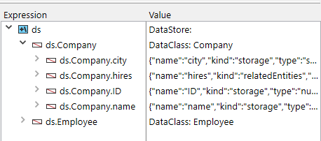

Uma vez que o ORDA é baseado em objectos, a sua utilização requer conhecimentos básicos de programação de objectos.

## Explorar o datastore

The ORDA datastore is automatically based upon a 4D database structure, provided it complies with the [ORDA prerequisites](overview.md#orda-prerequisites).

Este exemplo utilizará a seguinte estrutura de banco de dados 4D simple:


To know what is exposed as the datastore, create a new project method, write the following line:

```code4d
TRACE
```

Executar o método: ele chama simplesmente a janela do depurador.
In the Expression area, double-click to insert an expression and enter `ds`. Devolve o objeto do datastore.
Deploy the object, you can see that tables and fields are automatically exposed by ORDA as properties of the `ds` object:



It means for example that, whenever you need to refer to the city field of the [Company] table, in ORDA you just need to write:

```code4d
ds. Company.city //returns the name of the city
```

> In the ORDA world, ds.Company is a **dataclass**. ds.Company.city is an **attribute**.

> ORDA e sensíveis às maiúsculas e minúsculas. `ds.company.city` will not refer to the ds.Company.city attribute.

You have also noticed the extra `hires` property in the ds.Company dataclass. Não corresponde a um campo. `hires` is actually the name of the _One to many_ relation between Company and Employee:


_Name of the relation as defined in the Inspector_

It means that, whenever you need to access the list of employees working for a company, in ORDA you just need to write:

```code4d
ds. Company.hires //returns the list of employees
```

Mas não vá demasiado depressa. Vejamos agora como registar dados em dataclasses ORDA.

## Adicionar dados

In ORDA, you can add a record to a dataclass using the `new()` command.

> In the ORDA world, a record is an **entity** -- an entity is itself an object. A command that is attached to a specific object is called a **member method**.

```code4d
$entity:=ds. Company.new() //create a new entity reference
//in the Company dataclass  
//and assign it to the $entity variable
```

A new entity object contains a "copy" of all attributes of its parent dataclass, thus you can assign values to them:

```code4d
$entity.name:="ACME, inc."  
$entity.city:="London"  
//$entity.ID is automatically filled
```

Atualmente, a entidade só existe na memória. To store it in the data file, you need to save it using the `save()` member method:

```code4d
$status:=$entity.save()
```
