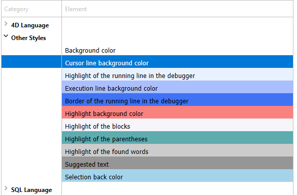
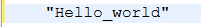
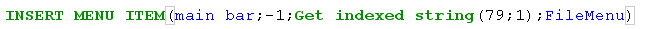

Esta página contém parâmetros que definem a interface do Editor de código e a sua visualização predefinida, bem como opções relativas ao seu funcionamento. Está dividida em duas secções às quais se acede através dos separadores Tema e Opções.

## Temas

Esta página permite selecionar, criar ou configurar temas do Editor de código. Um tema define a fonte, o tamanho da fonte, as cores e os estilos dos itens apresentados no editor de código.

### Lista de temas

Nesta lista, seleciona o tema a aplicar ao editor de código. São apresentados todos os temas disponíveis, incluindo os temas personalizados (se existirem). 4D fornece dois temas por padrão:

- **Tema Light predefinido**
- **Tema escuro predefinido**

> Os temas padrão não podem ser modificados ou eliminados.

Un tema **myTheme** se añade automáticamente si ya ha personalizado los estilos del Editor de Código en versiones anteriores de 4D.

### Criar temas personalizados

É possível criar temas que podem ser totalmente personalizados. Para crear un tema, seleccione un tema existente y haga clic en el **+** en la parte inferior de la lista de temas. También puede añadir temas personalizados copiando los archivos de temas en la carpeta `4D Editor Themes` (ver más abajo).

### Ficheiros de temas personalizados

Cada tema personalizado se almacena en un único archivo JSON llamado _themeName.json_. Los archivos JSON de los temas personalizados se almacenan en la carpeta `4D Editor Themes` situada en el mismo nivel que el [archivo de preferencias](overview.md#stora

Si los valores de las teclas no se definen en un tema personalizado, se ajustan por defecto a los valores del tema _Default Light Theme_. Si un archivo de tema JSON es inválido, se carga el tema _Default Light Theme_ y se genera un error.

> Quando um ficheiro de tema é modificado por um editor externo, 4D deve ser reiniciado para considerar a(s) modificação(ões).

## Definição do tema

Definir um tema significa:

- definir um tipo de letra e um tamanho de letra globais para todo o editor de código,
- atribuir estilos e cores específicos a cada elemento da linguagem 4D (campos, tabelas, variáveis, parâmetros, SQL, etc.), elemento da linguagem SQL (palavras-chave, funções, etc.) e fundos de cor.

A combinação de cores e estilos diferentes é particularmente útil para manutenção do código.

### Tipo e tamanho de letra

Los menús **fuente** y **tamaño de fuente** le permiten seleccionar el nombre y el tamaño de la fuente utilizada en el área de entrada del Editor de código para todas las categorías.

### Linguagem 4D e Linguagem SQL

Pode definir estilos de letra e cores diferentes (cor da letra ou cor de fundo) cada tipo de elemento de linguagem. Pode selecionar o(s) elemento(s) a personalizar na lista Categoria.

### Outros estilos

Essas opções configuram as várias cores usadas nas interfaces do Editor de código e do depurador.

|                                                | Descrição                                                                                                                                                                                                    |
| ---------------------------------------------- | ------------------------------------------------------------------------------------------------------------------------------------------------------------------------------------------------------------ |
| **Cor de fundo**                               | Cor de fundo da janela do editor de código.                                                                                                                                                  |
| **Borda da linha em execução no depurador**    | Color del borde que rodea la línea que se está ejecutando en el depurador cuando la opción "Resaltar la línea en ejecución" está activada en la página [Opciones](#options).                 |
| **Cor de fundo da linha do cursor**            | Cor de fundo da linha que contém o cursor.                                                                                                                                                   |
| **Cor de fundo da linha de execução**          | Cor de fundo da linha que está a ser executada no depurador.                                                                                                                                 |
| **Destaque das palavras encontradas**          | Cor de destaque das palavras encontradas numa pesquisa.                                                                                                                                      |
| **Destaque dos parênteses**                    | Color de resaltado de los paréntesis correspondientes (se utiliza cuando los pares de paréntesis se señalan mediante resaltado, ver [Opciones](#options)).                |
| **Destaque dos blocos**                        | Color de resaltado de los bloques lógicos seleccionados cuando la opción "Resaltar bloques lógicos" está activada en las [Opciones](#options).                                               |
| **Realce da mesma variável ou campo**          | Color de resaltado para las otras ocurrencias de la misma variable o del mismo texto de campo cuando una de las opciones "Resaltar variables y texto" está activada en [Opciones](#options). |
| **Destaque da linha em execução no depurador** | Color de resaltado de la línea que se está ejecutando en el depurador cuando la opción "Resaltar línea en ejecución" está activada en [Opciones](#options).                                  |
| **Cor de fundo da seleção**                    | Cor de fundo da seleção.                                                                                                                                                                     |
| **Texto sugerido**                             | Cor do texto do preenchimento automático sugerido pelo Editor de código.                                                                                                                     |

## Opções

Esta página configura as opções de exibição do Editor de código.

### Opções

#### Linguagem de programação 4D (Use os parâmetros regionais do sistema)

Permite-lhe desativar/ativar os parâmetros do código "internacional" para a aplicação 4D local.

- **no seleccionado** (por defecto): los parámetros English-US y el lenguaje de programación inglés se utilizan en los métodos 4D.
- **seleccionado**: los parámetros regionales se utilizan en los métodos 4D.

> Se modificar esta opção, tem de reiniciar a aplicação 4D para que a alteração seja tida em conta.

#### Indentação

Altera o valor de indentação do código 4D no editor de código. A largura deve ser especificada em pontos (10 por defeito).

O código 4D é automaticamente indentado para revelar a sua estrutura:

A modificação deste valor predefinido pode ser útil se os seus métodos contiverem algoritmos complexos com muitos níveis de incorporação. Pode ser utilizada uma indentação mais estreita para limitar a deslocação horizontal.

#### Mostrar los números de línea

Permite-lhe apresentar os números de linha por padrão em cada janela do Editor de código. Também pode mostrar/ocultar números de linha para a janela atual diretamente a partir do Editor de código.

#### Mostrar as listas

Lets you choose whether or not to show the lists of objects (Commands, Tables and fields, etc.) by default when the Code Editor window is opened. Também é possível mostrar ou ocultar cada lista diretamente a partir do Editor de código.

#### Mostrar pranchetas

Permite-lhe escolher se quer ou não mostrar as várias pranchetas no editor de código.

Los correspondientes [atajos al portapapeles](https://doc.4d.com/4Dv19R3/4D/19-R3/Writing-a-method.300-5612559.en.html#3977166) siguen activos cuando estos portapapeles están ocultos.

#### Destacar os blocos lógicos

Quando marcada, todo o código pertencente a um bloco lógico (If/End if, por exemplo) é realçado quando o rato é colocado sobre o nó expandido:

El color de resaltado se puede definir en la página [Tema](#theme-definition).

#### Mostrar sempre as linhas de bloco

Oculta permanentemente as linhas verticais dos blocos. As linhas de bloco são concebidas para ligar visualmente os nós. Por padrão, são sempre apresentados (exceto quando os ícones de recolher/expandir estão ocultos, ver abaixo).

#### Ocultar ícones recolher/expandir

Permite-lhe ocultar todos os ícones de expansão/recolhimento por padrão ao apresentar o código. Quando a opção está selecionada, os ícones dos nós (bem como as linhas de bloco locais, ver acima) são apresentados temporariamente quando o rato é colocado sobre um nó:

#### Inserir () e fechar } ) ] "

Permite a inserção automática de () e de chaves de fecho durante a escrita de código. Esta opção controla duas funcionalidades automáticas:

- **par de paréntesis ()<**: se añade después de un comando 4D, una palabra clave o un método proyecto insertado desde una lista de sugerencias o de finalización, si el elemento insertado requiere uno o más argumentos obligatorios. Por exemplo, se escrever "C_OB" e pressionar Tab, 4D escreve "C_OBJECT()" e coloca o ponto de inserção dentro do ().

- **cierre }, ), ], o "**: caracter que se añade al escribir respectivamente una apertura {, (, ], o ". Esta função permite inserir pares de símbolos correspondentes no ponto de inserção ou à volta de um texto selecionado. Por exemplo, se realçar uma cadeia de caracteres e escrever um único ", toda a cadeia de caracteres selecionada será colocada entre "":

\

#### Correspondência \[]\(){}

Define a sinalização gráfica das chaves correspondentes no código. Esta sinalização aparece sempre que é selecionado um parêntese quadrado, parêntese ou parêntese curvo.
As opções abaixo estão disponíveis:

- **Ninguno**: sin señales
- **Retângulo** (padrão): braces cercadas por uma linha preta\
  
- **Color de fondo**: corchetes resaltados (el color se define en la página [Tema](#Teme-definition)).
- **Negrita**: las llaves aparecen en negrita.

#### Destaque de variáveis e campos

Permite destacar todas as ocorrências da mesma variável ou campo numa janela de método aberta.

- **No**(por defecto): no resaltado
- **Con cursor**: todas las ocurrencias se destacan cuando se hace clic en el texto
- **Al seleccionar**: se resaltan todas las ocurrencias cuando se selecciona el texto

El color de resaltado se puede definir en la página [Tema](#theme-definition).

#### Depurar (Destacar a linha em execução)

Destaca a linha que está atualmente em execução no depurador, para além do indicador de seta amarela normal.

Se anular a seleção desta opção, só é mostrada a seta amarela.

### Sugestões

Esta área permite-lhe configurar os mecanismos de preenchimento automático no Editor de código para o adaptar aos seus próprios hábitos de trabalho.

|                               | Descrição                                                                                                                                                                                                                                                                                                                                                                                                                                                                                                                                                                                                                                                                                                                                                                                                                                                                                                                                                                                                                                                                                                                   |
| ----------------------------- | --------------------------------------------------------------------------------------------------------------------------------------------------------------------------------------------------------------------------------------------------------------------------------------------------------------------------------------------------------------------------------------------------------------------------------------------------------------------------------------------------------------------------------------------------------------------------------------------------------------------------------------------------------------------------------------------------------------------------------------------------------------------------------------------------------------------------------------------------------------------------------------------------------------------------------------------------------------------------------------------------------------------------------------------------------------------------------------------------------------------------- |
| Abertura automática da janela | Triggers the automatic display of the suggestion window for:<ul><li>Constants</li><li>Variables (local and interprocess) and object attributes</li><li>Tables</li><li>Prototypes (_i.e._, class functions)</li></ul>
For example, when the "Variables (local or interprocess) and object attributes" option is checked, a list of suggestions appears when you type the $ character:

 You can disable this functioning for certain elements of the language by deselecting their corresponding option.                                                                                                                                                                                                                                                                                                                                                                                                            |
| Validação de uma sugestão     | Sets the entry context that allows the Code Editor to validate automatically the current suggestion displayed in the autocomplete window.<ul><li>**Tab and delimiters** When this option is selected, you can validate the current selection with the Tab key or any delimiter that is relevant to the context. Por exemplo, se introduzir "ALE" e depois "(", 4D escreve automaticamente "ALERT(" no editor. Here is the list of delimiters that are taken into account:  ( ; : = < [ {</li><li>**Tab only** When this option is selected, you can only use the Tab key to insert the current suggestion. This can be used more particularly to facilitate the entry of delimiter characters in element names, such as ${1}.**Note**: You can also double-click in the window or press the Carriage return key to validate a suggestion.</li></ul> |
