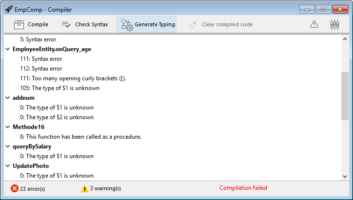

Você pode compilar seus projetos, ou seja, traduzir todos os seus métodos para a linguagem da máquina. Compilar um projeto permite que você verifique a consistência do código e acelere a sua execução, Além de tornar possível ofuscar o código na sua totalidade. A compilação constitui um passo indispensável entre o desenvolvimento de projetos que utilizam o 4D e a sua implantação como aplicações isoladas.

## Compilar

A compilação é tratada da sua aplicação 4D e é inteiramente automática.

> En macOS, la compilación requiere que instale `Xcode`. Consulte [esta sección](#silicon-compiler) para obtener más información sobre este requisito.

1. Abra la ventana de compilación seleccionando el comando **Compilador...** en el menú **Diseño** o el botón **Compilador** de la barra de herramientas.

 

 

> También puede lanzar directamente la compilación seleccionando el elemento de menú **Iniciar compilación** en el menú **Diseño**.

2. Haga clic en el botón **Compilar** para lanzar la compilación utilizando los [parámetros ded compilación](#compiler-settings) actuales.

Se nenhum erro for detectado, a compilação atual começa e a mensagem "Compilação com sucesso" é exibida na parte inferior da janela quando a compilação é concluída:


Puede inmediatamente [ejecutar su aplicación en modo compilado](#run-compiled) y ver lo rápido que es.

Se erros forem detectados, o processo é interrompido e a mensagem "Compilação falhou" é exibida. A área de informação da janela exibe os nomes de métodos e números de linha envolvidos em uma lista hierárquica:



Clique duas vezes em cada erro detectado para abrir o método ou a classe em questão diretamente no Editor de Código 4D. A linha que contém o erro é destacada e o tipo de erro é exibido na área de sintaxe da janela.

Utilice los comandos **Error anterior** / **Error siguiente** del menú **Método** para navegar de un error a otro.

O número de erros encontrados durante as suas primeiras compilações podem ser um desafio, mas não deixe isso te avisar. Logo você descobrirá que eles muitas vezes nascem da mesma fonte, ou seja, não conformidade com certas convenções do projeto. El compilador siempre ofrece un [diagnóstico preciso](#error-file) de los errores para ayudarle a corregirlos.

> A compilação requer uma licença adequada. Sem esta licença, não é possível realizar uma compilação (os botões estão desativados). No entanto, ainda é possível verificar a sintaxe e gerar métodos de digitação.

## Executar a compilação

Una vez compilado un proyecto, es posible pasar del [modo interpretado al modo compilado](Concepts/interpreted.md), y viceversa, en cualquier momento y sin tener que salir de la aplicación 4D (excepto cuando se ha eliminado el código interpretado). Para ello, utilice los comandos **Reiniciar en interpretado** y **Reiniciar en compilado** del menú **Ejecución**. La [caja de diálogo de apertura del proyecto](GettingStarted/creating.md#options) también ofrece elegir entre el modo interpretado o compilado para iniciar la base de datos.

Quando você alternar de um modo para o outro, a 4D fecha o modo atual e abre o novo. Isto é equivalente a sair e reabrir a aplicação. Cada vez que se cambia de un modo a otro, 4D ejecuta los dos métodos base siguientes (si se especifican) en este orden: `On Exit` -> `On Startup`.

Se você modificar seu projeto em modo interpretado, é necessário recompilá-lo para que suas edições sejam consideradas no modo compilado.

## Características da janela do compilador

Além do botão [**Compilar**](#compilar), a janela Compilador oferece recursos adicionais que são úteis durante a fase de desenvolvimento do projeto.

### Verificar sintaxe

El botón **Verificar la sintaxis** lanza la ejecución de la fase de verificación de la sintaxis. No final do processo de verificação, todos os erros detectados são listados na área de informações. You can double–click on an error line in order to display the corresponding method or form object.

El control sintáctico también puede lanzarse directamente con el comando **Verificar sintaxis** asociado al botón de la barra de herramientas **Compilador**. Esta é a única opção disponível se você não tiver uma licença adequada para permitir a compilação de aplicações.

### Gerar digitação

:::info Compatibidade

This button is only displayed in converted projects if the **All variables are typed (Direct typing)** [compilation path option](#enabling-direct-typing) is not selected. Para informações sobre este botão, consulte a [documentação de versões 4D anteriores](../Project/compiler.md#generate-typing).

:::

### Limpar código compilado

El botón **Borrar el código compilado** borra el código compilado del proyecto. Al hacer clic en él, se borra todo el [código generado durante la compilación](#classic-compiler), se desactiva el comando **Reiniciar compilado** del menú **Ejecutar** y la opción "Proyecto compilado" no está disponible al inicio.

### Mostrar/ocultar avisos

Você pode alternar a exibição de [warnings](#warnings) na janela do Compilador clicando no botão **Mostrar/Esconder Warnings**:


Quando essa opção for marcada, os avisos (se houver) são exibidos na janela, após os outros tipos de erro. Estas aparecem em itálico:


Um duplo clique num aviso abre o método correspondente.

## Parâmetros do compilador

The "Compiler" tab of the Settings dialog box lets you set parameters related to project compilation. Puede abrir directamente esta página desde la [ventana del compilador](#compiler-window) haciendo clic en el botón **Parámetros del compilador**:


### Opções de compilação

Essa área agrupa as opções genéricas usadas durante o processo de compilação.

#### Gerar o arquivo de símbolo

Used to generate the error file (see [error file](#symbol-file)) at the time of syntax checking. Used to generate the symbol file (see [symbol file](#symbol-file)).

#### Gerar ficheiro de erros

Se utiliza para generar el archivo de errores (ver [archivo de errores](#error-file)) en el momento del control sintáctico. El archivo de error se crea en la [carpeta Logs](Project/architecture.md#logs) del proyecto con el nombre `ProjectName_errors.xml`.

#### Objectivo de compilação

<details><summary>História</summary>

| Release | Mudanças   |
| ------- | ---------- |
| 19      | Adicionado |

</details>

Este parâmetro permite selecionar a família de processadores para a qual seu projeto 4D deve ser compilado nativamente. O compilador 4D pode criar código nativo para duas famílias de processadores:

- Los procesadores **Intel/AMD** (todas las máquinas),
- los procesadores **Apple Silicon**.

Duas opções de alvo estão disponíveis. O resultado depende do processador da máquina em que 4D está em execução.

| *Opção*                                                                   | *no Windows Intel/AMD*                                                             | *macOS Intel*                                                                                    | *no macOS Silicon*                                                                               |
| ------------------------------------------------------------------------- | ---------------------------------------------------------------------------------- | ------------------------------------------------------------------------------------------------ | ------------------------------------------------------------------------------------------------ |
| **Todos os processadores (Intel/AMD e Apple Silicon)** | Código para Intel/AMD<br/>*No es posible producir código Apple Silicon en Windows* | Código para Apple Silicon + Código para Intel/AMD<br/>*Habrá dos códigos compilados disponibles* | Código para Apple Silicon + Código para Intel/AMD<br/>*Habrá dos códigos compilados disponibles* |
| **O meu processador (processador)**                    | Código para Intel/AMD                                                              | Código para Intel/AMD                                                                            | Código para Apple Silicon                                                                        |

> El objetivo de compilación Apple Silicon requiere que la aplicación **Clang** esté instalada en su máquina. Clang vem com a versão mais recente do Xcode. Ver los [requisitos del compilador Silicon](#requirements) para más información.

### Additional options (Compatibility)

In projects converted from 4D versions prior to 20 R7, additional compilation options are available:

- **Caminho de compilação**
- **Default typing**
- **Métodos Compilador para...**

These options are only maintained for compatibility with legacy code. Para mais informações, consulte a [documentação de lançamentos 4D anteriores](../Project/compiler.md#compiler-settings).

Em projetos convertidos, é recomendado [ativar o modo de digitação direta](#enabling-direct-typing) e escrever o código de declaração em conformidade, i.e.:

- declarar explicitamente todas as variáveis [usando palavras-chave `var`](../Concepts/variables.md#declaring-variables)
- declare explicitely all parameters in function prototypes (i.e. using the `Function` or `Class Constructor` keywords) or with `#DECLARE` keywords in methods (see [Declaring parameters](../Concepts/parameters.md#declaring-parameters).

#### Enabling direct typing

:::info

The direct typing mode is optional in converted projects only. It is natively used in projects created with 4D 20 R7 and higher.

:::

Select **All variables are typed (Direct typing)** option in the **Compilation Path** menu to enable the direct typing mode. When this option is selected, other compatibility options become useless and are no longer displayed.

Using this option is recommended since it provides flexibility and efficiency. The direct typing concept assumes that all elements are directly declared where they are defined in your code. You just have to make sure that all your variables are declared using the regular [`var` syntax](../Concepts/variables.md#declaring-variables) and that your method and function parameters are declared [in their prototypes](../Concepts/parameters.md) (the [Check Syntax](#check-syntax) feature can help you detecting missing or invalid declarations).

## Avisos

Avisos são mensagens específicas geradas pelo compilador quando verifica a sintaxe. Essas mensagens têm o objetivo de chamar sua atenção para declarações que podem levar a erros de execução. Não impedem a compilação.

Depending on circumstances and the programming style used, warnings may be more or less relevant. You can enable or disable warnings, in the compiler dialog, and in the code editors (4D code editor and VS Code), globally through the [warnings tab](#warnings-tab) or locally using [`//%W`](#disabling-and-enabling-warnings-locally).

### Warnings tab


This tab allows you to define which warnings should be displayed globally. From the list of all possible warnings with their types, their code and their localized label, ordered by warning code.

Para reduzir a lista, você pode pesquisar palavras por etiquetas e códigos de aviso usando a caixa de texto **Pesquisar em códigos e rótulos** ou o ícone da lupa à esquerda.

By default, all warning types are checked and enabled.

When you modify a warning display status, the information is stored in the "warnings.json" file, placed in the project Settings folder.

The **Reset to factory settings** button sets all the warning display status checkboxes to default values and deletes the "warnings.json" file.

### Desativar e ativar avisos localmente

You can control warnings in specific parts of your code by using special comments to disable or enable them.

To disable warnings, insert the following comments before and after the code section where you want to disable warnings:

```4d
// Before the selected code part use
  //%W-<warning number>

// After the selected code part use
  //%W+<warning number>
```

Para reativar os avisos em uma seção de código, use os seguintes comentários:

```4d
// Before the selected code part use
  //%W+<warning number>

// After the selected code part use
  //%W-<warning number>
```

Only warnings with numbers can be disabled or enabled. Warning numbers are specified at the end of each message in the list of compilation errors or in the list found in the warning tab.
Por exemplo, para desativar o seguinte aviso:

*1: Redefinição da variável $a (550.10)*

... you just need to write the following comments in your 4D method:

```4d
  var $a : Text
  $a:="hello world"
  
  //%W-550.10
  var $a : Text
  //%W+550.10
  
```

:::note

The special warnings comments have priority over the warnings display settings set in the warning tab.

:::

## Ferramentas de compilação

### Ficheiro Symbol

If you check the [**Generate the symbol file**](#generate-the-symbol-file) option in the compiler settings, a symbol file called `ProjectName_symbols.txt` is created in the [Logs folder](Project/architecture.md#logs) of the project during compilation. Está dividido en varias partes:

#### Lista das variáveis processo e interprocesso

Estas duas listas contêm quatro colunas:

- Nomes de variáveis e arrays processo e interprocesso usadas em seu projeto. Estas variáveis são enumeradas por ordem alfabética.
- Tipo da variável. Os tipos são definidos por comandos da diretiva do compilador ou são determinados pelo compilador com base na utilização da variável. Se o tipo de uma variável não puder ser determinado, a coluna estará vazia.
- Número de dimensões se a variável for um array.
- Referência ao contexto onde o compilador estabeleceu o tipo da variável. Se a variável é usada em vários contextos, o contexto mencionado é o usado pelo compilador para determinar seu tipo.
 - Se a variável foi encontrada em um método de banco de dados, o nome do método de banco de dados é dado, precedido por (M)\*.
 - Se a variável foi encontrada em um método do projeto, o método é identificado como foi definido em 4D, precedido por (M).
 - Se a variável for encontrada em um gatilho, o nome da tabela é dado, precedido por (TM).
 - Se a variável foi encontrada em um método do formulário, o nome do formulário é dado, precedido pelo nome da tabela e (FM).
 - Se a variável foi encontrada em um método do objeto, o nome do método do objeto é fornecido, precedido pelo nome do formulário, nome da tabela, e por (OM).
 - Se a variável for um objeto em um formulário e não aparecer em qualquer projeto, formulário, método do objeto, ou gatilho, o nome do formulário em que aparece é dado, precedido por (F).
  No final de cada lista, você pode encontrar os tamanhos das variáveis do processo e interprocessos em bytes.

> Durante a compilação, o compilador não pode determinar em qual processo uma determinada variável de processo é usada. Uma variável processo pode ter um valor diferente em cada processo. Consequentemente, todas as variáveis do processo são sistematicamente duplicadas à medida que cada novo processo é lançado: portanto, é aconselhável ter cuidado com a quantidade de memória que eles vão utilizar. Além disso, lembre-se de que o espaço para as variáveis do processo não está relacionado ao tamanho da pilha do processo.

#### Lista de variáveis locais

A lista de variáveis locais é classificada pelo método banco de dados, método projeto, trigger, método formulário e método objeto, na mesma ordem que em 4D.

Esta lista está dividida em três colunas:

- lista das variáveis locais utilizadas no método;
- tipo da variável;
- número de dimensões se a variável for um array.

#### Lista completa de métodos

Uma lista completa de seus métodos banco de dados e projeto é apresentada no final do ficheiro com:

- o seu tipo (procedimento ou função que devolve um valor)
- os tipos de dados de seus parâmetros e o resultado retornado
- o número de chamadas
- a propriedade Thread Safe ou Thread Unsafe.

Esta informação aparece da seguinte forma:

```
Procedimiento o función <Method name>(tipos de datos de los parámetros):
tipo resultado, número de llamadas, Thread Safe o Thread Unsafe
```

### Arquivo de erros

You can choose whether or not to generate an error file during compilation using the [**Generate error file**](#generate-error-file) option in the compiler settings. El archivo de errores se llama automáticamente `projectName_errors.xml` y se coloca en la carpeta [Logs](Project/architecture.md#logs) del proyecto.

Aunque se puede acceder a los errores directamente a través de la [ventana de compilación](#compile), puede ser útil disponer de un archivo de errores que se pueda transmitir de una máquina a otra. O arquivo de erro é gerado no formato XML para facilitar a análise automática de seu conteúdo. Também permite a criação de interfaces customizadas de exibição de erros.

O tamanho do arquivo de erros depende do número de erros e avisos emitidos pelo compilador.

A estrutura do ficheiro de erros é a seguinte:

- Na parte superior do arquivo está a lista de erros e avisos, classificados por método e em sua ordem de criação em 4D.
- En la sección ***Errores generales*** se agrupan todas las imposibilidades de digitación y las ambigüedades de identidad. There are two cases in which the compiler reports a general error:
 - número da linha no método (0 indica erros gerais)
 - atributo de aviso indicando se a anomalia detectada é um aviso (warning="true") ou um erro (warning="false")
 - diagnóstico que descreve o erro

Si su proyecto no tiene errores generales, el archivo no tendrá una sección *Errores generales*.

Um ficheiro de erros pode conter três tipos de mensagens:

- **Errores asociados a una línea específica**: estos errores se muestran en contexto -la línea en la que se encontraron y con una explicación. O compilador relata esse tipo de erro quando encontra uma expressão em que vê uma inconsistência relacionada ao tipo de dados ou sintaxe. Na janela do compilador, clique duas vezes em cada erro detectado para abrir o método em questão diretamente no Editor de Código 4D, com a linha que contém o erro destacado.

- **Errores generales**: son errores que imposibilitan la compilación del proyecto. Há dois casos em que o compilador informa um erro geral:
 - Não foi possível determinar o tipo de dados de uma variável processo.
 - Dois tipos diferentes de objetos têm o mesmo nome.

Os erros gerais são assim chamados porque não podem ser vinculados a nenhum método específico. No primeiro caso, o compilador não pôde executar uma digitação especificada em nenhum lugar do projeto. No segundo, ele não conseguiu decidir se associava um determinado nome a um objeto e não a outro.

- **Avisos**: los avisos no son errores. Eles não impedem que o projeto seja compilado, mas simplesmente apontam possíveis erros de código. Na janela do compilador, os avisos aparecem em itálico. Clique duas vezes em cada aviso para abrir o método em questão diretamente no Editor de Código 4D, com a linha que contém o aviso destacado.

### Controlo de execução

O código gerado pelo compilador 4D verifica automaticamente que todo acesso a um elemento de array ou uma referência de caractere é feito no intervalo real de elementos do array, ou de caracteres de string. Os acessos fora do intervalo provocarão erros de execução em tempo de execução.

Em alguns casos, pode preferir que a verificação de intervalos não se aplique a certas partes do código consideradas fiáveis. Mais especificamente, no caso de repetições que se repetem por diversas vezes. e ao executar a base de dados compilada em máquinas mais antigas, a verificação por intervalo pode diminuir significativamente o processamento. Se você tiver certeza de que o código em questão é confiável e não pode causar erros no sistema, poderá desativar a verificação de intervalo localmente.

Para ello, debe rodear el código a excluir del control de rangos con los comentarios especiales `//%R-` y `//%R+`. El comentario `//%R-` desactiva el control de rangos y `//%R+` lo reactiva:

```4d
  // %R-   to disable range checking
 
 ... //Place the code to be excluded from range checking here
 
  // %R+   to enable range checking again for the rest
```

## Sobre os compiladores

4D contém dois compiladores:

- um compilador "clássico", usado para compilar código nativo para processadores Intel/AMD;
- um compilador Silicon, para compilar código nativo para processadores Apple Silicon.

O compilador clássico pode ser usado em qualquer plataforma, enquanto o compilador do Silicon só pode ser usado em uma máquina Mac:

|             |    Compilar para Windows    |   Compilar para Intel Mac   |  Compilar para Silicon Mac  |
| ----------- | :-------------------------: | :-------------------------: | :-------------------------: |
| Em Windows  | &#10003 | &#10003 | &#10007 |
| Intel Mac   | &#10003 | &#10003 | &#10003 |
| Silicon Mac | &#10003 | &#10003 | &#10003 |

Ambos os compiladores estão integrados em 4D. El compilador adecuado se selecciona automáticamente en función de la opción [objetivo de compilación](#compilation-target).

### Compilador clássico

O compilador clássico gera código compilado nativo para processadores Intel/AMD em qualquer máquina. Não necessita de qualquer configuração específica.

El código compilado resultante se almacena en la carpeta [DerivedData](architecture.md#deriveddata) del proyecto.

### Compilador Silicon

El compilador Silicon genera código compilado nativo para los procesadores Apple Silicon, como *Apple M1*.

El código compilado resultante se almacena en la carpeta [Libraries](architecture.md#libraries) del proyecto.

#### Requisitos

- **Ordenador Apple**: el compilador Silicon sólo puede ejecutarse desde una máquina Apple.
- **Arquitectura proyecto de 4D**: el compilador Silicon sólo está disponible para los desarrollos 4D que utilizan la [arquitectura proyecto](architecture.md).
- **Herramientas Xcode o Developer**: el compilador Silicon llama al compilador de código abierto de macOS **Clang** para compilar el proyecto a partir de código C++ en el [segundo paso](#compilador-incremental) de la compilación. *clang* requiere librerías Apple nativas, que son proporcionadas por el paquete **Xcode** o **Developer Tools**.
 - **Si ya tiene** Xcode o Developer Tools instalados en su ordenador, sólo tiene que asegurarse de que su versión cumple con los requisitos de 4D.
 - **Si no tiene** ninguna de estas herramientas instaladas en su ordenador, tendrá que descargar una de ellas desde el sitio web Apple Developer.

> Recomendamos instalar **Xcode**, que es bastante sencillo de instalar. Puede decidir instalar **Developer Tools** que es más compacto, sin embargo su instalación es un poco más compleja.

Em quaisquer casos, o compilador 4D de Silicon irá avisá-lo se sua configuração não corresponder com seus requisitos.

#### Compilador incremental

O compilador Silicon é incremental, o que significa que:

- Durante la primera compilación, se compilan **todos los métodos 4D**. Esta etapa pode demorar algum tempo. No entanto, só ocorre uma vez.
- Durante todas las compilaciones posteriores, sólo se procesan los métodos **nuevos o modificados**, lo que reduce drásticamente el tiempo de compilación.