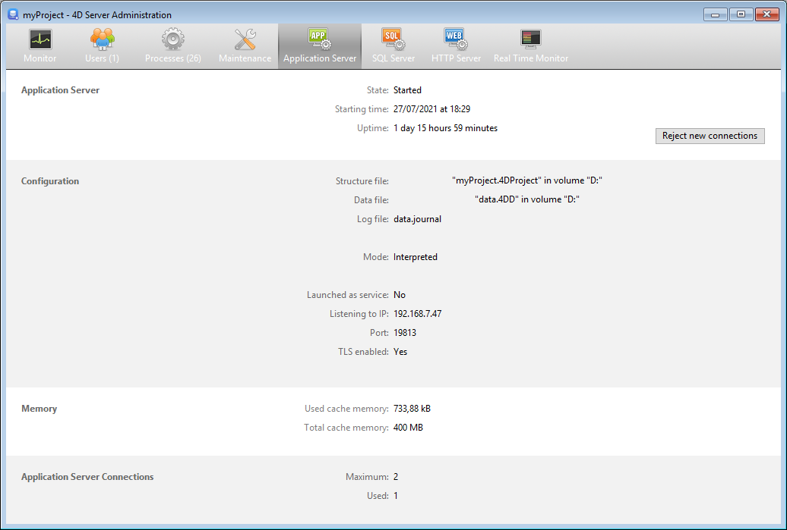

A página Application Server agrupa informações sobre a aplicação desktop publicada pelo 4D Server e pode ser usada para gerenciar essa publicação.

A parte superior da página fornece informação sobre o estado atual do servidor de aplicação 4D Server.

- **State**: Started or Stopped.
- **Starting time**: Date and time the application server was launched. Esta data corresponde à abertura do projeto por 4D Server.
- **Uptime**: Time elapsed since last opening of the project by the server.

## Aceitar/Rejeitar novas ligações

Este botão alterna e pode ser utilizado para gerir o acesso de novas máquinas cliente de ambiente de trabalho ao servidor de aplicações.

Por padrão, quando o projeto for publicado:

- O botão tem o título "Rejeitar novas ligações."
- Os novos clientes desktop podem conectar-se livremente (dentro do limite das conexões permitidas pela licença).
- O nome do projeto é publicado na caixa de diálogo de ligação remota (se a opção "At Startup Publish Database Name in the Connection Dialog" estiver selecionada nas Preferências).

If you click on the **Reject new connections** button:

- O título do botão muda para "Aceitar novas ligações."
- Nenhum novo cliente pode então ligar-se. Os clientes que tentarem ligar-se receberão a seguinte mensagem:

- O nome do projeto já não aparece na caixa de diálogo da ligação remota.
- Os clientes de ambiente de trabalho que já estão ligados não são desligados e podem continuar a trabalhar normalmente.

> You can perform the same action with the [`REJECT NEW REMOTE CONNECTIONS`](https://doc.4d.com/4dv19/help/command/en/page1635.html) command.

- If you click on the **Accept new connections button**, the application server returns to its default state.

This feature permits, for example, an administrator to carry out various maintenance operations (verification, compacting, etc.) just after having started the server. Se o administrador utilizar uma ligação remota, pode ter a certeza de que é o único a modificar os dados. Também é possível utilizar esta função para preparar uma operação de manutenção que exija que não exista uma máquina cliente de secretária ligada.

## Informação

### Configuração

Esta área fornece informação sobre o projeto 4D publicado pelo servidor: nome e localização dos arquivos de dados e de estrutura e nome do arquivo de registo da base de dados. Pode clicar no nome da estrutura ou do arquivo de dados para ver o seu caminho completo.

The **Mode** field indicates the current execution mode of the application: compiled or interpreted.

A parte inferior da área indica os parâmetros de configuração do servidor (lançados como serviço, porta e endereço IP) e a ativação do TLS para ligações cliente-servidor (não diz respeito a ligações SQL nem HTTP).

### Memória

This area indicates the **Total cache memory** (parameter set in the settings) and the **Used cache memory** (dynamic allocation by 4D Server according to its needs).

### Ligações aplicação servidor

- **Maximum**: maximum number of simultaneous client connections allowed for the application server. Este valor depende da licença instalada na máquina do servidor.
- **Used**: actual number of connections currently being used.
