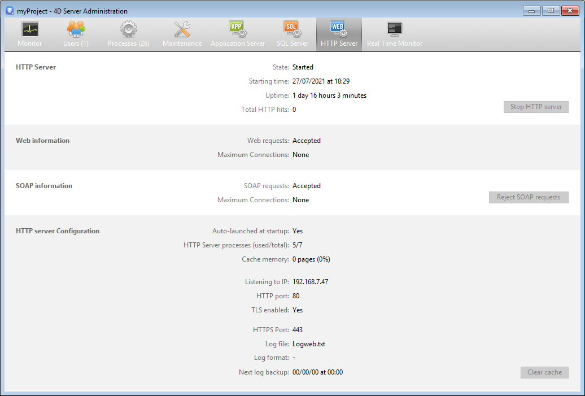

La página **Servidor HTTP** agrupa la información sobre el servidor Web y el servidor SOAP de 4D Server. O servidor web permite que você publique conteúdo Web como páginas HTML ou imagens para navegadores Web e para lidar com solicitações REST. O servidor SOAP gere a publicação de serviços Web. Esses servidores dependem do servidor HTTP interno de 4D Server.

A parte superior da página fornece informações sobre o estado atual do servidor HTTP do 4D Server.

- **Estado**: Iniciado o Detenido
- **Hora de inicio**: fecha y hora en que el servidor HTTP fue lanzado por última vez.
- **Duración del funcionamiento**: tiempo transcurrido desde el último arranque del servidor HTTP.
- **Total de hits HTTP**: número de hits HTTP (de bajo nivel) recibidos por el servidor HTTP desde que se inició.

## Iniciar/parar o servidor HTTP

Esse botão alterna e pode ser usado para controlar a ativação do servidor HTTP do 4D Server.

- Cuando el estado del servidor HTTP es "Iniciado", el botón se etiqueta**Detener el servidor HTTP**. Se você clicar neste botão, o servidor HTTP 4D é parado imediatamente; o servidor Web, o servidor REST e o servidor SOAP não aceitam mais quaisquer solicitações.
- Cuando el estado del servidor HTTP es "Detenido", el botón se titula **Iniciar servidor HTTP**. Se você clicar nesse botão, o servidor HTTP de 4D Server será iniciado imediatamente; solicitações Web, REST e SOAP serão aceitas.

> Você deve ter uma licença adequada para poder iniciar o servidor HTTP.
>
> O servidor HTTP também pode ser iniciado automaticamente na inicialização do aplicativo (configurações) ou pela programação.

## Informação Web

Esta área fornece informações específicas sobre o servidor Web de 4D Server.

- **Peticiones web**: aceptadas o rechazadas. Esta informação indica se o servidor Web está ativado. Como o servidor da Web está diretamente vinculado ao servidor HTTP, as solicitações Web são aceitas quando o servidor HTTP é iniciado e rejeitadas quando ele é interrompido.
- **Conexiones máximas**: número máximo de conexiones web permitidas. Este valor depende da licença instalada na máquina do servidor.

## Informação SOAP

Esta área fornece informações específicas sobre o servidor SOAP do 4D Server e inclui um botão de controle.

- **Peticiones SOAP**: aceptadas o rechazadas. Esta informação indica se o servidor SOAP está ativado. Para que as solicitações SOAP sejam aceitas, o servidor HTTP deve ser iniciado e o servidor SOAP deve aceitar explicitamente as solicitações (consulte o botão Aceitar/Rejeitar).
- **Conexiones máximas**: número máximo de conexiones SOAP permitidas. Este valor depende da licença instalada na máquina do servidor.
- Botón **Aceptar/rechazar las peticiones SOAP**: este botón se alterna y puede utilizarse para controlar la activación del servidor SOAP de 4D Server. Este botón modifica el valor de la opción **Autorizar peticiones de servicios web** en la página "Servicios web" de las Propiedades de la base (y viceversa). You can also use the [`SOAP REJECT NEW REQUESTS`](https://doc.4d.com/4dv19/help/command/en/page1636.html) command to refuse new SOAP requests, however this does not modify the value of the **Allow Web Services Requests** option.

Si presiona el botón **Aceptar las peticiones SOAP** y el servidor HTTP está detenido, 4D lo inicia automáticamente.

## Configuração servidor HTTP

Esta área fornece informações sobre os parâmetros de configuração e a operação do servidor HTTP:

- **Lanzamiento automático al inicio**: parámetro definido a través de las Propiedades.
- **Proceso servidor HTTP (utilizado/total)**: número de procesos HTTP creados en el servidor (número actual de procesos / total de todos los procesos creados).
- **Memoria caché**: tamaño de la memoria caché del servidor HTTP, cuando está activada (tamaño realmente utilizado por la caché / tamaño máximo teóricamente asignado a la caché en las Propiedades). Puede hacer clic en el botón **Borrar caché** para vaciar la caché actual.
- **Listening to IP**, **HTTP Port** (80 by default), **TLS enabled** for HTTP connections (does not concern 4D nor SQL connections) and **HTTPS Port** used: current [configuration parameters](WebServer/webServerConfig.md) of the HTTP server, specified through the Settings or by programming.
- **Información del archivo de registro**: nombre, formato y fecha de la siguiente copia de seguridad automática del registro del servidor HTTP (archivo logweb.txt).

