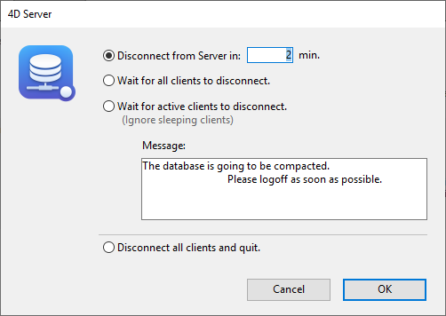

La página **Mantenimiento** de la ventana de administración de 4D Server ofrece información relativa al funcionamiento actual de la aplicación. Ele também fornece acesso às funções básicas de manutenção:

## Última verificação/compactação

Estas áreas indican la fecha, la hora y el estado de la última [verificación de datos](MSC/verify.md) y [operación de compactación](MSC/compact.md) efectuadas en la base.

### Verificar registos e índices

This button can be used to launch the verification operation directly, without interrupting the server. Observe que o servidor pode ficar visivelmente mais lento durante a operação.

Todos os registros e todos os índices do banco de dados são verificados. Si desea poder orientar la verificación o disponer de opciones adicionales, deberá utilizar el [Centro de mantenimiento y seguridad](MSC/overview.md) (CSM).

Tras la verificación, se genera un archivo de informe en formato XML en el servidor, en la carpeta [maintenance Logs](Project/architecture.md#logs). El botón **Ver informe** (llamado **Descargar informe** si la operación se ha realizado desde una máquina remota) le permite visualizar el archivo en su navegador.

### Compactar dados...

Thus button can be used to launch a data compacting operation directly. This operation requires stopping the server: when you click on this button, the 4D Server shutdown dialog box appears so that you can choose how to interrupt the operation:

After the actual interruption of the application service, 4D Server carries out a standard compacting operation on the database data. Si desea disponer de opciones adicionales, deberá utilizar el [Centro de seguridad y de mantenimiento (CSM)](MSC/overview.md).

Once the compacting is finished, 4D Server automatically restarts the application. Os usuários 4D podem então ser reconectados.

> If the request for compacting was carried out from a remote 4D remote machine, this machine is automatically reconnected by 4D Server.

Tras la verificación, se genera un archivo de informe en formato XML en el servidor, en la carpeta [maintenance Logs](Project/architecture.md#logs). El botón **Ver informe** (llamado **Descargar informe** si la operación se ha realizado desde una máquina remota) le permite visualizar el archivo en su navegador.

## Tempo de funcionamento

This area indicates the duration of the 4D Server application execution since the last time it was started (days, hours and minutes).

### Reiniciar o servidor...

Este botão pode ser usado para fechar e reiniciar imediatamente o projeto. When you click on this button, the 4D Server shutdown dialog box appears so that you can choose how to interrupt the operation. Após a validação, 4D Server fecha e reabre automaticamente o projeto. Os usuários 4D podem então ser reconectados.

> If the request for restarting was carried out from a remote 4D machine, this machine is automatically reconnected by 4D Server.

## Última cópia de segurança

Esta área indica la fecha y la hora de la [última copia de seguridad](MSC/backup.md) de la base y ofrece información sobre la próxima copia de seguridad automática programada (si la hay). Las copias de seguridad automáticas se configuran en la página **Periodicidad** de las propiedades de estructura.

- **Última copia de seguridad**: fecha y hora de la última copia de seguridad.
- **Próxima copia de seguridad**: fecha y hora de la próxima copia de seguridad programada.
- **Espacio necesario**: espacio estimado necesario para la copia de seguridad. The actual size of the backup file may vary according to the settings (compression, etc.) e de acordo com as variações do arquivo de dados.
- **Espacio disponible**: espacio disponible en el volumen de copia de seguridad.

El botón **Iniciar copia de seguridad** permite realizar una copia de seguridad inmediata de la base utilizando los parámetros de copia de seguridad actuales (archivos de copia de seguridad, ubicación de los archivos, opciones, etc.). Puede ver estos parámetros haciendo clic en el botón **Propiedades...**. During a backup on the server, the client machines are "blocked" (but not disconnected) and it is not possible for any new clients to connect.

## Histórico de solicitações e depuração

This area indicates the server log files recording duration (when log files are activated) and allows you to control their activation.

Consulte a seção [**Descrição dos arquivos de log**](Debugging/debugLogFiles.md) para obter detalhes sobre os arquivos de log.

### Start/Stop Request and Debug Logs

El botón **Iniciar los registros de peticiones y de depuración** inicia los archivos de registro. Since this may noticeably deteriorate server performance, it is to be reserved for the development phase of the application.

> Este botão registra apenas operações executadas no servidor.

Una vez activados los registros, el título del botón cambia a **Detener los registros de peticiones y depurar**, para que pueda detener el registro de peticiones en cualquier momento. Pay attention to the fact that restarting the log after stopping it "erases" the previous file.

### Ver relatório

El botón **Ver informe** (llamado **Descargar el informe** si la operación se ha realizado desde un cliente de escritorio remoto) permite abrir una ventana sistema en la que se muestra el archivo de registro de peticiones.

### Carregar ficheiro de configuração dos registos

Este botón le permite cargar un [archivo de configuración de log](Debugging/debugLogFiles.md#using-a-log-configuration-file)(archivo`.json`) para un servidor específico. Such a file can be provided by 4D technical services to monitor and study specific cases.

### Pausar no registo

This button suspends all currently logging operations started on the server. Esta funcionalidade pode ser útil para aligeirar temporariamente as tarefas do servidor.

Cuando los registros se han puesto en pausa, el título del botón cambia a **Reanudar registro**, para que pueda reanudar las operaciones de registro.

> Puede pausar y reanudar el registro utilizando el comando [SET DATABASE PARAMETER](https://doc.4d.com/4dv19/help/command/en/page642.html).
