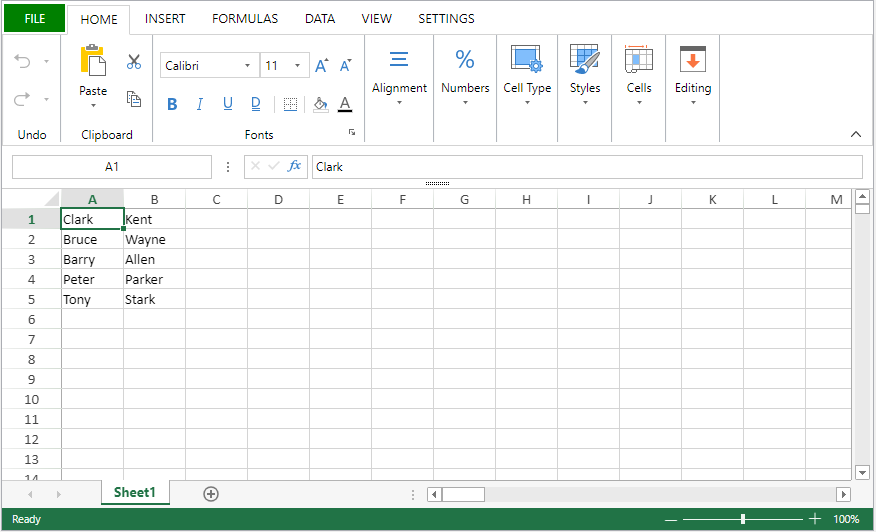

<details><summary>História</summary>

| Release | Mudanças                                   |
| ------- | ------------------------------------------ |
| 20 R2   | Suporte de documentos .sjs |

</details>

<!-- REF #_method_.VP IMPORT DOCUMENT.Syntax -->

**VP IMPORT DOCUMENT** ( *vpAreaName* : Text ; *filePath* : Text { ; *paramObj* : Object} ) <!-- END REF -->

<!-- REF #_method_.VP IMPORT DOCUMENT.Params -->

| Parâmetro  | Tipo   |    | Descrição                                  |                  |
| ---------- | ------ | -- | ------------------------------------------ | ---------------- |
| vpAreaName | Text   | -> | Nome de objeto formulário área 4D View Pro |                  |
| filePath   | Text   | -> | Caminho do documento                       |                  |
| paramObj   | Object | -> | Opções de importação                       | <!-- END REF --> |

#### Descrição

The `VP IMPORT DOCUMENT` command <!-- REF #_method_.VP IMPORT DOCUMENT.Summary -->imports and displays the document designated by *filePath* in the 4D View Pro area *vpAreaName*<!-- END REF -->. O documento importado substitui qualquer dado já inserido na área

Em *vpAreaName*, passe o nome da área 4D View Pro. Se passar um nome que não existe, é devolvido um erro.

Em *filePath*, passe o caminho de destino e o nome do documento a ser importado. São suportados os seguintes formatos:

- Os documentos 4D View Pro (extensão ".4vp")
- Microsoft Excel (extensão ".xlsx")
- documentos textos (extensão ".txt", ".csv", o documento deve ser em utf-8)
- [Documentos SpreadJS](https://developer.mescius.com/spreadjs/docs/features/spreadjs-file-format) (extensão ".sjs")

If the document extension is not a recognized extension, such as `.4vp` or `.xlsx`, the document is considered a text document. Deve passar uma rota completa, a não ser que o documento esteja localizado no mesmo nível que a pasta Project, em cujo caso pode passar apenas seu nome.

An error is returned if the `filePath` parameter is invalid, or if the file is missing or malformed.

The optional *paramObj* parameter allows you to define properties for the imported document:

| Parâmetro  |                     | Tipo                         | Descrição                                                                                                                                                                                                                                                                                                                                                                                                                                                          |
| ---------- | ------------------- | ---------------------------- | ------------------------------------------------------------------------------------------------------------------------------------------------------------------------------------------------------------------------------------------------------------------------------------------------------------------------------------------------------------------------------------------------------------------------------------------------------------------ |
| formula    |                     | 4D. Function | Um método de retorno de chamada a ser iniciado quando a importação for concluída. Você deve usar uma fórmula retornada pelo comando [`Formula`](../../API/FunctionClass.md#formula). Veja [Passando um método de callback (fórmula)](vp-export-document.md#passing-a-callback-method-formula).                                                                                                  |
| senha      |                     | text                         | Somente Microsoft Excel (opcional) - Senha usada para proteger o documento do MS Excel.                                                                                                                                                                                                                                                                                                                                         |
| csvOptions |                     | object                       | opções para importação csv                                                                                                                                                                                                                                                                                                                                                                                                                                         |
|            | range               | object                       | O intervalo  de células que contém a primeira célula onde os dados serão escritos. Se o intervalo especificado não é um intervalo de células, só a primeira célula do intervalo é usada.                                                                                                                                                                                                                                           |
|            | rowDelimiter        | text                         | Delimitador de linha. Se não estiver presente, o delimitador é automaticamente determinado por 4D.                                                                                                                                                                                                                                                                                                                                 |
|            | columnDelimiter     | text                         | Delimitador de coluna. O padrão: ","                                                                                                                                                                                                                                                                                                                                                                                               |
| sjsOptions |                     | object                       | opções para importação de sjs                                                                                                                                                                                                                                                                                                                                                                                                                                      |
|            | calcOnDemand        | boolean                      | Se as fórmulas devem ser calculadas somente quando forem exigidas; padrão=falso.                                                                                                                                                                                                                                                                                                                                                                   |
|            | dynamicReferences   | boolean                      | Se deve calcular funções com referências dinâmicas; o padrão é true.                                                                                                                                                                                                                                                                                                                                                                               |
|            | fullRecalc          | boolean                      | Para decidir se calcula depois do carregamento do dado json, falso por padrão                                                                                                                                                                                                                                                                                                                                                                                      |
|            | includeFormulas     | boolean                      | Se deve incluir as fórmulas ao carregar; o padrão é true.                                                                                                                                                                                                                                                                                                                                                                                          |
|            | includeStyles       | boolean                      | Se os estilos devem ser incluídos no carregamento; o padrão é true.                                                                                                                                                                                                                                                                                                                                                                                |
|            | includeUnusedStyles | boolean                      | Se deve incluir os estilos de nome não utilizados ao converter o xml do Excel em json; o padrão é true.                                                                                                                                                                                                                                                                                                                                            |
|            | openMode            | integer                      | <li>0 (normal): normal open mode, without lazy and incremental. When opening file, UI and UI event could be refreshed and responsive at specific time points.</li><li>1 (lazy): lazy open mode. Quando abrir o documento, só a folha ativa será carregada diretamente. Other sheets will be loaded only when they are be used.</li><li>2 (incremental): incremental open mode. When opening file, UI and UI event could be refreshed and responsive directly.</li> |

:::note Notas

- Importar arquivos em formatos .xslx, .csv, e .sjs é **assíncrona**. With these formats, you must use the `formula` attribute if you want to start an action at the end of the document processing.
- Quando importar um arquivo formatado em Excel em um documento 4D View Pro, algumas configurações podem ser perdidas. You can verify your settings with [this list from SpreadJS](https://developer.mescius.com/spreadjs/docs/excelimpexp/excelexport).
- For more information on the CSV format and delimiter-separated values in general, see [this article on Wikipedia](https://en.wikipedia.org/wiki/Delimiter-separated_values)

:::

#### Exemplo 1

Se quiser importar um documento 4D View Pro armazenado no disco quando o formulário for aberto:

```4d
C_TEXT($docPath)
If(Form event code=On VP Ready) //A zona 4D View Pro está carregada e pronta
    $docPath:="C:\\Bases\\ViewProDocs\\MyExport.4VP"
    VP IMPORT DOCUMENT("VPArea";$docPath)
End if
```

#### Exemplo 2

Você deseja importar um documento do Microsoft Excel protegido por senha para uma área do 4D View Pro:

```4d
	//Código de importação
var $o : Object
$o:=New object
$o.password:="excel123"
$o.formula:=Formula(myImport)
 
VP IMPORT DOCUMENT("ViewProArea";"c:\\tmp\\excelfilefile.xlsx";$o)
```

```4d
	//myImport callback method
#DECLARE($area : Text; $filePath : Text; $param : Object; $status : Object)

If ($status.success)
     ALERT("Import successfully completed")
Else 
     ALERT("Error: "+$status.errorMessage)
End if
```

#### Exemplo 3

You want to import a `.txt` file that uses a comma (",") as delimiter:


```4d
$params:=New object
$params.range:=VP Cells("ViewProArea";0;0;2;5)
VP IMPORT DOCUMENT("ViewProArea";"c:\\import\\my-file.txt";New object("csvOptions";$params))
```

Aqui está o resultado:


#### Veja também

[VP EXPORT DOCUMENT](vp-export-document.md)<br/>
[VP NEW DOCUMENT](vp-new-document.md)
