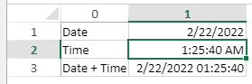

<details><summary>História</summary>

| Release | Mudanças   |
| ------- | ---------- |
| 19 R5   | Adicionado |

</details>

<!-- REF #_method_.VP SET DATA CONTEXT.Syntax -->

**VP SET DATA CONTEXT** ( _vpAreaName_ : Text ; _dataObj_ : Object {; _options_ : Object } {; _sheet_ : Integer} )<br/>**VP SET DATA CONTEXT** ( _vpAreaName_ : Text ; _dataColl_ : Collection ; {_options_ : Object } {; _sheet_ : Integer} )<!-- END REF -->

<!-- REF #_method_.VP SET DATA CONTEXT.Params -->

| Parâmetro  | Tipo       |    | Descrição                                        |                  |
| ---------- | ---------- | -- | ------------------------------------------------ | ---------------- |
| vpAreaName | Object     | -> | Nome de objeto formulário área 4D View Pro       |                  |
| dataObj    | Object     | -> | Objeto dados a carregar no contexto de dados     |                  |
| dataColl   | Collection | -> | Recolha de dados a carregar no contexto de dados |                  |
| options    | Object     | -> | Opções adicionais                                |                  |
| sheet      | Integer    | -> | Índice da folha                                  | <!-- END REF --> |

#### Descrição

O comando `VP SET DATA CONTEXT` <!-- REF #_method_.VP SET DATA CONTEXT.Summary -->define o contexto de dados de uma folha<!-- END REF -->. A data context is an object or a collection bound to a worksheet, and whose contents can be used to automatically fill the sheet cells, either by using an autogenerate option or the [VP SET BINDING PATH](vp-set-binding-path.md) method. On the other hand, the [VP Get data context](vp-get-data-context.md) command can return a context containing user modifications.

Em _vpAreaName_, passe o nome da área 4D View Pro. Se passar um nome que não existe, é devolvido um erro.

In _dataObj_ or _dataColl_, pass an object or a collection containing the data to load in the data context. As imagens são convertidas em esquemas URI de dados.

To pass a time value in _dataObj_ or _dataColl_, encapsulate it in an object with the following properties (see [example 4](#example-4---date-and-time-syntax)):

| Propriedade | Tipo                                     | Descrição                                                               |
| ----------- | ---------------------------------------- | ----------------------------------------------------------------------- |
| value       | Integer, Real, Boolean, Text, Date, Null | Valor a inserir no contexto                                             |
| time        | Real                                     | Valor de hora (em segundos) a introduzir no contexto |

In _options_, you can pass an object that specifies additional options. As propriedades possíveis são:

| Propriedade         | Tipo   | Descrição                                                                                                                                                                                                                                                                                                                                                                                                                                                                                                                                                                                                                                                                          |
| ------------------- | ------ | ---------------------------------------------------------------------------------------------------------------------------------------------------------------------------------------------------------------------------------------------------------------------------------------------------------------------------------------------------------------------------------------------------------------------------------------------------------------------------------------------------------------------------------------------------------------------------------------------------------------------------------------------------------------------------------- |
| reset               | Object | True to reset the sheet's contents before loading the new context, False (default) otherwise.                                                                                                                                                                                                                                                                                                                                                                                                                                                                                                                                                   |
| autoGenerateColumns | Object | Apenas utilizado quando os dados são uma coleção. True (default) to specify that columns must be generated automatically when the data context is bound. In this case, the following rules apply: <ul><li>If _dataColl_ is a collection of objects, attribute names are used as column titles (see example 2).</li><li>If _dataColl_ contains subcollections of scalar values, each subcollection defines the values in a row (see example 3). The first subcollection determines how many columns are created.</li></ul> |

In _sheet_, pass the index of the sheet that will receive the data context. Se nenhum índice for passado, o contexto será aplicado à folha atual.

If you export your document to an object using [VP Export to object](vp-export-to-object.md), or to a 4DVP document using [VP EXPORT DOCUMENT](vp-export-document.md), the `includeBindingSource` option lets you copy the contents of the current contexts as cell values in the exported object or document. Para obter mais detalhes, consulte a descrição desses métodos.

#### Exemplo

Passa um objeto e associa os dados de contexto às células da primeira linha:

```4d
var $data : Object

$data:=New object

$data.firstName:="Freehafer"
$data.lastName:="Nancy"

VP SET DATA CONTEXT("ViewProArea"; $data)

VP SET BINDING PATH(VP Cell("ViewProArea"; 0; 0); "firstName")
VP SET BINDING PATH(VP Cell("ViewProArea"; 1; 0); "lastName")

```


#### Exemplo 2

Passe uma coleção de objetos e gere colunas automaticamente:

```4d
var $options : Object
var $data : Collection

$data:=New collection()
$data.push(New object("firstname"; "John"; "lastname"; "Smith"))
$data.push(New object("firstname"; "Mary"; "lastname"; "Poppins"))

$options:=New object("autoGenerateColumns"; True) VP SET DATA CONTEXT("ViewProArea"; $data; $options)
```


#### Exemplo 3

The _data_ passed as a parameter is a collection that contains subcollections. Cada subcoleção define o conteúdo de uma linha:

```4d
var $data : Collection
var $options : Object

$data:=New collection
$data.push(New collection(1; 2; 3; False; ""))  // 5 columns are created
$data.push(New collection)  // Second row is empty
$data.push(New collection(4; 5; Null; "hello"; "world"))  // Third row has 5 values
$data.push(New collection(6; 7; 8; 9))  // Fourth row has 4 values

$options:=New object("autoGenerateColumns"; True) VP SET DATA CONTEXT("ViewProArea"; $data; $options)
```


#### Exemplo 4 - Sintaxe de data e hora

```4d
var $data : Collection
var $options : Object

$data:= New collection()

// Dates can be passed as scalar values
$data.push(New collection("Date"; Current date)) 

// Time values must be passed as object attributes
$data.push(New collection("Time"; New object("time"; 5140)))

// Date + time example
$data.push(New collection("Date + Time"; New object("value"; Current date; "time"; 5140))) 

$options:=New object("autoGenerateColumns"; True) VP SET DATA CONTEXT("ViewProArea"; $data; $options)
```

Eis o resultado após as colunas serem geradas:



#### Veja também

[VP SET BINDING PATH](vp-set-binding-path.md)<br/>
[VP Get binding path](vp-get-binding-path.md)<br/>
[VP Get data context](vp-get-data-context.md)
