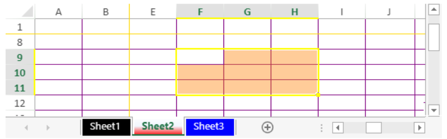

<!-- REF #_method_.VP SET SHEET OPTIONS.Syntax -->

**VP SET SHEET OPTIONS** ( _vpAreaName_ : Text; _sheetOptions_ : Object { ; _sheet_ : Integer}  ) <!-- END REF -->

<!-- REF #_method_.VP SET SHEET OPTIONS.Params -->

| Parâmetro    | Tipo   |    | Descrição                                                   |                  |
| ------------ | ------ | -- | ----------------------------------------------------------- | ---------------- |
| vpAreaName   | Object | -> | Nome da área 4D View Pro                                    |                  |
| sheetOptions | Object | -> | Opção(ões) de folha a definir            |                  |
| sheet        | Object | -> | Índice da folha (folha atual se omitida) | <!-- END REF --> |

#### Descrição

The `VP SET SHEET OPTIONS` command <!-- REF #_method_.VP SET SHEET OPTIONS.Summary -->allows defining various sheet options of the _vpAreaName_ area<!-- END REF -->.

Pass the name of the 4D View Pro area in _vpAreaName_. Se passar um nome que não existe, é devolvido um erro.

Pass an object containing definitions for the options to set in the _sheetOptions_ parameter. To view the full list of the available options, see the [Sheet Options](../configuring.md#sheet-options) paragraph.

In the optional _sheet_ parameter, you can designate a specific spreadsheet (counting begins at 0). Se omitido, a planilha atual será utilizada por padrão. Você pode selecionar explicitamente a planilha atual com a seguinte constante:

- `vk current sheet`

#### Exemplo 1

Pretende proteger todas as células exceto o intervalo C5:D10:

```4d
// Activate protection on the current sheet
var $options : Object
  
$options:=New object
$options.isProtected:=True
VP SET SHEET OPTIONS("ViewProArea";$options)
  
// mark cells C5:D10 as 'unlocked'
VP SET CELL STYLE(VP Cells("ViewProArea";2;4;2;6);New object("locked";False))
```

#### Exemplo 2

You need to protect your document while your users can resize rows and columns:

```4d
var $options : Object
  
$options:=New object
// Activate protection
$options.isProtected:=True
$options.protectionOptions:=New object
// Allow user to resize rows
$options.protectionOptions.allowResizeRows=True;
// Allow user to resize columns
$options.protectionOptions.allowResizeColumns=True;
    
// Apply protection on the current sheet
VP SET SHEET OPTIONS("ViewProArea";$options)
```

#### Exemplo 3

You want to customize the colors of your sheet tabs, frozen lines, grid lines, selection background and selection border:

```4d
var $options : Object
   
$options:=New object
// Customize color of Sheet 1 tab
$options.sheetTabColor:="Black"
$options.gridline:=New object("color";"Purple")
$options.selectionBackColor:="rgb(255,128,0,0.4)"
$options.selectionBorderColor:="Yellow"
$options.frozenlineColor:="Gold"
   
VP SET SHEET OPTIONS("ViewProArea";$options;0)
 
// Customize color of Sheet 2 tab
$options.sheetTabColor:="red"
   
VP SET SHEET OPTIONS("ViewProArea";$options;1)
 
// Customize color of Sheet 3 tab
$options.sheetTabColor:="blue"
  
VP SET SHEET OPTIONS("ViewProArea";$options;2)
```

Resultados:



#### Exemplo

Pretende ocultar as linhas da grelha, bem como os cabeçalhos das linhas e das colunas.

```4d
var $options : Object
  
$options:=New object
$options.gridline:=New object()
$options.gridline.showVerticalGridline:=False
$options.gridline.showHorizontalGridline:=False
$options.rowHeaderVisible:=False
$options.colHeaderVisible:=False
  
VP SET SHEET OPTIONS("ViewProArea";$options)
```

Resultados:


#### Veja também

[4D View Pro sheet options](../configuring.md#sheet-options)<br/>
[VP Get sheet options](vp-get-sheet-options.md)
