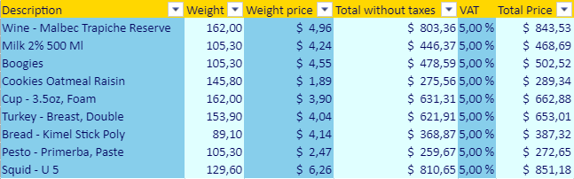

<details><summary>História</summary>

| Release | Mudanças   |
| ------- | ---------- |
| 19 R8   | Adicionado |

</details>

<!-- REF #_method_.VP SET TABLE THEME.Syntax -->

**VP SET TABLE THEME** ( _vpAreaName_ : Text ; _tableName_ : Text ; _options_ : cs.ViewPro.TableTheme )<!-- END REF -->

<!-- REF #_method_.VP SET TABLE THEME.Params -->

| Parâmetro  | Tipo                                                                              |    | Descrição                                  |                  |
| ---------- | --------------------------------------------------------------------------------- | -- | ------------------------------------------ | ---------------- |
| vpAreaName | Text                                                                              | -> | Nome de objeto formulário área 4D View Pro |                  |
| tableName  | Text                                                                              | -> | Nome da tabela                             |                  |
| options    | [cs.ViewPro.TableTheme](../classes.md#tabletheme) | -> | Propriedades do tema da tabela a modificar | <!-- END REF --> |

#### Descrição

O comando `VP SET TABLE THEME` <!-- REF #_method_.VP SET TABLE THEME.Summary -->modifica o tema atual da _tableName_<!-- END REF -->.

In _vpAreaName_, pass the name of the 4D View Pro area and in _tableName_, the name of the table to modify.

In the _options_ parameter, pass an object of the [`cs.ViewPro.TableTheme` class](../classes.md#tabletheme) that contains the theme properties to modify.

#### Exemplo 1

Pretende-se definir um tema predefinido para uma tabela:

```4d
var $param : cs. ViewPro. TableTheme
$param:=cs. ViewPro. TableTheme.new()
$param.theme:="medium2" VP SET TABLE THEME("ViewProArea"; "myTable"; $param)
```

#### Exemplo 2

Pretende ter esta renderização de coluna alternativa:



```4d
var $param : cs.ViewPro.TableTheme
$param:=cs.ViewPro.TableTheme.new()

// Enable the band column rendering
$param.bandColumns:=True
$param.bandRows:=False

// Create the theme object with header and column styles
$param.theme:=cs.ViewPro.TableThemeOptions.new()

var $styleHeader; $styleColumn; $styleColumn2 : cs.ViewPro.TableStyle

$styleHeader:=cs.ViewPro.TableStyle.new()
$styleHeader.backColor:="Gold"
$styleHeader.foreColor:="#03045E"
$param.theme.headerRowStyle:=$styleHeader

$styleColumn1:=cs.ViewPro.TableStyle.new()
$styleColumn1.backColor:="SkyBlue"
$styleColumn1.foreColor:="#03045E"
$param.theme.firstColumnStripStyle:=$styleColumn1

$styleColumn2:=cs.ViewPro.TableStyle.new()
$styleColumn2.backColor:="LightCyan"
$styleColumn2.foreColor:="#03045E"
$param.theme.secondColumnStripStyle:=$styleColumn2

VP SET TABLE THEME("ViewProArea"; "myTable"; $param)

```

#### Veja também

[VP CREATE TABLE](vp-create-table.md)<br/>
[VP Get table theme](vp-get-table-theme.md)
