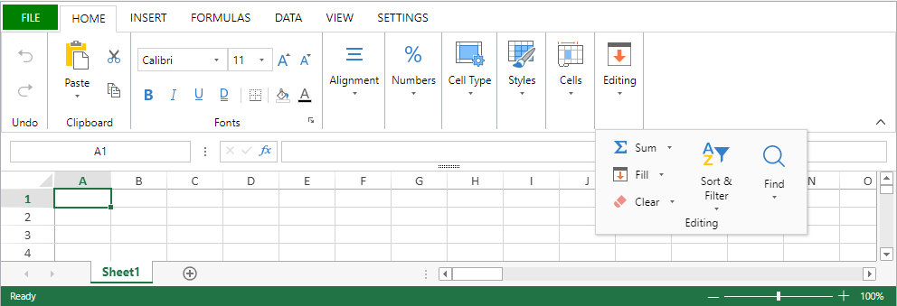

As propriedades da área 4D View Pro podem ser configuradas utilizando a lista de propriedades. Spreadsheet properties are available through the language.

## Propriedades da área do formulário

Using the area's property list, you can set [4D View Pro object properties](FormObjects/viewProArea_overview.md#supported-properties) such as **Object Name**, [**Variable or Expression**](#4d-view-pro-form-object-variable), **Appearance**, **Action**, and **Events**.


### Selecção de uma interface utilizador

You can select the interface to use with your 4D View Pro form areas in the **Property List**, under **Appearance**:


> You can also use the [`userInterface`](FormObjects/properties_Appearance.md#user-interface) and [`withFormulaBar`](FormObjects/properties_Appearance.md#show-formula-bar)(only with the "toolbar" interface) JSON properties.

Interfaces allow for basic modifications and data manipulation. User-defined modifications are saved in the 4D View Pro object when the user saves the document.

#### Ribbon



#### Barra de ferramentas

Enabling the Toolbar interface displays the [**Show Formula Bar**](FormObjects/properties_Appearance.md#show-formula-bar) option. When selected, the formula bar is visible below the Toolbar interface.

With visible formula bar:


#### Funcionalidades

Both the Ribbon and the Toolbar interfaces group related features into tabs:

| Tab      | Acções                          | Ribbon Interface | Interface da barra de ferramentas |
| -------- | ------------------------------- |:----------------:|:---------------------------------:|
| File     | File manipulation               |        X         |                                   |
| Inicio   | Aspecto do texto                |        X         |                 X                 |
| Inserir  | Adicionar itens                 |        X         |                 X                 |
| Fórmulas | Formula calculation and library |        X         |                 X                 |
| Dados    | Data manipulation               |        X         |                 X                 |
| Mostrar  | Apresentação visual             |        X         |                 X                 |
| Settings | Presentação da folha            |        X         |                                   |

## Eventos formulário

The following form events are available in the Property List for 4D View Pro areas.

Some of the events are standard form events (available to all active objects) and some are specific 4D View Pro form events. Some standard form events provide extended information in the object returned by the [`FORM Event`](https://doc.4d.com/4dv19/help/command/en/page1606.html) command when they are generated for 4D View Pro areas. The following table shows which events are standard and which are specific or provide additional information to 4D View Pro areas:

| Eventos 4D ‘standard’                           | Eventos 4D View Pro específicos e alargados           |
| ----------------------------------------------- | ----------------------------------------------------- |
| [On Load](../Events/onLoad.md)                  | [On VP Ready](../Events/onVpReady.md)                 |
| [On Getting Focus](../Events/onGettingFocus.md) | [On Clicked](../Events/onClicked.md)                  |
| [On Losing Focus](../Events/onLosingFocus.md)   | [On Double Clicked](../Events/onDoubleClicked.md)     |
| [On Unload](../Events/onUnload.md)              | [On Header Click](../Events/onHeaderClick.md)         |
|                                                 | [On After Edit](../Events/onAfterEdit.md)             |
|                                                 | [On Selection Change](../Events/onSelectionChange.md) |
|                                                 | [On Column Resize](../Events/onColumnResize.md)       |
|                                                 | [On Row Resize](../Events/onRowResize.md)             |
|                                                 | [On VP Range Changed](../Events/onVpRangeChanged.md)  |

## Opções folha

The 4D View Pro sheet options object allows you to control various options of your 4D View Pro areas. This object is handled by the following commands:

* [VP SET SHEET OPTIONS](method-list.md#vp-set-sheet-options)
* [VP Get sheet options](method-list.md#vp-get-sheet-options)

### Aspecto da folha

| Propriedade          |                        | Tipo          | Descrição                                                                                                                                                                                                                                                                                                  |
| -------------------- | ---------------------- | ------------- | ---------------------------------------------------------------------------------------------------------------------------------------------------------------------------------------------------------------------------------------------------------------------------------------------------------- |
| allowCellOverflow    |                        | boolean       | Specifies whether data can overflow into adjacent empty cells.                                                                                                                                                                                                                                             |
| sheetTabColor        |                        | string        | A color string used to represent the sheet tab color, such as "red", "#FFFF00", "rgb(255,0,0)", "Accent 5", and so on.                                                                                                                                                                                     |
| frozenlineColor      |                        | string        | A color string used to represent the frozen line color, such as "red", "#FFFF00", "rgb(255,0,0)", "Accent 5", and so on.                                                                                                                                                                                   |
| clipBoardOptions     |                        | inteiro longo | The clipboard option. Valores disponibles: `vk clipboard paste options all`, `vk clipboard paste options formatting`, `vk clipboard paste options formulas`, `vk clipboard paste options formulas and formatting`, `vk clipboard paste options values`, `vk clipboard paste options values and formatting` |
| gridline             |                        | object        | The grid line's options.                                                                                                                                                                                                                                                                                   |
|                      | color                  | string        | A color string used to represent the grid line color, such as "red", "#FFFF00", "rgb(255,0,0)", "Accent 5", and so on.                                                                                                                                                                                     |
|                      | showVerticalGridline   | boolean       | Specifies whether to show the vertical grid line.                                                                                                                                                                                                                                                          |
|                      | showHorizontalGridline | boolean       | Specifies whether to show the horizontal grid line.                                                                                                                                                                                                                                                        |
| rowHeaderVisible     |                        | boolean       | Especifica se o cabeçalho da linha é visível.                                                                                                                                                                                                                                                              |
| colHeaderVisible     |                        | boolean       | Especifica se o cabeçalho da coluna é visível.                                                                                                                                                                                                                                                             |
| rowHeaderAutoText    |                        | inteiro longo | Specifies whether the row header displays letters or numbers or is blank. Valores disponíveis: `vk header auto text blank`, `vk header auto text letters`, `vk header auto text numbers`                                                                                                                   |
| colHeaderAutoText    |                        | inteiro longo | Specifies whether the column header displays letters or numbers or is blank. Valores disponíveis: `vk header auto text blank`, `vk header auto text letters`, `vk header auto text numbers`                                                                                                                |
| selectionBackColor   |                        | string        | A cor de fundo da seleção para a folha. (formato RGBA preferido)                                                                                                                                                                                                                                           |
| selectionBorderColor |                        | string        | A cor do contorno da seleção para a folha.                                                                                                                                                                                                                                                                 |
| sheetAreaOffset      |                        | object        | The sheetAreaOffset's options.                                                                                                                                                                                                                                                                             |
|                      | left                   | inteiro longo | The offset left of sheet from host.                                                                                                                                                                                                                                                                        |
|                      | top                    | inteiro longo | The offset top of sheet from host.                                                                                                                                                                                                                                                                         |
> Todas as propriedades são opcionais.

### Protecção da folha

To lock the whole sheet, you only need to set the *isProtected* property to **true**. You can then unlock cells individually by setting the [locked](#layout) cell style property.

| Propriedade       |                          | Tipo    | Descrição                                                                                                                         |
| ----------------- | ------------------------ | ------- | --------------------------------------------------------------------------------------------------------------------------------- |
| isProtected       |                          | boolean | Specifies whether cells on this sheet that are marked as protected cannot be edited.                                              |
| protectionOptions |                          | object  | A value that indicates the elements that you want users to be able to change. If null : the protectionOptions parameter is reset. |
|                   | allowSelectLockedCells   | boolean | Specifies whether the user can select locked cells, optional. True por defeito.                                                   |
|                   | allowSelectUnlockedCells | boolean | Specifies whether the user can select unlocked cells, optional. True por defeito.                                                 |
|                   | allowSort                | boolean | Specifies whether the user can sort ranges, optional. Padrão é falso.                                                             |
|                   | allowFilter              | boolean | Specifies whether the user can filter ranges, optional. Padrão é falso.                                                           |
|                   | allowEditObjects         | boolean | Specifies whether the user can edit floating objects, optional. Padrão é falso.                                                   |
|                   | allowResizeRows          | boolean | Specifies whether the user can resize rows, optional. Padrão é falso.                                                             |
|                   | allowResizeColumns       | boolean | Specifies whether the user can resize columns, optional. Padrão é falso.                                                          |
|                   | allowDragInsertRows      | boolean | Specifies whether the user can perform the drag operation to insert rows, optional. Padrão é falso.                               |
|                   | allowDragInsertColumns   | boolean | Specifies whether the user can perform the drag operation to insert columns, optional. Padrão é falso.                            |
|                   | allowInsertRows          | boolean | Specifies whether the user can insert rows, optional. Padrão é falso.                                                             |
|                   | allowInsertColumns       | boolean | Specifies whether the user can insert columns, optional. Padrão é falso.                                                          |
|                   | allowDeleteRows          | boolean | Specifies whether the user can delete rows, optional. Padrão é falso.                                                             |
|                   | allowDeleteColumns       | boolean | Specifies whether the user can delete columns, optional. Padrão é falso.                                                          |
> Todas as propriedades são opcionais.

## Formato das células

Defining a format pattern ensures that the content of your 4D View Pro documents is displayed the way you intended. Formats can be set using the selected 4D View Pro [interface](#selecting-a-user-interface), or using the [VP SET VALUE](method-list.md#vp-set-value) or [VP SET NUM VALUE](method-list.md#vp-set-num-value) methods.

4D View Pro has built-in formats for numbers, dates, times, and text, but you can also create your own patterns to format the contents of cells using special characters and codes.

For example, when using the [VP SET VALUE](method-list.md#vp-set-value) or [VP SET NUM VALUE](method-list.md#vp-set-num-value) methods to enter amounts in an invoice, you may want the currency symbols ($, €, ¥, etc.) to be aligned regardless of the space required by the number (i.e., whether the amount is $5.00 or $5,000.00). You could use formatting characters and spectify the pattern _($* #,##0.00_) which would display amounts as shown:


Note that when creating your own format patterns, only the display of the data is modified. O valor dos dados mantém-se inalterado.

### Formatos número e texto

Number formats apply to all number types (e.g., positive, negative, and zeros).

| Caracteres | Descrição                                                                                                                                                                                                               | Exemplo                                                                                                                    |
| ---------- | ----------------------------------------------------------------------------------------------------------------------------------------------------------------------------------------------------------------------- | -------------------------------------------------------------------------------------------------------------------------- |
| 0          | Placeholder that displays zeros.                                                                                                                                                                                        | #.00 mostrará 1.1 como 1.10                                                                                                |
| .          | Displays a decimal point                                                                                                                                                                                                | 0.00 mostrará 1999 como 1999.00                                                                                            |
| ,          | Mostra o separador de milhares num número. Thousands are separated by commas if the format contains a comma enclosed by number signs "#" or by zeros. A comma following a digit placeholder scales the number by 1,000. | #,0 mostrará 12200000 como 12,200,000                                                                                      |
| \_       | Salta a largura do carácter seguinte.                                                                                                                                                                                   | Usually used in combination with parentheses to add left and right indents, \_( and _) respectively.                     |
| @          | Formatador de texto. Aplica o formato a todo o texto da célula                                                                                                                                                          | "\[Red]@" applies the red font color for text values.                                                                     |
| *          | Repeats the next character to fill the column width.                                                                                                                                                                    | 0*- will include enough dashes after a number to fill the cell, whereas *0 before any format will include leading zeros. |
| " "        | Displays the text within the quotes without interpreting it.                                                                                                                                                            | "8%" will display as: 8%                                                                                                   |
| %          | Mostra os números como uma percentagem de 100.                                                                                                                                                                          | 8% será exibido como 0,08                                                                                                  |
| \#       | Digit placeholder that does not display extra zeros. If a number has more digits to the right of the decimal than there are placeholders, the number is rounded up.                                                     | #.# mostrará 1.54 como 1.5                                                                                                 |
| ?          | Digit placeholder that leaves space for extra zeros, but does not display them. Typically used to align numbers by decimal point.                                                                                       | $?? displays a maximum of 2 decimals and causes dollar signs to line up for varying amounts.                               |
| \         | Displays the character following it.                                                                                                                                                                                    | #.00\? mostrará 123 como 123.00?                                                                                          |
| /          | When used with numbers, displays them as fractions. When used with text, date or time codes, displayed "as-is".                                                                                                         | #/# mostrará .75 como 3/4                                                                                                  |
| \[ ]      | Cria formatos condicionais.                                                                                                                                                                                             | \[>100]\[GREEN]#,##0;\[`<=-100`]\[YELLOW]#,##0;\[BLUE]#,##0                                                        |
| E          | Formato notação científica.                                                                                                                                                                                             | #E+# - mostrará 1.500.500 como 2E+6                                                                                        |
| \[color]  | Formats the text or number in the color specified                                                                                                                                                                       | \[Green]###.##\[Red]-###.###                                                                                             |

#### Exemplo

```4d
//Set the cell value as $125,571.35 VP SET VALUE(VP Cell("ViewProArea";3;2);New object("value";125571.35;"format";"_($* #,##0.00_)")
```

### Date and time formats

4D View Pro provides the following constants for ISO 8601 date and time patterns:

| Parâmetros                                | Valor                                | Comentário                                                                                                                                                            |
| ----------------------------------------- | ------------------------------------ | --------------------------------------------------------------------------------------------------------------------------------------------------------------------- |
| `vk pattern full date time`               | "*fullDateTimePattern*"              | ISO 8601 format for the full date and time in current localization.USA default pattern: "dddd, dd MMMM yyyy HH:mm:ss"                                                 |
| `vk pattern long date`                    | "*longDatePattern*"                  | ISO 8601 format for the full date in current localization.USA default pattern: "dddd, dd MMMM yyyy"                                                                   |
| `vk pattern long time`                    | "*longTimePattern*"                  | ISO 8601 format for the time in current localization.USA default pattern: "HH:mm:ss"                                                                                  |
| `vk pattern month day`                    | "*monthDayPattern*"                  | ISO 8601 format for the month and day in current localization.USA default pattern: "MMMM dd"                                                                          |
| `vk pattern short date`                   | "*shortDatePattern*"                 | Abbreviated ISO 8601 format for the date in current localization.USA default pattern: "MM/dd/yyyy"                                                                    |
| `vk pattern short time`                   | "*shortTimePattern*"                 | Abbreviated ISO 8601 format for the time in current localization.USA default pattern: "HH:mm"                                                                         |
| `vk pattern sortable date time`           | "*sortableDateTimePattern*"          | ISO 8601 format for the date and time in current localization which can be sorted.USA default pattern: "yyyy\'-\'MM\'-\'dd\'T\'HH\':\'mm\':\'ss"            |
| `vk pattern universal sortable date time` | "*universalSortableDateTimePattern*" | ISO 8601 format for the date and time in current localization using UTC which can be sorted.USA default pattern: "yyyy\'-\'MM\'-\'dd HH\':\'mm\':\'ss\'Z\'" |
| `vk pattern year month`                   | "*yearMonthPattern*"                 | ISO 8601 format for the month and year in current localization.USA default pattern: "yyyy MMMM"                                                                       |

#### Exemplo

```4d
//Set the cell value as specific date and time VP SET VALUE(VP Cell("ViewProArea";3;9);New object("value";!2024-12-18!);"time";?14:30:10?;"format";vk pattern full date time))
```

### Formatos data e hora personalizados

To create your own date and time patterns, in your current localization, you can use combinations of the following codes:

|      | Código<br/>(não sensível a maiúsculas e minúsculas) | Descrição                                       | Exemplo              |
| ---- | --------------------------------------------------------- | ----------------------------------------------- | -------------------- |
| Date |                                                           |                                                 | (January 1, 2019)    |
|      | m                                                         | Número do mês sem zero à esquerda               | 1                    |
|      | mm                                                        | Month number with leading zero                  | 01                   |
|      | mmm                                                       | Nome do mês, abreviado                          | Jan                  |
|      | mmmm                                                      | Nome do mês, long                               | January              |
|      | d                                                         | Day number without leading zero                 | 1                    |
|      | dd                                                        | Número do dia com zero à esquerda               | 01                   |
|      | ddd                                                       | Dia da semana, curto                            | Tue                  |
|      | dddd                                                      | Dia da semana, longo                            | Tuesday              |
|      | yy                                                        | Ano, breve                                      | 19                   |
|      | yyyy                                                      | Ano, longo                                      | 2019                 |
| Hora |                                                           |                                                 | (2:03:05 PM)         |
|      | h                                                         | Hour without leading zero. 0-23                 | 2                    |
|      | hh                                                        | Hora com zero à esquerda. 00-23                 | 02                   |
|      | m                                                         | Minutes without leading zero. 0-59              | 3                    |
|      | mm                                                        | Minutes with leading zero. 00-59                | 03                   |
|      | s                                                         | Seconds without leading zero. 0-59              | 5                    |
|      | ss                                                        | Seconds with leading zero. 00-59                | 05                   |
|      | \[h]                                                     | Tempo decorrido em horas                        | 14 (pode exceder 24) |
|      | \[mm]                                                    | Tempo decorrido em minutos                      | 843                  |
|      | \[ss]                                                    | Tempo decorrido em segundos                     | 50585                |
|      | AM/PM                                                     | Períodos do dia. 24 hour fomat used if omitted. | PM                   |
> The code 'm' is interpreted depending on its position in the pattern. If it's immediately after 'h' or 'hh' or immediately before 's' or 'ss', it will be interpreted as minutes, otherwise it will be interpreted as months.

### Símbolos adicionais

In addition to the special characters and codes described in the previous sections, there are additional characters and symbols that can be used in your format patterns. These additional characters and symbols do not require a \ or "" and do not impact the interpretation of the format pattern. Aparecem "tal como estão" no padrão.

| Caracteres  | Descrição                                                          | Exemplo              |
| ----------- | ------------------------------------------------------------------ | -------------------- |
| + e -       | Sinais mais e menos                                                | ### + ### = ###,### |
| ( )         | Parênteses esquerdo e direito                                      | (-###.##)            |
| :           | Dois pontos                                                        | hh:mm:ss             |
| ^           | Caret                                                              | #\^#                |
| '           | Apóstrofe                                                          | '######              |
| { }         | Parêntesis enrolados                                               | {###,###,###}        |
| `< >` | Less-than and greater than signs                                   | ## >##              |
| =           | Sinal igual                                                        | #+#=##               |
| /           | Forward slash. When used with numbers, displays them as fractions. | mm/dd/yyyy           |
| !           | Ponto de exclamação                                                | $###.00!             |
| &           | Ampersand                                                          | "Hello" & "Welcome"  |
| ~           | Tilde                                                              | ~##                  |
|             | Space character                                                    |                      |
| €           | Euro                                                               | €###.00              |
| £           | Libra esterlina                                                    | £###.00              |
| ¥           | Iene japonês                                                       | ¥###.00              |
| $           | Sinal de dólar                                                     | $###.00              |
| ¢           | Sinal de cêntimo                                                   | .00¢                 |

## Atributos de impressão

4D View Pro print attributes allow you to control all aspects of printing 4D View Pro areas. These attributes are handled by the following commands:

* [VP SET PRINT INFO](method-list.md#vp-set-print-info)
* [VP Get print info](method-list.md#vp-get-print-info)

### Colunas / Linhas

Column and row attributes are used to specify the beginning, end, and repetition of columns and rows.

| Propriedade       | Tipo          | Descrição                                                                                                  |
| ----------------- | ------------- | ---------------------------------------------------------------------------------------------------------- |
| columnEnd         | inteiro longo | A última coluna a imprimir num intervalo de células. Default value = -1 (all columns)                      |
| columnStart       | inteiro longo | A primeira coluna a imprimir num intervalo de células. Default value = -1 (all columns)                    |
| repeatColumnEnd   | inteiro longo | The last column of a range of columns to print on the left of each page. Default value = -1 (all columns)  |
| repeatColumnStart | inteiro longo | The first column of a range of columns to print on the left of each page. Default value = -1 (all columns) |
| repeatRowEnd      | inteiro longo | The last row of a range of rows to print on the top of each page. Default value = -1 (all rows)            |
| repeatRowStart    | inteiro longo | The first row of a range of rows to print at the top of each page. Default value = -1 (all rows)           |
| rowEnd            | inteiro longo | A última linha a imprimir num intervalo de células. Default value = -1 (all rows)                          |
| rowStart          | inteiro longo | A primeira linha a imprimir num intervalo de células. Default value = -1 (all rows)                        |

### Cabeçalhos / Rodapés

Header and footer attributes are used to specify text or images in the left, right, and center header/footer sections.

| Propriedade       | Tipo                 | Descrição                                                  |
| ----------------- | -------------------- | ---------------------------------------------------------- |
| footerCenter      | text                 | The text and format of the center footer on printed pages. |
| footerCenterImage | picture &#124; text* | A imagem para a secção central do rodapé.                  |
| footerLeft        | text                 | The text and format of the left footer on printed pages.   |
| footerLeftImage   | picture &#124; text* | A imagem para a secção esquerda do rodapé.                 |
| footerRight       | text                 | The text and format of the right footer on printed pages.  |
| footerRightImage  | picture &#124; text* | A imagem para a secção direita do rodapé.                  |
| headerCenter      | text                 | The text and format of the center header on printed pages. |
| headerCenterImage | picture &#124; text* | A imagem para a secção central do cabeçalho.               |
| headerLeft        | text                 | The text and format of the left header on printed pages.   |
| headerLeftImage   | picture &#124; text* | A imagem para a secção esquerda do cabeçalho.              |
| headerRight       | text                 | The text and format of the right header on printed pages.  |
| headerRightImage  | picture &#124; text* | A imagem para a secção direita do cabeçalho.               |

\* If using text type, pass the filepath (absolute or relative) of the image. If you pass a relative path, the file should be located next to the database structure file. In Windows, the file extension must be indicated. No matter the type used to set an image, the image itself (not a reference) is stored in the 4D View Pro area and is returned by [VP Get print info](method-list.md#vp-get-print-info).

### Caracteres especiais

The following special characters allow the automatic addition or formatting of information in the header and footer when the 4D View Pro area is printed.

| Caracteres | Descrição                        | Exemplo                                                                | Resultados                                           |
| ---------- | -------------------------------- | ---------------------------------------------------------------------- | ---------------------------------------------------- |
| &          | Escape character                 | (ver exemplos abaixo)                                                  |                                                      |
| P          | Página actual                    | printInfo.headerLeft:="This is page &P."                               | Esta é a página 5.|                                  |
| N          | Contagem de páginas              | printInfo.headerLeft:="Existem &N páginas."                            | Existem 10 páginas.                                  |
| D          | Current date (yyyy/mm/dd format) | printInfo.headerLeft:="É &D."                                          | Estamos em 2015/6/19.                                |
| T          | Hora actual                      | printInfo.headerLeft:="É &T."                                          | São 16:30:36.                                        |
| G          | Imagem                           | printInfo.headerLeftImage:=smiley<br/>printInfo.headerLeft:="&G" |  |
| S          | Riscado                          | printInfo.headerLeft:="&SThis is text."                                | ~Isto é texto.~                                      |
| U          | Sublinhado                       | printInfo.headerLeft:="&UThis is text."                                | Isto é texto. (Sublinhado)                           |
| B          | Negrito                          | printInfo.headerLeft:="&BThis is text."                                | **Isto é texto.**                                    |
| I          | Itálico                          | printInfo.headerLeft:="&IThis is text."                                | *Isto é texto.*                                      |
| "          | Prefixo do tipo de letra         | printInfo.headerLeft:="&\"Lucida Console\"&14This is text."          |  |
| K          | Prefixo da cor do texto          | printInfo.headerLeft:="&KFF0000This is text."                          | Este é o texto (a vermelho).                         |
| F          | Workbook name                    | printInfo.headerLeft:="&F"                                             | 2019 Monthly Revenue Forecasts                       |
| A          | Nome da folha de cálculo         | printInfo.headerLeft:="&A"                                             | June 2019 revenue forecast                           |

### Margens

Margin attributes are used to specify the 4D View Pro area margins for printing. Expresso em centenas de polegada.

| Propriedade |         | Tipo          | Descrição                                                             |
| ----------- | ------- | ------------- | --------------------------------------------------------------------- |
| margin      |         | object        | As margens de impressão                                               |
|             | top     | inteiro longo | Margem superior, em centésimos de polegada. Valor padrão = 75         |
|             | bottom  | inteiro longo | Margem inferior, em centésimos de polegada. Valor padrão = 75         |
|             | left    | inteiro longo | Margem esquerda, em centésimos de polegada. Valor padrão = 70         |
|             | direita | inteiro longo | Margem direita, em centésimos de polegada. Valor padrão = 70          |
|             | header  | inteiro longo | Deslocação do cabeçalho, em centésimos de polegada. Valor padrão = 30 |
|             | footer  | inteiro longo | Footer offset, in hundredths of an inch. Valor padrão = 30            |

### Orientação

Os atributos de orientação são utilizados para especificar a direcção da disposição da página impressa.
> This attribute defines rendering information only.

| Propriedade | Tipo          | Descrição                                                                                                                       |
| ----------- | ------------- | ------------------------------------------------------------------------------------------------------------------------------- |
| orientation | inteiro longo | Orientação da página. Valores disponíveis: `vk print page orientation landscape`, `vk print page orientation portrait` (padrão) |

### Página

Os atributos de página são utilizados para especificar as definições gerais de impressão de documentos.

| Propriedade     | Tipo          | Descrição                                                                                                                                                                                             |
| --------------- | ------------- | ----------------------------------------------------------------------------------------------------------------------------------------------------------------------------------------------------- |
| blackAndWhite   | boolean       | Impressão apenas em preto e branco. <p>Valor padrão = false</p><p>**Note**: PDFs are not affected by this attribute. As cores nos PDFs mantêm-se.</p>                                                                                                                 |
| centering       | inteiro longo | How the contents are centered on the printed page. Valores disponíveis: `vk print centering both`, `vk print centering horizontal`, `vk print centering none` (padrão), `vk print centering vertical` |
| firstPageNumber | inteiro longo | The page number to print on the first page. Default value = 1                                                                                                                                         |
| pageOrder       | inteiro longo | The order pages are printed. Valores disponíveis: `vk print page order auto` (default), `vk print page order down then over`, `vk print page order over then down`.                                   |
| pageRange       | text          | The range of pages for printing                                                                                                                                                                       |
| qualityFactor   | inteiro longo | The quality factor for printing (1 - 8).  The higher the quality factor, the better the printing quality, however printing performance may be affected.<p>Valor padrão = 2</p>                      |
| useMax          | boolean       | Apenas as colunas e linhas com dados são impressas.<p>Valor padrão = true</p>                                                                                                                          |
| zoomFactor      | real          | The amount to enlarge or reduce the printed page.<p>Valor padrão = 1</p>                                                                                                                            |

### Tamanho de papel

Paper size attributes are used to specify the dimensions or model of paper to use for printing. Existem duas formas de definir o tamanho do papel:

* Tamanho personalizado - atributos de altura e largura
* Standard size - kind attribute

| Propriedade |        | Tipo          | Descrição                                                                                                        |
| ----------- | ------ | ------------- | ---------------------------------------------------------------------------------------------------------------- |
| paperSize   |        | object        | Paper dimensions (height, width) or specific format (kind) for printing.                                         |
|             | height | inteiro longo | Altura do papel, em centésimos de polegada.                                                                      |
|             | width  | inteiro longo | Largura do papel, em centésimos de polegada.                                                                     |
|             | kind   | text          | Name of standard paper size (e.g., A2, A4, legal, etc.) returned by `Get Print Option`. Default value = "letter" |

* If the paper size is specified using the `height` and `width` properties,  [`VP Get print info`](./method-list.md#vp-get-print-info) returns a paper size with `custom` as value for `kind`.

* If you set the paper size using the `kind` property, you can use either:
  * one of the formats in the [SpreadJS format list](https://www.grapecity.com/spreadjs/docs/latest/online/SpreadJS~GC.Spread.Sheets.Print.PaperKind.html)
  * one of the formats returned by the [`PRINT OPTION VALUES`](https://doc.4d.com/4dv19/help/command/en/page785.html) command. In that case, [`VP Get print info`](./method-list.md#vp-get-print-info) returns the corresponding format with the height and width.

### Escala

Scale attributes are used to specify printing optimization and adjustments.

| Propriedade    | Tipo          | Descrição                                                                                                   |
| -------------- | ------------- | ----------------------------------------------------------------------------------------------------------- |
| bestFitColumns | boolean       | Column width is adjusted to fit the largest text width for printing. Valor padrão = "false"                 |
| bestFitRows    | boolean       | Row height is adjusted to fit the tallest text height for printing. Valor padrão = "false"                  |
| fitPagesTall   | inteiro longo | The number of vertical pages (portrait orientation) to check when optimizing printing. Valor padrão = -1    |
| fitPagesWide   | inteiro longo | The number of horizontal pages (landscape orientation) to check when optimizing printing. Valor padrão = -1 |

### Mostrar / Esconder

Show / Hide attributes are used to specify the visibility (printing) of 4D View Pro area elements.

| Propriedade      | Tipo          | Descrição                                                                                                                                                                                            |
| ---------------- | ------------- | ---------------------------------------------------------------------------------------------------------------------------------------------------------------------------------------------------- |
| showBorder       | boolean       | Prints the outline border. Default value = "true"                                                                                                                                                    |
| showColumnHeader | inteiro longo | Column header print settings. Valores disponíveis: `vk print visibility hide`, `vk print visibility inherit` (padrão), `vk print visibility show`, `vk print visibility show once`                   |
| showGridLine     | boolean       | Prints the gridlines. Valor padrão = "false"                                                                                                                                                         |
| showRowHeader    | inteiro longo | Parâmetros de impressão de cabeçalhos de linha. Valores disponíveis: `vk print visibility hide`, `vk print visibility inherit` (padrão), `vk print visibility show`, `vk print visibility show once` |

### Marca de água

Watermark attributes are used to superimpose text or an image onto the 4D View Pro area.

| Propriedade   |                | Tipo                 | Descrição                                                                                                                                                  |
| ------------- | -------------- | -------------------- | ---------------------------------------------------------------------------------------------------------------------------------------------------------- |
| marca de água |                | collection           | Coleção de parâmetros de marcas de água.  Default value: undefined                                                                                         |
|               | \[ ].height   | inteiro longo        | A altura do texto/imagem da marca de água.                                                                                                                 |
|               | \[ ].imageSrc | picture &#124; text* | O texto/imagem da marca de água.                                                                                                                           |
|               | \[ ].page     | text                 | A(s) página(s) onde a marca de água é impressa. For all pages: "all". For specific pages: page numbers or page ranges separated by commas. Ex.: "1,3,5-12" |
|               | \[ ].width    | inteiro longo        | A largura do texto/imagem da marca de água.                                                                                                                |
|               | \[ ].x        | inteiro longo        | The horizontal coordinate of the top left point of the watermark text / image.                                                                             |
|               | \[ ].y        | inteiro longo        | The vertical coordinate of the top left point of the watermark text / image.                                                                               |

\* If using text type, pass the filepath (absolute or relative) of the image. If you pass a relative path, the file should be located next to the database structure file. In Windows, the file extension must be indicated. No matter the type used to set an image, the image itself (not a reference) is stored in the 4D View Pro area and is returned by [VP Get print info](method-list.md#vp-get-print-info).

## Style Objects

4D View Pro style objects and style sheets allow you to control the graphical aspects and the look of your 4D View Pro documents.

### Style objects & Style sheets

Style objects contain the style settings. They can be used either in a style sheet or on their own. Style objects can also be used in addition to a style sheet so that different settings can be specified for individual cell ranges without affecting the rest of the document. You can use style objects directly with the [VP SET CELL STYLE](method-list.md#vp-set-cell-style) and [VP SET DEFAULT STYLE](method-list.md#vp-set-default-style) commands. You can also use style objects when defining custom table themes using the [VP SET TABLE THEME](method-list.md#vp-set-table-theme) or [VP CREATE TABLE](method-list.md#vp-create-table) commands.

A **style sheet** groups together a combination of properties in a style object to specify the look of all of the cells in your 4D View Pro documents. Style sheets saved with the document can be used to set the properties for a single sheet, multiple sheets, or an entire workbook. When created, a 4D View Pro style sheet is given a name which is saved within the style sheet in the "name" property. This allows a style sheet to be easily used and, if thoughtfully selected, can facilitate its identification and purpose (e.g., Letterhead\_internal, Letterhead_external).

Style sheets are created with the [VP ADD STYLESHEET](method-list.md#vp-add-stylesheet) command and applied with the the [VP SET DEFAULT STYLE](method-list.md#vp-set-default-style) or [VP SET CELL STYLE](method-list.md#vp-set-cell-style) commands. You can  remove a style sheet with the [VP REMOVE STYLESHEET](method-list.md#vp-remove-stylesheet) command.

The [VP Get stylesheet](method-list.md#vp-get-stylesheet) command can be used to return the style object of a single style sheet or you can use the [VP Get stylesheets](method-list.md#vp-get-stylesheets) command to retrieve a collection of style objects for multiple style sheets.

### Propriedades do objecto de estilo

Exemplo:

```4d
 $style:=New object
 $style.hAlign:=vk horizontal align left
 $style.font:="12pt papyrus"
 $style.backColor:="#E6E6FA" //cor púrpura claro

 VP SET DEFAULT STYLE("myDoc";$style)
```

#### Fundo & Primeiro plano

| Propriedade           | Tipo          | Descrição                                | Valores possíveis                                                                                                                                                                                                                                                                                                                                                         |
| --------------------- | ------------- | ---------------------------------------- | ------------------------------------------------------------------------------------------------------------------------------------------------------------------------------------------------------------------------------------------------------------------------------------------------------------------------------------------------------------------------- |
| backColor             | text          | Define a cor do fundo.                   | CSS color "#rrggbb" syntax (preferred syntax), CSS color "rgb(r,g,b)" syntax (alternate syntax), CSS color name (alternate syntax)                                                                                                                                                                                                                                        |
| backgroundImage       | picture, text | Specifies a background image.            | Can be specified directly or via the image path (full path or file name only). If the file name only is used, the file must be located next to the database structure file. No matter how set (picture or text), a picture is saved with the document. This could impact the size of a document if the image is large. Note for Windows: File extension must be included. |
| backgroundImageLayout | inteiro longo | Define o esquema para a imagem de fundo. | `vk image layout center`, `vk image layout none`, `vk image layout stretch`, `vk image layout zoom`                                                                                                                                                                                                                                                                       |
| foreColor             | text          | Define a cor do primeiro plano.          | CSS color "#rrggbb" syntax (preferred syntax), CSS color "rgb(r,g,b)" syntax (alternate syntax), CSS color name (alternate syntax)                                                                                                                                                                                                                                        |

#### Borders

| Propriedade                                                                |       | Tipo          | Descrição                                                                               | Valores possíveis                                                                                                                                                                                                                                                                                                                                                |
| -------------------------------------------------------------------------- | ----- | ------------- | --------------------------------------------------------------------------------------- | ---------------------------------------------------------------------------------------------------------------------------------------------------------------------------------------------------------------------------------------------------------------------------------------------------------------------------------------------------------------- |
| borderBottom, borderLeft, borderRight, borderTop, diagonalDown, diagonalUp |       | object        | Define a linha de fronteira correspondente                                              |                                                                                                                                                                                                                                                                                                                                                                  |
|                                                                            | color | text          | Defines the color of the border. Predefinição = black.                                  | CSS color "#rrggbb" syntax (preferred syntax), CSS color "rgb(r,g,b)" syntax (alternate syntax), CSS color name (alternate syntax)                                                                                                                                                                                                                               |
|                                                                            | style | inteiro longo | Defines the style of the border. Predefinição = vazio. Não pode ser null ou indefinido. | `vk line style dash dot`, `vk line style dash dot dot`, `vk line style dashed`, `vk line style dotted`, `vk line style double`, `vk line style empty`, `vk line style hair`, `vk line style medium`, `vk line style medium dash dot`, `vk line style medium dash dot dot`,`vk line style medium dashed`, `vk line style slanted dash dot`, `vk line style thick` |

#### Fontes e texto

| Propriedade     |              | Tipo          | Descrição                                                                                                                                                                                                                                                                                                                                                            | Valores possíveis                                                                                                                                                                                                 |
| --------------- | ------------ | ------------- | -------------------------------------------------------------------------------------------------------------------------------------------------------------------------------------------------------------------------------------------------------------------------------------------------------------------------------------------------------------------- | ----------------------------------------------------------------------------------------------------------------------------------------------------------------------------------------------------------------- |
| font            |              | text          | Specifies the font characteristics in CSS font shorthand ("font-style font-variant font-weight font-size/line-height font-family"). Example: "14pt Century Gothic". The font-size and font-family values are mandatory. If one of the other values is missing, their default values are used. Note: If a font name contains a space, the name must be within quotes. | A CSS font shorthand. 4D provides utility commands to handle font characteristics as objects: [`VP Font to object`](method-list.md#vp-font-to-object) and [`VP Object to font`](method-list.md#vp-object-to-font) |
| formatter       |              | text          | Pattern for value/time property.                                                                                                                                                                                                                                                                                                                                     | Number/text/date/time formats, special characters. Ver [Formato da célula](#cell-format).                                                                                                                         |
| isVerticalText  |              | boolean       | Specifies text direction.                                                                                                                                                                                                                                                                                                                                            | True = texto vertical, False = texto horizontal.                                                                                                                                                                  |
| labelOptions    |              | object        | Define as opções de etiqueta de célula (opções de marca de água).                                                                                                                                                                                                                                                                                                    |                                                                                                                                                                                                                   |
|                 | alignment    | inteiro longo | Especifica a posição da etiqueta da célula. Propriedade opcional.                                                                                                                                                                                                                                                                                                    | `vk label alignment top left`, `vk label alignment bottom left`, `vk label alignment top center`, `vk label alignment bottom center`, `vk label alignment top right`, `vk label alignment bottom right`           |
|                 | visibilidade | inteiro longo | Especifica a visibilidade da etiqueta da célula. Propriedade opcional.                                                                                                                                                                                                                                                                                               | `vk label visibility auto`, `vk label visibility hidden`, `vk label visibility visible`                                                                                                                           |
|                 | foreColor    | text          | Define a cor do primeiro plano. Propriedade opcional.                                                                                                                                                                                                                                                                                                                | CSS color "#rrggbb" syntax (preferred syntax), CSS color "rgb(r,g,b)" syntax (alternate syntax), CSS color name (alternate syntax)                                                                                |
|                 | font         | text          | Specifies the font characteristics with CSS font shorthand ("font-style font-variant font-weight font-size/line-height font-family"). The font-size and font-family values are mandatory.                                                                                                                                                                            |                                                                                                                                                                                                                   |
| textDecoration  |              | inteiro longo | Especifica a decoração adicionada ao texto.                                                                                                                                                                                                                                                                                                                          | `vk text decoration double underline`, `vk text decoration line through`, `vk text decoration none`, `vk text decoration overline`, `vk text decoration underline`                                                |
| textIndent      |              | inteiro longo | Define a unidade de indentação do texto. 1 = 8 píxeles                                                                                                                                                                                                                                                                                                               |                                                                                                                                                                                                                   |
| textOrientation |              | inteiro longo | Defines the rotation angle of the text in a cell. Number between -90 and 90                                                                                                                                                                                                                                                                                          |                                                                                                                                                                                                                   |
| marca de água   |              | text          | Define o conteúdo da marca de água (etiqueta da célula)                                                                                                                                                                                                                                                                                                              |                                                                                                                                                                                                                   |
| wordWrap        |              | boolean       | Especifica se o texto deve ser envolvido.                                                                                                                                                                                                                                                                                                                            | True = texto embrulhado, False = texto não embrulhado                                                                                                                                                             |

#### Layout

| Propriedade | Tipo          | Descrição                                                                                                                    | Valores possíveis                                                                                                    |
| ----------- | ------------- | ---------------------------------------------------------------------------------------------------------------------------- | -------------------------------------------------------------------------------------------------------------------- |
| cellPadding | text          | Defines the cell padding                                                                                                     |                                                                                                                      |
| hAlign      | inteiro longo | Defines the horizontal alignment of cell contents.                                                                           | `vk horizontal align center`, `vk horizontal align general`, `vk horizontal align left`, `vk horizontal align right` |
| locked      | boolean       | Especifica o estado de proteção da célula. Note, this is only available if [sheet protection](#sheet-protection) is enabled. | True = locked, False = unlocked.                                                                                     |
| shrinkToFit | boolean       | Specifies if the contents of the cell should be reduced.                                                                     | True = conteúdo reduzido, False = sem redução.                                                                       |
| tabStop     | boolean       | Specifies if the focus to the cell can be set using the Tab key.                                                             | True = Tab key sets focus, False = Tab key does not set focus.                                                       |
| vAlign      | inteiro longo | Specifies the vertical alignment of cell contents.                                                                           | `vk vertical align bottom`, `vk vertical align center`, `vk vertical align top`                                      |

#### Informações sobre o estilo

| Propriedade | Tipo | Descrição                                                                                                                                                                                                                                                                                         |
| ----------- | ---- | ------------------------------------------------------------------------------------------------------------------------------------------------------------------------------------------------------------------------------------------------------------------------------------------------- |
| name        | text | Defines the name of the style                                                                                                                                                                                                                                                                     |
| parentName  | text | Specifies the style that the current style is based on. Values from the parent style will be applied, then any values from the current style are applied. Changes made in the current style will not be refelected in the parent style. Apenas disponível quando se utiliza uma folha de estilos. |

## Objeto 4D View Pro

The 4D View Pro [object](Concepts/dt_object.md) stores the whole spreadsheet contents. É tratado automaticamente pelo 4D View Pro. You can set or get this object using the [VP IMPORT FROM OBJECT](method-list.md#vp-import-from-object) or [VP Export to object](method-list.md#vp-export-to-object) methods.

Contém as seguintes propriedades:

| Propriedade  | Tipo de valor | Descrição                                         |
| ------------ | ------------- | ------------------------------------------------- |
| version      | Longint       | Internal component version                        |
| dateCreation | Timestamp     | Data de criação                                   |
| dateModified | Timestamp     | Data da última modificação                        |
| meta         | Object        | Conteúdos gratuitos, reservados ao programador 4D |
| spreadJS     | Object        | Reservado para o componente 4D View Pro           |

## 4D View Pro Form Object Variable

The 4D View Pro form object variable is the [object](Concepts/dt_object.md) variable associated to the 4D View Pro form area. It manages information used by the 4D View Pro object.
> The 4D View Pro form object variable is for information purposes only (i.e., debugging). Não deve, em caso algum, ser modificado.

Contém as seguintes propriedades:

| Propriedade            | Tipo de valor | Descrição                                                                                                                                                                                                                                                                                                                    |
| ---------------------- | ------------- | ---------------------------------------------------------------------------------------------------------------------------------------------------------------------------------------------------------------------------------------------------------------------------------------------------------------------------- |
| ViewPro.area           | Text          | Nome da área 4D View Pro                                                                                                                                                                                                                                                                                                     |
| ViewPro.callbacks      | Object        | Stores temporary information necessary for commands requiring callbacks such as importing and exporting.                                                                                                                                                                                                                     |
| ViewPro.commandBuffers | Collection    | Stores sequentially the commands called by the method and executes them as a batch (rather than individually) upon exiting the method, or if a command returns a value or the [VP FLUSH COMMANDS](method-list.md#vp-flush-commands) is called. This mechanism increases performance by reducing the number of requests sent. |
| ViewPro.events         | Object        | [Event](#form-events) list.                                                                                                                                                                                                                                                                                                  |
| ViewPro.formulaBar     | Parâmetros    | Indicates whether or not the formula bar is displayed. Disponível apenas para a interface "barra de ferramentas".                                                                                                                                                                                                            |
| ViewPro.inited         | Parâmetros    | Indicates whether or not the 4D View Pro area has been initialized (see [On VP Ready](Events/onVpReady.md) event).                                                                                                                                                                                                           |
| ViewPro.interface      | Text          | Specifies the type of user interface:"ribbon", "toolbar", "none".                                                                                                                                                                                                                                                            |
