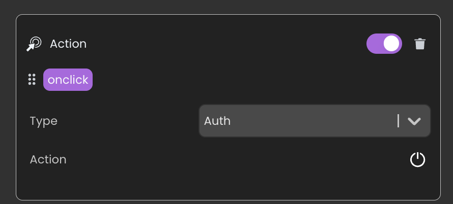

**Qodly Studio** é um construtor de interfaces para aplicações web. It provides developers with a graphical page editor to design applications running in web browsers or smartphones. Ele suporta nativamente os [objetos ORDA](../ORDA/overview.md).

Você pode usar Qodly Studio diretamente do seu **ambiente 4D** para criar interfaces modernas e sofisticadas que podem ser facilmente integradas aos seus projetos 4D existentes e implementadas **no local**.

Qodly Studio can also be used in the [**Qodly Cloud platform**](https://qodly.com), dedicated to the development of web business applications.

Qodly Studio proposes a full-featured web UI, allowing you to:

- create Qodly pages by placing components on a canvas
- map components to Qodly Sources
- acionar o código 4D configurando eventos
- e muito mais.

## Configuração

### Requisitos

#### Navegador

Qodly Studio suporta os seguintes navegadores Web:

- Chrome
- Edge
- FireFox

A resolução recomendada é 1920x1080.

#### Aplicação 4D

- Desenvolvimento: 4D v20 R2 ou superior
- Desenvolvimento: 4D Server v20 R2 ou superior
- Qodly Studio only works with 4D projects (binary databases are not supported).
- Web sessions (_aka_ Scalable sessions) must [be enabled](sessions.md#enabling-web-sessions).
- O código 4D chamado pelos formulários Qodly deve ser [hilo seguro] (preemptiveWeb.md).

### Habilitando o acesso a Qodly Studio

Por padrão, o acesso a Qodly Studio não é concedido.

Qodly Studio is served by the [WebAdmin web server](../Admin/webAdmin.md) and displays data from 4D projects handled by the [4D web server](webServer.md).

Para permitir o acesso ao Qodly Studio, você deve permiti-lo explicitamente em dois níveis:

- ao nível da aplicação 4D
- a nível do projeto

If one of the two levels (or both) are not enabled, access to Qodly Studio is denied (a 403 page is returned).

#### No nível 4D

Como primeiro nível de segurança, você precisa [permitir o acesso a Qodly Studio no servidor WebAdmin](../Admin/webAdmin.md#enable-access-to-qodly-studio). This setting applies to the 4D application (4D or 4D Server) on the host machine. Todos os projetos abertos com essa aplicação 4D consideram essa configuração.

Keep this option unchecked if you want to make sure no access to Qodly Studio is allowed on the application. Marque esta opção para ser possível acessar a Qodly Studio. No entanto, você ainda precisa habilitá-lo em todos os níveis do projeto.

Além disso, você pode [configurar a porta HTTP/HTTPS do servidor WebAdmin usada](../Admin/webAdmin.md#accept-http-connections-on-localhost).

:::note

Após qualquer alteração nessas configurações, você deve [reiniciar o servidor WebAdmin](../Admin/webAdmin.md#start-and-stop) para que a nova configuração entre em vigor.

:::

#### A nível do projeto

After you have enabled access to Qodly Studio at the 4D level, you need to explicitly designate every project that can be accessed. A opção **Ativar acesso a Qodly Studio** deve ser ativada na página [Recursos Web das Configurações da aplicação 4D](../settings/web.md#enable-access-to-qodly-studio).

Keep in mind that [user settings](../settings/overview.md) can be defined at several levels, and that priorities apply.

### Ativando autenticação

Authentication on the WebAdmin web server is granted using an access key. Para mais detalhes, consulte [Chave de Acesso](../Admin/webAdmin.md#access-key).

### Development and deployment

In accordance with the management of 4D projects, only the following usages are supported:

- o desenvolvimento com Qodly Studio deve ser feito usando **4D** (monousuário).
- implantação de aplicações 4D com páginas Qodly deve ser feita usando **4D Server**.

:::warning

You can open Qodly Studio, [debug](#using-qodly-debugger-on-4d-server) and edit Qodly pages directly on a 4D Server machine when a project is running in interpreted mode. This feature is only provided for testing and debugging purposes, for example to evaluate the application flow with actual data, or in multi-user environment. It must NOT be considered as a regular way to develop applications since it does not provide any control over concurrent accesses.

:::

## Abertura do Qodly Studio

A página Qodly Studio está disponível quando o [servidor web WebAdmin](../Admin/webAdmin.md#start-and-stop) e a autenticação está ativada (veja acima).

Há duas maneiras de acessar Qodly Studio:

- by selecting the **Qodly Studio...** menu command from the **Design** menu (4D single-user) or the **Window** menu (4D Server).
  If the WebAdmin web server is already running, depending on its configuration, your default browser opens at `IPaddress:HTTPPort/studio` or `IPaddress:HTTPSPort/studio`. Otherwise, you will be prompted if you want to start the WebAdmin web server first.

- on a browser, with the WebAdmin web server running (launched from 4D or 4D Server), enter the following address:<br/>
  `IPaddress:HTTPPort/studio`

  ou :

  `IPaddress:HTTPSPort/studio`

  For example, after launching a local web server on port 7080, type this address in your browser:

  `localhost:7080/studio`

  You will then be prompted to enter the [access key](../Admin/webAdmin.md#access-key) to access Qodly Studio.

## Developing with Qodly Studio

### Documentation

The Qodly Studio documentation is available on the [Qodly documentation website](https://developer.qodly.com/docs/studio/overview).

You can rely on this documentation and its associated resources for developing web applications powered by Qodly pages. However, depending on implementation stage, 4D developers will either use Qodly Studio or 4D IDE (see [Feature comparison](#feature-comparison)).

Code examples are provided in [QodlyScript](https://developer.qodly.com/docs/category/qodlyscript), but since QodlyScript inherits from the 4D Language, you won't be lost. Code examples are provided in [QodlyScript](https://developer.qodly.com/docs/category/qodlyscript), but since QodlyScript inherits from the 4D Language, you won't be lost.

:::info

There is no direct compatibility between apps implemented with 4D and apps implemented with Qodly.

:::

### Comparação de funcionalidades

|                                                                                         | Qodly Studio no 4D                                                                                                                                                                                                    | Qodly Studio in Qodly Cloud platform                                                |
| --------------------------------------------------------------------------------------- | --------------------------------------------------------------------------------------------------------------------------------------------------------------------------------------------------------------------- | ----------------------------------------------------------------------------------- |
| Visualizar e editar tabelas (classes de dados), atributos e relações | Editor de estrutura 4D(1)                                                                                                                                                                          | Qodly Studio Model Editor                                                           |
| Páginas Qodly                                                                           | Editor de páginas Qodly Studio                                                                                                                                                                                        | Editor de páginas Qodly Studio                                                      |
| Formulários para desktop                                                                | 4D IDE                                                                                                                                                                                                                | _não suportado_                                                                     |
| Linguagem de programação                                                                | Linguagem 4D com ORDA                                                                                                                                                                                                 | [QodlyScript](https://developer.qodly.com/docs/category/qodlyscript) featuring ORDA |
| IDE de codificação                                                                      | 4D IDE code editor _or_ VS Code with [4D-Analyzer extension](https://github.com/4d/4D-Analyzer-VSCode)<br/>_4D Server only_: Qodly Studio code editor (see (2)) | Editor de código Qodly Studio                                                       |
| Depurador                                                                               | 4D IDE debugger<br/>_4D Server only_: Qodly Studio debugger (see [this paragraph](#using-qodly-debugger-on-4d-server))                                                             | Depurador Qodly Studio                                                              |
| REST/Web roles and privileges                                                           | roles.json direct edit/Qodly Studio roles and privileges editor                                                                                                                                       | Qodly Studio role and privileges editor                                             |

Note that in 4D single-user, if you open some 4D code with the Qodly Studio code editor, syntax coloring is not available and a "Lsp not loaded" warning is displayed. (1) The **Model** item is disabled in Qodly Studio.<br/>
(2) In 4D Server, opening 4D code with the Qodly Studio code editor is supported **for testing and debugging purposes** (see [this paragraph](#development-and-deployment)).

### Línguagem

The following commands and classes are dedicated to the server-side management of Qodly pages:

- Comando [`Web Form`](../API/WebFormClass.md#web-form): retorna a página Qodly como um objeto.
- comando [`Web Event`](../API/WebFormClass.md#web-event): retorna eventos acionados nos componentes da página Qodly.
- [`WebForm`](../API/WebFormClass.md) class: functions and properties to manage the rendered Qodly page.
- Classe [`WebFormItem`](../API/WebFormItemClass.md): funções e propriedades para gerenciar componentes de página Qodly.

### Uso de métodos projeto

Recomendamos o uso de funções classe em vez de métodos projeto. Apenas as funções de classe podem ser chamadas a partir de componentes. No entanto, você ainda pode usar seus métodos projeto no Qodly Studio de duas maneiras:

- Você pode chamar seus métodos a partir de funções classe.
- You can directly [execute your methods](https://developer.qodly.com/docs/studio/coding#methods-and-classes) from the Qodly Explorer.

### Uso fora de linha

You can develop with Qodly Studio while your computer is not connected to the internet. Nesse caso, entretanto, os seguintes recursos não estão disponíveis:

- [Templates](https://developer.qodly.com/docs/studio/pageLoaders/templates): the Template library is empty
- UI tips: they are not displayed when you click on  icons.

## Implantação

### Ativação da renderização

Qodly Studio encapsulates Qodly pages, including layout, data connections, and event-driven logic, in a structured JSON file. This JSON file is processed on-the-fly by the **Qodly renderer** to serve a fully functional web page.

:::info

See [this page](https://developer.qodly.com/docs/studio/rendering) for detailed information on how to render Qodly pages in Qodly.

:::

Para ativar a renderização das páginas Qodly, as seguintes opções devem ser definidas.

- A opção **Propriedades** > **Web** > **Funcionalidades Web** > [**Expor como servidor REST**](../settings/web.md#exposed-as-rest-server) deve ser ativada.
- O [servidor Web 4D] (webServer.md) deve estar em execução.

:::note

[Renderer buttons](https://developer.qodly.com/docs/studio/rendering#how-to-render-a-webform) are not available if the configuration options are not activated.

:::

### Escopo dos formulários Qodly

Ao renderizar formulários Qodly no Qodly Studio, o renderizador se conectará ao servidor web 4D por HTTP ou HTTPS, dependendo das configurações, seguindo o mesmo padrão de conexão HTTP/HTTPS do servidor web [4D WebAdmin](../Admin/webAdmin.md#accept-http-connections-on-localhost). See also [this paragraph](#about-license_usage) about URL schemes and license usage.

Keep in mind that Qodly Studio runs through the 4D WebAdmin web server. When you use Qodly Studio as a developer, even when you preview a Qodly Page in the studio, you're using the 4D WebAdmin web server. This allows you to see dataclasses, functions and attributes that are not exposed as REST resources for example (they are greyed out).

However, page rendering happens outside Qodly Studio, and is served by the standard 4D web server. In this situation, your web application cannot access assets that are not exposed as REST resources. See [Exposed vs non-exposed functions](../ORDA/ordaClasses.md#exposed-vs-non-exposed-functions) and [Exposing tables](../REST/configuration.md#exposing-tables) for more information on how to expose assets.

### Acessar páginas Qodly

For deployment, the WebAdmin server is not necessary. End-user access to your web application made with Qodly Studio is based on the 4D REST protocol, and as such, it works as through a conventional 4D remote application.

Your Qodly pages are available through the following url:

```
IP:port/$lib/renderer/?w=QodlyPageName
```

...where _IP:port_ represents the address of the web server and _QodlyPageName_ is the name of the Qodly page.

Por exemplo:

```
https://www.myWebSite.com/$lib/renderer/?w=welcome
```

### Preview Qodly Application

You can preview your Qodly application at any moment by selecting the **Preview Qodly Application...** command in the **Windows** menu (4D Server) or in the **Design** menu (4D single-user).

This command launches the Qodly renderer on a local address in your default browser and displays the **start page** [defined in the Application settings](https://developer.qodly.com/docs/studio/settings#start-page) of Qodly Studio.

### Using Qodly debugger on 4D Server

When using Qodly pages in a deployed 4D Server application (interpreted mode), you might encounter some cases where you need to debug your pages on the server, for example when a specific user configuration is required. In this case, you can attach the [Qodly Studio debugger](https://developer.qodly.com/docs/studio/debugging) to the 4D Server and then, benefit from its features when executing your Qodly pages.

Note that in this case, the Qodly Studio debugger will display all the code executed on the server, in accordance with the [attached debugger rule on 4D Server](../Debugging/debugging-remote.md#attached-debugger).

To attach the Qodly Studio debugger to your running 4D Server application:

1. [Open Qodly Studio](#opening-qodly-studio) from 4D Server.

:::note

The project must be running in interpreted mode so that **Qodly Studio** menu item is available.

:::

2. In the Qodly Studio toolbar, click on the **Debug** button.<br/>
   

If the debug session starts successfully, a green bullet appears on the button label  and you can use the Qodly Studio debugger.

If the debugger is already attached to a another machine or another Qodly Studio page, an error is displayed. You have to detach it beforehand from the other location.

To detach the Qodly Studio debugger from your running 4D Server application:

1. Click the **Debug** button in the Qodly Studio toolbar while a debug session is active.
   A warning dialog box will prompt you to confirm whether you want to detach the debugger.
2. Select **Keep in progress** to continue evaluating the code until the end of the current method or function before detaching the debugger, or **Stop** to detach the debugger immediately.

## Force login

With Qodly Studio for 4D, the ["force login" mode](../REST/authUsers.md#force-login-mode) allows you to control the number of opened web sessions that require 4D Client licenses. You can also [logout](#logout) the user at any moment to decrement the number of retained licenses.

### Configuração

Make sure the ["force login" mode](../REST/authUsers.md#force-login-mode) is enabled for your 4D application in the [Roles and Privileges page](https://developer.qodly.com/docs/studio/roles/rolesPrivilegesOverview), using the **Force login** option:


You can also set this option directly in the [**roles.json** file](../ORDA/privileges.md#rolesjson-file).

You just need then to implemented the [`authentify()`](../REST/authUsers.md#function-authentify) function in the datastore class and call it from the Qodly page. A licence will be consumed only when the user is actually logged.

:::note Compatibidade

When the legacy login mode ([deprecated as of 4D 20 R6](https://blog.4d.com/force-login-becomes-default-for-all-rest-auth)) is enabled, any REST request, including the rendering of an authentication Qodly page, creates a web session on the server and gets a 4D Client license, whatever the actual result of the authentication. For more information, refer to [this blog post](https://blog.4d.com/improved-4d-client-licenses-usage-with-qodly-studio-for-4d) that tells the full story.

:::

#### Exemplo

In a simple Qodly page with login/password inputs, a "Submit" button calls the following `authentify()` function we have implemented in the DataStore class:

```4d

exposed Function authentify($credentials : Object) : Text

var $salesPersons : cs.SalesPersonsSelection
var $sp : cs.SalesPersonsEntity

$salesPersons:=ds.SalesPersons.query("identifier = :1"; $credentials.identifier)
$sp:=$salesPersons.first()

If ($sp#Null)
	If (Verify password hash($credentials.password; $sp.password))

		Session.clearPrivileges()
		Session.setPrivileges("") //guest session

		return "Authentication successful"
	Else
		return "Wrong password"
	End if
Else
	return "Wrong user"
End if
```

This call is accepted and as long as the authentication is not successful, `Session.setPrivileges()` is not called, thus no license is consumed. Una vez que se llama a `Session.setPrivileges()`, se utiliza una licencia de cliente de 4D y luego se acepta cualquier solicitud REST.

### Encerrar sessão

When the ["force login" mode is enabled](#setting-the-force-login-mode), Qodly Studio for 4D allows you to implement a logout feature in your application.

Para fazer o logout do usuário, basta executar a ação padrão **Logout** na página Qodly. In Qodly Studio, you can associate this standard action to a button for example:



Triggering the logout action from a web user session has the following effects:

- the current web user session loses its privileges, only [descriptive REST requests](../REST/authUsers.md#descriptive-rest-requests) are allowed,
- a licença associada ao 4D é liberada,
- the `Session.storage` is kept until the web session inactivity timeout is reached (at least one hour). During this period after a logout, if the user logs in again, the same session is used and the `Session.storage` shared object is available with its current contents.

## Sobre o uso da licença para renderização

In default mode when any page is rendered, or in "force login" mode when a page handling data or calling a function is rendered, you must have an available license, as rendering Qodly forms targets the project database's main web server.

### Esquemas URL

A configuração do esquema URL de Qodly Studio (HTTP e HTTPS) determina quantas licenças são retidas ao renderizar os formulários Qodly. With the appropriate configuration, you can avoid unnecessary license retaining.

As explained in the [configuration](#configuration) section, the WebAdmin web server provides a secured web access to Qodly Studio. On the other hand, the [renderer](#rendering-webforms) communicates with the 4D web server of the database using REST requests. Dessa forma, se comporta como um Cliente 4D convencional.

Se você executar o renderizador a partir do Qodly Studio e esses dois servidores web não forem acessados através do mesmo esquema de URL (HTTP ou HTTPS), isso pode levar a uma contagem incorreta de licenças.

:::info

Using different schemes might also lead to [session](sessions.md) issues, such as losing [privileges](../ORDA/privileges.md) after a page refresh.

:::

#### Exemplo

1. Você executa Qodly Studio em um esquema URL HTTPS (por exemplo, `https://127.0.0.1:7443/studio/`)

2. O servidor da Web do seu banco de dados é iniciado somente em uma porta HTTP.


3. No Qodly Studio, você clica no ícone **Preview**. Você está avisado que os dois servidores web estão iniciados em esquemas diferentes, mas apesar disso você clique no botão **Confirmar**.


Como resultado, duas licenças são mantidas.

:::note

You can enable/disable the display of the renderer pop over using a Qodly Studio user setting.

:::

### Atributo SameSite

O comportamento descrito anteriormente é devido ao cookie de sessão do servidor web 4D. This session cookie has a `SameSite` attribute that determines if the session cookie is sent to the web server.

If the `SameSite` attribute's value is `Strict` (default), the session cookie is not sent to the web server, so a new session is opened each time a page is rendered or refreshed.

For more information on the `SameSite` attribute, check out [this blog post](https://blog.4d.com/get-ready-for-the-new-SameSite-and-secure-attributes-for-cookies/).

### Recomendações

To avoid using more licenses than necessary, we recommend doing one of the following:

- Run the renderer on another browser tab (by entering the rendered URL of your Qodly page: `IP:port/$lib/renderer/?w=QodlyPageName`).
- Assegure-se de que o Qodly Studio e seu banco de dados sejam acessados no mesmo esquema de URL.
- Use the `Lax` value for the [session cookie](webServerConfig.md#session-cookie-samesite) of your project database's web server.
