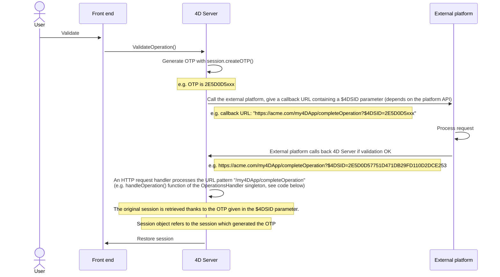
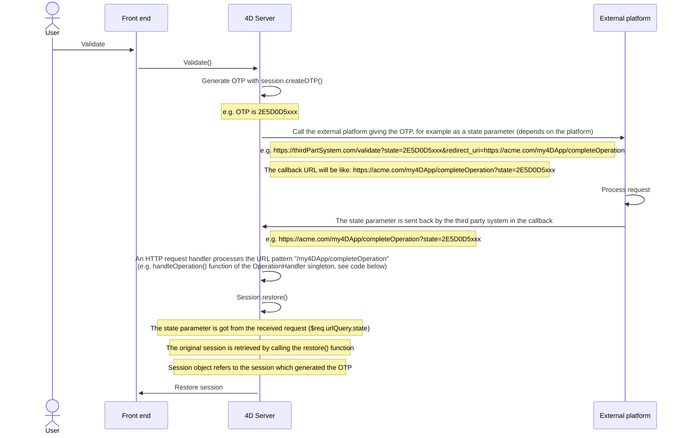

O servidor web 4D oferece recursos integrados para gerenciar **sessões web**. Creating and maintaining web sessions allows you to control and improve the user experience on your web application. When web sessions are enabled, web clients can reuse the same server context from one request to another.

As sessões Web permitem:

- manipular várias solicitações simultaneamente do mesmo cliente web através de um número ilimitado de processos preventivos (sessões web são **escaláveis**),
- gerenciar a sessão por um objeto `Session` e da [API de session](API/SessionClass.md),
- armazena e compartilha dados entre processos de um cliente web usando o [.storage](../API/SessionClass.md#storage) da sessão,
- associate privileges to the user running the session.

## Usos

As sessões Web são usadas para:

- [Aplicaciones web](gettingStarted.md) que envían peticiones http,
- calls to the [REST API](../REST/authUsers.md), which are used by [remote datastores](../ORDA/remoteDatastores.md) and [Qodly forms](qodly-studio.md).

## Activando sessões web

A funcionalidade de gerenciamento de sessão pode ser ativado e desativado no seu servidor web 4D. Existem diferentes formas de ativar a gestão de sessões:

- Using the **Scalable sessions** OTPion on the "Web/OTPions (I)" page of the Settings (permanent setting):
 

This OTPion is selected by default in new projects. It can however be disabled by selecting the **No sessions** OTPion, in which case the web session features are disabled (no `Session` object is available).

- Using the [`.scalableSession`](API/WebServerClass.md#scalablesession) property of the Web Server object (to pass in the *settings* parameter of the [`.start()`](API/WebServerClass.md#start) function). In this case, this setting overrides the OTPion defined in the Settings dialog box for the Web Server object (it is not stored on disk).

> The [`WEB SET OTPION`](../commands-legacy/web-set-option.md) command can also set the session mode for the main Web server.

Em qualquer caso, o parâmetro é local para a máquina; para poder diferir no servidor Web 4D Server e os servidores Web de máquinas 4D remotas.

> **Compatibility**: A **Legacy sessions** OTPion is available in projects created with a 4D version prior to 4D v18 R6 (for more information, please refer to the [doc.4d.com](https://doc.4d.com) web site).

## Session implementation

When [sessions are enabled](#enabling-web-sessions), automatic mechanisms are implemented, based upon a private cookie set by 4D itself: "4DSID__AppName_", where *AppName* is the name of the application project. Este cookie faz referência à sessão web atual da aplicação.

:::info

O nome do cookie pode ser obtido usando a propriedade [`.sessionCookieName`](API/WebServerClass.md#sessioncookiename).

:::

1. En cada petición del cliente web, el servidor web comprueba la presencia y el valor de la cookie privada "4DSID__AppName_".

2. Se o cookie tiver um valor, 4D procura pela sessão que criou este cookie entre as sessões existentes; Se esta sessão for encontrada, ela será reutilizada para a chamada.

3. Se a solicitação do cliente não corresponder a uma sessão já aberta:

- se crea una nueva sesión con una cookie privada "4DSID__AppName_" en el servidor web
- se crea un nuevo objeto Guest `Session` dedicado a la sesión web escalable.

:::note

La creación de una sesión web para una petición REST puede requerir que una licencia esté disponible, consulte [esta página](../REST/authUsers.md).

:::

The `Session` object of the current session can then be accessed through the [`Session`](commands/session.md) command in the code of any web processes.


:::info

Os processos Web geralmente não terminam, eles são reciclados em um pool para aumentar a eficiência. Quando um processo termina de executar uma solicitação, ele é colocado de novo no pool e disponibilizado para a próxima solicitação. Since a web process can be reused by any session, [process variables](Concepts/variables.md#process-variables) must be cleared by your code at the end of its execution (using [`CLEAR VARIABLE`](https://doc.4d.com/4dv20/help/command/en/page89.html) for example). Esta limpeza é necessária para todas as informações relacionadas ao processo, como uma referência a um arquivo aberto. Esta es la razón por la que **se recomienda** utilizar el objeto [Sesión](API/SessionClass.md) cuando se quiera guardar información relacionada con la sesión.

:::

## Armazenar e compartilhar informações de sessão

Cada objeto `Session` fornece uma propriedade [`.storage`](API/SessionClass.md#storage) que é um [objeto compartilhado](Concepts/shared.md). Essa propriedade permite que você compartilhe informações entre todos os processos manipulados pela sessão.

## Duração da sessão

Uma sessão Web escalável é encerrada quando:

- o servidor web está parado,
- o tempo limite do cookie de sessão foi atingido.

O tempo de vida de um cookie inativo é 60 minutos por padrão, o que significa que o servidor irá automaticamente fechar as sessões inativas após 60 minutos.

This timeout can be set using the [`.idleTimeout`](API/SessionClass.md#idletimeout) property of the `Session` object (the timeout cannot be less than 60 minutes) or the *connectionInfo* parameter of the [`Open datastore`](../commands/open-datastore.md) command.

Quando uma sessão Web é fechada, se o comando [`Session`](commands/session.md) for chamado posteriormente:

- el objeto `Session` no contiene privilegios (es una sesión de invitado)
- a propriedade [`storage`](API/SessionClass.md#storage) está vazia
- um novo cookie de sessão é associado à sessão

:::info

Você pode fechar uma sessão em um formulário Qodly usando o recurso [**logout**](qodly-studio.md#logout).

:::

## Privilégios

Os privilégios podem ser associados a sessões usuário Web. No servidor web, você pode fornecer acesso ou recursos específicos, dependendo dos privilégios da sessão.

Você atribui privilégios usando a função [`.setPrivileges()`](API/SessionClass.md#setprivileges). Em seu código, você pode verificar os privilégios da sessão para permitir ou negar o acesso usando a função [`.hasPrivilege()`](API/SessionClass.md#hasprivilege). By default, new sessions do not have any privilege: they are **Guest** sessions ([`.isGuest()`](API/SessionClass.md#isguest) function returns true).

Exemplo:

```4d
If (Session.hasPrivilege("WebAdmin"))
	//Access is granted, do nothing
Else
	//Display an authentication page
End if
```

:::info

Privileges are implemented at the heart of the ORDA architecture to provide developers with a powerful technology for controlling access to the datastore and dataclas functions. For more information, please refer to the [**Privileges**](../ORDA/privileges.md) page of the ORDA chapter.

:::

## Exemplo

Em uma aplicação CRM, cada vendedor gerencia seu próprio portefólio de clientes. A datastore contém pelo menos dois dataclasses ligados: Customers e SalesPersons (um vendedor tem vários clientes).


Queremos que um vendedor autentique, abra uma sessão no servidor web e que os 3 primeiros clientes sejam carregados na sessão.

1. Executamos este URL para abrir uma sessão:

```
http://localhost:8044/authenticate.shtml
```

> En un entorno de producción, es necesario utilizar una conexión [HTTPS](API/WebServerClass.md#httpsenabled) para evitar que cualquier información no cifrada circule por la red.

2. La página `authenticate.shtml` es un formulario que contiene los campos de entrada *userId* y *password* y envía una acción 4DACTION POST:

```html
<!DOCTYPE html>
<html>
<body bgcolor="#ffffff">
<FORM ACTION="/4DACTION/authenticate" METHOD=POST>
	UserId: <INPUT TYPE=TEXT NAME=userId VALUE=""><br/>
	Password: <INPUT TYPE=TEXT NAME=password VALUE=""><br/>
<INPUT TYPE=SUBMIT NAME=OK VALUE="Log In">
</FORM>
</body>
</html>
```


3. El método authenticate project busca la persona *userID* y valida la contraseña contra el valor hash ya almacenado en la tabla *SalesPersons*:

```4d
var $indexUserId; $indexPassword; $userId : Integer
var $password : Text
var $userTop3; $sales; $info : Object


ARRAY TEXT($anames; 0)
ARRAY TEXT($avalues; 0)

WEB GET VARIABLES($anames; $avalues)

$indexUserId:=Find in array($anames; "userId")
$userId:=Num($avalues{$indexUserId})

$indexPassword:=Find in array($anames; "password")
$password:=$avalues{$indexPassword}

$sales:=ds.SalesPersons.query("userId = :1"; $userId).first()

If ($sales#Null)
    If (Verify password hash($password; $sales.password))
        $info:=New object()
        $info.userName:=$sales.firstname+" "+$sales.lastname
        Session.setPrivileges($info)
        Use (Session.storage)
            If (Session.storage.myTop3=Null)
                $userTop3:=$sales.customers.orderBy("totalPurchase desc").slice(0; 3)

                Session.storage.myTop3:=$userTop3
            End if
        End use
        WEB SEND HTTP REDIRECT("/authenticationOK.shtml")
    Else
        WEB SEND TEXT("This password is wrong")
    End if
Else
    WEB SEND TEXT("This userId is unknown")
End if
```

:::note

For more examples, please refer to the [Scalable sessions for advanced web applications](https://blog.4d.com/scalable-sessions-for-advanced-web-applications/) bog post.

:::

## Session Token (OTP)

The 4D web server allows you to generate, share, and use OTP (One-Time Passcode) session tokens. OTP session tokens are used to secure communications with third-party applications or websites. For information on OTP, please refer to the [One-time password page](https://en.wikipedia.org/wiki/One-time_password) on Wikipedia.

In 4D, OTP session tokens are useful when calling external URLs and being called back in another browser or device (mobile/computer). Typically, a third-party application sends a confirmation email containing a callback link on which the user has to click. The callback link includes the OTP token, so that the session which triggered the callback is loaded along with its data and privileges. This principle allows you to share the same session on multiple devices. Thanks to this architecture, the [session cookie](#session-implementation) is not exposed on the network, which eliminates the risk of man-in-the-middle attack.

### Visão Geral

The basic sequence of an OTP session token use in a 4D web application is the following:

1. The web user initiates an action that requires a secured third-party connection, for example a validation, from within a specific session.
2. No seu código 4D, você cria um OTP para a sessão usando a função [`Session.createOTP()`](../API/SessionClass.md#createotp).
3. You send a request to the third-party application with the session token included in the callback Uri. Note that the way to provide the callback Uri to a third-party application depends on its API (see below).
4. The third-party application sends back a request to 4D with the pattern you provided in the callback Uri.
5. The request callback is processed in your application.

By definition, an OTP token can only be used once. In this scenario, if a web request is received with a session token as parameter that has already been used, the initial session is not restored.

### Processing the OTP in the callback

Callbacks from third-party applications that include the OTP token can be processed in different ways in your 4D application, depending on your development and the third-party API. Basically, you have two possibilities to handle the token: through the **`$4DSID`** parameter for an automatic processing, or through a custom parameter that you need to process.

#### Using `$4DSID` in the URL

Using the `$4DSID` parameter is the most simple way to process a callback from the third-party application:

- The OTP token is provided as a parameter directly in the callback url using the standard `?$4DSID=XXXX123` syntax.
- In 4D, you implement a dedicated [HTTP Request handler](http-request-handler.md) in your 4D application using [`IncomingMessage`](../API/IncomingMessageClass.md) and [`OutgoingMessage`](../API/OutgoingMessageClass.md) classes.
- If the `$4DSID` token is valid, the related web user session is **automatically restored** in any web process with its storage and privileges.

:::note

Um url [`4DACTION`](./httpRequests.md#4daction) também pode ser usada no lado 4D.

:::

#### Usando um parâmetro personalizado

The OTP token can also be provided as a custom parameter that you need to process specifically to restore the session. You must use this solution if:

- the third-party application does not allow to insert parameters such as a `$4DSID` directly in the redirect Uri, and provides a dedicated API (the implementation depends on the third-party application),
- or, you want to call an ORDA function through REST to process the callback, in which case you need to pass the OTP with the [REST parameter syntax](../REST/ClassFunctions.md#parameters) (e.g. `?$params='["XXX123"]'`).

In both cases, you need to extract the token from the custom parameter and to call the [`Session.restore()`](../API/SessionClass.md#restore) function with the token as parameter.

#### Processing a invalid OTP

The OTP token is considered invalid if:

- the session token has already been used,
- the session token has expired,
- the session token does not exist,
- the original session itself has expired.

In this case, no web user session is restored and the current session (if any) is left unchanged. Usually, you can decide to display a login page or to open a guest session.

Verifying if the received OTP token is valid depends on how it was handled:

- If you used a `$4DSID`, you can store a custom status property in the [session storage](../API/SessionClass.md#storage) at the moment of the token creation, and check this status once the OTP token was received to see if it is the same value (see example).
- Se você usou a função [`Session.restore()`](../API/SessionClass.md#restore), ele retorna verdadeiro se a sessão foi restaurada corretamente.

### Scenario with $4DSID

The scenario using the `$4DSID` key is illustrated in the following diagram:



The 4D HTTP request handler definition:

```json
[
  {
    "class": "OperationsHandler",
    "method": "handleOperation",
    "regexPattern": "/my4DApp/completeOperation",
    "verbs": "get"
  }
]
```

The singleton class:

```4d
//Class OperationsHandler
shared singleton Class constructor()
    function handleOperation($request : 4D.IncomingMessage) 
    $session:=Session
```

### Scenario with `restore` function

The scenario using a custom parameter is illustrated in the following diagram:



The 4D HTTP request handler definition:

```json
[
  {
    "class": "OperationsHandler",
    "method": "handleOperation",
    "regexPattern": "/my4DApp/completeOperation",
    "verbs": "get"
  }
]
```

The singleton class:

```4d
//Class OperationsHandler
shared singleton Class constructor()
    Function handleOperation($req : 4D.IncomingMessage) : 4D.OutgoingMessage
    Session.restore($req.urlQuery.state)
```

### Example of email validation with $4DSID

1. A user account is created in a *Users* dataclass. A *$info* object is received with the email and password. An OTP corresponding to the current session is generated. An URL is then returned with this OTP given in the $4DSID parameter.

```4d
//cs.Users class

Function create($info : Object) : Text
	
var $user : cs.UsersEntity
var $status : Object
var $token : Text
	
$user:=This.new() //create a new user
$user.fromObject($info)
$status:=$user.save()
	
//Store information in the session
//including user creation status
Use (Session.storage)
	Session.storage.status:=New shared object("step"; "Waiting for validation email"; /
    "email"; $user.email; "ID"; $user.ID)
End use 
	
//Generate an OTP corresponding to the session
$token:=Session.createOTP()

// Return an URL with a $4DSID parameter
return "https://my.server.com/tools/validateEmail?$4DSID="+$token`

```

2. The user is sent this URL as a link in an email. The URL prefix `/validateEmail` is handled by a [custom HTTP request handler](./http-request-handler.md):

```json
[
  {
    "class": "RequestHandler",
    "method": "validateEmail",
    "regexPattern": "/validateEmail",
    "verbs": "get"
  }
]
```

The *validateEmail()* function of the RequestHandler singleton:

```4d
//validateEmail class

shared singleton Class constructor()

Function validateEmail() : 4D.OutgoingMessage
	
 var $result:=4D.OutgoingMessage.new()
    //The session which generated the OTP is retrieved 
    //thanks to the $4DSID parameter given in the URL
 If (Session.storage.status.step="Waiting for validation email")
	
  $user:=ds.Users.get(Session.storage.status.ID)
  $user.emailValidated() //set to true
		
  $result.setBody("Congratulations <br>"\
  +"Your email "+Session.storage.status.email+" has been validated")
		
  $result.setHeader("Content-Type"; "text/html"	
  Use (Session.storage.status)
	Session.storage.status.step:="Email validated"
  End use
 Else
  $result.setBody("Invalid token")

 End if 
	
 return $result

```

Since the `$4DSID` parameter contains a valid OTP corresponding to the original session, the `Session` object refers to the session that created the OTP.

A new user is created, and some information is stored in the session, especially the current step of the user account creation process (Waiting for validation email) and the user ID.

### Supported contexts

- Both HTTP and HTTPS schemas are supported.
- Apenas [sessões escaláveis](#enabling-web-sessions) podem ser reutilizadas com tokens.
- Only sessions of the host database can be reused (sessions created in component web servers cannot be restored).
- Tokens are not supported with client/server sessions or single-user sessions.

### Lifespan

A session token has a lifespan, and the session itself has a lifespan. O tempo de vida útil do token de sessão pode ser definido [na criação do token](../API/SessionClass.md#createotp). By default, the token lifespan is the same value as the [`.idleTimeout`](../API/SessionClass.md#idletimeout) value.

A session is only restored by a token if both the session token lifespan and the session lifespan have not expired. In other cases (the session token has expired and/or the session itself has expired), a guest session is created when a web request with a session token is received.

:::note

For more information, please refer to the [Connect Your Web Apps to Third-Party Systems](https://blog.4d.com/connect-your-web-apps-to-third-party-systems/) blog post.

:::