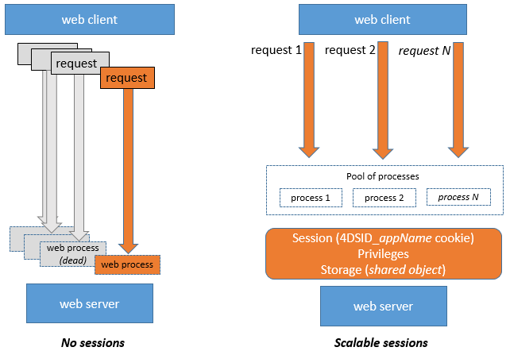
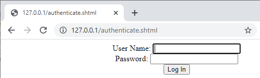

O servidor web 4D oferece recursos integrados para gerenciar **sessões web**. Creating and maintaining web sessions allows you to control and improve the user experience on your web application. When web sessions are enabled, web clients can reuse the same server context from one request to another.

As sessões Web permitem:

- manipular várias solicitações simultaneamente do mesmo cliente web através de um número ilimitado de processos preventivos (sessões web são **escaláveis**),
- manage session through a `Session` object and the [Session API](API/SessionClass.md),
- store and share data between processes of a web client using the [.storage](../API/SessionClass.md#storage) of the session,
- associate privileges to the user running the session.

## Usos

As sessões Web são usadas para:

- [Aplicaciones web](gettingStarted.md) que envían peticiones http,
- calls to the [REST API](../REST/authUsers.md), which are used by [remote datastores](../ORDA/remoteDatastores.md) and [Qodly forms](qodly-studio.md).

## Activando sessões web

The session management feature can be enabled and disabled on your 4D web server. Existem diferentes formas de ativar a gestão de sessões:

- Usando a opção **Sessões escalonáveis** na página "Web/Opções (I)" das Propriedades (configuração permanente):
  

Esta opção é selecionada por defeito nos novos projetos. Sin embargo, se puede desactivar seleccionando la opción **Sin sesiones**, en cuyo caso las funcionalidades de la sesión web se desactivan (no hay ningún objeto `Session` disponible).

- Using the [`.scalableSession`](API/WebServerClass.md#scalablesession) property of the Web Server object (to pass in the _settings_ parameter of the [`.start()`](API/WebServerClass.md#start) function). In this case, this setting overrides the option defined in the Settings dialog box for the Web Server object (it is not stored on disk).

> El comando `WEB SET OPTION` también puede establecer el modo de sesión para el servidor web principal.

In any cases, the setting is local to the machine; so it can be different on the 4D Server Web server and the Web servers of remote 4D machines.

> **Compatibilidad**: una opción **Sesiones legacy** está disponible en proyectos creados con una versión de 4D anterior a 4D v18 R6 (para más información, consulte el sitio web [doc.4d.com](https://doc.4d.com)).

## Session implementation

Cuando [se habilitan las sesiones](#enabling-sessions), se implementan mecanismos automáticos, basados en una cookie privada establecida por el propio 4D: "4DSID__AppName_", donde _AppName_ es el nombre del proyecto de la aplicación. Este cookie faz referência à sessão web atual da aplicação.

:::info

O nome do cookie pode ser obtido usando a propriedade [`.sessionCookieName`](API/WebServerClass.md#sessioncookiename).

:::

1. En cada petición del cliente web, el servidor web comprueba la presencia y el valor de la cookie privada "4DSID__AppName_".

2. If the cookie has a value, 4D looks for the session that created this cookie among the existing sessions; if this session is found, it is reused for the call.

3. Se a solicitação do cliente não corresponder a uma sessão já aberta:

- se crea una nueva sesión con una cookie privada "4DSID__AppName_" en el servidor web
- se crea un nuevo objeto Guest `Session` dedicado a la sesión web escalable.

:::note

La creación de una sesión web para una petición REST puede requerir que una licencia esté disponible, consulte [esta página](../REST/authUsers.md).

:::

The `Session` object of the current session can then be accessed through the [`Session`](commands/session.md) command in the code of any web processes.



:::info

Os processos Web geralmente não terminam, eles são reciclados em um pool para aumentar a eficiência. When a process finishes executing a request, it is put back in the pool and made available for the next request. Since a web process can be reused by any session, [process variables](Concepts/variables.md#process-variables) must be cleared by your code at the end of its execution (using [`CLEAR VARIABLE`](https://doc.4d.com/4dv20/help/command/en/page89.html) for example). This cleanup is necessary for any process related information, such as a reference to an opened file. Esta es la razón por la que **se recomienda** utilizar el objeto [Sesión](API/SessionClass.md) cuando se quiera guardar información relacionada con la sesión.

:::

## Armazenar e compartilhar informações de sessão

Each `Session` object provides a [`.storage`](API/SessionClass.md#storage) property which is a [shared object](Concepts/shared.md). This property allows you to share information between all processes handled by the session.

## Duração da sessão

Uma sessão Web escalável é encerrada quando:

- o servidor web está parado,
- o tempo limite do cookie de sessão foi atingido.

The lifespan of an inactive cookie is 60 minutes by default, which means that the web server will automatically close inactive sessions after 60 minutes.

This timeout can be set using the [`.idleTimeout`](API/SessionClass.md#idletimeout) property of the `Session` object (the timeout cannot be less than 60 minutes) or the _connectionInfo_ parameter of the [`Open datastore`](../commands/open-datastore.md) command.

When a web session is closed, if the [`Session`](commands/session.md) command is called afterwards:

- el objeto `Session` no contiene privilegios (es una sesión de invitado)
- a propriedade [`storage`](API/SessionClass.md#storage) está vazia
- um novo cookie de sessão é associado à sessão

:::info

Você pode fechar uma sessão em um formulário Qodly usando o recurso [**logout**](qodly-studio.md#logout).

:::

## Privilégios

Os privilégios podem ser associados a sessões usuário Web. On the web server, you can provide specific access or features depending on the privileges of the session.

Você atribui privilégios usando a função [`.setPrivileges()`](API/SessionClass.md#setprivileges). In your code, you can check the session's privileges to allow or deny access using the [`.hasPrivilege()`](API/SessionClass.md#hasprivilege) function. By default, new sessions do not have any privilege: they are **Guest** sessions ([`.isGuest()`](API/SessionClass.md#isguest) function returns true).

Exemplo:

```4d
If (Session.hasPrivilege("WebAdmin"))
	//Access is granted, do nothing
Else
	//Display an authentication page
End if
```

:::info

Privileges are implemented at the heart of the ORDA architecture to provide developers with a powerful technology for controlling access to the datastore and dataclas functions. For more information, please refer to the [**Privileges**](../ORDA/privileges.md) page of the ORDA chapter.

:::

## Exemplo

Em uma aplicação CRM, cada vendedor gerencia seu próprio portefólio de clientes. The datastore contains at least two linked dataclasses: Customers and SalesPersons (a salesperson has several customers).


We want a salesperson to authenticate, open a session on the web server, and have the top 3 customers be loaded in the session.

1. Executamos este URL para abrir uma sessão:

```
http://localhost:8044/authenticate.shtml
```

> En un entorno de producción, es necesario utilizar una conexión [HTTPS](API/WebServerClass.md#httpsenabled) para evitar que cualquier información no cifrada circule por la red.

2. La página `authenticate.shtml` es un formulario que contiene los campos de entrada _userId_ y _password_ y envía una acción 4DACTION POST:

```html
<!DOCTYPE html>
<html>
<body bgcolor="#ffffff">
<FORM ACTION="/4DACTION/authenticate" METHOD=POST>
	UserId: <INPUT TYPE=TEXT NAME=userId VALUE=""><br/>
	Password: <INPUT TYPE=TEXT NAME=password VALUE=""><br/>
<INPUT TYPE=SUBMIT NAME=OK VALUE="Log In">
</FORM>
</body>
</html>
```



3. El método authenticate project busca la persona _userID_ y valida la contraseña contra el valor hash ya almacenado en la tabla _SalesPersons_:

```4d
var $indexUserId; $indexPassword; $userId : Integer
var $password : Text
var $userTop3; $sales; $info : Object


ARRAY TEXT($anames; 0)
ARRAY TEXT($avalues; 0)

WEB GET VARIABLES($anames; $avalues)

$indexUserId:=Find in array($anames; "userId")
$userId:=Num($avalues{$indexUserId})

$indexPassword:=Find in array($anames; "password")
$password:=$avalues{$indexPassword}

$sales:=ds.SalesPersons.query("userId = :1"; $userId).first()

If ($sales#Null)
    If (Verify password hash($password; $sales.password))
        $info:=New object()
        $info.userName:=$sales.firstname+" "+$sales.lastname
        Session.setPrivileges($info)
        Use (Session.storage)
            If (Session.storage.myTop3=Null)
                $userTop3:=$sales.customers.orderBy("totalPurchase desc").slice(0; 3)

                Session.storage.myTop3:=$userTop3
            End if
        End use
        WEB SEND HTTP REDIRECT("/authenticationOK.shtml")
    Else
        WEB SEND TEXT("This password is wrong")
    End if
Else
    WEB SEND TEXT("This userId is unknown")
End if
```

## Ver também (post do blog)

[Scalable sessions for advanced web applications](https://blog.4d.com/scalable-sessions-for-advanced-web-applications/)
