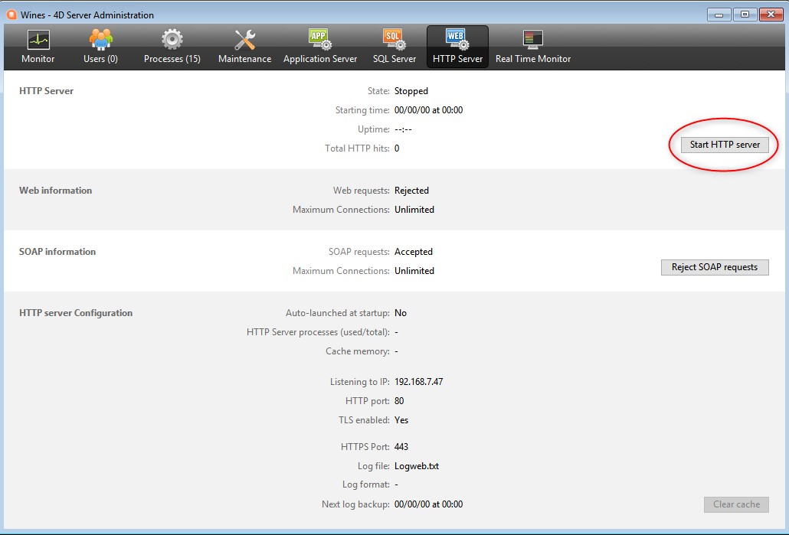

4D provides several integrated tools to start, stop, or monitor the integrated web server.

## Iniciando o servidor Web 4D

> To be able to launch the web server of 4D or 4D Server, you must have a "4D Web Application" license. Para más información, consulte el [sitio web de 4D](https://www.4d.com).

A 4D project can start and monitor a web server for the main (host) application as well as for each hosted component.

O servidor web principal de 4D pode ser iniciado de diferentes maneiras:

- Utilizar um botão/comando de menu.
  - 4D: menu **Executar\>Iniciar o servidor Web**  
  - 4D Server: botão **Iniciar servidor HTTP** da página Servidor HTTP 

- Inicia automaticamente cada vez que a aplicação 4D é aberta. To do this, display the **Web\/Configuration** page of the Settings and select the **Launch Web Server at Startup** check box: 

- Programmatically, by calling the [`webServer.start()`](API/WebServerClass.md#start) function or `WEB START SERVER` command.

The web server of any component can be launched by calling the [`webServer.start()`](API/WebServerClass.md#start) function on the component's web server object.

> You do not need to relaunch the 4D application to start or stop the web server.

## Parando o servidor Web 4D

O servidor web principal de 4D pode ser parado de diferentes maneiras:

- Utilizando el menú 4D **Ejecución\>Detener el servidor Web**, o vía el botón **Detener el servidor HTTP** de la página Servidor HTTP de 4D Server (ambos elementos muestran **Iniciar...** cuando el servidor no está ya iniciado).

- Programmatically, by calling the [`webServer.stop()`](API/WebServerClass.md#stop) function or `WEB STOP SERVER` command.

El servidor web de cualquier componente puede detenerse llamando a la función `webServer.stop()` en el objeto servidor web del componente.

## Teste do Servidor Web 4D

El comando **Test Web Server** puede utilizarse para asegurarse de que el servidor web integrado funciona correctamente (sólo en 4D). Este comando es accesible en el menú **Ejecutar** cuando se lanza el servidor web:

When you select this command, the home page of the website published by the 4D application is displayed in a window of your default web browser:

This command lets you verify that the web server, home page display, etc. work correctly. La página se llama utilizando la URL _localhost_, que es el atajo estándar que designa la dirección IP de la máquina en la que se ejecuta el navegador web. El comando tiene en cuenta el número de [puerto de publicación TCP](#http-port) especificado en los parámetros.

## Limpar a cache

At any moment, you can clear the cache of the pages and images that it contains (if, for example, you have modified a static page and you want to reload it in the cache).

Para o fazer, pode:

- 4D: haga clic en el botón **Borrar la caché** de la página [Web/Opciones (I)](../settings/web.md) de la caja de diálogo Parámetros.
- 4D Server: haga clic en el botón **Borrar la caché** de la página HTTP de la ventana Administración de 4D Server.

A cache é então imediatamente limpa.

> También puede utilizar la URL [/4DCACHECLEAR](#cacheclear).

## Explorador de execução

La página **Watch** (sección **Web**) del Explorador de ejecución muestra la información del servidor web, en particular:

- **Uso de la caché web**: indica el número de páginas presentes en la caché web así como su porcentaje de uso. This information is only available if the web server is active and if the cache size is greater than 0.

- **Tiempo de actividad del servidor web**: indica la duración del uso (en formato horas:minutos:segundos) del servidor web. Esta informação só está disponível se o servidor Web estiver ativo.

- **Conteo de visitas web**: indica el número total de peticiones HTTP recibidas desde el arranque del servidor web, así como un número instantáneo de peticiones por segundo (medida tomada entre dos actualizaciones del Explorador de ejecución). Esta informação só está disponível se o servidor Web estiver ativo.

## URLs de administração

Website administration URLS allow you to control the website published on your server. 4D Web Server acepta cuatro URLs específicas: _/4DSTATS_, _/4DHTMLSTATS_, /_4DCACHECLEAR_ y _/4DWEBTEST_.

> _/4DSTATS_, _/4DHTMLSTATS_ y _/4DCACHECLEAR_ sólo están disponibles para el diseñador y el administrador de la base de datos. If the 4D password system has not been activated, these URLs are available to all the users. /4DWEBTEST está sempre disponível.

### /4DSTATS

La URL **/4DSTATS** devuelve varios elementos de información en una tabla HTML (visualizable en un navegador):

| Elemento                | Descrição                                                            |
| ----------------------- | -------------------------------------------------------------------- |
| Tamanho actual da cache | Tamanho atual da cache do servidor Web (em bytes) |
| Tamanho máximo da cache | Tamanho máximo da cache (em bytes)                |
| Cached Object Max Size  | Tamanho máximo de cada objeto na cache (em bytes) |
| Cache Use               | Porcentagem do cache usado                                           |
| Cached Objects          | Número de objetos encontrados en la caché, **incluyendo imágenes**   |

This information can allow you to check the functioning of your server and eventually adapt the corresponding parameters.

> El comando `WEB GET STATISTICS` permite obtener también información sobre cómo se está utilizando la caché de las páginas estáticas.

### /4DHTMLSTATS

La URL _/4DHTMLSTATS_ devuelve, también como una HTML, la misma información que la URL _/4DSTATS_. La diferencia es que el campo **Cached Objects** sólo cuenta las páginas HTML (sin contar los archivos de imágenes). Además, esta URL devuelve el campo **Objetos filtrados**.

| Elemento                | Descrição                                                               |
| ----------------------- | ----------------------------------------------------------------------- |
| Tamanho actual da cache | Tamanho atual da cache do servidor Web (em bytes)    |
| Tamanho máximo da cache | Tamanho máximo da cache (em bytes)                   |
| Cached Object Max Size  | Tamanho máximo de cada objeto na cache (em bytes)    |
| Cache Use               | Porcentagem do cache usado                                              |
| Cached Objects          | Número de objetos encontrados en la caché, **sin imágenes**             |
| Objectos filtrados      | Número de objetos no cache não contados por URL, em particular, imagens |

### /4DCACHECLEAR

La URL _/4DCACHECLEAR_ elimina inmediatamente las páginas estáticas y las imágenes de la caché. It allows you to therefore “force” the update of the pages that have been modified.

### /4DWEBTEST

La URL _/4DWEBTEST_ permite verificar el estado del servidor web. Quando esse URL é chamado, 4D retorna um arquivo texto com os campos HTTP seguintes preenchidos:

| Campo HTTP | Descrição                                           | Exemplo                                                                                                                                                                                                                                                                                                                                            |
| ---------- | --------------------------------------------------- | -------------------------------------------------------------------------------------------------------------------------------------------------------------------------------------------------------------------------------------------------------------------------------------------------------------------------------------------------- |
| Date       | data atual no formato RFC 822                       | Mon, 7 Dec 2020 13:12:50 GMT                                                                                                                                                                                                                                                                                       |
| Server     | 4D/número da versão                                 | 4D/18.5.0 (Build 18R5.257368)                                                                                                                                                                                                                                                   |
| User-Agent | nome e versão @ endereço IP do cliente | Mozilla/5.0 (Windows NT 10.0; Win64; x64) AppleWebKit/537.36 (KHTML, like Gecko) Chrome/86.0.4240.183 Safari/537.36 @ 127.0.0.1 |

## Logs

4D permite gerar dois logs de pedidos web:

- un historial de depuración, útil en la fase de desarrollo del servidor web (_HTTPDebugLog.txt_),
- un historial estandarizado de peticiones web, más bien utilizado con fines estadísticos (_logweb.txt_).

Ambos archivos de historial se crean automáticamente en la carpeta **Logs** del proyecto de aplicación.

### HTTPDebugLog.txt

The [http debug file](webServerConfig.md#debug-log) can be enabled using the [`web server` object](webServerObject.md) or the `WEB SET OPTION` command.

Este arquivo registra cada petição HTTP e cada resposta em modo raw (não processado). Petições inteiras, incluindo cabeçalhos, são registradas; opcionalmente, partes do corpo podem ser registradas também.

Os campos abaixo são registrados tanto para Request quanto para Response:

| Campo nome     | Descrição                                                                      |
| -------------- | ------------------------------------------------------------------------------ |
| SocketID       | ID da socked usada para comunicação                                            |
| PeerIP         | Endereço IPv4 do host (cliente)                             |
| PeerPort       | Porta usada por host (cliente)                              |
| TimeStamp      | Timestamp em milisegundos (desde início sistema)            |
| ConnectionID   | Connection UUID (UUID de VTCPSocket usada para comunicação) |
| SequenceNumber | Número de operação único e sequencial da sessão de histórico                   |

### logweb.txt

The [web log recording file](webServerConfig.md#log-recording) can be enabled using the [`web server` object](webServerObject.md), the `WEB SET OPTION` command, or the **Web/Log (type)** page of the settings. É necessário selecionar o formato do registo.

#### CLF/DLF

Each line of the file represents a request, such as: _host rfc931 user \[DD/MMM/YYYY:HH:MM:SS] "request" state length_ Each field is separated by a space and each line ends by the CR/LF sequence (character 13, character 10).

DLF (Combined Log Format) format is similar to CLF (Common Log Format) format and uses exactly the same structure. Simplesmente adiciona dois campos HTTP adicionais no final de cada solicitação: Referer e User-agent. Eis a descrição dos formatos CLF/DLF (não personalizáveis):

| Campo nome                                                           | Descrição                                                                                                                                                                                                                                                                                                                                                               |
| -------------------------------------------------------------------- | ----------------------------------------------------------------------------------------------------------------------------------------------------------------------------------------------------------------------------------------------------------------------------------------------------------------------------------------------------------------------- |
| host                                                                 | Endereço IP do cliente (por exemplo: 192.100.100.10)                                                                                                                                                                                                                                 |
| rfc931                                                               | informação não gerada por 4D, é sempre - (um sinal de menos                                                                                                                                                                                                                                                                                          |
| user                                                                 | nome de usuário conforme é autenticado, ou então é - (um sinal de menos). Se o nome de usuário contiver espaços, eles serão substituídos por _ (um sublinhado).                                                                                                              |
| DD/MMM/YYYY:HH:MM:SS | DD: day, MMM: a 3-letter abbreviation for the month name (Jan, Feb,...), YYYY: year, HH: hour, MM: minutes, SS: seconds. A data e a hora são locais para o servidor. |
| request                                                              | petição enviada pelo cliente (por exemplo, GET /index.htm HTTP/1.0                                                                                                                                                                                                                                                   |
| state                                                                | resposta dada pelo servidor                                                                                                                                                                                                                                                                                                                                             |
| length                                                               | tamanho dos dados retornados (HTTP header exceto) ou 0                                                                                                                                                                                                                                                                                               |
| Referer                                                              | DLF apenas- Contém a URL da página apontando para o documento solicitado.                                                                                                                                                                                                                                                                               |
| User-agent                                                           | DLF only- Contains the name and version of the browser or software of the client at the origin of the request                                                                                                                                                                                                                                                           |

#### ELF/WLF

O formato ELF (Extended Log Format) é muito difundido no mundo dos navegadores HTTP. Ele pode ser usado para criar registros sofisticados que atendam a necessidades específicas. For this reason, the ELF format can be customized: it is possible to choose the fields to be recorded as well as their order of insertion into the file.

The WLF (WebStar Log Format) was developed specifically for the 4D WebSTAR server.

##### Configuração dos campos

When you choose the ELF or WLF format, the “Web Log Token Selection” area displays the fields available for the chosen format. You will need to select each field to be included in the log. To do so, check the desired fields. Para o efeito, assinalar os campos pretendidos.

> Não é possível selecionar o mesmo campo duas vezes.

The following table lists the fields available for each format (in alphabetical order) and describes its contents:

| Campo                                                  | ELF | WLF | Valor                                                                                                                                                                                                                                    |
| ------------------------------------------------------ | --- | --- | ---------------------------------------------------------------------------------------------------------------------------------------------------------------------------------------------------------------------------------------- |
| BYTES_RECEIVED                    |     | X   | Número de bytes recebidos pelo servidor                                                                                                                                                                                                  |
| BYTES_SENT                        | X   | X   | Número de bytes enviados pelo servidor ao cliente                                                                                                                                                                                        |
| C_DNS                             | X   | X   | Endereço IP do DNS (ELF: campo idêntico ao campo C_IP)                                                                                                                           |
| C_IP                              | X   | X   | Endereço IP do cliente (por exemplo, 192.100.100.10)                                                                                                                  |
| CONNECTION_ID                     |     | X   | Número de identificação da ligação                                                                                                                                                                                                       |
| CS(COOKIE)                          | X   | X   | Informações sobre as cookies contidas na petição HTTP                                                                                                                                                                                    |
| CS(HOST)                            | X   | X   | Campo Host do pedido HTTP                                                                                                                                                                                                                |
| CS(REFERER)                         | X   | X   | URL da página que aponta para o documento solicitado                                                                                                                                                                                     |
| CS(USER_AGENT) | X   | X   | Informações sobre o software e o sistema operacional do cliente                                                                                                                                                                          |
| CS_SIP                            | X   | X   | Endereço IP do servidor                                                                                                                                                                                                                  |
| CS_URI                            | X   | X   | URI onde o pedido é efectuado                                                                                                                                                                                                            |
| CS_URI_QUERY | X   | X   | Parâmetros da consulta                                                                                                                                                                                                                   |
| CS_URI_STEM  | X   | X   | Parte da solicitação sem parâmetros de consulta                                                                                                                                                                                          |
| DATE                                                   | X   | X   | DDD: dia, MMM: abreviação de 3 letras por mês (jan, fev, etc.), YYYY: ano                                                                             |
| METHOD                                                 | X   | X   | Método HTTP utilizado para o pedido enviado ao servidor                                                                                                                                                                                  |
| PATH_ARGS                         |     | X   | Parâmetros CGI: cadeia de caracteres localizada após o carácter "$"                                                                                                                                                      |
| STATUS                                                 | X   | X   | Resposta fornecida pelo servidor                                                                                                                                                                                                         |
| TIME                                                   | X   | X   | HH: hora, MM: minutos, SS: segundos                                                                                                                                                      |
| TRANSFER_TIME                     | X   | X   | Tempo solicitado pelo servidor para gerar a resposta                                                                                                                                                                                     |
| USER                                                   | X   | X   | Nome do usuário se estiver autenticado; caso contrário, - (sinal de menos). Se o nome do usuário contiver espaços, eles serão substituídos por _ (sublinhado) |
| URL                                                    |     | X   | URL solicitado pelo cliente                                                                                                                                                                                                              |

> As datas e horas são indicadas em GMT.

#### Frequência do backup

Dado que un archivo _logweb.txt_ puede llegar a ser considerablemente grande, es posible establecer un mecanismo de archivo automático. The triggering of a backup can be based on a certain period of time (expressed in hours, days, week or months), or based on the file size; when the set deadline (or file size) is reached, 4D automatically closes and archives the current log file and creates a new one.

Cuando se activa la copia de seguridad del archivo de registro web, el archivo de registro se archiva en una carpeta llamada "Archivos Logweb", que se crea en el mismo nivel que el archivo _logweb.txt_.

The archived file is renamed based on the following example: “DYYYY_MM_DD_Thh_mm_ss.txt.” For instance, for a file archived on September 4, 2020 at 3:50 p.m. and 7 seconds: and 7 seconds: e 7 segundos: “D2020_09_04_T15_50_07.txt.”

#### Parâmetros de backup

Los parámetros de copia de seguridad automáticadel logweb.txt se definen en la página **Web/Log (copia de seguridad)** de los parámetros:

First you must choose the frequency (days, weeks, etc.) or the file size limit criterion by clicking on the corresponding radio button. Você deve então especificar o momento exato do backup, se necessário.

- **Sin copia de seguridad**: la función de copia de seguridad programada está desactivada.

- **Cada X hora(s)**: esta opción se utiliza para programar las copias de seguridad con una base horaria. Pode digitar um valor entre 1 e 24.
  - **a partir de**: permite definir la hora de activación de la primera copia de seguridad.

- **Cada X día(s) a las X**: esta opción se utiliza para programar las copias de seguridad con una base diaria. Introduza 1 se pretender efetuar uma cópia de segurança diária. When this option is checked, you must indicate the time when the backup must be started.

- **Cada X semana(s), día a las X**: esta opción se utiliza para programar las copias de seguridad con una base semanal. Digite 1 se quiser realizar o backup 1 vez por semana. Digite 1 se quiser realizar o backup 1 vez por semana. Enter 1 if you want to perform a weekly backup. When this option is checked, you must indicate the day(s) of the week and the time when each backup must be started.

- **Cada X mes(es), el día X a las X**: esta opción se utiliza para programar las copias de seguridad con una base mensual. Digite 1 se quiser realizar uma cópia de segurança mensal. Digite 1 se quiser realizar uma cópia de segurança mensal.

- **Todos los X MB**: esta opción se utiliza para programar las copias de seguridad en función del tamaño del archivo de registro actual. Um backup é acionado automaticamente quando o arquivo atinge o tamanho definido. Pode definir um limite de tamanho de 1, 10, 100 ou 1000 MB.
