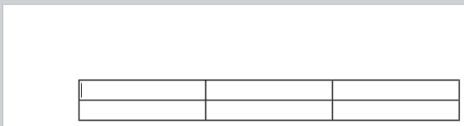

<!--REF #_command_.WP Insert table.Syntax-->**WP Insert table** ( *objFaixa* ; *modo* {; *atFaixa* {; *numCol* {; *numFilas*}}} ) -> Resultado<!-- END REF-->
<!--REF #_command_.WP Insert table.Params-->
| Parâmetro | Tipo |  | Descrição |
| --- | --- | --- | --- |
| objFaixa | Object | &#8594;  | Objeto Faixa de seleção |
| modo | Integer | &#8594;  | Modo inserção |
| atFaixa | Integer | &#8594;  | Modo de atualização da faixa |
| numCol | Integer | &#8594;  | Número de colunas a estabelecer na tabela |
| numFilas | Integer | &#8594;  | Numero de filas a estabelecer na tabela |
| Resultado | Object | &#8592; | Objeto referência tabela |

<!-- END REF-->

#### Descrição 

<!--REF #_command_.WP Insert table.Summary-->O comando **WP Insert table**insere uma nova tabela em *objRango* de acordo com o *modo* de inserçao especificado e retorna o novo objeto de tabela correspondente.<!-- END REF--> Opcionalmente, pode passar um parametro *actRango* assim como um número predefinido de colunas e filas em *numCol* e *numFilas*.

Em *objFaixa*, passe .

* um intervalo de seleção
* um elemento (tabela / parágrafo / corpo / cabeçalho / rodapé / imagem inline / seção / subseção)
* um documento 4D Write Pro.

**Nota:** não é possível inserir uma tabela dentro de outra tabela (um erro é retornado).

No parâmetro *modo*, passe uma das seguintes constantes para indicar o modo de inserção que se utilizará para a tabela no documento:

| Constante  | Tipo          | Valor | Comentário                                                                                                           |
| ---------- | ------------- | ----- | -------------------------------------------------------------------------------------------------------------------- |
| wk append  | Inteiro longo | 2     | Insere conteúdos ao final da faixa e atualiza a faixa para conter tanto os conteúdos anteriores quanto os inseridos. |
| wk prepend | Inteiro longo | 1     | Conteúdos inseridos no início da faixa e atualiza a faixa para conter os conteúdos anteriores e os inseridos         |
| wk replace | Inteiro longo | 0     | Substituir e atualizar conteúdos da faixa; a nova faixa contèm os conteúdos inseridos.                               |

* Se *objRange for* uma range, pode utilizar o parâmetro opcional *actRange*, para passar uma das constantes abaixo para especificar se a tabela inserida se inclui ou não na range resultante:  

| Constante             | Tipo          | Valor | Comentário                                                                                     |  
| --------------------- | ------------- | ----- | ---------------------------------------------------------------------------------------------- |  
| wk exclude from range | Inteiro longo | 1     | Insere conteùdos ao fim da faixa e atualiza a faixa para menter apenas conteúdos anteriores.   |  
| wk include in range   | Inteiro longo | 0     | Insere conteúdos ao início da faixa e atualiza a faixa para manter apenas conteúdos anteriores |  
    
Se não passar um parâmetro *atRange*, de forma pré-determinada, a tabela inserida é incluida na range resultante.
* se *alvoObj* não for uma range, *rangeUpdate* é ignorada.

Pode passar em *numCol* e *numFilas* o número de colunas e filas a definir na tabela. Como padrão, se forem omimtidos *numCol* e *numFilas*, se cria uma nova tabela com coluna 0 e fila 0\. A seguir, poderá agregar estes elementos utilizando o comando [WP Table append row](../commands/wp-table-append-row.md).

O comando devolve a nova tabela como um objeto de tabela, que pode passar a seguir aos demais comandos de tabela WP. A tabela foi criada com os atributos predeterminados de fonte, borda e cor que pode personalizar utilizando o comando [WP SET ATTRIBUTES](../commands/wp-set-attributes.md).

#### Exemplo 

Em um documento em branco, se desejar agregar uma nova tabela com 3 colunas e 2 filas:

```4d
 var $WPRange;$WPTable : Object
 $WPRange:=WP Text range(WParea;wk start text;wk end text)
 $WPTable:=WP Insert table($WPRange;wk append;wk exclude from range;3;2)
```

Resultado:



#### Ver também 

[WP Table append row](../commands/wp-table-append-row.md)  
[WP Table get rows](wp-table-get-rows.md)  