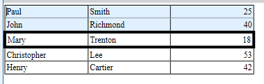

<!--REF #_command_.WP Table get rows.Syntax-->**WP Table get rows** ( *objAlvo* ) | ( *refTab* ; *iniFila* {; *numFilas*} )  -> Resultado<!-- END REF-->
<!--REF #_command_.WP Table get rows.Params-->
| Parâmetro | Tipo |  | Descrição |
| --- | --- | --- | --- |
| objAlvo | Object | &#8594;  | intervalo ou elemento ou documento 4D Write Pro |
| refTab | Object | &#8594;  | objeto referência de tabela |
| iniFila | Integer, Text | &#8594;  | Posição início fila |
| numFilas | Integer | &#8594;  | Número de filas a obter |
| Resultado | Object | &#8592; | Nova faixa de tabela contendo filas selecionadas |

<!-- END REF-->

#### Descrição 

<!--REF #_command_.WP Table get rows.Summary-->O comando **WP Table get rows** devolve um novo objeto de range de filas que contenha a seleção das filas de *objTarget* ou *refTabela* (definidas por *filaIni* e *numFilas*)

Passe:

* *objTarget* *:*  
   * uma range ou  
   * um elemento (fila / parágrafo / corpo / cabeçalho / rodapé / imagem inline / seção / subseção), ou  
   * um documento 4D Write Pro

Se *objTarget* não se cruza com uma tabela ou range de texto onde se pode recuperar uma seleção de filas, o comando devolve Null.<!-- END REF-->

**Ou**

* *refTabela* \- a referência da tabela cuja seleção de filas que quiser obter.
* *filaIni* \- aponta à primeira fila da tabela a devolver e
* (opcional) *numFilas* \- especifica quantas filas são devolvidas. Se omitir *numFilas*, se devolve a fila *filaIni*.  
    
Se *filaIni* mais *numFilas* excederem o número de filas em *refTabela*, ou se *filaIni* for maior que o número de filas em *refTabela*, a range devolvida contém o máximo número de filas possível.

Ou

* refTabla: a referência da tabela cujas linhas de cabeçalho quiser obter.
* wk header rows: para indicar que quer obter as linhas de cabeçalho

Neste caso, o comando devolve um intervalo de linhas que contém as linhas de cabeçalho repetidas (se for passado, se ignora o parâmetro numFilas). O comando devolve Null se não houver linhas de cabeçalho definidas.

#### Exemplo 1 

Se quiser estabelecer uma cor de fundo específico para as duas primeiras filas de uma tabela e modificar a borda da terceira fila:

```4d
 var $wpTable;$wpRange;$wpRow1;$wpRow2;$wpRow3;$wpRow4;$wpRow5;$rows;$rows2 Object

$wpRange: :=WP Text range(WParea;wk start text;wk end text)
 
 $wpTable:=WP Insert table($wpRange;wk append)
 $wpRow1:=WP Table append row($wpTable;"Paul";"Smith";25)
 $wpRow2:=WP Table append row($wpTable;"John";"Richmond";40)
 $wpRow3:=WP Table append row($wpTable;"Mary";"Trenton";18)
 $wpRow4:=WP Table append row($wpTable;"Christopher";"Lee";53)
 $wpRow5:=WP Table append row($wpTable;"Henry";"Cartier";42)
 
 $rows:=WP Table get rows($wpTable;1;2)
 WP SET ATTRIBUTES($rows;wk background color;0x00E0F0FF)
 $rows2:=WP Table get rows($wpTable;3)
 WP SET ATTRIBUTES($rows2;wk border style;wk solid)
 WP SET ATTRIBUTES($rows2;wk border width;4)


```

  


#### Exemplo 2 

Para obter uma faixa de filas começando da décima até o fim:

```4d
 WP Table get rows(tableRef;10;MAXLONG)
```

#### Exemplo 3 

Se quiser recuperar as filas que um usuário tiver selecionado:

```4d
 
var $userSelection;$rows : Object
 
 $userSelection:=WP Selection range(myWPArea)
 
 $rows:=WP Table get rows($userSelection)


```

#### Exemplo 4 

O exemplo abaixo:

1. Obtém as duas primeiras linhas da primeira tabela de WParea.
2. As define como linhas de cabeçalho.
3. Define sua cor de texto em branco e sua cor de fundo em negro.

```4d
 var $table;$range : Object
 
 $table:=WP Get elements(WParea;wk type table)[0]  // Seleciona a primeira tabela em WParea
 
 WP SET ATTRIBUTES($table;wk header row count;2) // Define as duas primeiras linhas como linhas de cabeçalho
 
 $range:=WP Table get rows($table;wk header rows) // Obtém as linhas de cabeçalho definidas anteriormente
 
 WP SET ATTRIBUTES($range;wk text color;"white";wk background color;"#000") // Define o texto e a cor de fundo das linhas de cabeçalho
 
```

#### Ver também 

[WP Insert table](wp-insert-table.md)  
[WP Table append row](../commands/wp-table-append-row.md)  
[WP Table get cells](wp-table-get-cells.md)  
[WP Table get columns ](wp-table-get-columns.md)  