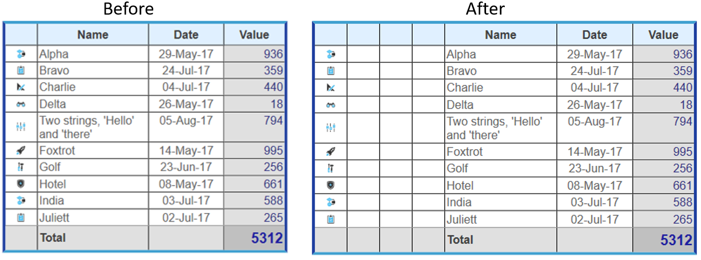

<!--REF #_command_.WP Table insert columns.Syntax-->**WP Table insert columns** ( objTarget | {*refTabela* ; *numCol*} {; *numColunas*} )  -> Resultado<!-- END REF-->
<!--REF #_command_.WP Table insert columns.Params-->
| Parâmetro | Tipo |  | Descrição |
| --- | --- | --- | --- |
| objTarget | Objeto | &#x1F852; | Range ou elemento ou documento 4D Write Pro |
| refTabela | Objeto | &#x1F852; | Referência de tabela |
| numCol | Inteiro longo | &#x1F852; | Número da coluna |
| numColunas | Inteiro longo | &#x1F852; | Número de colunas a inserir (valor predefinido = 1) |
| Resultado | Objeto | &#x1F850; | Range/seleção de colunas da tabela |

<!-- END REF-->

#### Descrição 

<!--REF #_command_.WP Table insert columns.Summary-->O comando **WP Table insert columns** insere uma ou várias colunas em uma tabela 4D Write Pro.<!-- END REF-->.

Este comando admite duas sintaxes:

* Se passar objTarget como primeiro parâmetro, o comando insere as colunas na primeira tabela que intersee o target. objTarget pode conter:  
   * uma range, ou  
   * um elemento (linha / parágrafo / corpo / cabeçalho / rodapé / imagem inline / seção / subseção), ou  
   * um documento 4D Write Pro.  
         
   Se objTarget não intersectar uma tabela a range de texto onde se pode inserir colunas, o comando não faz nada e devolve Null (não se gera um erro).
* Se passar os parâmetros *refTabela e* *numCol*, o comando insere as colunas na tabela designada e no índice de coluna especificado. Se *numCol* for maior que o número de colunas em *refTabela*, as colunas se agregam à tabela ao invés de se inserir.

O parâmetro opcional *numColunas* define o número de colunas a inserir em objTarget ou *refTabela*. Normalmente, se omitir este parâmetro, se insere uma coluna.  
  
**Resultado** 
  
  
O comando devolve uma range de colunas que representa as colunas inseridas, ou Null se não inserir nada.  
  
#### Exemplo 

Para inserir três colunas depois da primeira coluna na tabela *Invoice (Faturas)*. Este código:

```4d
 var $column : Object
 var $table : Object
 
 $table:=WP Get element by ID(WParea;"Invoice") //procura a tabela "Invoice"
 
 $column:=WP Table insert columns($table;2;3) //posição 2, agregue 3 colunas
```

Insertará as novas colunas na localização correta:

  
  
  

#### Ver também 

[WP Table insert rows](wp-table-insert-rows.md)  