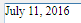

## Arrastar e Soltar 

Para configurar as propriedades arrastar e soltar para suas áreas 4D Write Pro, é necessário seleciar as opções apropriadas no tema "Action" na lista de Propriedades:

Áreas 4D Write Pro suporta dois modos arrastar e soltar:

* **Modo personalisado:** apenas as opções "Arrastável" e "Soltável" estão marcadas.  
Neste modo, pode selecionar texto e começar a movê-lo. O método objeto é chamado com o evento On Begin Drag Over , e assim pode definir a ação soltar usando o modo personalisado.
* **Modo Automatico**: as opções "Arrastável", "Soltável", "Arraste automático" e "Soltado automático" estão marcadas  
Neste modo, pode automativamente mover ou copiar (aperte a tecla **Alt/Option**) o texto selecionado. O evento On Begin Drag Over não é ativado.

**Nota:** Selecionar apenas as opções "Arraste automático" e "Soltado automático" não terá efeito na área 4D Write Pro area. 

## Propriedades de Vista 

As propriedades de vista do documento estão diretamennte disponíveis na lista Propriedades das áreas 4D Write pro para permitier que defina como um documento 4D Write será exibido como padrão nesta área. Estas propriedades permitem que personalise, por exemplo, se os documentos 4D Write Pro são exibidos da mesma maneira que serão impressos, ou como gerados pelo navegador. Pode estabelecer diferentes vistas do mesmo documento 4D Write Pro no mesmo formulário.

**Nota:** Configurações de Vista podem ser gerenciadas dinamicamente usando os comandos [WP SET VIEW PROPERTIES](../commands/wp-set-view-properties) e [WP Get view properties](../commands/wp-get-view-properties).

Configurações de vista de documento são gerenciadas através de itens específicos no tema **Aparência** da lista de propriedades de objetos de formulário 4D Write Pro.:

* **Resolução**: Estabelece a resolução de tela para os conteúdos de área 4D Write Pro. Como padrão, é estabelecido em **72 dpi (Mac OS)**, que é a resolução padrão para formulários 4D em todas as plataformas. Estabelecer esta propriedade para Automático faz com que oa geração do documento seja diferente entre as plataformas Mac Os e Windows. Estabelecer um valor de dpi específico faz com que a geração do documento seja a mesma nas plataformas Mac OS e Windows.
* **Zoom**: Estabelece a porcentagem do zoom para exibir os conteúdos da área 4D Write Pro. O normal é 100%.
* **Modo de Vista**: Estabelece o modo para exibir o documento 4D Write Pro na área formulário. Três valores estão disponíveis:  
   * **Página** (padrão): o modo de vista mais completo que inclui limites de página, orientação, margens, quebra de página, cabeçalhos, rodapés, etc. Para saber mais veja o parágrafo *Propriedades de visualização de página*.  
   * **Rascunho**: modo rascunho com propriedades de documento básicas  
   * **Embebido**: modo de vista adequado para áreas embebidas. Não exibe margens, cabeçalhos, rodapés, bordas de página, etc.  
   Este modo também pode ser usado para produzir uma vista de página do tipo Web (se também selecionar a resolução de 96 dpi e a opção **Show HTML WYSIWYG**).  
         
   **Nota:** A propriedade **Modo de vista** é usada apenas para geração na tela. Em quanto a configurações de impressão, regras específicas de geração são usadas automaticamente (ver *Imprimir documentos 4D Write Pro*).
* **Mostrar page frame**: Exibe ou esconde a borda da página quando o modo de vista for estabelecido como "Página". O normal é escondido.
* **Mostrar referências**: Exibe todas as expressões 4D inseridas no documento como referências. Quando esta opção não estiver marcada (padrão) as expressões 4D são exibidas como valores. Quando inserir um campo ou expressão 4D, 4D Write Pro computa e exibe o valor atual. Se quiser saber que campos ou expressões estão sendo exibidas, marque esta opção. As referências do campo ou expressão vão aparecer em seu documento, com um fundo cinza.  
Por exemplo, se inserir a data atual junto com o formato, a data é exibida:  
  
Se marcar a opção **Mostrar referências**, a referência é exibida:  
  
**Nota:** expressões 4D podem ser inseridas usando o comando [ST INSERT EXPRESSION](../../commands/st-insert-expression).
* **Mostrar cabeçalhos e rodapés**: Exibe ou esconde os cabeçalhos e rodapés quando o modo de página estiver estabelecido como "Página" (exibido como padrão). Para saber mais, veja .
* ****Mostrar fundo**: Exibe/esconde tanto as imagens de fundo quando a cor de fundo (padrão é exibido)
* ****Mostrar caracteres escondidos**: Exibe ou esconde caracteres invisíveis (padrão é escondido).
* ****Mostrar HTML WYSIWYG**: Ativa ou desativa a vista HTML WYSIWYG, na qual qualquer atributo avançado 4D Write Pro que não forem compatíveis com todos os navegadores serão removidos (padrão é desaqtivado).
* **Mostrar régua horizonta**l: horizontal. Para saber mais sobre as réguas nas áreas 4D Write Pro, consulte *Manejar réguas*.
* **Mostrar régua vertical**: mostra/oculta a régua vertical quando o documento estiver em modo Página. Para saber mais sobre as réguas nas áreas 4D Write Pro, consulte *Manejar réguas*.
* Mostrar imágens vaziaws ou não compatíveis: mostra/oculta um retângulo negro para s imagens que não podem ser carregadas ou calculadas (imagens vazias ou em um formato não compatível). Para saber mais veja *Imagens vazias*.
* Mostrar a fonte da fórmula como símbolo: mostra o texto fonte das formulas como  símbolos quando as expressões são mostradas como referencias (ver acima). Mostrar as fórmulas como símbolos faz com que os documentos de modelo sejam mais compactos e mais wysiwyg.

## Menu contextual 

Se a propriedade **Menu contextual** está selecionada por uma área 4D Write Pro (ver *Criar uma área 4D Write Pro*), um menu contextual completo está disponível para os usuários em modo Aplicação:

 

Este menu oferece acesso a todas as funcionalidades de 4D Write Pro.

## Selecionar o modo de visualização 

Os documentos 4D Write Pro podem ser visualizados em três modos de vista de página:

* **Rascunho**: modo rascunho com propriedades básicas
* **Página**: modo "vista imprimir" (novo em 4D v15 R5)
* **Embebido**: modo adequado para áreas embebidas, não exibe margens, cabeçalhos, rodapés, bordas de página, etc  
Este modo pode ser usado para produzir output do tipo Web (se selecionar também a resolução de 96 dpi e a opção **HTML WYSIWYG**).

O modo de visualização pode ser configurardo utilizando a área de menu pop-up:

**Nota:** o modo de visualização da página não são armazenadas com o documento.

Para áreas embebidas em formulários 4D, o modo vista pode ser também definido como padrão usando a lista Propriedades. Neste caso, o modo de vista é armazenado como uma propriedade do objeto de formulário 4D Write Pro (para saber mais, veja o parágrafo *Configurar propriedades de Vista*). 

