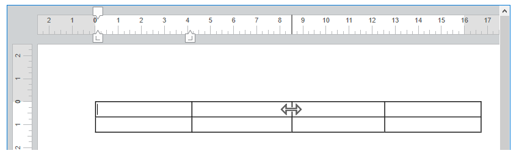
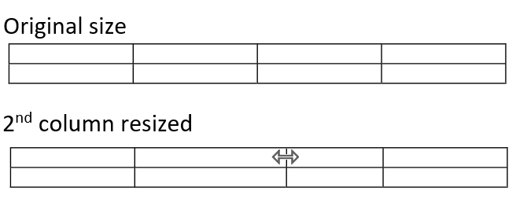
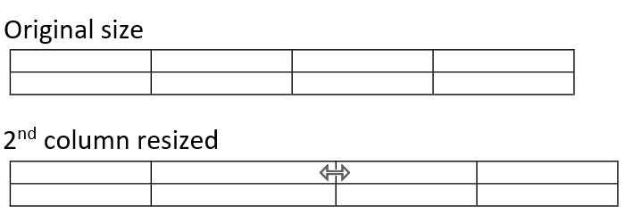
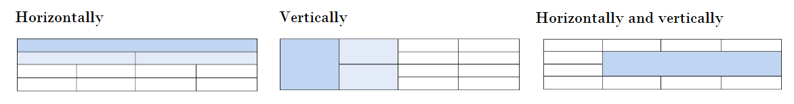
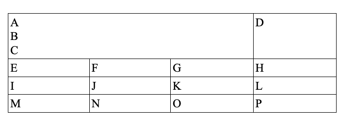
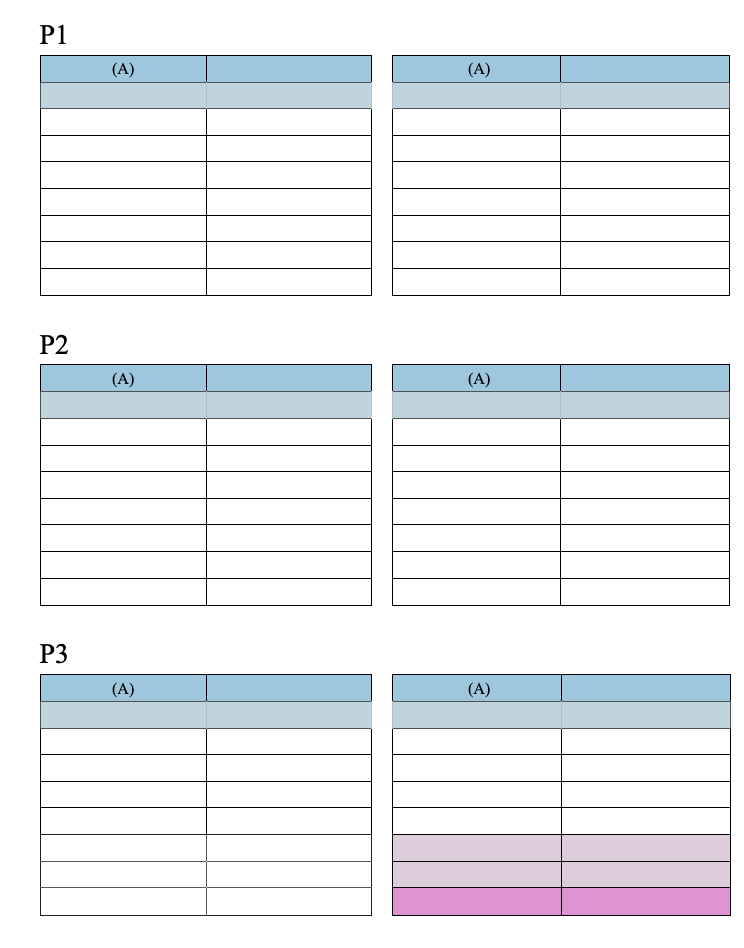
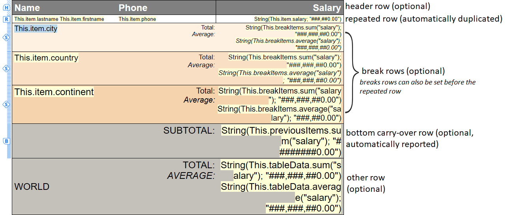
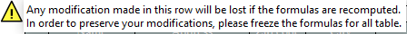

#### Gerenciar tabelas 

Os documentos 4D Write Pro podem conter tabelas. As tabelas 4D Write Pro sãoi criadas e definidas por programação, mas seu conteúdo pode ser modificado e manejado pelo usuário. Vários atributos de tabelas 4D Write Pro são editáveis incluindo a altura da fila, o alinhamento, as margens, o estilo de texto, a cor ou as bordas.


**Nota:** Desde o 4D Write pro, as tabelas podem ser preenchidas por programação. Elas podem conter um grande número de colunas e linhas. Lembre-se que tabelas muito grandes podem impactar o rendimento, especialmente se forem exibidas na tela. Veja este [artigo](https://blog.4d.com/4d-write-pro-tables-without-limit) para saber mais.

#### Criar uma tabela 

As tabelas 4D Write Pro são criadas mediante uma chamada ao comando [WP Table append row](../commands/wp-table-append-row). Depois pode adicionar filas utilizando o comando .

**Nota:** um usuário pode criar uma tabela ao copiar e colar um seleção de células:  


#### Editar tabelas 

Conteúdos de células podem ser adicionados por programação usando o comando [WP Table append row](../commands/wp-table-append-row).

Quando uma tabela tiver sido criada, conteúdos de célula podem ser editados durante execução pelos usuários. Podem clicar nas células e selecionar, editar, copiar, colar, apagar texto ou imagens da mesma maneira que em parágrafos normais. Podem navegar pelas células usando a tecla **Tab** (**Shift+Tab** para navegar na direção oposta).

Usar a tecla **Retorno de carro** dentro de uma célula cria um novo parágrafo na célula.

Note que a largura de célula é fixa: quando um usuário digita texto ou cola uma imagem, a altura da linha é automaticamente estendida se necessário e o texto sofre quebras de linha automaticamente.:


Usuários podem selecionar colunas, linhas ou células e aplicar atributos disponíveis de estilo, cor, alinhamento de texto, etc, usando o menu de pop up embutido ou qualquer inteface personalizada. 4D Write Pro oferece diversos comandos para selecionar qualquer parte de uma tabela:

* [WP Table get rows](../commands/wp-table-get-rows) para obter um conjunto de linha
* [WP Table get columns ](../commands/wp-table-get-columns) para obter um conjunto de colunas(\*)
* [WP Table get cells](../commands/wp-table-get-cells) para obter um conjunto de células

(\*) Colunas não tem um equivalente em html. Em 4D Write Pro, um conjunto de colunas é na verdade um conjunto de células, oque significa que colunas tem a mesma prioridade que células.

Quando tiver selecionado um conjunto, pode aplicar qualquer atributo apropriado usando o comando [WP SET ATTRIBUTES](../commands/wp-set-attributes). Dentro de células, atributos são aplicados a parágrafos, caracteres ou imagens, dependendo de seus conteúdos. Por exemplo, pode estabelecer a altura, tamanho de fonte, borda, etc de tabelas ou céllulas de tabelas. Para saber mais, veja a seção *Atributos 4D Write Pro*).

Quando atributos diferentes são aplicados a elementos concorrentes de uma tabela, uma ordem de prioridade é aplicada à renderização:

1. Tabela é renderizada primeiro
2. Linhas são renderizadas (sobrepujando atributos de tabela)
3. Células ou colunas são renderizadas (sobrepujando atributos de linha).

##### Redimensionar colunas 

A largura de colunas tabelas podem ser modificadas arrastando o separador de colunas para a esquerda ou direita. O cursor muda para indicar que pode ser movido horizontalmente e uma linha vertical é mostrada na régua: 



Redimensionar colunas gera um evento de formulário On After Edit.

Para redimensionar uma coluna, clique no separador de colunas e arraste para a esquerda ou direita. O tamanho mínimo de coluna é 8pts. Se a coluna adjacente à direita alcançar o tamanho mínimo, todas as colunas à direita serão movidas. Se a primeira coluna ou uma coluna adjacente à esquerda alcançar o tamanho mínimo, nenhuma mudança de redimensionamente acontecerá nesta direção.  
  


Se apertar a tecla **Shift** enquanto redimensiona uma coluna, o tamanho da coluna adjacente à direita não será modificada.  
  
  
  
**Nota**: A propriedade Editável pode ser ativada para o documento 4D Write Pro para permitir o redimensionamento de coluna.

##### Fundir e separar células 

Com 4D Write Pro, pode dividir e combinar células em uma tabela. Fusionar células é combinar duas ou mais células adjacentes de uma tabela situadas na mesma linha ou coluna em uma única célula. Dividir células é tomar células já fusionadas e separá-las em múltiplas células adjacentes na mesma linha ou coluna. As células podem ser fusiconadas usando o comando [WP TABLE MERGE CELLS](../commands/wp-table-merge-cells) ou a ação paddrão **cell/merge**, e ser divididas utilizando o comando [WP TABLE SPLIT CELLS](../commands/wp-table-split-cells) ou a ação padrão **cell/split**.


As células da tabela podem ser fusionadas: 



**Exemplo de fusão de** células **utilizando a linguagem:**

1. Designa um intervalo de células para fusionar em sua tabela, as células têm que ser adjacentes horizontal ou verticalmente, ou ambas.
2. Chame ao comando [WP TABLE MERGE CELLS](../commands/wp-table-merge-cells) no intervalo selecionado.

```4d
 $cells:=WP Table get cells($table;1;1;3;1)
 WP TABLE MERGE CELLS($cells)
  //ou
 WP TABLE MERGE CELLS($table;1;1;3;1)
```

Os dados existentes das células originais são concatenados na célula fusionada resultante.

antes  


depois  


**Exemplo de divisão de** células **utilizando a linguagem:**

1. Designe um intervalo de células a dividir em sua tabela, o intervalo selecionado tem que conter algumas células ja fusionadas.
2. Chame ao comando [WP TABLE SPLIT CELLS](../commands/wp-table-split-cells) no intervalo selecionado.

```4d
 $cells:=WP Table get cells($table;1;1;1;1)
 WP TABLE SPLIT CELLS($cells)
  //ou
 WP TABLE SPLIT CELLS($table;1;1;1;1)
```

Os dados da célula já fusionada se mantém todos na primera células resultante (acima à esquerda) depois da división, as outras células resultantes da divisão permanecem vazías.

antes  


depois  


**Importante**: 

* As células que pertençam a uma línha especial (línha repetida, línha de ruptura ou línha de arraste inferior) não podem ser combinadas verticalmente.
* As células que pertenencem a linhas de cabeçalho só podem ser combinadas verticalmente se todas pertenecerem a outras línhas de cabeçalho (não podem ser combinadas com nenhuma linha de cabeçalho que siga as linhas de cabeçalho).

  
**Designação de células fusionadas:** 

Uma célula fusionada pode ser manipulada igual que uma célula individual (cor de fundo, estilo de borda, estilos de parágrafo..) utilizando a interface de 4D Write Pro, as ações padrão ou o comando [WP SET ATTRIBUTES](../commands/wp-set-attributes).

Todos os comandos de tabela existentes são aplicáveis a intervalos ou elementos que contenham células fusionadas. Em uma tabela que contenha células fusionadas, os índices das células permanecem como se não se tivesse combinado nenhuma célula.   

Exemplo:

```4d
 $cell1:=WP Table get cells($table;1;1;1;1)
 $cell4:=WP Table get cells($table;4;1;1;1)
 WP SET ATTRIBUTES($cell1;wk background color;"yellow")
 WP SET ATTRIBUTES($cell4;wk background color;"pink")
```

antes  


depois  


neste exemplo também pode passar $cell2 ou $cell3 ao invés de $cell1 como:  

```4d
 $cell2:=WP Table get cells($table;2;1;1;1)
```

```4d
 $cell3:=WP Table get cells($table;3;1;1;1)
```

e terá o mesmo resultado que utilizando $cell1 porque $cell1, $cell2, e $cell3 se referem à mesma célula depois da fusão e qualquier mudança aplicada a $cell1, $cell2, o $cell3 se aplica realmente à nova célula fusionada.  

Entretanto, se forem combinadas um número x de línhas ou colunas completas, os índices das seguintes línhas ou colunas se reduzem em x.

#### Paginação de Tabelas 

Quando exibido em modos Page ou Draft (ou no contexto de impressão de documento), tabelas 4D Write Pro podem se dividir:

* automaticamente, se a altura da tabela for maior que a altura disponível de página/coluna
* dependendo das quebras de página/coluna estabelecidas por programação ou pelo usuário.

Tabelas só se separam entre linhas, e as linhasa também podem ser dividas. A paginação da tabela é atualizada dinamicamente se a orientação ou o número de coluna for modificado.

* **Notas:**  
Pode desativar divisões automáticas em tabelas usando atributos de tabela wk page break inside row / wk page break inside table (ver *Atributos 4D Write Pro*) ou as ações table/avoidPageBreakInside e row/avoidPageBreakInside (ver *Usando ações padrão*).
* Quando uma linha de tabela e um parágrafo tem opções diferentes de quebra de página, as opções aplicadas às linhas tem precedência. POr exemplo quando um parágrafo permitir quebras de página, mas sua linha pai não permitir, a linha não será dividida..

Paginação de tabela pode ser controlada por programação ou pelo usuário. Ações disponíveis incluem:

* inserir uma quebra de página em uma tabela:  
   * comando [WP INSERT BREAK](../commands/wp-insert-break)  
   * ação padrão *insertPageBreak*  
   * opção **Insert page break** do menu contextual padrão
* inserir uma quebra de coluna em uma tabela:  
   * comando [WP INSERT BREAK](../commands/wp-insert-break)  
   * ação padrão*insertColumnBreak*  
   * opção **Insert column break** do menu contextual

Quando for inserida uma quebra de página ou uma quebra de coluna através da ação padrão ou do menu contextual, ela é adicionada antes dos conteúdos selecionados: a primeira fila da seleção é movida ao início da próxima página ou coluna. Por exemplo:

 \===> 

**Nota:** 

Só as tabelas no corpo de um documento podem ser divididas. Os cortes inseridos nas tabelas, cabeçalhos e rodapés são ignorados.   
Tabelas não podem ser quebradas em diferentes seções. Inserir uma quebra de seção em uma tabela vai mover a tabela inteira para a nova seção  
Os saltos dentro das linhas não estão permitidos quando estiver ativados as *Linhas Carry-over*

#### Cabeçalho repetido 

4D Write Pro lhe permite definir até cinco linhas de cabeçalho por tabela. As linhas de cabeçalho selecionadas se repetirão em cada coluna ou página quando ocorrer uma quebra de coluna ou de página.



Os cabeçalhos da tabela são as primeiras linhas da tabela. Para definir as linhas de cabeçalho pode

* utilizar a ação padrão *headerRowCount* (ver *Usando ações padrão*), o
* utilizar a ação [WP SET ATTRIBUTES](../commands/wp-set-attributes) com wk header row count (em uma tabela, ver *Tabelas*), ou wk header (em uma linha, ver *Filas e Colunas*).

Se designar mais de cinco linhas como cabeçalho (ou se resultar de uma inserção de linhas em um cabeçalho existente), 4D Write Pro só utiliza as cinco primeiras linhas como cabeçalho. Se eliminar as linhas definidas no cabeçalho, o número de linhas do cabeçalho diminui.

#### Table datasource 

Pode atribuir um objeto fórmulaa como fonte de dados para uma tabela e acessar os valores resultantes desde a tabela usando *Expressões com This* (ver abaixo). a fórmula da fonte de dados é processada por 4D Write Pro quando se calculam as fórmulas (por exemplo, quando abrir o documento, quando chamar ao comando [WP COMPUTE FORMULAS](../commands/wp-compute-formulas), etc.). Esta função aproveita os contextos de dados (ver [WP SET DATA CONTEXT](../commands/wp-set-data-context)).

Para atribuir uma fonte de dados a uma tabela, use o comando [WP SET ATTRIBUTES](../commands/wp-set-attributes) com o comando wk datasource e um objeto *4D formula* como valor. Por exemplo, para preencher uma tabela com uma linha por cada pessoa que vive em França:

```4d
 $formula:=Formula(ds.people.query("country = :1";"France"))
 WP SET ATTRIBUTES($table;wk datasource;$formula)
```

* Se o objeto fórmula da fonte de dados devolve uma coleção ou uma seleção de entidades (não vazia), a tabela se preenche automaticamente quando se calcular a fórmula: contém ao menos tantas linhas quanto elementos tiver na coleção ou entidades na seleção de entidades. A primeira linha da tabela, chamada a linha repetida, se utiliza como linha de modelo (excluindo as linhas de cabeçalho e as possíveis linhas de ruptura).
* Na linha repetida (e linhas de ruptura) pode inserir expressões que usem palavras chaves especiais como *This.elemento.sobrenome*. As expressôes se sustituem durante o processamento pelos dados da coleção ou a seleção de entidades. Esta linha de modelo se duplicará para que o número de linhas de elementos seja igual ao número de elementos da coleção ou seleção de entidades depois de calcular as fórmulas.
* Se a fórmula da fonte de dados não devolver uma coleção ou uma seleção de entidades, ou se devolver uma coleção/seleção de entidades vazia, as linhas da tabela não são criadas automaticamente e todas as linhas se tratam como linhas normais.

Para eliminar uma fonte de dados de uma tabela, utilize o comando [WP RESET ATTRIBUTES](../commands/wp-reset-attributes). Definirá o valor de atributo datasource como *null*:

```4d
 WP RESET ATTRIBUTES($table;wk datasource)
```

##### Fazer uma tabela com um datasource 

Um design da tabela baseado em uma fonte de dados que contém as linhas abaixo:

| **Linhas**            | **Número** | **Obrigatório** | **Condições**                                                 | **Descrição**                                                                                                                                                                                                                                                                                                                                                               |
| --------------------- | ---------- | --------------- | ------------------------------------------------------------- | --------------------------------------------------------------------------------------------------------------------------------------------------------------------------------------------------------------------------------------------------------------------------------------------------------------------------------------------------------------------------- |
| Linhas de cabeçalho   | ate 5      | \-              | \-                                                            | Cabeçalho de tabela padrão, ver *Cabeçalho repetido*                                                                                                                                                                                                                                                                                                                        |
| Linha de planilha     | 1          | sí              | A fórmula da fonte de dados devolve elementos iteráveis       | Se a tabela não tiver linhas de cabeçalho, a linha da planilha é a primeira linha da tabela, no caso contrário, será a primeira linha depois do cabeçalho. Costuma ser preenchida com expressões que usam **This** (por exemplo, *This.item.value*) que dão acesso aos dados processados quando o documento estiver em modo de mostrar valores e a linha estiver duplicada. |
| Bottom carry-over row | 1          | \-              | a fórmula da fonte de dados deve devolver elementos iteraveis | A primeira linha que seguir à linha da planilha. Ver *Linhas Carry-over*                                                                                                                                                                                                                                                                                                    |
| Otras líneas          | ilimitado  | \-              | \-                                                            | Línhas padrão (não duplicadas)                                                                                                                                                                                                                                                                                                                                              |

Exemplo (*Mostrar* *modo referências*):



Quando se calculam as fórmulas, a linha do modelo se duplica automaticamente segundo seja necessário para que coincida com todas as entidades ou elementos da coleção devolvidos pela fórmula da fonte de dados:


Em qualquer caso, a intrução abaixo devolve o número real de linhas:

```4d
 WP GET ATTRIBUTES($table;wk row count;$vcount) //24 para o exemplo anterior
```

##### Linhas Carry-over 

As tabelas baseadas em fontes de dados são compatíveis com linhas de arraste inferiores (carry over) que são mostradas automaticamente na parte inferior de cada página ou coluna quando a tabela for dividida em mais de uma página ou coluna. Uma linha de arraste pode mostrar informação adicional baseada nos elementos mostrados ou impressos anteriormente, graças à expressão **This.previousItems** (ver *Expressões com This*). Esta função permite, por exemplo, adicionar linhas de subtotal.


As linhas de arraste são mostradas:

* quando uma tabela de fonte de dados não cabe em uma só página (ou coluna)
* na parte inferior da tabela
* na primeira página (ou primeira coluna) e em todas as demais exceto na última.

**Importante:** as linhas de arraste só estão disponíveis nas tabelas preenchidas por uma fórmula de fonte de dados que devolva uma coleção ou uma seleção de entidades não vazia e no modo de visualização de valores. Em todos os demais casos ou quando a fórmula da fonte de dados não tiver sido calculado, uma linha de arraste é mostrada como uma linha normal.

Para criar líinhas de arraste:

1. No modelo da tabela, adicione uma linha logo depois da linha do modelo e insira as fórmulas necessárias em seu interior, utilizando, por ejemplo **This.previousItems**.
2. Ative a funcionalidade de arraste de linhas para seu documento. Pode:  
\- utilizar a ação padrão *bottomCarryOverRow* (ver *Usando ações padrão*), ou  
\- utilizar o comando [WP SET ATTRIBUTES](../commands/wp-set-attributes) com o seletor de atributos wk bottom carry over row *Tabelas*.

**Nota:** não se permitem quebras de página dentro das linhas quando a função de traspaso de línhas estiver ativada (ver *Paginação de Tabelas*). As opções correspondentes, se forem definidas, são ignoradas.

##### Break rows 

As tabelas baseadas em fontes de dados são compatíveis com uma ou várias Linahs de quebra de ordem que podem ser mostradas antes ou depois da linha repetida. As linhas de ruptura de ordem lhe ajudam a dividir visualmente os elementos da fonte de dados já ordenados na tabela em diferentes partes baseadas em um valor de fórmula calculado

Cada vez que mudar o valor da fórmula, se insere uma nova linha de ruptura. Portanto, para que as tabelas se mostram corretamente, a seleção de entidades (ou coleção) utilizada como fonte de dados da tabela deve estar ordenada em consequencia. Por exemplo, se quiser desgloses por países e cidades, a fonte de dados deve ser ordenada do seguinte modo: *ds.people.all().orderBy("country asc, city asc")*

o valor de ruptura se define mediante o atributo *wk break formula*. O valor deve ser una fórmula baseada em uma propriedade do elemento como "This.item.name'', do contrario o valor calculado pode não mudar nunca, o que faz que a fórmula de ruptura seja inútil. O atributo wk break formula se ignora se a tabela não tiver fonte de dados ou se a linha for um cabeçalho. Uma linha de ruptura deve ser adjacente à línha repetida (seja antes ou depois), ou a outra línha de interrupção, do contrario se ignora.

```4d
 WP SET ATTRIBUTES($row_2;wk break formula;Formula(This.item.country))
```

Graças à expressão **This.breakItems** pode utilizar esta funcionalidad,e por exemplo, para mostrar a media total das linhas repetidas dentro de una linha de interrupção. breakItems é um subconjunto avaliado da fonte de dados da tabela, seja uma seleção de entidades se a fonte de dados da tabela for uma seleção de entidades, ou uma coleção se a fonte de dados for uma coleção. Assim, dentro de uma linha de ruptura, pode escrever: This.breakItems.sum("salario")

Para criar líinhas de ruptura:

1. Ordene a fonte de dados com os niveis correspondentes às rupturas que quiser mostrar, por exemplo, *ds.People.all().orderBy("continent asc, country asc, city asc")*
2. Desenhe as linhas de ruptura na plantilla de tabela. Se as quebras forem encontradas depois da linha repetida, devem coincidir com a **ordem inversa** da fonte de dados, e se for encontrada antes da linha repetida, deve coincidir com a mesma ordem da fonte de dados.
3. Defina o atributo *wk break formula* para as linhas selecionadas:

```4d
 $row:=WP Table get rows($table;2;1) //selecione a segunda linha como quebra
 WP SET ATTRIBUTES($row_2;wk break formula;Formula(This.item.country))
```

##### Expressões com This 

| **Contexto**                                                                                                            | **Expressão**                            | **Tipo**                                                             | **Retorna**                                                                                                                                                                                                                                                                                                                        |
| ----------------------------------------------------------------------------------------------------------------------- | ---------------------------------------- | -------------------------------------------------------------------- | ---------------------------------------------------------------------------------------------------------------------------------------------------------------------------------------------------------------------------------------------------------------------------------------------------------------------------------- |
| Qualquer lugar                                                                                                          | This.table                               | Object                                                               | Tabela atual                                                                                                                                                                                                                                                                                                                       |
| |  This.row                                                                                                             | Object                                   | Elemento linha da tabela atual                                       |                                                                                                                                                                                                                                                                                                                                    |
| |  This.rowIndex                                                                                                        | Number                                   | Indice da linha atual, a partir de 1                                 |                                                                                                                                                                                                                                                                                                                                    |
| Quando uma datasource foi definida para a tabela                                                                        | This.table.dataSource                    | Object (formula)                                                     | Datasource como formula                                                                                                                                                                                                                                                                                                            |
| |  This.tableData                                                                                                       | Collection or Entity selection (usually) | Avaliado table.dataSource                                            |                                                                                                                                                                                                                                                                                                                                    |
| Em cada linha repetida quando uma datasource tabela retornar uma coleção ou seleção de entidade                         | This.item.xxx                            | Any                                                                  | Mapeado para cada item da coleção ou seleção de entidade table datasource, por exemplo **This.item.firstName** se a entidade associada for o atributo *firstName*                                                                                                                                                                  |
| |  This.itemIndex                                                                                                       | Number                                   | Indice do item atual na coleção ou seleção de entidade a partir de 0 |                                                                                                                                                                                                                                                                                                                                    |
| Em qualquer linha (exceto linhas de cabeçalho) quando uma datasource tabela retornar uma coleção ou seleção de entidade | This.previousItems                       | Collection or Entity selection                                       | Items exibidos nas paginas antes do fundo vão para próxima página (se houver) ou antes da linha da expressão, incluindo a página onde é exibida a linha contendo a expressão<br/>Esta expressão retorna o mesmo tipo de valor que a expressão **This.tableData**.                                                          |
| Em uma quebra de linha                                                                                                  | This.breakItems                          | Collection or Entity selection                                       | Itens da coleção ou seleção de entidade exibida nas linhas entre: a quebra de linha atual e a quebra de linha no mesmo nível (no inicio da página) se as quebras forem exibidas antes da linha repetida. a quebra atual e a quebra no mesmo nivel (ou o final da tabela) se a quebra de linha for exibida na mesma linah repetida. |

Em outros contextos, essas expresões retornam *undefined*.

**Nota:** Para saber mais, veja inserção de fórmula [WP INSERT FORMULA](../commands/wp-insert-formula).

##### Trabalhar com uma tabela de datasource 

Quando preencher uma tabela desde uma fonte de dados, as filas são criadas automaticamente quando calcular as referências. As linhas podem ser inseridas ou eliminadas, editar o conteúdo das células, mudar o estilo, etc:

  
  
Entretanto, lembre que se a fonte de dados da tabela voltar a ser calculada, qualquer modificação realizada nas linhas calculadas (exceto na primeira linha, ver a seguir) é perdida. Por outro lado, como a primeira linha é a linha da planilha, qualquer modificação realizada nesta linha se propagará a todas as linhas se voltar a calcular a fonte de dados da tabela. O mesmo é válido para quebra de linhas, qualquer modificação feita em quebras de linhas é perdida, exceto para quebras de linha template (que estao localizadas no final ou começo da tabela).

Por exemplo


Depois de voltar a calcular as expressões:


Quando o cursor se inserir em uma célula de uma tabela preenchida com uma fonte de dados, aparece um ícone no canto esquerdo junto com um conselho que mostra a informação:



Quando as fórmulas são mostradas como referências ou quando se guarda o documento, só são mostradas/salvas a primeira fila como planilha (se as fórmulas não estiverem congeladas).

Quando congelar as fórmulas, a tabela se converte em uma tabela padrão se restabelece a fonte de dados da tabela.

**Nota:** a ação padrão *freezeExpressions* não recalcula as fórmulas.