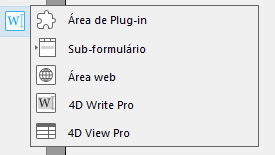
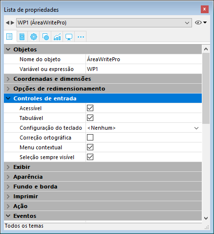
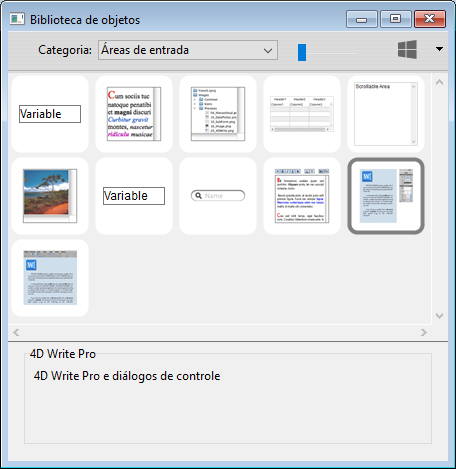
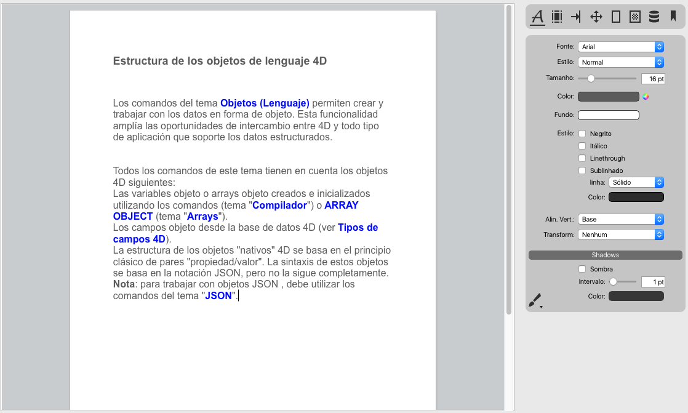

4D Write Pro oferece aos usuários 4D uma ferramenta avançada de processamento de texto, totalmente integrada a sua base de dados 4D. Utilizando 4D Write Pro, pode escrever mensagens de email pré formatados e/ou cartas com imagens, uma assinatura escaneada, texto com formato e marcadores de posição para variáveis dinâmicas. Também pode criar faturas ou relatórios de forma dinâmica, incluindo formatos de texto e imagens.

As funcionalidades principais do produto são as seguintes:

* Processamento de textos: um objeto 4D Write Pro objeto alinhado em um formulário oferece funcionalidades de processamento de texto estandarte, incluindo texto e manipulação de parágrafos e de estilos, inserção de imagens, importação e exportação, e muito mais.
* Integração na base de dados:  
   * um objeto 4D Write Pro pode conter partes variáveis que são preenchidas com os dados da base, ou dados calculados por 4D.  
   * os documentos 4D Write Pro podem ser armazenados dentro dos campos da base de dados ou no disco.

4D Write Pro comes with:

- a **form object** that you can install in your forms. You can load, handle, and save **4D Write Pro documents** in this area. This object is configurable through the Property list and includes a comprehensive developer pop up menu at runtime.
- **language commands**, added to the 4D Language and allowing you to deeply customize the area.
- **standard actions**, to help building a fully customized interface. 
- **4D Write Pro Interface**, an extension that offers a set of predefined palettes for end users.

#### Instalação e ativação 

O 4D Write Pro está totalmente integrado ao próprio 4D, pelo que é mais fácil de deslocar e administrar. Não se requer nenhuma instalação adicional, pode agregar áreas 4D Write Pro em seus formulários e manipular as variáveis 4D Write Pro em suas aplicações 4D diretamente.  
  
No entanto, é necessário ter uma licença do 4D Write Pro instalada na sua aplicação para ativar o recurso.

## Criar uma área do 4D Write Pro

### Usando o objeto de área 4D Write Pro 

Os documentos 4D Write Pro podem mostrar e editar manualmente em um objeto formulário 4D, chamado **4D Write Pro**. Este objeto está disponível como parte da última ferramenta (Área Plug-in, Área Web, etc.) da [barra de objetos](../../FormEditor/formEditor.md#object-bar):

Uma área 4D Write Pro form se configura por meio das propriedades estandarte da Lista de propriedades, tais como nome do objeto e nome da variável, coordenadas, entrada, visualização e aparência, e/ou eventos.

A propriedade Nome da variável pode ser utilizada na linguagem como uma referência a área 4D Write Pro. Tenha em conta que a variável deve ser do tipo [objeto](../../Concepts/dt_object.md).

As propriedades "Entrada" gerenciam funcionalidades básicas para a introdução de texto:

* **Editável**: lhe permite bloquear/desbloquear a área com o propósito de permitir ou impedir sua modificação
* **Auto revisão ortográfica**: disponível para áreas 4D Write Pro
* **Menu contextual**: lhe permite ativar/desativar o menu contextual em modo Aplicação (ver a seção [Utilizar uma área 4D Write Pro](./using-a-4d-write-pro-area.md))
* **Seleção sempre visível**: se encarrega da seleção de texto como nas áreas de texto estandarte.

### Utilizando a interface 4D Write Pro

Pode criar uma área 4D Write Pro pré-configurada utilizando o objeto **4D Write Pro** que se encontra na [biblioteca de objetos](../../FormEditor/objectLibrary.md) (tema "Áreas de entrada"):

Esta área vem com um painel de controle para gerenciar todos os atributos da área (fonte, cor, estilo, etc.):

Para saber mais, consulte a seção [Área 4D Write Pro](../writeprointerface.md).