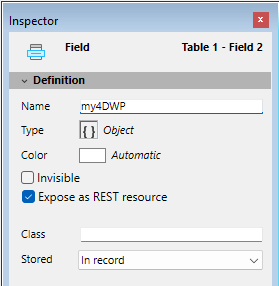

## Formato de documento .4wp 

É possível salvar e reabrir documentos 4D Write Pro em disco e a partir de disco sem qualquer perda usando o formato nativo **.4wp**.

O formato **.4wp** consiste de uma pasta zip cujo nome é o título do documento e cujos conteúdos são texto HTML e imagens:

* texto HTML combina HTML normal com expressões 4D (que não são computadas) assim como etiquetas 4D especificas,
* imagens são armazenadas em uma pasta com o mesmo nome que o título do documento, do lado do arquivo HTML.

Já que documentos .4wp são baseados em HTML, podem ser importados ou abertos em qualquer aplicação externa que suporta HTML.

O formato de documento interno 4D Write Pro é uma extensão HTML proprietária, compatível comHTML5/XHTML5, mas que suporta um subconjunto de atributos HTML/CSS e etiquetas. Como resultado, apenas documentos HTML exportados por 4D Write Pro podem ser abertos por 4D Write Pro sem risco de perda de dados. Importar documentos HTML que foram criados externamente pode produzir erros.

Para saber mais, [**baixe a lista de atributos 4D Write pro com definição associada como CSS style ou XHTML tag**](https://download.4d.com/Documents/Products%5FDocumentation/LastVersions/Line%5F19/4DWP-attributes-and-xhtml.pdf) em 4D Write Pro XHTML.

### Compatibilidade com versões anteriores 

Sempre pode reabrir um documento .4wp com uma versão anterior de 4D Write Pro. Se conter atributos que foram adicionados em versões mais recentes, esses atribuos são apenas ignorados. Entretanto se salvar o documento, os atributos são removidos do documento e serão perdidos. 

## Armazenar os documentos 4D Write Pro nos campos objeto 4D

Pode armazenar seus documentos 4D Write Pro automaticamente no arquivo de dados 4D. Se criar uma área 4D Write Pro em um formulário e criar um campo Objeto para armazenar os conteúdos da área, qualquer texto digitado na área é salvado automaticamente com cada registro quando o registro for validado. Pode então usar o comando [QUERY BY ATTRIBUTE](../../commands/query-by-attribute) para selecionar registros baseados no valor dos atributos internos. Pode também adicioanr e pesquisar seus próprios atributos com áreas 4D Write Pro. 

Esta seção descreve as seguintes propriedades:

* Ligar o campo 4D Object à área 4D Write Pro em um formulário
* Configurar, obter e pesquisar atributos personalizados dos documentos 4D Write Pro armazenados usando os comandos de objeto padrão [OB SET](../../commands/ob-set), [OB Get](../../commands/ob-get), e [QUERY BY ATTRIBUTE](../../commands/query-by-attribute).

### Atribuindo um campo 4D Object para uma área 4D Write Pro 

Para ligar uma área 4D Write Pro com um campo 4D Object, só precisa referenciar o campo na propriedade Variable Name da área. 

### Criar o campo Objeto na Estrutura 

Em sua estrutura de banco de dados, qualquer campo de Objeto 4D Object pode ser usado para armazenar documentos 4D Write Pro. Assim como qualquer campo Object, tem que definir, dependendo de suas necessidades:

* o nome do campo,
* os atributos, tais como "Expose as REST resource," assim como o índice,
* a opção de armazenamento 



Estes parâmetros são padrão para campos Objeto.

### Atribuindo a área 4D Write Pro para o campo 

Quando tiver definido um campo Objeto para armazenar seu documento 4D Write Pro, só precisa referenciar ele no formulário contendo a área. Pode usar qualquer tabela ou um formulário projeto.   
No editor Formulário, entre o nome do campo usando a notação padrão "\[Table\]Field" na área **Variable Name** da lista de Propriedade para a área 4D Write Pro:


Sua área 4D Write Pro é então associada com o campo, assegurando que seus conteudos serão salvados automaticamente com cada registro. Note que se não usar os botões automáticos 4D, terá que salvar a área manualmente usando os comandos 4D. 

### Usar atributos personalizáveis 

Quando as áreas 4D Write Pro forem armazenadas nos campos Objeto, pode salvar e ler qualquer atributo personalizado com o documento 4D Write Pro, tais como o nome do escritor, a categoria do documento ou qualquer informação adicional que achar útil. Pode então pesquisar qualquer atributo personalizável para selecionar registros que se enquadrem nos critérios.

* Atributos personalizados não serão exportados com os comandos [WP EXPORT DOCUMENT](../commands/wp-export-document) ou [WP EXPORT VARIABLE](../commands/wp-export-variable). Eles tambèm seráo quando converter um campo de objeto 4D Write Pro para JSON com o comando [JSON Stringify](../../commands/json-stringify) (junto com os principais atributos de documento 4D Write Pro).

Para estabelecer ou conseguir atributos personalizados, precisa usar os comandos padrão [OB Get](../../commands/ob-get) e [OB SET](../../commands/ob-set).

Por exemplo, no método de formulário pode escrever:  

```4d
 If(Form event code=On Validate)
    [MyDocuments]My4DWP["myatt_Last edition by"]:=Current user
    [MyDocuments]My4DWP.myatt_Category:="Memo"
    [MyDocuments]My4DWP:=[MyDocuments]My4DWP //to record the edit
 End if
```

ou:  
  
```4d
 If(Form event code=On Validate)
    OB SET([MyDocuments]My4DWP;"myatt_Last edition by";Current user)
    OB SET([MyDocuments]My4DWP;"myatt_Category";"Memo")
 End if
```

Também pode ler atributos personalizados de documentos:

```4d
 vAttrib:=[MyDocuments]My4DWP.myatt_Category
```
  
  
ou:  
  
```4d
 vAttrib:=OB Get([MyDocuments]My4DWP;"myatt_Category")
```

Se tiver salvo atributos personalizados 4D Write Pro em seu arquivo de dados, pode pesquisar estes atributos para criar uma seleção de registros contendo o valor apropriado do atributo. No exemplo abaixo, pode pesquisar a tabela contendo o campo Objeto para selecionar registros:

```4d
 QUERY BY ATTRIBUTE([MyDocuments];[MyDocuments]My4DWP;"myatt_Category";=;"Memo")
  //seleciona todos os registros em MyDocuments cujo atributo personalizável "myatt_Category" tenha o valor "Memo"
  //no campo de objeto My4DWP  (ligado à área 4D Write Pro)
```

:::warning Sobre nomes de atributos personalizados 

Já que atributos personalizados têm o mesmo espaço de nomeação que atributos internos 4D Write Pro, recomenda-se que se use prefixo quando definir seus próprios nomes de atributo, para evitar conflitos entre atributos internos e personalizados. Nomes não prefixados são reservados para os atributos internos 4D Write Pro. Pode usar qualque prefixo personalizável (no exemplo acima foi usado "myatt\_" como prefixo).

:::

**Nota:** a partir de 4D v15 R4, os atributos internos de 4D Write Pro também são acessíveis por programação utilizando os comandos padrão [OB Get](../../commands/ob-get) e [OB SET](../../commands/ob-set), mas também utilizando [WP SET ATTRIBUTES](../commands/wp-set-attributes), [WP GET ATTRIBUTES](../commands/wp-get-attributes) e [WP RESET ATTRIBUTES](../commands/wp-reset-attributes). 
 
## Abrir e exportar documentos

Nas aplicações 4D, os documentos, 4D Write Pro são criados importados e exportados por meio de comandos específicos que se encontram no tema **4D Write Pro** ([WP EXPORT DOCUMENT](../commands/wp-export-document), [WP EXPORT VARIABLE](../commands/wp-export-variable), [WP Import document](../commands/wp-import-document), [WP New](../commands/wp-new)). 

Também é possível [associar uma área 4D Write Pro com um campo Objeto](../user-legacy/defining-a-4d-write-pro-area.md#storing-4d-write-pro-documents-in-4d-object-fields) em um banco de dados. Desta maneira, cada documento 4D Write Pro é automaticamente salvo com o registro e armazenado nos dados do banco de dados.

## Imprimir documentos 4D Write Pro 

Os documentos 4D Write Pro podem ser impressos de duas formas

* como partes de formulários 4D
* como documentos independentes

### Imprimindo documentos 

Imprimir uma área 4D Write Pro embebida em um formulário 4D é respaldada pelo sistema

Pode imprimir objetos 4D Write Pro incluidos em qualquer tipo de [formulário 4D](../../FormEditor/forms.md) (projeto, tabela, input ou output) usando comandos de impressão comuns de 4D tais como [PRINT SELECTION](../../commands/print-selection) ou [PRINT RECORD](../../commands/print-record). 

A opção padronizada *Impressão tamanho variável* também é compatível (\*) com áreas 4D Write Pro, pérmitindo que maneje tamanho durante impressão. Quando esta opção for marcada, a margem (interior ou exterior) e margem superior são aplicadas apenas para a primeira página. As margens (interior e exterior) e a margem inferior são aplicadas apenas na última página. Propriedades de paginação do documento são ignoradas: controle de linhas viúvas e órfãs é desativado e quebras de página não são aplicadas (estas propriedades são usadas apenas para renderização na tela ou impressão do documento página por página. Quando a opção **Print Variable Frame** for selecionada, apenas objetos localizados acima da área de formulário serão impressos. Para saber mais, veja "*Impressão tamanho variável*" no manual Design Reference.

(\*) Os comandos [Print object](../../commands/print-object) e [Print form](../../commands/print-form) não são compatíveis com esta opção. 

#### Modo de vista para impressão 

Qualquer que seja o modo de Vista para a área 4D Write Pro (ver *Configurar propriedades de Vista*), sempre será impresso no modo Embebido quanod usar um comando de impressão 4D tal como [Print form](../../commands/print-form). Neste caso, as configurações de aparência abaixo não são levadas em conta para os objetos de formulário 4D Write Pro: modo de vista Página (sempre "Embebido"), Mostrar cabeçalho, Mostra rodapé, mostrar borda da página (sempre "Não"), Mostrar caracteres ocultos (sempre "Não").

#### Exemplo 

O exemplo abaixo mostra o efeito da opção **Print Variable Frame** numa área 4D Write Pro area embebida no formulário de output padrão. O seguinte código é executado:

```4d
 ALL RECORDS([Movies])
 ORDER BY([Movies]Title)
 PRINT SELECTION([Movies])
```

* Com a opção Print Variable Frame **desmarcada** (off), terá o resultado abaixo:  

* Com a opção Print Variable Frame **marcada** (on), terá o resultado abaixo:  
  
*(sample text source: wikipedia)*

### Imprimir documentos independentes 

A partir de 4D v15 R5, 4D Write Pro inclui novas funcionalidades de impressão. Utilizando estas funcionalidades padrão, poderá imprimir documentos 4D Write Pro independentes, assim como também controlar as opções de impressão padrão tais como formato, orientação ou números de página.

#### Novos comandos 4D Write Pro 

Basicamente, dois comandos manejam a função de impressão 4D Write Pro: [WP PRINT](../commands/wp-print) e [WP USE PAGE SETUP](../commands/wp-use-page-setup).

* [WP PRINT](../commands/wp-print) inicia um trabalho de impressão0 para o documento 4D Write Pro ou agrega o documento ao trabalho de impressão atual.
* [WP USE PAGE SETUP](../commands/wp-use-page-setup) modifica a configuração de página da impressora atual dos atributos de documento 4D Write Pro para o tamanho e orientação.

**Notas** 

* Nas máquinas com Windows 7 ou Windows Server 2008 R2, tenha certeza de que a *atualização de plataforma para Windows 7* tenha sido instalado de maneira a que as funcionalidades de impressão sejam compatíveis.

#### Comandos 4D atualizados 

Os comandos abaixo 4D suportam as funcionalidades de impressão 4D Write Pro:

* [SET PRINT OPTION](../../commands/set-print-option) e [GET PRINT OPTION](../../commands/get-print-option): todas as opções são suportadas para documentos 4D Write Pro impressos por [WP PRINT](../commands/wp-print). Para Paper option e Orientation option, é mais eficiente chamar a [WP USE PAGE SETUP](../commands/wp-use-page-setup) para sincronizar facilmente estes atributos com a configuração do documento 4D Write Pro. Page range option (15) lhe permite definir a faixa de página a imprimir.
* [PRINT SETTINGS](../../commands/print-settings): permite estabelecer os ajustes de impressão para a impressora atual; se [WP PRINT](../commands/wp-print) for chamado depois, será utilizada a configuração de impressora modificada se foram modificados por diálogos de configuração de impressão (com exceção das márgens de diálogo de configuração de página que sempre se baseiam no documento 4D Write Pro).
* [OPEN PRINTING JOB](../../commands/open-printing-job) e [CLOSE PRINTING JOB](../../commands/close-printing-job): [WP PRINT](../commands/wp-print) pode ser chamada entre estes comandos para inserir um ou mais documentos 4D Write Pro em um trabalho de impressão.