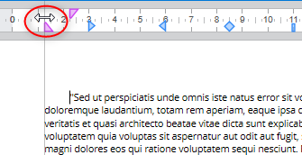
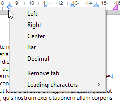
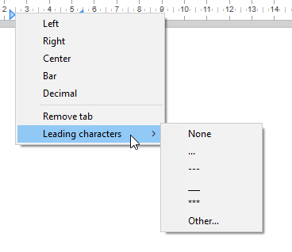

## Noções básicas

Quando o documento está no [modo de vista **Página**](./defining-a-4d-write-pro-area.md#selecting-the-view-mode), as seguintes propriedades do documento são mostradas ao usuário:

* Traços de página para representar os limites de impressão
* Largura de página e Altura da página (normal: 21x29.7 cm)
* Orientação da página (normal: retrato)
* Margem da página (normal: 2.5 cm)

Você também pode usar comandos adicionais, como **Documento.../Tamanho da página** ou **Documento.../Orientação da página**.

**Nota:** quando o documento está em modo Web ou Rascunho, as propriedades da página se podem definir, ainda que seu efeito não for visível. No modo Rascunho, os seguintes efeitos propriedad de parágrafo são visíveis:

* Limitação de altura página (línhas desenhadas)
* Colunas
* Evitar salto de página dentro da propriedade
* Controle de viúdas e órfãs.

## Quebras de parágrafo 

Quando exibido em modo Page ou Draft (no contexto de impressão de documento), Parágrafos 4D Write Pro pode quebrar:

* automaticamente, se a altura de parágrafo for maior que a altura disponível de página
* dependendo de quebras de parágrafo estabelecidos por programação ou pelo usuário.

Quebras podem ser adicionadas por programação ou pelo usuário. Ações disponíveis incluem:

* [WP INSERT BREAK](../commands/wp-insert-break) comando
* *insertPageBreak* ação padrão
* **Insert page break** opção do menu contextual padrão

### Controle de Quebra automática

Pode controlar quebras automáticas em parágrafos usando as funcionalidades abaixo: 

* **Widow and orphan control**: Quando essa opção for estabelecida para um parágrafo. 4D Write Pro não permite linhas viúvas (a última linha de um parágrafo isolada no topo da próxima página) ou órfãs (a primeira linha de um parágrafo isolada no fundo da página anterior) em um documento. No primeiro caso, a linha anterior do parágrafo é adicionada ao topo da página de forma que duas linhas são exibidas lá. No segundo caso, a primeira linha isolada é movida para a próxima página..
* **Avoid page break inside**: Quando essa opção for estabelecida para um parágrafo, 4D Write Pro previne que esse parágrafo seja quebrada em partes ou em duas ou mais páginas.
* **Manter com o próximo**: quando se estabelece esta opção para um parágrafo, esse parágrafo não pode separar-se do que lhe segue por uma quebra automática. Ver `wk keep with next` e a [ação padrão](./defining-a-4d-write-pro-area.md#standard-actions) correspondente *keepWithNext*.

Essas opções podem ser estabelecidas usando o menu contextual, ou [atributos](../commands-legacy/4d-write-pro-attributes.md) (`wk avoid widows and orphans`, `wk page break inside paragraph`, ou [ações padrão](./defining-a-4d-write-pro-area.md#standard-actions) *widowAndOrphanControlEnabled*, *avoidPageBreakInside*. 

<!-- INCLUDE lists-WP.Desc -->

## Fundo 

O fundo de documentos 4D Write e elementos de documentos (tabelas, parágrafos, seções, cabeçalhos/rodapés, etc) podem ser estabelecidos com os efeitos abaixo:

* cores
* bordas
* imagens
* origem, posicionamento horizontal e vertical
* área de pintura
* repetir

Esses [atributos](../commands-legacy/4d-write-pro-attributes.md) podem ser definidos programaticamente para os elementos indivíduos ou uma página ou fundos de documentos inteiros com o comando [WP SET ATTRIBUTES](../commands/wp-set-attributes) ou por [ações padrão](./defining-a-4d-write-pro-area.md#standard-actions).

Usuários podem modificar atributos de fundo via o menu contextual como mostrado abaixo:


Como exemplo de adicionar uma imagem de tamanho inteiro como fundo, veja *How Do I* (HDI) demo [aqui](http://download.4d.com/Demos/4D%5Fv16%5FR5/HDI%5F4DWP%5FBackImagePaperBox.zip).

## Cabeçalhos, rodapés e seções 

Documentos 4D Write Pro são compatíveis com cabeçalhos e rodapés. Cabeçalhos e rodapés são relacionadas à seções

Uma seção é uma parte do documento definida por uma faixa de páginas e pode ter seu próprio paginamento e atributos comuns. Um documento pode conter qualquer número de seções (de uma seção ao número total de páginas). Cada página pode conter apenas uma seção, exceto páginas com quebras de secção contínuas (ver abaixo).

Os documentos 4D Write Pro podem conter:

- uma ou mais secções (uma secção por predefinição)
- para cada secção, até três subsecções:
   - subsecção da primeira página
   - subsecção da(s) página(s) esquerda(s)
   - subsecção da(s) página(s) direita(s)

Pode definir um conjunto de cabeçalhos e rodapés para cada seção

### Definir uma seção 

Uma seção é um subconjunto de páginas contínuas em um documento 4D Write Pro. Um documento pode conter uma ou mais seções. Uma seção pode conter qualquer número de páginas, de uma página única ao número total de páginas do documento. Uma seção pode conter de uma coluna até 20 colunas.   
  
Como padrão, um documento contém apenas uma seção, chamada **Seção 1**. O menu contextual 4D Write Pro exibe este número de seção sempre que clicar no documento.


Pode criar uma nova seção adicionado uma quebra de sessão no fluxo do texto :


Quando uma quebra de seção for adicionada, o menu contextual exibe um número incrementado para cada seção. No entanto, pode renomear qualquer seção:


O nome que digitar será usado como nome da seção em qualquer ponto do documento

 

Note que se tiver definido uma primeira página diferente ou a opção de páginas da esquerda e da direita diferentes para a seção, o tipo de página também é exibido no menu (ver abaixo)

### Inserir uma quebra de seção contínua 

Uma quebra de seção contínua cria uma nova seção na mesma página. Isso permite criar páginas com seções que tenham diferentes números de colunas (vet *Criar uma página com seções múltiplas-colunas e únicas colunas*).

As seções criadas com saltos de seção continuos são contadas no documento (têm números de seção), mas diferente das seções criadas com quebras de seção normal, seus cabeçalhos, rodapés, imagens ancoradas, etc, só são levadas em consideração quando for produzido uma quebra de página física.

**Nota:** se mudar a orientação da página da nova seção depois de inserir uma quebra de seção contínua, se converte em uma quebra de seção padrão.

### Atributos de seção 

Seções são herdadas de atributos de documentos. Entretanto atributyos comuns de documentos, incluindo cabeçalhos e rodapés podem ser modificados separadamente para cada seção. O menu contextual pop up exibe as propriedades e atributos disponíveis ao nível de seção:


* **Orientação de Página**: permite que estabeleça uma orientação de página específica (Orientação vertical ou horizontal) por seção
* **Primeira página diferente**: permite que estabeleça atributos diferentes para a primeira página da seção. Esta propriedade pode ser usada para criar páginas em branco no começo do texto, por exemplo. Quando este atributo estiver marcado, a primeira página da seção é manejada como uma subseção e pode ter seus próprios atributos.  

* **Páginas da esquerda e da direita diferentes**: permite que estabelece atributos diferentes para páginas que estão à esquerda e à direita na seção. Quando este atributo for marcado, páginas da esquerda e da direita na seção serão manejadas como subseções e terão seus próprios atributos.  

* Comandos **Cabeçalho** e **Rodapé**: estas opções permitem que defina cabeçalhos e rodapé separados. Estas opções são detalhadas abaixo
* **Margens** / **preenchimento** / **Bordas** / **Fundo**: estes atributos podem ser definidos separadamente para cada seção. Para saber mais, veja o artigo *Atributos 4D Write Pro*.

### Inserir cabeçalhos e rodapés 

Cada seção pode ter cabeçalhos e rodapés específicos. São exibidos apenas quando o modo de vista da página do documento for **Page**. 

 Dentro de uma seção, pode definir até três diferentes cabeçalhos ou rodapés, dependendo das opções ativadas:

* primeira página,
* páginas esquerda,
* páginas direita.

Para criar um cabeçalho ou rodapé: 

1. Veja se o documento está no modo de vista **Page**.
2. Dê duplo clique na área de cabeçalho ou rodapé da seção desejada para começar o modo editar.  
   * A área cabeçalho está no topo da página:  
     
   * A área rodapé está no fundo da página:  
   

Pode entrar qualquer conteúdo estático, que será automaticamente repetido em cada página da seção (exceto para a primeira página, se ativado)


Pode inserir conteúdos dinâmicos tais como número de página ou contador de página usando o comando [ST INSERT EXPRESSION](../../commands/st-insert-expression) (para saber mais, veja o parágrafo *Inserir documentos e expressões de página*).  
  
Nota: TAmbém é possível manejar cabeçalhos e rodapés por programação, usando comandos específicos como [WP Get header](../commands/wp-get-header) ou [WP Get footer](../commands/wp-get-footer)

Quando um cabeçalho ou rodapé tiver sido definido para uma seção, pode configurar seus atributos comuns usando o menu contextual:


Para saber mais sobre   **Margens**, **Preenchimento**, **Bordas**, e atributos **Fundo**, veja a seção *Atributos 4D Write Pro*. 

Pode remover a definição total do cabeçalho ou rodapé (conteúdos e atributos) selecionando os comandos **Remove header** ou **Remove footer** no menu contextual. 

### Compatibilidade 

4D Write Pro maneja cabeçalhos e rodapés de documentos convertidos do plug-in 4D Write com uma altura fixa

A expressão abaixo e propriedades também são compatíveis e convertidas do plugin 4D Write em cabeçalhos e rodapés:

* número de página e variáveis de contador de página
* primeira página diferenciada
* páginas esquerda/direita diferenciadas

## Réguas 

As réguas estão disponíveis em todos os modos de visualização de 4D Write Pro e têm as seguintes características:

* Graduações em cm, mm, polegadas ou pt de acordo com a unidade de desenho atual definida no documento 4D Write Pro. Pode mudar as unidades de medida mediante o menu contextual ou modificando o atributo wk layout unit.
* Símbolo de indentação de primeira linha
* Símbolo de margem de parágrafo esquerdo
* Símbolo de margem de parágrafo direito
* Tabulações mostradas ao longo da borda inferior da régua
* O contraste de cor visível representa as margens de página esquerda e direita

As réguas verticais estão disponíveis só no modo Página e possuem as características abaixo:

* Graduações em cm, mm, polegadas ou pt segundo a unidade de desenho atual definida no documento 4D Write Pro. Pode mudar as unidades de medida utilizando o menu contextual ou modificando o atributo wk layout unit.
* Contraste de cor visível que representa as margens superior e inferior da página.

Pode mudar o estado de visualização da régua marcando ou desmarcando a opção **Mostrar régua horizontal** ou **Mostrar régua vertical** no menu contextual da área 4D Write Pro:  
  
  

**Nota:** uma propriedade específica da área 4D Write Pro permite definir a visualização predeterminada para as réguas (ver a seção *Configurar propriedades de Vista*).

### Ajustar margens de texto e indentação 

Pode modificar margens, indentações e posições de abas clicando e arrastando os símbolos correspondentes:


Quando colocar o mouse sobre um destes símbolos, o cursor muda para indicar que pode ser movido e aparece uma linha de guia vertical enquanto for arrastado:


Quando forem selecionados vários parágrafos, arrastar margens ou símbolos de indentação aplica estes margens ou indentações a todos os parágrafos selecionados. Mantendo pressionada a tecla Maiúsc Enquanto arrasta estes símbolos mantém os intervalos existentes entre indentações ou margens nos parágrafos selecionados.

#### Régua Horizontal 

Pode modificar margens esquerda e direita, indentações e posições de tabulação clicando e arrastando os símbolos correspondentes na régua horizontal:


Quando colocar o mouse sobre um desses símbolos, o cursor muda para indicar que pode ser movido e aparece uma linha de guia vertical enquanto for arrastado:



Quando vários parágrafos forem selecionados, arrastar margens ou símbolos de indentação aplica a estas margens ou indentações a todos os parágrafos selecionados. Mantendo pressionada a tecla Maiúscula (Shift) enquanto arrasta estes símbolos mantém os intervalos existentes entre as identações ou margens nos parágrafos selecionados.

#### Régua Vertical 

Pode modificar as margens superior e inferior com a régua vertical. Quando mover o mouse sobre o limite da margem, o cursor muda para indicar que é possível mover, e aparece uma linha de guia horizontal enquanto for arrastado:  
  


Esta ação pode ser usada para modificar o espaço entre a parte superior e inferior da página e o corpo e o cabeçalho e rodapé de um documento. 

### Gerenciar tabulações 

É possível usar o menu contextual de regua para criar, modificar ou apagar tabulações:



Para criar uma tabulação, dê um clique direito diretamente na régua e escolha seu tipo do menu contextual; um clique esquerdo automaticamente cria uma aba esquerda padrão. Pode também dar um clique direito em tabulações existentes para modificar seu tipo usando o menu contextual.

**Remover tabulação** só está disponível quando der clique direito diretamente numa tabulação existente; também pode remover tabulações ao arrastar as tabulações fora da área de régua.

:::note Notas 

* Abas também podem ser definidas por programação com os comandos [WP SET ATTRIBUTES](../commands/wp-set-attributes), [WP GET ATTRIBUTES](../commands/wp-get-attributes), e [WP RESET ATTRIBUTES](../commands/wp-reset-attributes) com os seletores wk tab default e wk tabs
* Para separações decimais, 4D Write Pro consida o primeiro caractere ponto ou vírgula da direita como um separador decimal; essa configuração padrão pode ser modificada com o seletor wk tab decimal separator

:::

#### Definir o signo inicial 

Os caracteres precedendo as tabulações (signos iniciais) podem ser definidos ao selecionar entre cinco caracteres pré-definidos ou definindo um caractere específico a usar. Os caracteres pré-definidos são:

* Nenhum (nenhum caractere é exibido - padrão)
* .... (pontos)
* \--- (traços)
* \_\_ (subscritos)
* \*\*\* (asteriscos)

Signos iniciais sempre aparecem antes da aba e seguem a direção do texto (da esquerda para direita ou direita para esquerda). Podem ser definidos por programação com os comandos [WP SET ATTRIBUTES](../commands/wp-set-attributes), [WP GET ATTRIBUTES](../commands/wp-get-attributes), e [WP RESET ATTRIBUTES](../commands/wp-reset-attributes) usando `wk leading` com os seletores `wk tab default` ou `wk tabs` , ou através do menu contextual da régua horizontal (mostrado abaixo).



Quando **Outro...** for selecionado, um diálogo é exibido onde um caractere inicial personalizado pode ser definido.

### Réguas Multi-coluna 

Quando duas ou mais colunas forem definidas para o documento ou seção, a régua exibe uma área específica para cada coluna:


**Nota:** propriedade Multi-coluna não está disponível em modo **Embedded**.

### Evento On After Edit 

Um evento de formulário [`On After Edit`](../../Events/onAfterEdit.md) é ativado para objeto de área de formulário 4D Write Pro sempre que uma aba ou controle de margem for movido, adicionado ou apagado, seja arrastando ou usando o menu contextual

## Colunas 

4D Write Pro permite que maneje colunas em seus documentos. Colunas são conectadas da coluna mais à esquerda até a mais à direita. Ou seja, quando digitar texto, o fluxo de texto vai começar preenchendo a coluna mais à esquerda e continuar com a coluna diretamente à direita até chegar ao final da página. Quando o final da página tiver sido alcançado, o fluxo de texto vai para a próxima página. Para poder balancear as configurações de páginas, 4D Write Pro permite que insira quebras de coluna.


Colunas podem ser definidas ao nível de documento (são exibidos no documento inteiro) ou no nível da seção (cada seção pode ter sua própria configuração de coluna).

**Nota:** Colunas só são compatíveis nos modos **Vista de página** e **Vista rascunho** (não são exibidos em modo **Embedded** e são exportados a .docx por [WP EXPORT DOCUMENT](../commands/wp-export-document) , mas não aos formato HTML e MIME HTML wk web page complete ).

Colunas podem ser estabelecidas usando:

* o submenu **Colunas** do menu contextual de área 4D Write Pro,
* [atributos](../commands-legacy/4d-write-pro-attributes.md) 4D Write Pro,
* [ações padrão](./using-4d-write-pro-standard-actions.md) 4D Write Pro.

Pode estabelecer ou obter as propriedades abaixo e ações para colunas:

| **Propriedade**                 | **Descrição**                                                                                                                                                                                                                                                            | *Documento* **atributos**                                                   | **Ações padrão**                                        |
| ------------------------------- | ------------------------------------------------------------------------------------------------------------------------------------------------------------------------------------------------------------------------------------------------------------------------ | --------------------------------------------------------------------------- | ------------------------------------------------------- |
| Número de colunas               | Pode definir até 20 colunas para o documento/seção                                                                                                                                                                                                                       | wk column count                                                             | *columnCount*                                           |
| Espaçamento de coluna           | Espaço entre colunas em pts, polegadas, ou cm. Note que todas as colunas vão ter o mesmo tamanho. Cada largura de coluna é automaticamente calculada por 4D Write Pro de acordo com o número de colunas, a largura de página e o espaçamento                             | wk column spacing                                                           | *columnSpacing*                                         |
| Largura de coluna               | (atributo apenas leitura) Largura atual de cada coluna, ou seja, largura computada                                                                                                                                                                                       | wk column width                                                             | \-                                                      |
| Estilo, cor e largura de coluna | Pode adicionar um separadador vertical (uma linha decorativa) entre as collunas. Essas opções permitem planejar o estilo de separador, cor e largura. Para remover o separador vertical, selecione **None** como estilo. | wk column rule style, wk column rule color, wk column rule width            | *columnRuleStyle*, *columnRuleColor*, *columnRuleWidth* |
| Inserir break                   | Insere uma quebra de coluna                                                                                                                                                                                                                                              | wk column break, veja também [WP INSERT BREAK](../commands/wp-insert-break) | *insertColumnBreak*                                     |
| Menu de Colunas                 | Crie um sub-menu Colunas                                                                                                                                                                                                                                                 | \-                                                                          | *colunas*                                               |

### Criar uma página com seções múltiplas-colunas e únicas colunas 

*Inserir uma quebra de seção contínua* em seu documento lhe permite ter seções de várias colunas e seções de uma coluna na mesma página. 

Por exemplo:


Pode inserir uma quebra de seção continua e mudar o número de colunas a duas para a primeira seção:


## Bookmarks

4D Write Pro permite criar e trabalhar com referências dinâmicas para faixas, chamadas **bookmarks**. Uma bookmark é uma referência de nome anexada à [faixa](./ranges.md) específica em um documento 4D Write Pro.

Bookmarks são dinâmicas, o que significa que se suas faixas associadas são modificadas, estendidas ou reduzidas, a bookmark ainda vai referenciar a mesma faixa dentro do documento. Por exemplo:

- Se criar uma bookmark chamada "MyBM" que referencia o texto "Hello world" na página 20 do seu documento.
- Se então inserir 50 páginas no começo do documento.
- Mesmo assim ainda poderá acessar o mesmo texto "Hello world" automaticamente, agora na página 70 do documento, através do bookmark "MyBM".

Um documento pode conter um número ilimitado de bookmarks. Diversas bookmarks podem referenciar a mesma faixa, e faixas de bookmarks podem ser intercaladas. Entretanto, cada nome de bookmark deve ser único no documento. Bookmarks não são importadas quando usar o comando [WP INSERT DOCUMENT](../commands/wp-insert-document-body) (bookmarks no documento de destino não podem ser gravadas por cima).

Ao ser criada, uma bookmark é armazenada dentro do documento. A bookmark é salva com o documento e pode ser manejada através de diversos comandos. Também pode ser usada para referenciar partes de um documento modelo. Estas partes podem então ser juntadas automaticamente com dados do banco de dados para produzir documentos output dinâmicos tais como faturas ou catálogos.

Diversos comandos permitem que se crie, remova ou use bookmarks:

- [WP NEW BOOKMARK](../commands-legacy/wp-new-bookmark.md) para criar uma nova bookmark de uma faixa,
- [WP GET BOOKMARKS](../commands-legacy/wp-get-bookmarks.md) para obter todas as bookmarks definidas em um documento,
- [WP Bookmark range](../commands-legacy/wp-bookmark-range.md) para recuperar uma faixa de uma bookmark existente,
- [WP DELETE BOOKMARK](../commands-legacy/wp-delete-bookmark.md) para apagar uma bookmark.


## Links

4D Write Pro permite que atribua hyperlinks para qualquer faixa de seleção do documento, incluindo faixas de texto, parágrafos, imagens, linhas de tabela ou células. Por exemplo, pode estabelecer um hyperlink para uma imagem, quando o documento 4D Write Pro for exportado a HTML, usuários podem clicar a imagem para abrir uma página num endereço específico.

Hyperlinks podem ser ativados em documentos 4D Write Pro usando os atalhos **Ctrl+clique** (Windows) ou **Cmd+clique** (macOS).

Em um documento 4D Write Pro, um link pode ser ativado utilizando um simples clique.

4D Write Pro é compatível com links dos seguintes tipos:

| Tipo de link | Descrição |
|--------------|-----------|
| `url` | Links a páginas web ou a qualquer documento, abre a aplicação associada quando se ativar (\*). A ativação de um link URL ao documento 4D Write Pro (`.4wp`, `.4w7`) substitui ao documento atual na área de 4D Write Pro.<br>(\*) Igual que o comando [OPEN URL](../../commands-legacy/open-url.md). |
| `bookmark` | Links a bookmarks no documento |
| `method` | Ativando um link a um método 4D executa o método (sempre que esteja registrado pelo método [SET ALLOWED METHODS](../../commands/set-allowed-methods.md)). |

Os hyperlinks são manejados através dos comandos abaixo:

- [WP SET LINK](../commands-legacy/wp-set-link.md) para inserir um link utilizando um objeto de destino.
- [WP Get links](../commands-legacy/wp-get-links.md) para obter a coleção de todos os links em um objeto de destino.

:::note

Nota: os links são manejados como atributos, portanto podem ser definidos ou obtidos utilizando os comandos [WP SET ATTRIBUTES](../commands/wp-set-attributes) e [WP RESET ATTRIBUTES](../commands/wp-reset-attributes) assim como a constante `wk link url`. Entretanto, recomendamos utilizar [WP SET LINK](../commands-legacy/wp-set-link.md) e [WP Get links](../commands-legacy/wp-get-links.md) porque automaticamente codificam/decodificam links como URLs. Quando são lidos links utilizando o comando [WP GET ATTRIBUTES](../commands/wp-get-attributes), se a range conter vários hyperlinks, o comando devolve a primeira string de url.

:::

Por exemplo, se quiser transformar o texto selecionado pelo usuário em uma URL em um site web:


Se pode escrever:

```4d
 $range:=WP Get selection(*;"WParea")
 WP SET LINK($range;New object("url";"http://www.4d.com"))
```


Para eliminar um link da range, pode escrever:

```4d
 WP RESET ATTRIBUTES($range;wk link url)
```
ou
```4d
 WP SET ATTRIBUTES($range;wk link url;"")
```

**Nota:** se *$range* não incluir o link todo, o link é truncado mas não é eliminado completamente.


## Utilizar os comandos do tema Objeto (Formulários)

Os seguintes comandos 4D do tema [Objetos (Formulários)](../../commands/theme/Objects_Forms.md) suportam objetos de formulário do 4D Write Pro:

| Comando | Comentários |
|--------|-------------|
| OBJECT DUPLICATE | |
| OBJECT Get auto spellcheck / OBJECT SET AUTO SPELLCHECK | |
| OBJECT Get border style / OBJECT SET BORDER STYLE | |
| OBJECT Get context menu / OBJECT SET CONTEXT MENU | |
| OBJECT GET COORDINATES / OBJECT SET COORDINATES | |
| OBJECT Get data source / OBJECT SET DATA SOURCE | |
| OBJECT GET DRAG AND DROP OPTIONS / OBJECT SET DRAG AND DROP OPTIONS | |
| OBJECT Get enabled / OBJECT SET ENABLED | |
| OBJECT Get enterable / OBJECT SET ENTERABLE | |
| OBJECT GET EVENTS / OBJECT SET EVENTS | |
| OBJECT Get focus rectangle invisible / OBJECT SET FOCUS RECTANGLE INVISIBLE | |
| OBJECT Get font / OBJECT SET FONT | Aplicado a seleção atual (se houver) |
| OBJECT Get font size / OBJECT SET FONT SIZE | Aplicado a seleção atual (se houver) |
| OBJECT Get font style / OBJECT SET FONT STYLE | Aplicado a seleção atual (se houver) |
| OBJECT Get horizontal alignment / OBJECT SET HORIZONTAL ALIGNMENT | Aplicado a seleção atual (se houver) |
| OBJECT GET RESIZING OPTIONS / OBJECT SET RESIZING OPTIONS | |
| OBJECT SET COLOR | Aplicado a seleção atual (se houver) |
| OBJECT GET RGB COLORS / OBJECT SET RGB COLORS | Aplicado a seleção atual (se houver) |
| OBJECT Get type | |
| OBJECT Get vertical alignment / OBJECT SET VERTICAL ALIGNMENT | Alinhamento vertical de parágrafos: só tem efeito quando a altura do parágrafo é maior a altura do texto do parágrafo |
| OBJECT Get visible / OBJECT SET VISIBLE | |
| OBJECT Is styled text | Devolve true |
| OBJECT MOVE | |
| OBJECT GET SUBFORM CONTAINER SIZE | |
| OBJECT Get name | |
| OBJECT Get pointer | |

Todos os comandos OBJECT não enumerados anteriormente não são aplicáveis às áreas 4D Write Pro.
