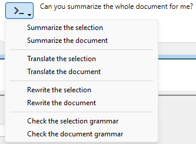

4D WritePro Interface offers a set of palettes, which allow end users to easily customize a 4D Write Pro document.

Um desenvolvedor 4D pode facilmente implementar essas paletas em sua aplicação. Thus, end users can manage all 4D Write Pro properties, such as fonts, text alignment, bookmarks, table layout, and frames.

La documentación principal de [la interfaz de 4D Write Pro](https://doc.4d.com/4Dv20/4D/20/Entry-areas.300-6263967.en.html) se encuentra en el manual *Diseño 4D*.

You will find below:

- the Table Wizard configuration documentation,
- the integrated A.I. documentation.

## Assistente de tabelas

The Table Wizard is here to further simplify table creation based on database data using contexts, data sources, and formulas.

The Table Wizard, accessible to end-users, loads templates provided and configured by 4D developers. This enables developers to customize the template according to the specific use cases and business requirements of the users.

The Table Wizard comes with default templates and themes, which developers can configure to adapt its content to match the specific requirements of the application.

To implement the Table Wizard in your application, the developers are able to create and configure template files.

### WP Table Wizard interface

The user opens the Table Wizard dialog from the "Insert table"  menu item in 4D Write Pro interface toolbar and sidebar.


From this interface, the user can select a template or a table from the first drop-down list and a theme from the second.

##### Em Colunas:


Depending on the user's selection of a template or a table, the user can view the list of fields stored in the template (Blob and object types are automatically excluded). They can then select columns to display in the table by checking the box in front of the field name and order them by moving and dragging the fields list.

##### Em linhas:


In the Table Wizard, the user can also define the number of header rows and extra rows (0 to 5 each), set [break rows](https://doc.4d.com/4Dv20/4D/20/Handling-tables.200-6229469.en.html#6233076) (summary rows) above or below the data row, and choose to show/hide [carry-over rows](https://doc.4d.com/4Dv20/4D/20/Handling-tables.200-6229469.en.html#6236686).

In addition, the user has the possibility to choose the table's behavior when its datasource is empty with the following options: Show data row, Hide date row, Hide table, Show placeholder row.

##### No ecrã:


The user adjusts the zoom level according to their preference by selecting the desired option from a drop-down list, uses radio buttons to display formulas or data for clear presentation, and chooses to display a horizontal ruler using a checkbox.

Tras finalizar la creación y personalización de la tabla, el usuario puede hacer clic en el botón **Insertar** para añadir la tabla a su documento WP.

Once the table has been integrated into the document, the user can customize its style. As ferramentas de formatação da barra de ferramentas e da barra lateral ainda estão disponíveis.

### Configuração do modelo do WP Table Wizard

A configuração dos modelos inclui:

- Definición de tablas y campos, así como preparación de fórmulas adaptadas a la aplicación desde el [archivo de plantilla](#template-files).
- Traducción de nombres de tablas, campos y fórmulas del [archivo de traducción](#translation-files).
- Diseño de estilos gráficos y temas personalizados a partir del [ archivo de temas](#theme-files).

These three types of files contribute to the configuration of the Table Wizard, and while each serves a distinct purpose, none of them are considered essential components.

#### Arquivos de modelo

O ficheiro modelo permite-lhe definir o seguinte:

- a fórmula que retorna uma seleção de entidades usadas como fonte de dados para a tabela,
- as fórmulas de interrupção (se for possível inserir uma linha de interrupção)
- os atributos dataclass que podem ser usados como colunas da tabela,
- the formulas available as contextual menus inside break rows, carry-over row, placeholder row or extra rows.

O arquivo modelo deve ser armazenado em uma pasta "[`Resources`](../Project/architecture.md#resources)/4DWP_Wizard/Templates" em seu projeto.

O arquivo de modelo no formato JSON contém os seguintes atributos:

| Atributo                             | Tipo       | Obrigatório | Descrição                                                                                                                                                                                                       |
| :----------------------------------- | :--------- | :---------- | :-------------------------------------------------------------------------------------------------------------------------------------------------------------------------------------------------------------- |
| tableDataSource                      | Text       | x           | Fórmula da fonte de dados da tabela                                                                                                                                                                             |
| columns                              | Collection | x           | Coleção de colunas de tabela                                                                                                                                                                                    |
| columns.check        | Text       | x           | True quando a coluna já está selecionada no editor de modelos. False quando a coluna não está selecionada no editor de modelos.                                                 |
| columns.header       | Text       | x           | Etiqueta mostrada ao usuário                                                                                                                                                                                    |
| columns.source       | Text       | x           | Formula                                                                                                                                                                                                         |
| breaks                               | Collection |             | Coleção de objetos de interrupção. A ordem das interrupções é importante. It corresponds to the order in the document when the breaks are above the data lines. |
| breaks.label         | Text       | x           | Etiqueta mostrada ao usuário                                                                                                                                                                                    |
| breaks.source        | Text       | x           | Formula                                                                                                                                                                                                         |
| breakFormulas                        | Collection |             | Coleção de objetos de fórmula aplicáveis a linhas de quebra                                                                                                                                                     |
| breakFormulas.label  | Text       | x           | Etiqueta mostrada ao usuário                                                                                                                                                                                    |
| breakFormulas.source | Text       | x           | Formula                                                                                                                                                                                                         |
| bcorFormulas                         | Collection |             | Collection of formula objects applicable to bottom carry over rows                                                                                                                                              |
| bcorFormulas.label   | Text       | x           | Etiqueta mostrada ao usuário                                                                                                                                                                                    |
| bcorFormulas.source  | Text       | x           | Formula                                                                                                                                                                                                         |
| extraFormulas                        | Collection |             | Coleção de objetos de fórmula aplicáveis a linhas extras                                                                                                                                                        |
| extraFormulas.label  | Text       | x           | Etiqueta mostrada ao usuário                                                                                                                                                                                    |
| extraFormulas.source | Text       | x           | Formula                                                                                                                                                                                                         |
| placeholderFormulas                  | Collection |             | Collection of formula objects that are inserted in the placeholder row                                                                                                                                          |

:::note Francês

If your application is likely to be run on a 4D with language set to French, make sure that you use [tokens](https://doc.4d.com/4Dv20/4D/20/Using-tokens-in-formulas.300-6237731.en.html) in your formulas so that they are correctly interpreted no matter the user's language configuration.

:::

##### Exemplo

Eis um breve exemplo do aspeto do seu ficheiro JSON:

```json
{
    "tableDataSource": "ds.People.all().orderBy(\"toCompany.name asc, continent asc, country asc, city asc\")",
    "columns": [{
            "check": true,
            "header": "Firstname",
            "source": "This.item.firstname"
        }, {
            "check": true,
            "header": "Lastname",
            "source": "This.item.lastname"
        }, {
            "check": true,
            "header": "Salary",
            "source": "String(This.item.salary;\"###,###.00\")"
        }
    ],
    "breaks": [{
            "label": "Company",
            "source": "This.item.toCompany.name"
        }
    ],
    "breakFormulas": [{
            "label": "Company",
            "source": "This.item.toCompany.name"
	}, {
            "label": "Sum of salaries",
            "source": "String(This.breakItems.sum(\"salary\"); \"###,###.00\")"
        }
    ],
    "bcorFormulas": [{
            "label": "Sum of salaries",
            "source": "String(This.tableData.sum(\"salary\"); \"###,###.00\")"
        }
    ],
    "extraFormulas": [{
            "label": "Sum of salaries",
            "source": "String(This.tableData.sum(\"salary\"); \"###,###.00\")"
        }
    ]
}

```

#### Arquivos de tradução

Translation files translate the names of templates, themes, tables, fields, and formulas. Estes arquivos são adicionados à pasta "[`Resources`](../Project/architecture.md#resources)/4DWP_Wizard/Translations" em seu projeto.

Each translation file must be named with the corresponding language code (for example "en" for English or "fr" for French).

O arquivo de tradução no formato JSON contém os seguintes atributos:

| Atributo  | Tipo       | Obrigatório | Descrição                                                                                                |
| :-------- | :--------- | :---------- | :------------------------------------------------------------------------------------------------------- |
| tabelas   | Collection |             | Coleção de objetos de tabela traduzidos                                                                  |
| fields    | Collection |             | Coleção de objetos de campo traduzidos                                                                   |
| formulas  | Collection |             | Coleção de objetos fórmula traduzidos                                                                    |
| fileNames | Collection |             | Collection of translated fileName objects (applicable to the theme and template name) |

Whitin each one of these attribute, the translation object includes the following attributes:

| Atributo    | Tipo | Obrigatório | Descrição                           |
| :---------- | :--- | :---------- | :---------------------------------- |
| original    | Text | x           | Texto original destinado à tradução |
| translation | Text | x           | Versão traduzida do texto original  |

Defining these attributes within the translation object ensures proper organization and alignment between the source and translated content.

If the template name or the formula (break, carry-over row, or extra) exists in the translated file, its translation is applied in the Table Wizard. In addition, only the table defined within the translation file is displayed and translated.

The translation file serves an additional role when a user selects a table in the interface. Ele pode filtrar as tabelas e os campos propostos ao usuário. Por ejemplo, para ocultar los ID de tabla, este comportamiento es similar a los comandos `SET TABLE TITLES` y `SET FIELD TITLES`.

##### Exemplo

```json
{
    "tables": [{
            "original": "People",
            "translation": "Personne"
        }
    ],
    "fields": [{
            "original": "lastname",
            "translation": "Nom"
        }, {
            "original": "firstname",
            "translation": "Prénom"
        }, {
            "original": "salary",
            "translation": "Salaire"
        }, {
            "original": "company",
            "translation": "Société"
        }
    ],
    "formulas": [{
            "original": "Sum of salary",
            "translation": "Somme des salaires"
        }
    ]
}
    
```

#### Arquivos de temas

A list of themes is provided by default in the 4D Write Pro Interface component, such as "Arial", "CourierNew" and "YuGothic", available in multiple variations like "Blue" and "Green". However, you can create your own theme by placing it in the "[`Resources`](../Project/architecture.md#resources)/4DWP_Wizard/Themes" folder within your project.

O ficheiro de tema em formato JSON contém os seguintes atributos:

| Atributo    | Tipo   | Obrigatório | Descrição                                                                                                                                                                                                                   |
| :---------- | :----- | :---------- | :-------------------------------------------------------------------------------------------------------------------------------------------------------------------------------------------------------------------------- |
| default     | Object |             | Objeto que contém o estilo padrão aplicável a todas as linhas.                                                                                                                                              |
| tabela      | Object |             | Objeto que contém a definição de estilo aplicável à tabela.                                                                                                                                                 |
| rows        | Object |             | Objeto que contém a definição de estilo aplicável a todas as linhas.                                                                                                                                        |
| cells       | Object |             | Objeto que contém a definição de estilo aplicável a todas as células.                                                                                                                                       |
| header1     | Object |             | Objeto que contém a definição de estilo aplicável à primeira linha de cabeçalho.                                                                                                                            |
| header2     | Object |             | Object containing the style definition applicable to the second header row.                                                                                                                                 |
| header3     | Object |             | Objeto que contém a definição de estilo aplicável à terceira linha de cabeçalho.                                                                                                                            |
| header4     | Object |             | Object containing the style definition applicable to the fourth header row.                                                                                                                                 |
| header5     | Object |             | Objeto que contém a definição de estilo aplicável à quinta linha de cabeçalho.                                                                                                                              |
| headers     | Object |             | Object containing the style definition applicable to the header rows, if a specific header (like header1, header2...) não está definido. |
| data        | Object |             | Object containing the style definition applicable to the repeated data row.                                                                                                                                 |
| break1      | Object |             | Objeto que contém a definição de estilo aplicável à primeira linha de quebra.                                                                                                                               |
| break2      | Object |             | Objeto que contém a definição de estilo aplicável à segunda linha de quebra.                                                                                                                                |
| break3      | Object |             | Objeto que contém a definição de estilo aplicável à terceira linha de quebra.                                                                                                                               |
| break4      | Object |             | Objeto que contém a definição de estilo aplicável à quarta linha de quebra.                                                                                                                                 |
| break5      | Object |             | Objeto que contém a definição de estilo aplicável à quinta linha de quebra.                                                                                                                                 |
| breaks      | Object |             | Object containing the style definition applicable to the break rows, if a specific break (like break1, break2...) não está definido.     |
| bcor        | Object |             | Object containing the style definition applicable to the bottom carry-over row.                                                                                                                             |
| placeholder | Object |             | Object containing the default style applicable to the placeholder row.                                                                                                                                      |

For every attribute used in your JSON file (header, data, carry-over, summary, and extra rows), you can define the following WP attributes, mentionned with their [corresponding WP constant](https://doc.4d.com/4Dv20/4D/20/4D-Write-Pro-Attributes.300-6229528.en.html):

| Atributos WP    | Constante WP correspondente |
| :-------------- | :-------------------------- |
| textAlign       | wk text align               |
| backgroundColor | wk background color         |
| borderColor     | wk border color             |
| borderStyle     | wk border style             |
| borderWidth     | wk border width             |
| font            | wk font                     |
| color           | wk font color               |
| fontFamily      | wk font family              |
| fontSize        | wk font size                |
| padding         | wk padding                  |

##### Exemplo

```json
{
    "default": {
           "backgroundColor": "#F0F0F0",
           "borderColor": "#101010",
           "borderStyle": 1,
           "borderWidth": "0.5pt",
           "font": "Times New Roman",
           "color": "#101010",
           "fontFamily": "Times New Roman",
           "fontSize": "7pt",
           "padding": "2pt"
    },
    "table": {
           "backgroundColor": "#E1EAF3"
    },
    "header1": {
           "textAlign": 2,
           "borderColor": "#41548F",
           "borderWidth": "1.5pt",
           "backgroundColor": "#979BA9",
           "color": "#F4F4FF",
           "font": "Times New Roman Bold"
    },
    "data": {
           "fontSize": "13pt",
           "textAlign": 0
    },
    "break1": {
           "textAlign": 2,
           "fontSize": "15pt"
    }
}
    
```

#### Veja também

[4D Write Pro - Table Wizard (vídeo tutorial)](https://www.youtube.com/watch?v=2ChlTju-mtM)

## Integrated AI

You can use an integrated AI in the 4D Write Pro interface so that you can easily translate or enhance your documents without having to use an external AI application.

Once you have enabled the AI feature, you can display a chat box over your 4D Write Pro document and interact with *chatGPT* to modify the text of the selection or of the document itself.

:::note

The 4D Write Pro interface uses OpenAI, for which you need to provide your own key (see below).

:::

### Limitações (Developer Preview)

In the current implementation, the feature has the following limitations:

- use of a predefined AI provider and necessity to pass your OpenAI key
- basic chatting features
- no image handling
- non-configurable predefined action commands
- predefined translations English/French and French/English only

### Enabling the AI feature

The AI dialog box is available by clicking on a button in the 4D Write Pro interface. This button is **hidden by default**, you need to enable it explicitely.

To display the AI dialog box button, you need to:

1. Get an API key from the [OpenAI website](https://openai.com/api/).
2. Execute the following 4D code:

```4d

WP SetAIKey ("<Your OpenAI Key>") //

```

:::note

No checking is done on the OpenAI key validity. If it is invalid, the *chatGPT* box will stay empty.

:::

The **A.I.** button is then displayed:


- in the 4D Write Pro Toolbar, in the **Import Export** tab,
- in the 4D Write Pro Widget, in the **Font Style** tab.

Click on the button to display the AI dialog box.

### AI dialog box

The 4D Write Pro AI dialog box allows a straightforward interaction between the chat area and the 4D Write Pro document.

#### Prompt area

At the bottom of the window, the **prompt area** allows you to enter any question to send to the AI.

To send your question to the AI, click on the Send button:


The button icon changes when the same request is sent again:


On the left side of this area, a pop up menu provides examples of common actions that can be usually delegated to the AI.

Selecting an action writes a corresponding question to the prompt. If necessary, you can modify the question and then to click on the Send button to actually send it:



:::note

Default translation actions are based upon the current 4D default configuration and depend on available languages.

:::

#### Copy buttons

These buttons propose basic interactions between the chat area, the underlying 4D Write Pro document, and the clipboard:


- **Return raw text**/**Return styled text**: Copy the latest response or the selected response from the AI to the 4D Write Pro document at the current insertion point, replacing the selected text if any.
- **Copy raw text**/**Copy styled text**: Copy the latest response or the selected response from the AI in the clipboard.

In both cases, if the response was provided with styles, you can decide to copy the text with or without styles.

:::note

The chat box uses the Markdown language to format text. Basic styles such as bold, italic, underline, titles are supported. When pasting styled text from the AI in the 4D Write Pro area, you may lose some formatting information.

:::

#### Chat area

The Chat area displays the whole interaction between you and the AI. You can scroll and select and part you want.

To empty this area, you can click on the Erase button of the History area (resets the window and all interactions).

#### Histórico

The History area lists all your prompts sent to the AI. You can hide/show this area using the button on the top right corner of the Chat area.

The Erase button allows you to reset the whole window and erase all interactions. It is equivalent to close/reopen the AI dialog box.

