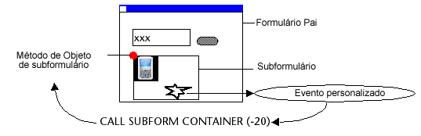

<!--REF #_command_.CALL SUBFORM CONTAINER.Syntax-->**CALL SUBFORM CONTAINER** ( *event* )<!-- END REF-->
<!--REF #_command_.CALL SUBFORM CONTAINER.Params-->
| Parâmetro | Tipo |  | Descrição |
| --- | --- | --- | --- |
| event | Integer | &#8594;  | Event to be sent |

<!-- END REF-->

*Esse comando não é seguro para thread e não pode ser usado em código adequado.*

#### Descrição 

<!--REF #_command_.CALL SUBFORM CONTAINER.Summary-->O comando **CALL SUBFORM CONTAINER** permite a uma instância de subformulário enviar o *evento* ao objeto subformulário que o contiver.<!-- END REF--> O objeto subformulário pode então processar o *evento* no contexto do formulário pai. 

Este comando deve ser localizado no método de formulário do subformulário ou no método de objeto de um dos objetos de subformulário. O evento só será recebido no método de objeto do contenedor do subformulário. 

Em *evento*, pode passar todo evento de formulário pré-definido de 4D (pode utilizar as constantes do tema "*Form event*") ou todo valor correspondente a um evento personalizado. No caso de um evento personalizado, é recomendado passar um valor negativo em *evento* para evitar o risco de interferir com os números de eventos 4D existentes ou futuros.

*Exemplo de execução do comando* **CALL SUBFORM CONTAINER** *:*

#### Ver também 

[Form event code](../commands/form-event-code.md)  
[GOTO OBJECT](goto-object.md)  