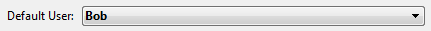

<!--REF #_command_.Current client authentication.Syntax-->**Current client authentication** {( *dominio* ; *protocolo* )} : Text<!-- END REF-->
<!--REF #_command_.Current client authentication.Params-->
| Parâmetro | Tipo |  | Descrição |
| --- | --- | --- | --- |
| dominio | Text | &#8592; | NOme do dominio |
| protocolo | Text | &#8592; | "Kerberos", "NTLM" ou string vazia |
| Resultado | Text | &#8592; | login do usuário da sessão retornado por windows |

<!-- END REF-->

#### Descrição 

<!--REF #_command_.Current client authentication.Summary-->O comando **Current client authentication** pede ao servidor Active Directory de Windows autenticar o cliente atual e se tiver êxito, devolve o nome de início de sessão de Windows para este cliente (identificador de sessão).<!-- END REF--> Se a autenticação falhar, se devolve uma string vazia. 

Este comando só pode ser utilizado no contexto de uma implementação SSO em Windows com 4D Server. Para saber mais consulte *Single Sign On (SSO) em Windows*.

Em geral, o cliente e o servidor devem ser gerenciados pelo mesmo Active Directory. Entretanto, diferentes configurações podem ser suportadas, como se descreve na seção *Exigências para SSO*. 

A string devolvida pelo comando deve ser passada a seu módulo de identificação 4D para conceder os direitos de acesso ao cliente em função de seu identificador de sessão de Windows; se definir um "usuario padrão", pode implementar uma interface onde o usuário não tenha que voltar a introduzir os ID (ver exemplo). 

Opcionalmente, o comando pode devolver dois parâmetros de texto:

* *dominio*: nome de dominio ao que pertence o cliente.
* *protocolo*: nome de protocolo utilizado por Windows para autenticar o usuário. Pode ser "Kerberos" ou "NTLM", dependendo dos recursos disponíveis. Se a autenticação falhar, se devolve uma string vazia ("").

Estes parâmetros podem ser utilizar para aceitar ou recusar as conexões se desejar filtrar o acesso em relação com o domínio ou o protocolo.

##### Nível de segurança da autenticação 

O nível de segurança da autenticação (ou seja, em quanto se pode confiar no início de sessão de usuário) depende da forma em que o usuário tenha sido identificado. O valor devolvido nos parâmetros do comando **Current client authentication** permitirão conhecer em que se baseia o início de sessão (se houver) e, portanto, o nível de segurança: 

| **Login**  | **domínio** | **protocolo** | **Comentários**                                                                                                                                                                                                                                                                                                                    |
| ---------- | ----------- | ------------- | ---------------------------------------------------------------------------------------------------------------------------------------------------------------------------------------------------------------------------------------------------------------------------------------------------------------------------------- |
| vazio      | vazio       | vazio         | O comando não pôde obter informação de autenticação sobre o usuário que iniciou sessão                                                                                                                                                                                                                                             |
| preenchido | vazio       | NTLM          | A ID devolvida é a local, a qual foi definida no equipamento local                                                                                                                                                                                                                                                                 |
| preenchido | preenchido  | NTLM          | A ID devolvida foi autenticada utilizando o protocolo NTLM no domínio devolvido no parâmetro *dominio*. Neste caso, deve selecionar o domínio para aumentar o nível de segurança. Dado que algumas arquiteturas têm um dominio forest, é necessário ter certeza de que o domínio no que foi autenticado o usuário seja o esperado. |
| preenchido | preenchido  | Kerberos      | A ID devolvida foi autenticada com o protocolo Kerberos no domínio esperado. Esta configuração oferece o mais alto nível de segurança.                                                                                                                                                                                             |

  
#### Exemplo 

Em seu banco de dados 4D Server, se tiver designado um sistema de controle de acesso baseado na propriedade de 4D de usuários e grupos, pode configurar sua aplicação para que os usuários remotos 4D em Windows se conectem diretamente a 4D Server (não são mostradas nenhum quadro de diálogo de senha), estando conectado com seus direitos atuais: 

1. Na página "Segurança" do quadro de diálogo Propriedades do banco de dados, designar a um usuário como o "usuário por padrão":  
  
Com esta configuração, não se mostra um diálogo de senha para um 4D remoto que se conecta ao servidor, todos os clientes se registran como "Bob".
2. No método banco On Server Open Connection, agregue o seguinte código para comprovar a autenticação de usuário do diretório  Active:

```4d
  //Método base On Server Open Connection
 var $0;$1;$2;$3 : Integer
 $login:=Current client authentication($domain;$protocol)
 If($login #"") //um login foi devolvido
    CHANGE CURRENT USER($login;"") //define o usuário atual
    $0:=0 //acesso aceito
 Else
    $0:=-1 //recuzar a conexão
 End if
```

**Nota:** Este exemplo mostra um cenário básico, que deve ser adaptado à suas soluções. O método personalizado de autenticação de usuário 4D ((CheckCredentials no exemplo acima) poderia se basear em uma das seguintes implementações:

* replicar os nomes do diretório Active nos nomes de usuário 4D e grupos, para um mapeamento automático,
* mapa retorna informação para uma tabela personalizada \[users\] ,
* usa propriedades LDAP para conseguir credenciais de usuário.
