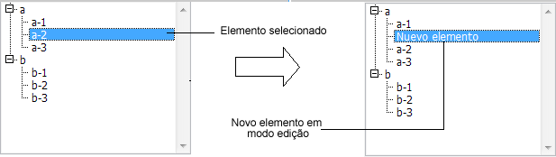
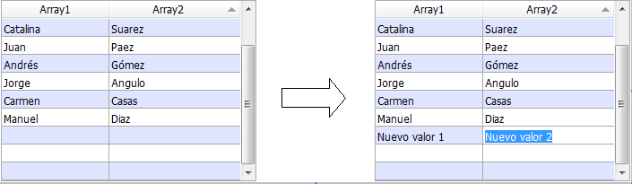

<!--REF #_command_.EDIT ITEM.Syntax-->**EDIT ITEM** ( {* ;} *objeto* {; *item*} )<!-- END REF-->
<!--REF #_command_.EDIT ITEM.Params-->
| Parâmetro | Tipo |  | Descrição |
| --- | --- | --- | --- |
| * | Operador | &#8594;  | Se especificado, objeto é um nome de objeto (string), se omitido, objeto é uma variável |
| objeto | any | &#8594;  | Nome de objeto (se * é especificado) ou Tabela ou Variável (se * é omitido) |
| item | Integer | &#8594;  | Número do item |

<!-- END REF-->

#### Descrição 

<!--REF #_command_.EDIT ITEM.Summary-->O comando **EDIT ITEM** lhe permite editar o elemento atual ou o elemento de número *item* do array ou a lista designada pelo parâmetro *objeto*.<!-- END REF-->

Isto significa que o elemento selecionado pode ser modificado; a entrada de um caractere substituirá totalmente o conteúdo do elemento.

Se passar o parâmetro opcional *\**, indica que o parâmetro *objeto* é um nome de objeto (neste caso, passe uma string em *objeto*). Se não passa o parâmetro, indica que o parâmetro *objeto* é uma tabela ou uma variável. Neste caso, não passa uma string sem uma referência de uma tabela ou variável.

Este comando aplica aos seguintes objetos editáveis:

* Listas hierárquicas
* Colunas de List boxes
* Subformulários (neste caso, só um nome de objeto, ou subformulário, pode ser passada em *objeto*),
* Formulários listados mostrados utilizando os comandos [DISPLAY SELECTION](display-selection.md) ou [MODIFY SELECTION](modify-selection.md).

Se o comando é utilizado com um objeto editável que não estiver na lista, age da mesma forma que o comando [GOTO OBJECT](goto-object.md).  
O comando não faze nada se a lista ou o array estão vazios ou são invisíveis. Igualmente, se a lista ou o array não são editáveis, ou comando só seleciona o elemento especificado sem mudar ao modo edição. No caso das list boxes, se a coluna não permite a entrada de texto (entrada por caixas de seleção ou por listas suspensas unicamente), o elemento especificado toma o foco.

O parâmetro opcional *item* lhe permite designar a posição do elemento (lista hierárquica) ou o número de linha (list box, formulários listados e subformulário em modo “seleção múltipla”) para mudar a modo de edição. Se não passar este parâmetro, o comando é aplicado ao elemento atual de *objeto*. Se não houver um elemento atual, o primeiro elemento de *objeto* modifica a modo edição.

**Notas:**

* Em subformulários e formulários listados, o comando passa a modo edição o primeiro campo da fila especificada, na ordem de entrada.
* Em listboxes mostrados em modo hierárquico, se o elemento objetivo pertence a um nível hierárquico colapsado, este nível (como também os possíveis níveis pais) são suspensos automaticamente para que a linha seja visível.

#### Exemplo 1 

Este comando pode ser particularmente útil quando cria um novo elemento em uma lista hierárquica. Quando sechama o comando, o último elemento adicionado ou inserido na lista se converte automaticamente em editável, sem que o usuário tenha que realizar alguma ação específica.   
  
O seguinte código pode ser o método de um botão que lhe permite inserir um novo elemento nuna lista existente. O texto automaticamente “Novo\_elemento” está pronto automaticamente para ser modificado: 

```4d
 vlUniqueRef:=vlUniqueRef+1
 INSERT LIST ITEM(hList;*;"Novo_elemento";vlUniqueRef)
 EDIT ITEM(*;"MinhaLista")
```



#### Exemplo 2 

Dadas duas colunas em una list box onde os nomes das variáveis são “Array1” e “Array2” respectivamente. O seguinte exemplo insere um novo elemento em dois arrays e passa o novo elemento de Array2 a modo edição: 

```4d
 $vlRowNum:=Size of array(Array1)+1
 LISTBOX INSERT ROWS(*;"MyListBox";$vlRowNum)
 Array1{$vlRowNum}:="New value 1"
 Array2{$vlRowNum}:="New value 2"
 EDIT ITEM(Array2;$vlRowNum)
```



#### Ver também 

[GOTO OBJECT](goto-object.md)  
[INSERT IN LIST](insert-in-list.md)  
[SET LIST ITEM](set-list-item.md)  

#### Propriedades

|  |  |
| --- | --- |
| Número do comando | 870 |
| Thread-seguro | &cross; |


