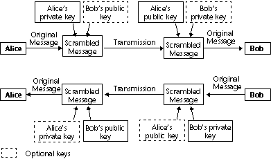

<!--REF #_command_.ENCRYPT BLOB.Syntax-->**ENCRYPT BLOB** ( *toEncrypt* ; *sendPrivKey* {; *recipPubKey*} )<!-- END REF-->
<!--REF #_command_.ENCRYPT BLOB.Params-->
| Parâmetro | Tipo |  | Descrição |
| --- | --- | --- | --- |
| toEncrypt | Blob | &#8596;  | Dados a encriptar |
||| | Dados encriptados |
| sendPrivKey | Blob | &#8594;  | Chave privada do emissor |
| recipPubKey | Blob | &#8594;  | Chave pública do receptor |

<!-- END REF-->

#### Descrição 

<!--REF #_command_.ENCRYPT BLOB.Summary-->O comando ENCRYPT BLOB criptograma o conteúdo do BLOB *toEncrypt* com a chave privada do remetente *sendPrivKey*, bem como, opcionalmente, a chave pública do destinatário *recipPubKey*.<!-- END REF--> Estas chaves devem ser geradas pelo comando [GENERATE ENCRYPTION KEYPAIR](generate-encryption-keypair.md) (no âmbito do tema "Protocolo Seguro").

**Nota:** Este comando usa o algoritmo do protocolo SSL e recursos de criptografia. Para poder usar este comando, certifique-se que os componentes necessários para o protocolo SSL estão corretamente instalados em sua máquina - mesmo que você não queira usar SSL para conexões de servidor Web de 4D. Para obter informações detalhadas sobre esse protocolo, consulte *developer.4d.com*.

* Se uma chave é usada para a criptografia (chave privada do remetente), as pessoas na posse da chave pública poderão ler as informações. Este sistema garante que o próprio remetente tem a informação criptografada.
* O uso simultâneo da chave privada do remetente e do destinatário público garantem que apenas um destinatário será capaz de ler as informações.

O BLOB contendo as chaves tem um formato PKCS interno. Este formato de plataforma padrão permite a troca ou o tratamento de chaves simplesmente copiando-colando em um e-mail ou um arquivo de texto.

Uma vez que o comando foi executado, o BLOB *toEncrypt* contém os dados criptografados, que serão descriptografados apenas com o comando [DECRYPT BLOB](decrypt-blob.md), com a chave pública do remetente passada como parâmetro.

Além disso, se chave pública do destinatário opcional foi usada para criptografar as informações, a chave privada do destinatário também será necessária para descriptografar.

**O princípio da criptografia com chaves públicas e privadas para a troca de mensagens entre duas pessoas, "Alice" e "Bob":** 



**Nota:** A cifra inclui uma funcionalidade de verificação a fim de evitar qualquer alteração de conteúdo BLOB (deliberadamente ou não). Por conseguinte, um BLOB criptografado não deve ser modificado, de outra forma não poderia ser decifrado.

##### Otimização Comandos de Criptografia 

A criptografia de dados atrasa a execução de suas aplicações, especialmente se um par de chaves é usado. No entanto, você pode considerar as seguintes dicas de otimização: 

* Dependendo da memória disponível atual, o comando será executado em modo "síncrono" ou "assíncrono".  
O modo assíncrono é mais rápido, pois não congela os outros processos. Este modo é usado automaticamente se a memória disponível é pelo menos o dobro do tamanho dos dados a serem criptografados.

Caso contrário, por razões de segurança, o modo síncrono é utilizado. Este modo é mais lento, uma vez que congela a outros processos. 

* Quanto aos BLOBs, você pode criptografar apenas uma pequena parte "estratégica" do BLOB, a fim de reduzir o tamanho dos dados a serem processados, bem como o tempo de processamento.

#### Exemplo 

* **Usando uma chave única**

A empresa deseja manter os dados armazenados em um banco de dados 4D privado. Tem que enviar regularmente essas informações às suas filiais através de arquivos, via Internet.

1) A empresa gera um par de chaves com o comando [GENERATE ENCRYPTION KEYPAIR](generate-encryption-keypair.md "GENERATE ENCRYPTION KEYPAIR"):

```4d
  //Método GENERAR_LLAVES_TXT
 var $BChavePublica;$BChavePrivada : Blob
 GENERATE ENCRYPTION KEYPAIR($BChavePrivada;$BChavePublica)
 BLOB TO DOCUMENT("ChavePublica.txt";$BChavePublica)
 BLOB TO DOCUMENT("ChavePrivada.txt";$BChavePrivada)
```

2) A empresa mantém a chave privada e envia uma cópia do documento que contém a chave pública para cada filial. Para segurança máxima, a chave deve ser copiada em um disco e entregue as filiais.

3) Em seguida, a empresa copia as informações privadas (armazenada no campo de texto, por exemplo) nos BLOBs que serão criptografados com a chave privada:

```4d
  //Método CIFRAR_INFO
 var $vbCifrado;$vbChavePrivada : Blob
 var $vtCifrado : Text
 
 $vtCifrado:=[Privado]Info
 VARIABLE TO BLOB($vtCifrado;$vbCifrado)
 DOCUMENT TO BLOB("ChavePrivada.txt";$vbChavePrivada)
 If(OK=1)
    ENCRYPT BLOB($vbCifrado;$vbChavePrivada)
    BLOB TO DOCUMENT("Update.txt";$vbCifrado)
 End if
```

4) Os arquivos de atualização podem ser enviados para as filiais (apesar de um canal não-seguro, como a Internet). Se uma terceira pessoa agarra o arquivo criptografado, ela não será capaz de decifrá-lo sem a chave pública.

5) Cada filial pode decifrar o documento com a chave pública:

```4d
  //Método DESCIFRAR_INFO
 var $vbCifrado;$vbChavePublica : Blob
 var $vtDescifrado : Text
 var $vtDocRef : Time
 
 ALERT("Por favor selecione um documento cifrado.")
 $vtDocRef:=Open document("") //Selecione Update.txt
 If(OK=1)
    CLOSE DOCUMENT($vtDocRef)
    DOCUMENT TO BLOB(Document;$vbCifrado)
  //Sua chave privada é carregada
    DOCUMENT TO BLOB("ChavePublica.txt";$vbChavePublica)
    If(OK=1)
       DECRYPT BLOB($vbCifrado;$vbChavePublica)
       BLOB TO VARIABLE($vbCifrado;$vtDescifrado)
       CREATE RECORD([Privado])
       [Privado]Info:=$vtDescifrado
       SAVE RECORD([Privado])
    End if
 End if
```

* **Usando pares de chaves**
A empresa quer usar a Internet para trocar informações. Cada filial recebe informações privadas e também envia informações para a sede da empresa. Consequentemente, há dois requisitos:  
\- O beneficiário só deve ser capaz de ler a mensagem,  
\- O destinatário deve ter a prova de que a mensagem foi enviada pelo próprio remetente. 

1) O escritório corporativo e cada filial geram os seus próprios pares de chaves (com o método GENERATE\_KEYS\_TXT).

2) A chave privada é mantida em segredo pelos dois lados. Cada filial envia sua chave pública para a sede da empresa que, por sua vez, envia sua chave pública também. Esta transferência de chave não precisa ser feito através de um canal seguro já que a chave pública não é suficiente para decifrar a mensagem.

3) Para criptografar os dados para enviar, a filial ou a casa corporativa executa o método ENCRYPT\_INFO\_2 que usa a chave privada do remetente e a chave pública do destinatário para criptografar as informações:

```4d
  //Método CIFRAR_INFO_2
 var $vbCifrado;$vbChavePrivada;$vbChavePublica : Blob
 var $vtCifrado : Text
 var $vtDocRef : Time
 
 $vtEncrypt:=[Privado]Info
 VARIABLE TO BLOB($vtCifrado;$vbCifrado)
  // Sua própria chave privada é carregado...
 DOCUMENT TO BLOB("ChavePrivada.txt";$vbChavePrivada)
 If(OK=1)
  // ...e a chave pública do destinatário
    ALERT("Por favor selecione a chave pública do destinatário.")
    $vhDocRef:=Open document("") //Chave pública a ser carregada
    If(OK=1)
       CLOSE DOCUMENT($vtDocRef)
       DOCUMENT TO BLOB(Document;$vbChavePublica)
  //Cifrado do BLOB com duas chaves como parâmetros
       ENCRYPT BLOB($vbCifrado;$vbChavePrivada;$vbChavePublica)
       BLOB TO DOCUMENT("Update.txt";$vbCifrado)
    End if
 End if
```

4) O arquivo criptografado pode ser enviado para o destinatário através da Internet . Se uma terceira pessoa se apodera dele, ele ou ela não será capaz de decifrar a mensagem, mesmo se ele ou ela tem as chaves públicas já que a chave privada do destinatário também será necessária.

5) Cada destinatário pode descriptografar o documento usando suas próprias chaves privadas e o a chave pública do remetente:

```4d
  //Método CIFRAR_INFO_2
 var $vbCifrado;$vbChavePrivada;$vbChavePublica : Blob
 var $vtCifrado : Text
 var $vtDocRef : Time
 
 ALERT("Por favor selecione la chave pública do destinatario.")
 $vhDocRef:=Open document("") //Chave pública a ser carregada
 If(OK=1)
    CLOSE DOCUMENT($vhDocRef)
    DOCUMENT TO BLOB(Document;$vbCifrado)
  //Se carrega sua própria chave privada
    DOCUMENT TO BLOB("ChavePrivada.txt";$vbChavePrivada)
    If(OK=1)
  // ...e a chave pública do emissor
       ALERT("Por favor selecione a chave pública do emissor.")
       $vhDocRef:=Open document("") //Chave pública a carregar
       If(OK=1)
          CLOSE DOCUMENT($vhDocRef)
          DOCUMENT TO BLOB(Document;$vbChavePublica)
  //Descifrar o BLOB com duas chaves como parâmetros
          DECRYPT BLOB($vbCifrado;$vbChavePublica;$vbChavePrivada)
          BLOB TO VARIABLE($vbCifrado;$vtDescifrado)
          CREATE RECORD([Privado])
          [Privado]Info:=$vtDescifrado
          SAVE RECORD([Privado])
       End if
    End if
 End if
```

#### Ver também 

  
[DECRYPT BLOB](decrypt-blob.md)  
[Encrypt data BLOB](encrypt-data-blob.md)  
[GENERATE ENCRYPTION KEYPAIR](generate-encryption-keypair.md)  

#### Propriedades
|  |  |
| --- | --- |
| Número do comando | 689 |
| Thread-seguro | &check; |
| Proibido no servidor ||


