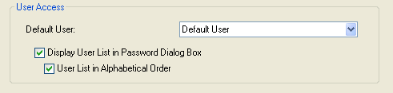

<!--REF #_command_.Get default user.Syntax-->**Get default user**  : Integer<!-- END REF-->
<!--REF #_command_.Get default user.Params-->
| Parâmetro | Tipo |  | Descrição |
| --- | --- | --- | --- |
| Resultado | Integer | &#8592; | Número de ID de usuário |

<!-- END REF-->

#### Descrição 

<!--REF #_command_.Get default user.Summary-->O comando Get default user retorna o número de referência único do usuário designado como “Usuário por padrão” na caixa de diálogo de Preferências do banco:

  
  
  
Se nenhum usuário por padrão estiver definido, o comando retorna 0.<!-- END REF-->

#### Propriedades

|  |  |
| --- | --- |
| Número do comando | 826 |
| Thread-seguro | &cross; |

