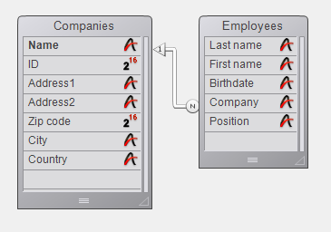
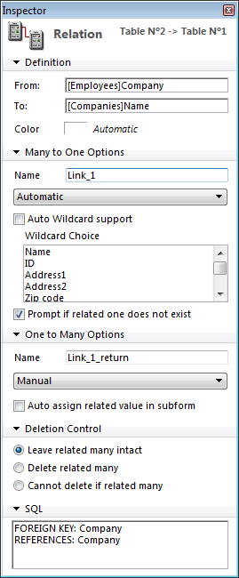

<!--REF #_command_.GET FIELD RELATION.Syntax-->**GET FIELD RELATION** ( *campoN* ; *um* ; *muitos* {; *} )<!-- END REF-->
<!--REF #_command_.GET FIELD RELATION.Params-->
| Parâmetro | Tipo |  | Descrição |
| --- | --- | --- | --- |
| campoN | Field | &#8594;  | Iniciar campo da relação |
| um | Integer | &#8592; | Estado das relações Muitos a Um |
| muitos | Integer | &#8592; | Estado da relação Um a Muitos |
| * | Operador | &#8594;  | Se passado: um e muitos retorna o estado atual da relação (valores 2 ou 3 apenas) * se omitido (padrão): um e muitos podem retornar o valor 1 se a relação não foi modificada através de programação |

<!-- END REF-->

#### Descrição 

<!--REF #_command_.GET FIELD RELATION.Summary-->O comando GET FIELD RELATION permite conhecer o estado automático/manual da relação começando desde o *campoN* para o processo atual.<!-- END REF--> Todas as relações podem ser consultadas, incluindo as relações automáticas na janela de Estrutura.

Passe em *campoN*, o nome do campo da tabela N desde onde começa a relação cujo estado queira conhecer. Se nenhuma relação se origina desde o campo *campoN*, os parâmetros *um* e *muitos* devolvem 0, se gera um erro e a variável sistema OK toma o valor 0 (ver a continuação).

* Depois da execução do comando, a variável *um* contém um valor indicando se a relação Muitos a Um especificada está definida como automática:

 0 = não há relação desde *campoN*. Se gera o erro de sintaxe No. 16 (“O campo não tem relação”) e a variável sistema OK toma o valor 0.  
 1 = o estado automático/manual da relação Muitos a Um especificado está definido pela opção **Relação Muitos a Um** **automática** nas propriedades da relação no ambiente Desenho (não foi modificado por programação).  
 2 = a relação Muitos a Um é manual para o processo.  
 3 = a relação Muitos a Um é automática para o processo.

Depois da execução do comando, o parâmetro *muitos* contém um valor indicando se a relação Um a Muitos especificada está definida como automática:  
 0 = não há relação desde *campoN*. Se gera o erro de sintaxe No. 16 (“O campo não tem relação”) e a variável sistema OK toma o valor 0.  
 1 = o estado automático/manual da relação Um a Muitos especificada está definido pela opção **Relação Um a Muitos automática**  
 2 = a relação Um a Muitos é manual para o processo.  
 3 = a relação Um a Muitos é automática para o processo.   
  
Pode comparar os valores recebidos nos parâmetros *um* e *muitos* com as constantes do tema “*Relações*”:  

| Constante               | Tipo          | Valor |
| ----------------------- | ------------- | ----- |
| Automatic               | Inteiro longo | 3     |
| Manual                  | Inteiro longo | 2     |
| No relation             | Inteiro longo | 0     |
| Structure configuration | Inteiro longo | 1     |

* O parâmetro opcional *\** permite “forçar” a leitura do estado atual da relação, inclusive se não foi modificado por programação. Em outras palavras, quando passa o parâmetro opcional \*, só podem ser devolvidos os valores 2 ou 3 nos parâmetros *um* e *muitos*.

#### Exemplo 

Dada a seguinte estrutura:



As propriedades da relação que une o campo \[Empregados\]Empresa com o campo\[Empresas\]Nome são as seguintes:



O código a seguir ilustra as diferentes possibilidades oferecidas pelos comandos GET FIELD RELATION, [GET AUTOMATIC RELATIONS](get-automatic-relations.md) e [SET FIELD RELATION](set-field-relation.md), [SET AUTOMATIC RELATIONS](set-automatic-relations.md) assim como seus efeitos:

```4d
 GET AUTOMATIC RELATIONS(um;muitos) //devolve False, False
 GET FIELD RELATION([Empregados]Empresa;um;muitos) //devolve 1,1
 GET FIELD RELATION([Empregados]Empresa;um;muitos;*) //devolve 3,2
 
 SET FIELD RELATION([Empregados]Empresa;2;0) //muda a relação Muitos a Um a manual
 
 GET FIELD RELATION([Empregados]Empresa;um;muitos) //devolve 2,1
 GET FIELD RELATION([Empregados]Empresa;um;muitos;*) //devolve 2, 2
 
 SET FIELD RELATION([Empregados]Empresa;1;0) //restabelece os parâmetros definidos no ambiente Desenho para a relação Muitos a Um
 
```

```4d
 GET FIELD RELATION([Empregados]Empresa;um;muitos) //devolve 1,1
```

```4d
 GET FIELD RELATION([Empregados]Empresa;um;muitos;*) //devolve 3,2
 
 SET AUTOMATIC RELATIONS(True;True) //muda todas as relações de todas as tabelas a automáticas
 
 GET AUTOMATIC RELATIONS(um;muitos) //devolve True, True
 GET FIELD RELATION([Empregados]Empresa;um;muitos) //devolve 1,1
 GET FIELD RELATION([Empregados]Empresa;um;muitos;*) //devolve 3,3
```

#### Ver também 

[GET AUTOMATIC RELATIONS](get-automatic-relations.md)  
[GET RELATION PROPERTIES](get-relation-properties.md)  
[SET AUTOMATIC RELATIONS](set-automatic-relations.md)  
[SET FIELD RELATION](set-field-relation.md)  

#### Propriedades
|  |  |
| --- | --- |
| Número do comando | 920 |
| Thread-seguro | &check; |
| Proibido no servidor ||


