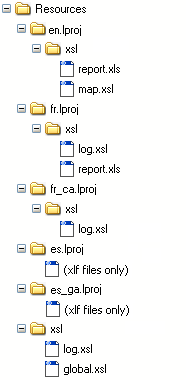

<!--REF #_command_.Get localized document path.Syntax-->**Get localized document path** ( *rotaRelativa* ) -> Resultado<!-- END REF-->
<!--REF #_command_.Get localized document path.Params-->
| Parâmetro | Tipo |  | Descrição |
| --- | --- | --- | --- |
| rotaRelativa | Text | &rarr; | Rota relativa do documento para qual quer obter a versão localizada |
| Resultado | Text | &larr; | Rota de acesso absoluta ao documento localizado |

<!-- END REF-->

#### Descrição 

<!--REF #_command_.Get localized document path.Summary-->O comando Get localized document path retorna a rota completa (absoluta) de um documento designado por *rotaRelativa* e localizado na pasta xxx.<!-- END REF-->lproj.  

Este comando deve ser usado dentro de uma arquitetura de aplicação multi-linguagem baseada na presença de uma pasta **Resources** e das subpastas xxx.lproj (xxx representa um idioma). Com esta arquitetura, 4D é automaticamente compatível arquivos localizados de tipo .xliff assim como as imagens, mas é possível que deva usar o mesmo mecanismo para outros tipos de arquivos.  
  
Passe em *rotaRelativa* a rota de acesso relativa do documento a buscar. A rota especificada deve ser relativa ao primeiro nível da pasta "xxx.lproj" da banco de dados. O comando devolverá uma rota de acesso completa utilizando a pasta "xxx.lproj" correspondente ao idioma atual do banco de dados.  
  
**Nota**: o idioma atual é definido automáticamente por 4D em função do conteúdo da pasta Resources (vea o comando [Get database localization](get-database-localization.md) ), ou através do comando [SET DATABASE LOCALIZATION](set-database-localization.md).

Pode expressar o conteúdo do parâmetro *rotaRelativa* utilizando uma sintaxe POSIX ou sistema. Por exemplo:  
* xsl/log.xsl (sintaxe POSIX: utilizável em Mac OS ou Windows)
* xsllog.xsl (Windows unicamente)
* xsl:log.xsl (Mac OS unicamente)

A rota de acesso absoluta retornada pelo comando é sempre expressa na sintaxe do sistema.

**4D Serve**r: em modo remoto, o comando retorna a rota da pasta **Resources** na máquina cliente se o comando for chamado desde um processo cliente.  
  
4D busca o arquivo respeitando uma sequência que permite tratar todos os casos de aplicações em vários idiomas. A cada passo, 4D comprova a presença de *rotaRelativa* na pasta correspondente ao idioma e retorna a rota completa quando tem êxito. Se *rotaRelativa* não for encontrada ou se a pasta não existir, 4D passa ao seguinte passo. Aqui estão as pastas para cada uma das diferentes etapas de pesquisa:

*Linguagem atual (por exemplo: fr-ca)* 
*Linguagem atual* *sem região (* *por exemplo* *.: fr)* 
 *Linguagem carregada automaticamente no startup (* *por exemplo* *.: es-ga)* 
*Linguagem carregada automaticamente no startup sem região* *(* *por exemplo* *.: es)* 
 *Primeira pasta .lproj encontrada (* *por exemplo* *.: en.lproj)* 
 *Primeiro nível de pasta Resources* 

Se *rotaRelativa* não for encontrada em nenhuma destas localizações, o comando retorna uma string vazia.

#### Exemplo 

Para transformar um arquivo XML em HTML, queremos utilizar um arquivo de transformação "log.xsl". Este arquivo difere dependendo do idioma atual. Você deseja conhecer a rota do arquivo "log.xsl" a utilizar.  
Estes são os conteúdos da pasta Resources:



Para utilizar um arquivo .xsl adaptado a linguagem atual, apenas deve passar:

```4d
 $myxsl:=Get localized document path("xsl/log.xsl")
```

Se a linguagem atuarl for, por exemplo, francês canadense (fr-ca), o comando devolve:

* em Windows: C:users……… resources \_ca.lprojxsllog.xsl
* em Mac OS: "HardDisk:users:…:…:…:resources:fr\_ca.lproj:xsl:log.xsl"

#### Ver também 

[Get database localization](get-database-localization.md)  