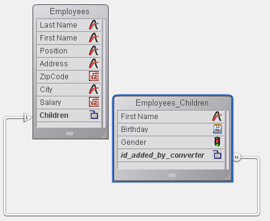

<!--REF #_command_.Get subrecord key.Syntax-->**Get subrecord key** ( *idField* ) -> Resultado<!-- END REF-->
<!--REF #_command_.Get subrecord key.Params-->
| Parâmetro | Tipo |  | Descrição |
| --- | --- | --- | --- |
| idField | Campo | &#x1F852; | "Subtable Relation" or "Longint" type field of a former subtable relation |
| Resultado | Inteiro longo | &#x1F850; | Internal key of relation |

<!-- END REF-->

#### Descrição 

<!--REF #_command_.Get subrecord key.Summary-->El comando [Get subrecord key](get-subrecord-key.md) facilita la migración del código 4D utilizando subtablas convertidas al código estándar de manipulación de tablas.<!-- END REF--> 

**Recordatorio:** a partir de la versión 11 de 4D, no se soportan subtablas. Cuando se convierte una base antigua, las subtablas existentes se transforman automáticamente en tablas estándar relacionadas con las tablas originales por una relación automática. La subtabla anterior se convierte en la tabla Muchos y la tabla original es la tabla Uno. En la tabla Uno, el campo subtabla anterior se transforma en un campo especial de tipo "Relación subtabla" y en la tabla Muchos, se añade un campo especial, de tipo "Relación subtabla", llamado "id\_anadido\_por\_convertidor".

Esto permite preservar el funcionamiento de bases de datos convertidas, pero le recomendamos que sustituya los mecanismos de subtablas en sus bases por los que se utilizan para las tablas estándar. 

El primer paso en este proceso consiste en eliminar las relaciones automáticas especiales, lo que desactiva de forma permanente los mecanismos heredados de subtablas. Después debe volver a escribir el código asociado. El comando [Get subrecord key](get-subrecord-key.md) acompaña a esta reescritura, devolviendo el identificador interno utilizado por la relación. Esta identificación interna hace que la relación real innecesaria y a continuación puede trabajar con la selección de la subtabla anterior incluso cuando la relación ya no está presente.

Veamos por ejemplo la siguiente estructura convertida: 



En 4D, el siguiente código aún funciona, pero debe actualizarse:

```4d
 ALL SUBRECORDS([Empleados]Hijos)
 $total:=Records in subselection([Empleados]Hijos)
 vNombres:=""
 For($i;1;$total)
    vNombre:=vNombres+[Empleados]Hijos'Nombre+" "
    NEXT SUBRECORD([Empleados]Hijos)
 End for
```

Ahora puede reemplazar este código por:

```4d
 QUERY([Empleados_Hijos];[Empleados_Hijos]id_anadido_por_convertidor=Get subrecord key([Empleados]Hijos))
 $total:=Records in selection([Empleados_Hijos])
 vNombres:=""
 For($i;1;$total)
    vNombres:=vNombres+[Empleados_Hijos]Nombre+" "
    NEXT RECORD([Empleados_Hijos])
 End for
```

**Nota:** [Get subrecord key](get-subrecord-key.md) devuelve 0 si no hay registro actual cargado durante su ejecución.

La segunda parte de código tiene la ventaja de usar comandos estándar de 4D y funciona de la misma manera si la relación está presente o no. Cuando elimina la relación, el comando devuelve simplemente el valor de la llave almacenada en el campo Entero largo. 

En el parámetro *campoID*, el comando acepta un campo de tipo Relación subtabla (si la relación sigue existiendo) o del tipo Entero largo (si la relación se ha eliminado). En todos los demás casos, se genera un error.

Esto le permite escribir el código de transición. Durante la fase final de actualización de la aplicación, puede eliminar las llamadas a este comando.

#### Atribuir o campo id\_added\_by\_converter 

A partir de 4D v14 R3, puede asignar un valor al campo "id\_added\_by\_converter". Anteriormente, este valor sólo podía ser asignado por 4D, lo que obligaba a los desarrolladores a utilizar comandos obsoletos como *\_o\_CREATE SUBRECORD* para poder añadir registros en subtablas convertidas. 

Gracias a esta posibilidad, puede convertir bases anteriores que contengan subtablas progresivamente: en un primer momento, puede mantener la "relación Subtabla" especial, mientras añade o modifica registros relacionados, como si fueran estándar. Luego, una vez que todos sus métodos estén actualizados, puede sustituir esta relación especial con una normal, sin tener que cambiar el código. 

Por ejemplo, con la estructura anterior puede escribir: 

```4d
 CREATE RECORD([Employees])
 [Employees]LastName:="Jones"
 CREATE RECORD([Employees_Children])
 [Employees_Children]FirstName:="Natacha"
 [Employees_Children]BirthDate:=!12/24/2013!
 [Employees_Children]id_added_by_converter:=Get subrecord key([Employees]Children)
 SAVE RECORD([Employees_Children])
 SAVE RECORD([Employees]
```

Este código funcionará tanto con una relación especial como con una estándar.
